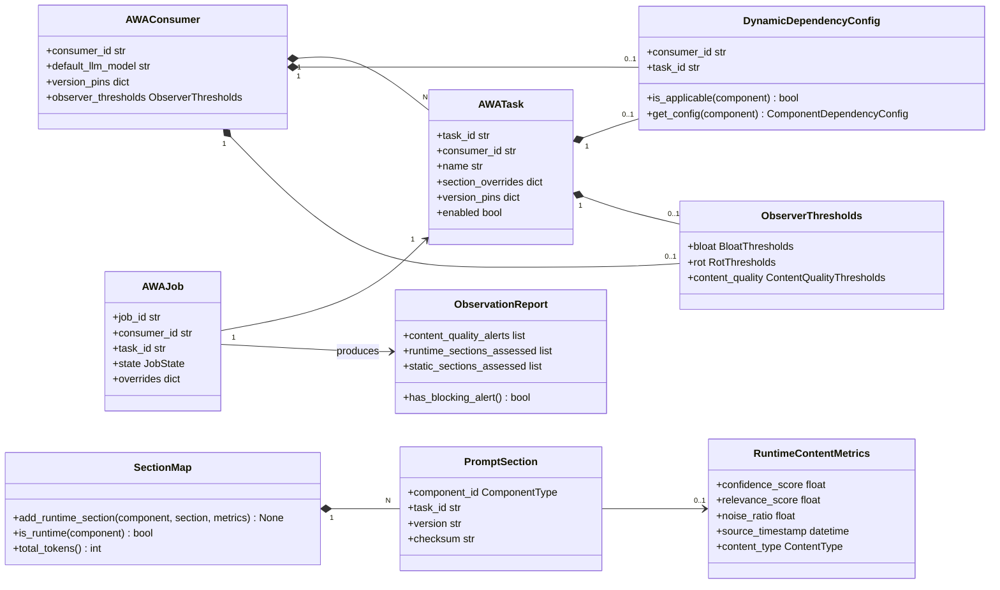
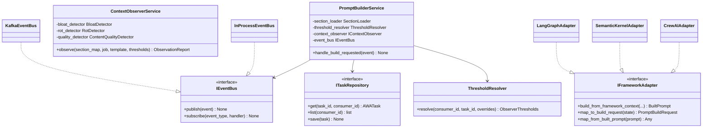
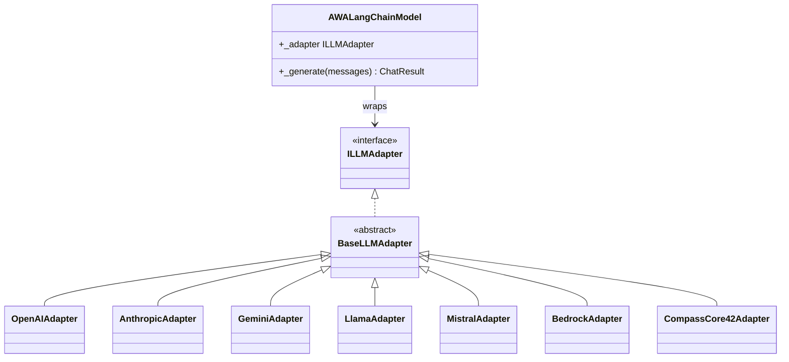
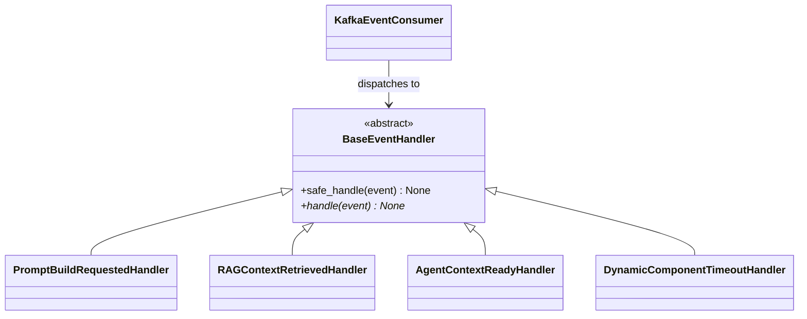
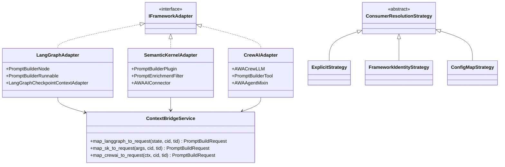
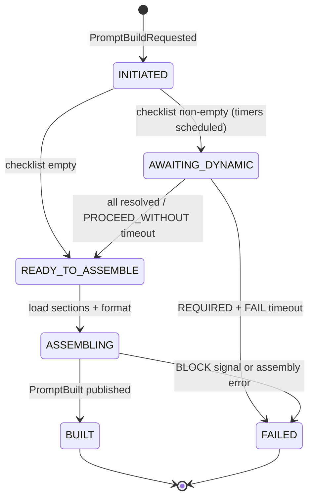
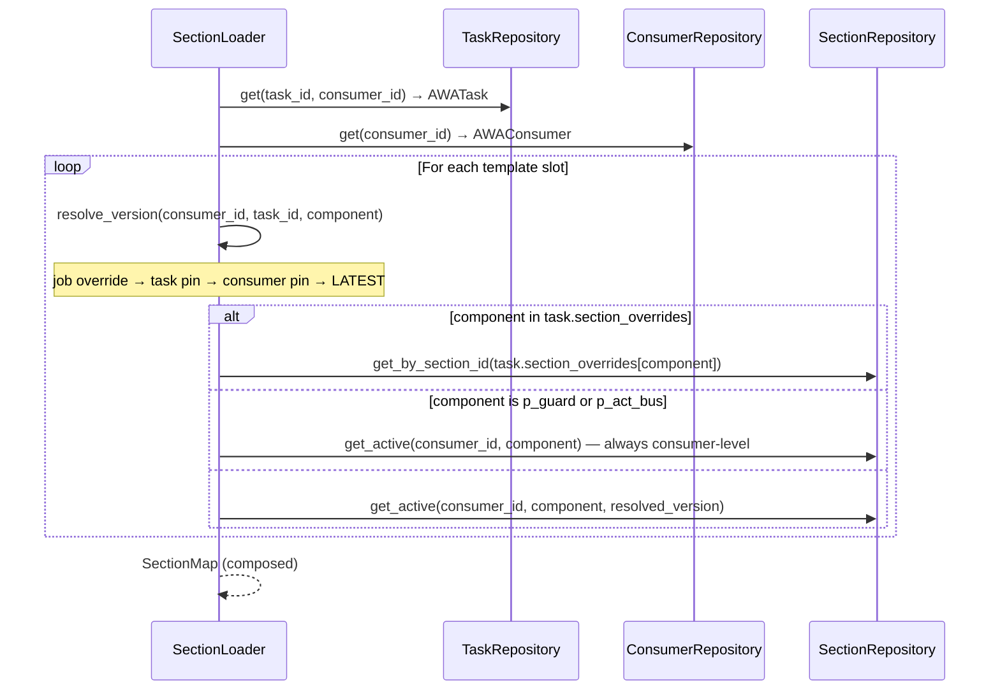

# AWA Agent Cortex — Technical Design Document

**Version:** 3.0.0  **Date:** 2026-05-26  **Status:** Final  
**Language:** Python 3.12  **Architecture:** Event-Driven Microservice · Hexagonal · Framework-Composable

---

## Table of Contents

1. [Executive Summary](#1-executive-summary)
2. [Feature Inventory](#2-feature-inventory)
3. [System Architecture](#3-system-architecture)
4. [Domain Model](#4-domain-model)
5. [Prompt Assembly Pipeline](#5-prompt-assembly-pipeline)
6. [LLM Adapter Registry](#6-llm-adapter-registry)
7. [Context Observer](#7-context-observer)
8. [Version Manager](#8-version-manager)
9. [Onboarding Framework](#9-onboarding-framework)
10. [Modification Framework](#10-modification-framework)
11. [Framework Integrations](#11-framework-integrations)
12. [AI Task Management](#12-ai-task-management)
13. [Event Architecture](#13-event-architecture)
14. [Control Plane REST API](#14-control-plane-rest-api)
15. [pb-cli Reference](#15-pb-cli-reference)
16. [Full Module & Class Reference](#16-full-module--class-reference)
17. [UML Diagrams](#17-uml-diagrams)
18. [Design Patterns](#18-design-patterns)
19. [SOLID Compliance](#19-solid-compliance)
20. [Technology Stack](#20-technology-stack)
21. [Deployment Architecture](#21-deployment-architecture)
22. [Security](#22-security)
23. [Phased Delivery Roadmap](#23-phased-delivery-roadmap)

---

## 1. Executive Summary

The **AWA Agent Cortex** is a runtime prompt construction microservice that assembles structured, LLM-standard-aware prompts from discrete versioned components before every LLM call. It is event-driven (Kafka), horizontally scalable, and model-agnostic.

Every prompt is built across a three-tier identity hierarchy: a **use case** (`AWA_Consumer_ID`) that defines the business domain, a specific **AI task** (`AWA_Task_ID`) that defines what capability is being invoked, and a **single LLM call** (`AWA_Job_ID`). This hierarchy enables precise prompt composition — business context and guardrails are shared at the consumer level, instruction logic is scoped to the task, and dynamic content (RAG, agent context, tool schemas) is resolved per job.

All quality thresholds are sourced from configuration files and resolved through a `ThresholdResolver` at runtime — no magic numbers exist in detector code. Runtime-generated content (OCR output, live retrievals) receives a dedicated `ContentQualityDetector` pathway in place of traditional rot detection, using confidence scores, relevance-to-query, and noise ratio as quality signals.

For teams using agent orchestration frameworks, AWA Agent Cortex ships first-class integrations for **LangGraph**, **Semantic Kernel**, and **CrewAI** via a pluggable `IFrameworkAdapter` port, supporting both standalone microservice deployment and embedded library mode.

---

## 2. Feature Inventory

### 2.1 Prompt Construction

| # | Feature |
|---|---------|
| F-01 | Runtime assembly of prompts from 11 discrete, versioned components |
| F-02 | Three-tier identity: `AWA_Consumer_ID` (use case), `AWA_Task_ID` (AI task), `AWA_Job_ID` (per LLM call) |
| F-03 | `p_template` controls slot order, placement (system/user), and enabled state |
| F-04 | Token budget enforcement per placement with automatic RAG source trimming |
| F-05 | Four-tier override precedence: job → task → consumer → global default |
| F-06 | `p_guard` enforced as always-present and non-disableable at any override level |

### 2.2 Dynamic Component Handling

| # | Feature |
|---|---------|
| F-07 | Per-consumer/task `DynamicDependencyConfig` for `p_rag_context_n` and `p_agent_context` |
| F-08 | Three wait strategies: `NOT_APPLICABLE`, `OPTIONAL`, `REQUIRED` |
| F-09 | Configurable timeout per dynamic component (milliseconds) |
| F-10 | Two timeout behaviours: `PROCEED_WITHOUT` (warn + continue) and `FAIL` (abort) |
| F-11 | `min_sources_required` threshold for RAG: treat sparse results as timeout |
| F-12 | Job-level override of wait strategy, timeout, and on_timeout |

### 2.3 Job State Machine

| # | Feature |
|---|---------|
| F-13 | Six-state lifecycle: `INITIATED → AWAITING_DYNAMIC → READY_TO_ASSEMBLE → ASSEMBLING → BUILT / FAILED` |
| F-14 | Per-job checklist stored in Redis (TTL-bounded), mirrored to Postgres on terminal state |
| F-15 | Redis-based distributed state — any Agent Cortex replica can advance a job |
| F-16 | Delay-queue timer events for dynamic component timeouts |
| F-17 | Five named event flows (no dynamic, RAG happy path, both dynamic, timeout PROCEED_WITHOUT, timeout FAIL) |

### 2.4 Multi-Model LLM Support

| # | Feature |
|---|---------|
| F-18 | Strategy-pattern adapter per LLM family: OpenAI, Anthropic, Gemini, Llama, Mistral, AWS Bedrock, CompassCore42 |
| F-19 | Extensible via `BaseLLMAdapter` subclass — no core code changes needed |
| F-20 | Per-adapter native prompt format (messages array, system+messages, contents[], special tokens) |
| F-21 | Per-adapter token estimation (tiktoken, Anthropic SDK, character approximation, custom) |
| F-22 | Adapter selected at runtime by `llm_model` field in `PromptBuildRequestedEvent` |

### 2.5 Versioning & Rollback

| # | Feature |
|---|---------|
| F-23 | Semantic versioning for all static sections and templates |
| F-24 | Full-snapshot version storage (not diffs) in S3-compatible object store |
| F-25 | Per-component version pinning at consumer or task level (or `LATEST`) |
| F-26 | Rollback with short-lived TOTP-style confirmation token gate |
| F-27 | Append-only audit log (actor, action, before, after, timestamp) |

### 2.6 Context Observation

| # | Feature |
|---|---------|
| F-28 | Per-job `ObservationReport`: token breakdown, alerts, rot signals, content quality alerts |
| F-29 | Bloat detection: total utilisation, single-section dominance, RAG source overflow |
| F-30 | Rot detection: staleness (days since update), semantic drift — applied to static versioned sections only |
| F-31 | Three observer actions: `WARN`, `TRIM` (drop lowest-scored RAG sources), `BLOCK` (abort) |
| F-32 | Per-consumer and per-task threshold overrides resolved via `ThresholdResolver` |
| F-33 | Timeout warnings attached to observation report when dynamic component is omitted |

### 2.7 Adapter Onboarding

| # | Feature |
|---|---------|
| F-34 | YAML template (`adapter_onboard.yaml`) for engineer self-service adapter registration |
| F-35 | Four adapter types: `llm`, `messaging`, `snapshot_store`, `timer` |
| F-36 | Pydantic schema validation with field-level error messages |
| F-37 | Jinja2 scaffold generation: Python class file + pytest skeleton |
| F-38 | Auto-append to `adapters_registry.yaml` master registry |
| F-39 | Dry-run mode previews generated files without writing |
| F-40 | Post-generation checklist of manual TODOs |

### 2.8 Use Case Onboarding

| # | Feature |
|---|---------|
| F-41 | YAML template (`pb_use_case_onboarding.yaml`) covering all consumer parameters including tasks |
| F-42 | Three section sources: `inline`, `file`, `shared` (cross-consumer content reuse) |
| F-43 | Environment targeting: `dev`, `staging`, `prod` |
| F-44 | Onboarding rollback (full snapshot written before any DB writes) |
| F-45 | Dry-run mode previews all DB records without writing |
| F-46 | Observer threshold override registration at onboarding time (consumer and task level) |

### 2.9 Adapter Modification

| # | Feature |
|---|---------|
| F-47 | Sparse diff YAML (`adapter_modify.yaml`) — only changed fields required |
| F-48 | Code-affecting field detection (`context_window`, `prompt_standard`, `token_counter`, `custom_format`) |
| F-49 | Optional scaffold regeneration (`--regenerate`) for code-affecting changes |
| F-50 | Class diff printed when code change detected without `--regenerate` |
| F-51 | Registry-only changes applied immediately without code change |
| F-52 | Idempotent — same YAML twice produces no-op |

### 2.10 Use Case Modification

| # | Feature |
|---|---------|
| F-53 | Sparse diff YAML (`pb_use_case_modify.yaml`) — independently modifiable blocks including tasks |
| F-54 | `dynamic_dependency_config` change publishes `DynamicConfigChanged` (live cache invalidation) |
| F-55 | `template` change creates new versioned `PromptTemplate`; old version preserved |
| F-56 | `sections` change creates new versioned `PromptSection` via `VersionManagerService` |
| F-57 | Slot merge: only named slots updated; unmentioned slots survive unchanged |
| F-58 | Per-modification rollback snapshot (independent from onboarding snapshot) |
| F-59 | Idempotent — same YAML twice produces no-op |

### 2.11 Observability & Operations

| # | Feature |
|---|---------|
| F-60 | Prometheus metrics endpoint per service |
| F-61 | OpenTelemetry distributed tracing (Jaeger) |
| F-62 | Structured JSON logging (ELK) — section content never logged, only IDs and token counts |
| F-63 | Alertmanager rules: bloat > 90%, rot > 60 days, build failure rate > 1%, RAG timeout > 5% |
| F-64 | Live job state API endpoint (`GET /api/v1/jobs/{id}/state`) |
| F-65 | Timeout-rate-per-dynamic-component metric per consumer |

### 2.12 Framework Integrations

| # | Feature |
|---|---------|
| F-66 | Three deployment modes: `service` (Kafka-native microservice), `library` (embedded SDK), `hybrid` |
| F-67 | `IFrameworkAdapter` port — bidirectional bridge between AWA domain and framework state models |
| F-68 | `IEventBus` port + `InProcessEventBus` (asyncio.Queue) for library mode |
| F-69 | LangGraph — `PromptBuilderNode` (graph node), `PromptBuilderRunnable` (Runnable), `AWAPromptState` TypedDict |
| F-70 | Semantic Kernel — `PromptBuilderPlugin` (KernelPlugin), `PromptEnrichmentFilter` (IFunctionInvocationFilter), `AWAAIConnector` |
| F-71 | CrewAI — `AWACrewLLM` (BaseLLM wrapper, recommended), `PromptBuilderTool` (BaseTool), `AWAAgentMixin` |
| F-72 | `p_tools` — 11th component type for tool/function schema injection from the orchestrating framework |
| F-73 | `IDCorrelationService` + three `ConsumerResolutionStrategy` implementations (Explicit, FrameworkIdentity, ConfigMap) |
| F-74 | `ContextBridgeService` — maps TypedDict / KernelArguments / task context ↔ `PromptBuildRequest` + `BuiltPrompt` |
| F-75 | Memory context adapters: `LangGraphCheckpointContextAdapter`, `SKVectorMemoryContextAdapter`, `CrewAIMemoryContextAdapter` |

### 2.13 AI Task Hierarchy

| # | Feature |
|---|---------|
| F-76 | `AWATask` entity: task-scoped `p_act_ins`, `p_act_cond`, `p_template`, version pins, dynamic config override, observer threshold overrides |
| F-77 | Task section composition: task-level overrides layer over consumer sections; `p_guard` and `p_act_bus` are always consumer-level |
| F-78 | `pb-cli task` command group + task CRUD REST endpoints + task block in onboarding/modify YAMLs |

### 2.14 Config-Driven Thresholds & Runtime Content Quality

| # | Feature |
|---|---------|
| F-79 | All observer thresholds sourced from `config/defaults/observer_thresholds.yaml`; zero hardcoded values in detector code |
| F-80 | `ThresholdResolver` merges global → consumer → task → job overrides into typed `ObserverThresholds` value object |
| F-81 | `RuntimeContentMetrics` travels with dynamic content events: `confidence_score`, `relevance_score`, `noise_ratio`, `source_timestamp`, `content_type` |
| F-82 | `ContentQualityDetector` assesses runtime sections on confidence, relevance-to-query, noise ratio, and source freshness |
| F-83 | `ContextObserverService` routes each section to rot detector (static/versioned) or quality detector (runtime-generated) based on `RuntimeContentMetrics` presence |

---

## 3. System Architecture

### 3.1 Architecture Style

- **Hexagonal (Ports & Adapters):** domain and service code depend only on abstract port interfaces; all infrastructure bindings live in the DI container.
- **Event-Driven:** Kafka is the coordination backbone in `service` mode; in `library` mode an in-process asyncio queue replaces Kafka.
- **Stateless services:** per-job state held in Redis (TTL-bounded); services are horizontally scalable.
- **Three-tier identity:** Consumer → Task → Job drives section composition, version resolution, and threshold selection.

### 3.2 System Context

```
┌──────────────────────────────────────────────────────────────────────────────┐
│                            External Callers                                   │
│  Chat UI │ Source System │ Agent Orchestrator │ LangGraph │ SK │ CrewAI      │
└──────┬──────────────┬──────────────────────────────────────┬─────────────────┘
       │              │                                       │ (library mode)
       ▼              ▼                                       ▼
┌─────────────────────────────────────────────────────────────────────────────┐
│                      API Gateway / Ingress                                   │
│              REST + gRPC  ──  JWT/mTLS Auth  ──  Rate Limit                │
└──────────────────────────────────┬──────────────────────────────────────────┘
                                   │
                          ┌────────▼────────┐
                          │   IEventBus      │
                          │  Kafka (service) │
                          │  InProcess (lib) │
                          └────────┬────────┘
        ┌─────────────────────────┼─────────────────────────┐
        ▼                         ▼                         ▼
┌──────────────┐        ┌──────────────────┐       ┌──────────────────────┐
│ Agent        │        │ Version Manager  │       │ Context Observer     │
│ Cortex       │        │ Service          │       │ Service              │
│              │        └──────────────────┘       └──────────────────────┘
└──────┬───────┘
       │
┌──────▼─────────────────────────────────────────────────┐
│  LLM Adapter Registry                                   │
│  OpenAI │ Anthropic │ Gemini │ Llama │ CompassCore42   │
│  AWALangChainModel (framework Runnable wrapper)        │
└─────────────────────────────────────────────────────────┘
       │
┌──────▼──────────────────────────────────────────────────────────────────────┐
│                            Storage Layer                                      │
│  PostgreSQL  (sections, templates, consumers, tasks, jobs, audit)            │
│  Redis       (job state machine, checklist, TTL)                             │
│  S3 / Blob   (version snapshots)                                             │
└─────────────────────────────────────────────────────────────────────────────┘
```

### 3.3 Service Responsibilities

| Service | Responsibility |
|---|---|
| **Agent Cortex** | Orchestrates the full assembly pipeline; owns job state machine; resolves task context |
| **Version Manager** | Snapshot versioning, rollback, audit for sections and templates |
| **Context Observer** | Bloat, rot, and content quality detection; emits alerts; applies TRIM strategy |
| **LLM Adapter Registry** | Translates canonical `SectionMap` into LLM-native prompt format |
| **Onboarding/Modification** | CLI-driven; manages adapter registry, consumer, and task DB records |
| **Framework Integrations** | Bridges AWA domain to LangGraph, Semantic Kernel, CrewAI state models |

### 3.4 Deployment Modes

| Mode | Event Bus | Redis | Use Case |
|---|---|---|---|
| `service` | Kafka (required) | Required | Standalone microservice, fully event-driven, multi-replica |
| `library` | InProcessEventBus | Optional | Embedded SDK inside LangGraph / SK / CrewAI application |
| `hybrid` | Kafka (required) | Required | Framework orchestrates agents; AWA called as a service per LLM invocation |

The DI container selects `KafkaEventBus` or `InProcessEventBus` based on `DEPLOYMENT_MODE` environment variable. All service code depends only on `IEventBus`.

---

## 4. Domain Model

### 4.1 The Eleven Prompt Components

| Key | Name | Scope | Lifecycle |
|---|---|---|---|
| `p_uq` | User / System Query | Job | Dynamic — per job |
| `p_guard` | Guardrail Prompt | Consumer (non-overridable at task level) | Static — always required |
| `p_act_bus` | Activity Business Context | Consumer | Static — consumer-level |
| `p_act_ins` | Activity Instructions | **Task** | Static — primary task differentiator |
| `p_act_cond` | Activity Conduct | Task or consumer | Static — task or consumer level |
| `p_rag_context_n` | RAG / OCR Context (1..N sources) | Job | Dynamic — per job, configurable |
| `p_agent_rgb` | Agent Role, Goal, Backstory | Consumer/Agent | Static — per agent |
| `p_agent_conduct` | Agent Conduct / Policy | Consumer/Agent | Static — per agent |
| `p_agent_context` | Agent Reflection Context | Job | Dynamic — per job, configurable |
| `p_template` | Assembly Template | Task or consumer | Static — task or consumer level |
| `p_tools` | Tool / Function Schemas | Job (from framework) | Dynamic — per job; injected by framework adapter |

### 4.2 Identifiers

```
AWA_Consumer_ID  ── use case domain  (e.g. IDP_INVOICE_US)
    └── AWA_Task_ID  ── specific AI function  (e.g. ENTITY_EXTRACTION)
            └── AWA_Job_ID  ── single LLM call  (e.g. job_abc123)
```

**Consumer scope:** `p_guard`, `p_act_bus`, default version pins, default dynamic config, default observer thresholds  
**Task scope:** `p_act_ins`, `p_act_cond`, `p_template`, task-level version pins, task dynamic config override, task threshold overrides  
**Job scope:** `p_uq`, `p_rag_context_n`, `p_agent_context`, `p_tools`, assembled prompt, job state, observation report

### 4.3 Core Domain Classes

```python
# ── Enumerations ─────────────────────────────────────────────────────────────
class ComponentType(str, Enum):
    P_UQ = "p_uq"; P_GUARD = "p_guard"; P_ACT_BUS = "p_act_bus"
    P_ACT_INS = "p_act_ins"; P_ACT_COND = "p_act_cond"
    P_RAG_CONTEXT_N = "p_rag_context_n"; P_AGENT_RGB = "p_agent_rgb"
    P_AGENT_CONDUCT = "p_agent_conduct"; P_AGENT_CONTEXT = "p_agent_context"
    P_TEMPLATE = "p_template"; P_TOOLS = "p_tools"       # 11th component

class WaitStrategy(str, Enum):   # NOT_APPLICABLE | OPTIONAL | REQUIRED
class OnTimeout(str, Enum):      # PROCEED_WITHOUT | FAIL
class JobState(str, Enum):       # INITIATED | AWAITING_DYNAMIC | READY_TO_ASSEMBLE | ASSEMBLING | BUILT | FAILED
class Placement(str, Enum):      # system | user
class AlertSeverity(str, Enum):  # WARN | TRIM | BLOCK
class DeploymentMode(str, Enum): # service | library | hybrid
class ContentType(str, Enum):    # ocr | retrieval | database | reflection | dynamic

# ── Threshold value objects (config-driven, immutable) ───────────────────────
@dataclass(frozen=True)
class BloatThresholds:
    total_utilization_warn_pct:   float = 80.0
    total_utilization_block_pct:  float = 95.0
    section_dominance_warn_pct:   float = 60.0
    rag_source_overflow_limit:    int   = 3

@dataclass(frozen=True)
class RotThresholds:
    staleness_warn_days:           int   = 30
    staleness_block_days:          int   = 90
    semantic_drift_warn_threshold: float = 0.65
    semantic_drift_enabled:        bool  = True

@dataclass(frozen=True)
class ContentQualityThresholds:
    min_confidence_score:    float = 0.75
    min_relevance_score:     float = 0.60
    max_noise_ratio:         float = 0.20
    block_on_low_confidence: bool  = False
    min_block_confidence:    float = 0.30

@dataclass(frozen=True)
class ObserverThresholds:
    bloat:           BloatThresholds
    rot:             RotThresholds
    content_quality: ContentQualityThresholds

# ── Value objects ─────────────────────────────────────────────────────────────
@dataclass
class RAGSource:
    source_id: str; content: str; score: float; token_count: int

@dataclass
class TokenBudget:
    system_max: int; user_max: int
    rag_context_max_per_source: int; rag_source_limit: int

@dataclass
class ChecklistItem:
    component: ComponentType; wait_strategy: WaitStrategy
    on_timeout: Optional[OnTimeout]; deadline: Optional[datetime]
    received: bool = False; timed_out: bool = False

@dataclass
class RuntimeContentMetrics:
    """Quality signals for runtime-generated content. Travels with the content event."""
    confidence_score:  Optional[float]    = None  # from upstream system (OCR, retrieval)
    relevance_score:   Optional[float]    = None  # computed vs p_uq at assembly time
    noise_ratio:       Optional[float]    = None  # non-alpha chars / total chars
    source_timestamp:  Optional[datetime] = None  # when underlying data was created
    content_type:      ContentType        = ContentType.DYNAMIC

@dataclass
class ContentQualityAlert:
    signal:    str            # LOW_CONFIDENCE | LOW_RELEVANCE | HIGH_NOISE | STALE_SOURCE
    severity:  AlertSeverity
    score:     float
    threshold: float
    component: ComponentType
    detail:    str

# ── Aggregates ────────────────────────────────────────────────────────────────
@dataclass
class PromptSection:
    section_id: str; component_id: ComponentType
    consumer_id: str; task_id: Optional[str]   # None = consumer-level section
    version: str; content: str; enabled: bool
    token_count: int; checksum: str; last_modified: datetime

class SectionMap:
    def add(component, section) -> None
    def add_rag_sources(sources, metrics: Optional[RuntimeContentMetrics] = None) -> None
    def add_runtime_section(component, section, metrics: RuntimeContentMetrics) -> None
    def get(component) -> Optional[PromptSection]
    def get_rag_sources() -> list[RAGSource]
    def get_runtime_metrics(component) -> Optional[RuntimeContentMetrics]
    def is_runtime(component) -> bool
    def enabled_sections() -> list[PromptSection]
    def total_tokens() -> int

@dataclass
class PromptTemplate:
    template_id: str; consumer_id: str; task_id: Optional[str]
    version: str; slots: list[TemplateSlot]; token_budget: TokenBudget
    def ordered_slots() -> list[TemplateSlot]
    def system_slots() -> list[TemplateSlot]
    def user_slots() -> list[TemplateSlot]

class DynamicChecklist:
    def is_complete() -> bool
    def has_fatal_timeout() -> bool
    def mark_received(component) -> None
    def mark_timed_out(component) -> None
    def is_empty() -> bool

@dataclass
class ComponentDependencyConfig:
    applicable: bool; wait_strategy: WaitStrategy
    timeout_ms: Optional[int]; on_timeout: Optional[OnTimeout]
    min_sources_required: Optional[int]

@dataclass
class DynamicDependencyConfig:
    consumer_id: str; task_id: Optional[str]; version: str
    p_rag_context_n: ComponentDependencyConfig
    p_agent_context: ComponentDependencyConfig
    def is_applicable(component) -> bool
    def get_config(component) -> ComponentDependencyConfig

@dataclass
class AWAConsumer:
    consumer_id: str; name: str; default_llm_model: str
    version_pins: dict[str, str]
    dynamic_dependency_config: DynamicDependencyConfig
    observer_thresholds: Optional[ObserverThresholds]

@dataclass
class AWATask:
    task_id: str; consumer_id: str; name: str; description: str
    section_overrides: dict[ComponentType, str]  # component → section_id
    template_id: Optional[str]
    version_pins: dict[str, str]
    dynamic_config_override: Optional[DynamicDependencyConfig]
    observer_thresholds: Optional[ObserverThresholds]
    enabled: bool

@dataclass
class AWAJob:
    job_id: str; consumer_id: str; task_id: Optional[str]
    llm_model: str; p_uq: str; state: JobState
    checklist: Optional[DynamicChecklist]; overrides: dict
    created_at: datetime

@dataclass
class ObservationReport:
    report_id: str; job_id: str
    total_tokens: int; model_context_limit: int; utilization_pct: float
    section_breakdown: list[TokenBreakdown]
    alerts: list[ContextAlert]; rot_signals: list[RotSignal]
    content_quality_alerts: list[ContentQualityAlert]
    runtime_sections_assessed: list[ComponentType]
    static_sections_assessed: list[ComponentType]
    dynamic_timeout_warnings: list[str]
    def has_blocking_alert() -> bool
    def has_trim_alert() -> bool
```

---

## 5. Prompt Assembly Pipeline

### 5.1 Dynamic Dependency Configuration

Stored per consumer with optional task-level overrides. Task config takes priority over consumer config.

| `wait_strategy` | Meaning |
|---|---|
| `NOT_APPLICABLE` | Never used. No timer started. Slot skipped even if in `p_template`. |
| `OPTIONAL` | Wait up to `timeout_ms`. Proceed silently if not received. |
| `REQUIRED` | Wait up to `timeout_ms`. Then apply `on_timeout`. |

| `on_timeout` | Behaviour |
|---|---|
| `PROCEED_WITHOUT` | Omit section. Record timeout in manifest. Emit WARN. |
| `FAIL` | Abort build. Publish `PromptBuildFailed`. |

### 5.2 Job State Machine

```
INITIATED
  ├── checklist empty? ──YES──► READY_TO_ASSEMBLE
  └──NO──► AWAITING_DYNAMIC
                ├── all resolved ──► READY_TO_ASSEMBLE
                └── REQUIRED + FAIL timeout ──► FAILED

READY_TO_ASSEMBLE ──► ASSEMBLING ──► BUILT
                                └──► FAILED  (Context Observer BLOCK)
```

Valid transitions stored as `frozenset[(from, to)]` in `JobStateMachine._TRANSITIONS`. State persisted in Redis keyed by `AWA_Job_ID` with TTL = `max(timeout_ms) + 10 s`.

### 5.3 Assembly Pipeline

```
PromptBuildRequested (consumer_id, task_id, job_id, p_uq, llm_model, tools_schema)
    │
    ├─► Load AWATask (if task_id) + AWAConsumer
    ├─► Merge DynamicDependencyConfig: task override → consumer default
    ├─► Apply job-level overrides to merged config
    ├─► ThresholdResolver.resolve(consumer_id, task_id) → ObserverThresholds
    ├─► DynamicDependencyResolver.build_checklist(job, merged_config)
    │
    ├─► Checklist empty? → READY_TO_ASSEMBLE
    │   Non-empty? → persist to Redis, schedule timeouts → AWAITING_DYNAMIC
    │
    │   [await RAGContextRetrieved / AgentContextReady / DynamicComponentTimeout]
    │
    ├─► Checklist resolved → READY_TO_ASSEMBLE
    ├─► SectionLoader.load_sections(consumer_id, task_id, template) → SectionMap
    │       task-level section_overrides compose over consumer sections
    ├─► Merge dynamic sections into SectionMap
    │       RAG sources + RuntimeContentMetrics, agent context, p_uq, p_tools
    ├─► TemplateExecutor.execute(template, section_map, dynamic_config)
    │
    ├─► ContextObserverService.observe(section_map, job, template, thresholds)
    │       BloatDetector(section_map, context_limit, thresholds.bloat)
    │       Per section:
    │         is_runtime(component)?
    │           YES → ContentQualityDetector(section, metrics, p_uq, thresholds.content_quality)
    │           NO  → RotDetector(section, p_uq, thresholds.rot)
    │       → ObservationReport
    │
    ├─► BLOCK? → FAILED; TRIM? → apply, re-observe
    ├─► LLMAdapterRegistry.get(llm_model).format(section_map, template) → LLMPayload
    └─► Publish PromptBuilt
```

### 5.4 Override Precedence (Four-Tier)

```
Priority (highest → lowest):
  1. Job-level override    (PromptBuildRequestedEvent.overrides)
  2. Task-level config     (AWATask.version_pins / dynamic_config_override / observer_thresholds)
  3. Consumer-level config (AWAConsumer.version_pins / DynamicDependencyConfig / observer_thresholds)
  4. Global default        (config/defaults/observer_thresholds.yaml)
```

**Non-overridable:** `p_guard` cannot be disabled at any tier. `min_sources_required` can only be relaxed (lowered) at job level.

---

## 6. LLM Adapter Registry

### 6.1 Prompt Standards per LLM

| Adapter | Format | Token Counter |
|---|---|---|
| `OpenAIAdapter` | `messages[]` with `system`/`user`/`assistant` roles | tiktoken `cl100k_base` |
| `AnthropicAdapter` | `system` param + `messages[]`; XML tags for sections | Anthropic SDK count_tokens |
| `GeminiAdapter` | `contents[]` with `role` and `parts` | Google tokenizer |
| `LlamaAdapter` | `<\|system\|>` / `<\|user\|>` special tokens | tiktoken or character estimate |
| `MistralAdapter` | `[INST]` / `[/INST]` instruction format | tiktoken |
| `BedrockAdapter` | Bedrock Converse API format | Model-specific |
| `CompassCore42Adapter` | OpenAI-compatible (scaffold-generated) | tiktoken |

### 6.2 Adapter Interface

```python
class ILLMAdapter(ABC):
    model_family:   str   # abstract property
    context_window: int   # abstract property
    def format(section_map: SectionMap, template: PromptTemplate) -> LLMPayload: ...
    def estimate_tokens(content: str) -> int: ...
```

### 6.3 Registry

`LLMAdapterRegistry` maintains a `dict[str, ILLMAdapter]` populated at startup by `AdapterRegistryLoader` reading `config/adapters_registry.yaml`. `get(model)` resolves model name → family → registered adapter instance.

---

## 7. Context Observer

### 7.1 Bloat Detection (`BloatDetector`)

All thresholds injected via `BloatThresholds` — zero hardcoded values.

| Signal | Condition | Default Action |
|---|---|---|
| Total utilisation | tokens > `total_utilization_warn_pct`% of context window | WARN |
| Total utilisation | tokens > `total_utilization_block_pct`% | BLOCK |
| Section dominance | one section > `section_dominance_warn_pct`% of total tokens | WARN |
| RAG overflow | source count > `rag_source_overflow_limit` | TRIM |

### 7.2 Rot Detection (`RotDetector`) — Static Sections Only

All thresholds injected via `RotThresholds`. Applied **only to sections without `RuntimeContentMetrics`**.

| Signal | Condition | Default Action |
|---|---|---|
| Staleness | not updated in > `staleness_warn_days` days | WARN |
| Staleness | not updated in > `staleness_block_days` days | BLOCK |
| Semantic drift | cosine_similarity(section, p_uq) < `semantic_drift_warn_threshold` | WARN |

### 7.3 Content Quality Detection (`ContentQualityDetector`) — Runtime Sections Only

All thresholds injected via `ContentQualityThresholds`. Applied **only to sections with `RuntimeContentMetrics` attached** (OCR output, live retrievals, tool results).

| Signal | Metric | Default Action |
|---|---|---|
| Low confidence | `confidence_score` < `min_confidence_score` | WARN |
| Critical confidence | `confidence_score` < `min_block_confidence` AND `block_on_low_confidence` | BLOCK |
| Low relevance | cosine_similarity(content, p_uq) < `min_relevance_score` | WARN |
| High noise | `noise_ratio` > `max_noise_ratio` (non-alpha / total chars) | WARN |
| Stale source | `source_timestamp` age > `staleness_warn_days` (when timestamp available) | WARN |

### 7.4 Observer Actions

```
WARN  → attach to ObservationReport; publish ContextAlert; continue build
TRIM  → drop lowest-scored RAG sources until under budget; re-count; continue
BLOCK → publish PromptBuildBlocked; transition job to FAILED
```

### 7.5 Threshold Resolution

```python
class ThresholdResolver:
    def resolve(
        self,
        consumer_id: str,
        task_id: Optional[str] = None,
        job_overrides: Optional[dict] = None,
    ) -> ObserverThresholds:
        """
        Merges: global defaults (YAML)
                ← consumer-level overrides (DB)
                ← task-level overrides (DB)
                ← job-level overrides (event payload)
        Returns immutable ObserverThresholds.
        """
    def resolve_bloat(consumer_id, task_id, job_overrides) -> BloatThresholds
    def resolve_rot(consumer_id, task_id, job_overrides) -> RotThresholds
    def resolve_content_quality(consumer_id, task_id) -> ContentQualityThresholds
    def _merge(base: ObserverThresholds, override: dict) -> ObserverThresholds
```

Global defaults are loaded once at startup from `config/defaults/observer_thresholds.yaml` via `GlobalThresholdConfig` (pydantic-settings).

---

## 8. Version Manager

### 8.1 Versioning Model

- **Semantic versioning** (`major.minor.patch`) for all sections and templates.
- Each version is a **full snapshot** stored in object storage.
- Active version flagged in Postgres (`is_active = true`).
- Version pins can be set at consumer level or task level. Task pins take priority.

### 8.2 Rollback

```
1. Caller: target_version + confirmation_token
2. VersionManagerService validates TOTP token
3. Deactivates current version; activates target version
4. Publishes VersionRolledBack → cache invalidation
5. Writes audit record
```

---

## 9. Onboarding Framework

### 9.1 Files

```
config/templates/adapter_onboard.yaml          ← blank adapter template
config/templates/pb_use_case_onboarding.yaml   ← blank use case + tasks template
config/defaults/observer_thresholds.yaml       ← global threshold defaults (NEW)
config/adapters_registry.yaml                  ← master registry (auto-maintained)
config/examples/IDP_INVOICE_US_onboarding.yaml ← filled use case example with tasks
scaffold_templates/llm_adapter.py.j2
scaffold_templates/messaging_adapter.py.j2
scaffold_templates/adapter_test.py.j2
```

### 9.2 Global Threshold Defaults File

```yaml
# config/defaults/observer_thresholds.yaml
observer:
  bloat:
    total_utilization_warn_pct:    80
    total_utilization_block_pct:   95
    section_dominance_warn_pct:    60
    rag_source_overflow_limit:     3
  rot:
    staleness_warn_days:           30
    staleness_block_days:          90
    semantic_drift_warn_threshold: 0.65
    semantic_drift_enabled:        true
  content_quality:
    min_confidence_score:          0.75
    min_relevance_score:           0.60
    max_noise_ratio:               0.20
    block_on_low_confidence:       false
    min_block_confidence:          0.30
```

### 9.3 Use Case Onboarding YAML — `tasks` and `integrations` Blocks

```yaml
use_case:
  awa_consumer_id: IDP_INVOICE_US
  # ... consumer-level config ...

  tasks:
    - task_id:      ENTITY_EXTRACTION
      name:         "Entity Extraction"
      description:  "Extracts structured fields from invoice documents"
      dynamic_config_override:
        p_rag_context_n:
          wait_strategy: REQUIRED
          timeout_ms:    6000
          on_timeout:    FAIL
      sections:
        p_act_ins:
          source:       file
          content_file: config/sections/IDP_INVOICE_US/tasks/entity_extraction_ins.txt
          new_version:  "1.0.0"
        p_act_cond:
          source:  inline
          content: |
            DO extract all monetary amounts with currency codes.
            DO NOT infer values not present in the document.
      version_pins:
        p_act_ins: "1.0.0"
      observer_thresholds:
        bloat:
          section_dominance_warn_pct: 75   # OCR output is verbose

    - task_id:      DOC_CLASSIFICATION
      name:         "Document Classification"
      dynamic_config_override:
        p_rag_context_n:
          wait_strategy: OPTIONAL
      sections:
        p_act_ins:
          source:       file
          content_file: config/sections/IDP_INVOICE_US/tasks/doc_classification_ins.txt
          new_version:  "1.0.0"

    - task_id:      SUMMARIZATION
      name:         "Document Summarisation"
      sections:
        p_act_ins:
          source:  inline
          content: |
            Produce a concise summary of the document in 3-5 bullet points.

  integrations:
    langgraph:
      enabled:             true
      thread_id_as_job_id: true
    semantic_kernel:
      enabled:       true
      attach_filter: true
    crewai:
      enabled:                   true
      llm_wrapper:               true
      agent_role_as_consumer_id: true
```

### 9.4 Section Sources

| Source | How content is loaded |
|---|---|
| `inline` | Content written directly in the YAML |
| `file` | Content read from a file path relative to the YAML |
| `shared` | References an existing `PromptSection` from another consumer |

---

## 10. Modification Framework

### 10.1 Design Principle

**Sparse / diff-based.** Every field defaults to `null`. The service applies only non-null fields. Running the same YAML twice is a no-op. Every modify writes a rollback snapshot before applying changes.

### 10.2 Adapter Modification

| Changed field | Category | Effect |
|---|---|---|
| `enabled`, `supported_models`, `connection.*` | Registry-only | YAML updated; DI hot-reload |
| `context_window`, `prompt_standard`, `token_counter`, `custom_format` | Code-affecting | Registry + class diff; `--regenerate` re-runs scaffold |

### 10.3 Use Case Modification Blocks

| Block | Effect |
|---|---|
| `llm` | DB update; model validated against registry |
| `dynamic_dependency_config` | DB update + `DynamicConfigChanged` Kafka event |
| `template` | New `PromptTemplate` version; old preserved |
| `sections` | New `PromptSection` version via `VersionManagerService` |
| `version_pins` | DB update |
| `observer_thresholds` | DB update |
| `tasks` | Task-level section, config, pin, or threshold update |

---

## 11. Framework Integrations

### 11.1 Deployment Modes

In **`library` mode**, `InProcessEventBus` replaces Kafka. All async coordination uses `asyncio.Queue` within the same process. In **`hybrid` mode**, the framework calls AWA's REST API or SDK entry point; AWA internally uses Kafka. The DI container wires the correct `IEventBus` based on `DEPLOYMENT_MODE`.

### 11.2 `IFrameworkAdapter` Port

```python
class IFrameworkAdapter(ABC):
    @abstractmethod
    async def build_from_framework_context(
        self,
        consumer_id: str,
        task_id: Optional[str],
        job_id: str,
        framework_context: dict[str, Any],
        dynamic_overrides: Optional[dict] = None,
    ) -> BuiltPrompt: ...

    @abstractmethod
    def map_to_build_request(self, framework_state: Any) -> PromptBuildRequest: ...

    @abstractmethod
    def map_from_built_prompt(self, prompt: BuiltPrompt) -> Any: ...
```

### 11.3 Event Bus Abstraction

```python
class IEventBus(ABC):
    async def publish(self, event: DomainEvent) -> None: ...
    async def subscribe(self, event_type: str, handler: Callable) -> None: ...

class KafkaEventBus(IEventBus):       # service mode
class InProcessEventBus(IEventBus):   # library mode — asyncio.Queue per event type
```

### 11.4 LangGraph Integration

```
integrations/langgraph/
  node.py                  PromptBuilderNode     — drop-in StateGraph node
  runnable.py              PromptBuilderRunnable — LangChain Runnable
  state.py                 AWAPromptState        — TypedDict
  checkpoint_context.py    LangGraphCheckpointContextAdapter (IContextStore)
```

```python
graph = StateGraph(AWAPromptState)
graph.add_node("build_prompt", PromptBuilderNode(
    consumer_id="IDP_INVOICE_US", task_id="ENTITY_EXTRACTION"))
graph.add_edge("build_prompt", "call_llm")
```

`thread_id` in LangGraph checkpointer maps to `AWA_Job_ID` when `thread_id_as_job_id: true`.

### 11.5 Semantic Kernel Integration

```
integrations/semantic_kernel/
  plugin.py          PromptBuilderPlugin    — KernelPlugin with @kernel_function
  filter.py          PromptEnrichmentFilter — IFunctionInvocationFilter (middleware)
  connector.py       AWAAIConnector         — SK AI service wrapper
  memory_context.py  SKVectorMemoryContextAdapter (IContextStore)
```

```python
# Transparent middleware — no changes to existing agent code
kernel.add_filter("function_invocation",
    PromptEnrichmentFilter(consumer_id="IDP_INVOICE_US", task_id="ENTITY_EXTRACTION"))
```

### 11.6 CrewAI Integration

```
integrations/crewai/
  llm.py            AWACrewLLM        — BaseLLM wrapper (recommended)
  tool.py           PromptBuilderTool — BaseTool (tool-call pattern)
  agent_mixin.py    AWAAgentMixin     — maps agent.role → AWA_Consumer_ID
  memory_context.py CrewAIMemoryContextAdapter (IContextStore — STM/LTM/entity)
```

```python
# LLM wrapper pattern — agents unaware of prompt building
agent = Agent(
    role="Invoice Processor",
    llm=AWACrewLLM(base_model="gpt-4o", task_id="ENTITY_EXTRACTION")
)
```

### 11.7 `p_tools` — 11th Component

| Property | Value |
|---|---|
| Source | Framework-injected via `PromptBuildRequestedEvent.tools_schema` |
| Placement | `system` |
| Applicable when | Framework has registered tools AND consumer template enables the slot |
| Quality check | `ContentQualityDetector` (runtime section — no rot detection) |

### 11.8 Consumer Resolution Strategy

```python
class ConsumerResolutionStrategy(ABC):
    def resolve(self, framework_context: dict) -> tuple[str, Optional[str]]:
        """Returns (consumer_id, task_id)."""

class ExplicitStrategy(ConsumerResolutionStrategy):       # passed directly in call
class FrameworkIdentityStrategy(ConsumerResolutionStrategy): # from agent role / node name
class ConfigMapStrategy(ConsumerResolutionStrategy):       # from YAML config file
```

### 11.9 `ContextBridgeService`

| Framework | State In | State Out |
|---|---|---|
| LangGraph | `TypedDict` | state dict update with `awa_built_prompt` |
| Semantic Kernel | `KernelArguments` | `FunctionResult` |
| CrewAI | task context dict | formatted string |

### 11.10 Memory Context Adapters

All implement `IContextStore` (existing port for `p_agent_context`):

```python
class LangGraphCheckpointContextAdapter(IContextStore): ...
class SKVectorMemoryContextAdapter(IContextStore): ...
class CrewAIMemoryContextAdapter(IContextStore): ...
```

---

## 12. AI Task Management

### 12.1 Task Concept

A **Task** is a named, reusable AI capability within a consumer domain. It carries task-specific instruction content and configuration that composes over the consumer's shared baseline.

**Example tasks for `IDP_INVOICE_US`:**

| Task ID | p_act_ins | RAG strategy | p_template |
|---|---|---|---|
| `DOC_CLASSIFICATION` | Classification rules | OPTIONAL | Classification template |
| `ENTITY_EXTRACTION` | Field schema + rules | REQUIRED | Extraction template |
| `DOC_CLASS_ENTITY_EXTRACT` | Combined instructions (compound) | REQUIRED | Combined template |
| `SUMMARIZATION` | Summary format + length | OPTIONAL | Summary template |

### 12.2 Section Composition Rule

```
Final SectionMap =
    Consumer sections: p_guard, p_act_bus         [always consumer-level; p_guard non-overridable]
  + Task section overrides: p_act_ins, p_act_cond  [task content replaces consumer defaults]
  + Consumer fallback: p_act_ins (if no task override)
  + Job-time dynamic: p_uq, p_rag_context_n, p_agent_context, p_tools
```

### 12.3 Task-Level Dynamic Config Merge

```
Resolved config = task.dynamic_config_override  (if set — highest priority)
               ← consumer.dynamic_dependency_config  (fallback)
               ← global defaults
```

### 12.4 Task REST API

```
GET    /api/v1/consumers/{id}/tasks
POST   /api/v1/consumers/{id}/tasks
GET    /api/v1/consumers/{id}/tasks/{task_id}
PUT    /api/v1/consumers/{id}/tasks/{task_id}
PATCH  /api/v1/consumers/{id}/tasks/{task_id}/enable
DELETE /api/v1/consumers/{id}/tasks/{task_id}
GET    /api/v1/consumers/{id}/tasks/{task_id}/sections/{component}/versions
POST   /api/v1/consumers/{id}/tasks/{task_id}/sections/{component}/versions
POST   /api/v1/consumers/{id}/tasks/{task_id}/sections/{component}/rollback
GET    /api/v1/consumers/{id}/tasks/{task_id}/observer-thresholds
PUT    /api/v1/consumers/{id}/tasks/{task_id}/observer-thresholds
```

---

## 13. Event Architecture

### 13.1 Kafka Topics

| Topic | Publisher | Consumers | Purpose |
|---|---|---|---|
| `awa.prompt.build.requested` | API Gateway / Framework Adapter | Agent Cortex | Trigger assembly |
| `awa.prompt.rag.retrieved` | RAG Pipeline | Agent Cortex | Inject RAG context + metrics |
| `awa.prompt.agent.context.ready` | CoT/ToT Engine | Agent Cortex | Inject agent context |
| `awa.prompt.dynamic.timeout` | Timer Service | Agent Cortex | Deadline exceeded |
| `awa.prompt.built` | Agent Cortex | LLM Caller, Context Observer, Audit | Final prompt ready |
| `awa.prompt.build.failed` | Agent Cortex | Alert, Caller | Build failed |
| `awa.prompt.build.blocked` | Context Observer | Alert, Caller | Observer blocked build |
| `awa.prompt.context.alert` | Context Observer | Alert, Dashboard | Bloat/rot/quality warning |
| `awa.version.changed` | Version Manager | Agent Cortex (cache invalidate) | Section/template updated |
| `awa.version.rolledback` | Version Manager | Agent Cortex, Audit | Rollback applied |
| `awa.section.flag.changed` | Control Plane API | Agent Cortex | Enable/disable section |
| `awa.dynamic.config.changed` | Control Plane API | Agent Cortex | Dynamic config updated |

### 13.2 Key Event Schemas

```python
PromptBuildRequestedEvent:
    event_type, awa_consumer_id, awa_task_id,          # task_id NEW
    awa_job_id, llm_model, p_uq,
    tools_schema: Optional[list[dict]],                # p_tools injection
    overrides: dict

RAGContextRetrievedEvent:
    awa_job_id, sources: list[RAGSource],
    source_confidence: Optional[float],                # from OCR/retrieval engine
    retrieval_timestamp: Optional[datetime]            # source data creation time

AgentContextReadyEvent:
    awa_job_id, context_type, content, token_count,
    context_confidence: Optional[float],
    source_timestamp: Optional[datetime],
    content_type: ContentType                          # ocr | reflection | database

DynamicComponentTimeoutEvent: awa_job_id, component_id

PromptBuiltEvent:
    awa_consumer_id, awa_task_id, awa_job_id, llm_model,
    formatted_payload, section_manifest,
    observation_report_ref, build_duration_ms

PromptBuildFailedEvent:
    awa_consumer_id, awa_task_id, awa_job_id, reason,
    failed_component, on_timeout_applied
```

### 13.3 Event Flows

| Flow | Scenario | Terminal Event |
|---|---|---|
| **A** | No dynamic components applicable | `PromptBuilt` (fast path) |
| **B** | RAG required, arrives with metrics | `PromptBuilt` |
| **C** | RAG + agent context both required, both arrive | `PromptBuilt` |
| **D** | RAG required, timeout → `PROCEED_WITHOUT` | `PromptBuilt` (with WARN) |
| **E** | RAG required, timeout → `FAIL` | `PromptBuildFailed` |

---

## 14. Control Plane REST API

```
# Section flags
PATCH /api/v1/consumers/{id}/sections/{component}/flag

# Dynamic dependency config
GET   /api/v1/consumers/{id}/dynamic-dependency-config
PUT   /api/v1/consumers/{id}/dynamic-dependency-config
PATCH /api/v1/consumers/{id}/dynamic-dependency-config/{component}

# Task management
GET    /api/v1/consumers/{id}/tasks
POST   /api/v1/consumers/{id}/tasks
GET    /api/v1/consumers/{id}/tasks/{task_id}
PUT    /api/v1/consumers/{id}/tasks/{task_id}
PATCH  /api/v1/consumers/{id}/tasks/{task_id}/enable
DELETE /api/v1/consumers/{id}/tasks/{task_id}
POST   /api/v1/consumers/{id}/tasks/{task_id}/sections/{component}/rollback
GET    /api/v1/consumers/{id}/tasks/{task_id}/observer-thresholds
PUT    /api/v1/consumers/{id}/tasks/{task_id}/observer-thresholds

# Version management
GET   /api/v1/consumers/{id}/sections/{component}/versions
POST  /api/v1/consumers/{id}/sections/{component}/versions
POST  /api/v1/consumers/{id}/sections/{component}/rollback
GET   /api/v1/consumers/{id}/templates
POST  /api/v1/consumers/{id}/templates
POST  /api/v1/consumers/{id}/templates/rollback

# Observer thresholds
GET   /api/v1/consumers/{id}/observer-thresholds
PUT   /api/v1/consumers/{id}/observer-thresholds
GET   /api/v1/global/observer-thresholds

# Observation & monitoring
GET   /api/v1/jobs/{job_id}/observation-report
GET   /api/v1/jobs/{job_id}/state
GET   /api/v1/consumers/{id}/context-metrics
GET   /api/v1/consumers/{id}/rot-alerts
GET   /api/v1/consumers/{id}/bloat-alerts
GET   /api/v1/consumers/{id}/content-quality-alerts
GET   /api/v1/consumers/{id}/timeout-stats
```

All endpoints require JWT with RBAC claims. Rollback requires a TOTP confirmation token.

---

## 15. pb-cli Reference

Built with **Click**. Installed as console script `pb-cli`.

```
# Adapter commands
pb-cli adapter onboard         --config <yaml> [--dry-run] [--output-dir <dir>]
pb-cli adapter modify          --config <yaml> [--dry-run] [--regenerate]
pb-cli adapter enable|disable  <name>
pb-cli adapter list            [--type llm|messaging|snapshot_store|timer]
pb-cli adapter validate        --config <yaml>

# Use case commands
pb-cli use-case onboard        --config <yaml> --env <env> [--dry-run]
pb-cli use-case modify         --config <yaml> --env <env> [--dry-run]
pb-cli use-case rollback       --consumer-id <id> --ref <rollback-ref>
pb-cli use-case list           [--env <env>]
pb-cli use-case status         <consumer-id>
pb-cli use-case validate       --config <yaml>

# Task commands (NEW)
pb-cli task create             --consumer-id <id> --config <yaml> --env <env> [--dry-run]
pb-cli task modify             --consumer-id <id> --task-id <id> --config <yaml> --env <env>
pb-cli task list               --consumer-id <id> [--env <env>]
pb-cli task enable|disable     --consumer-id <id> --task-id <id>
pb-cli task rollback           --consumer-id <id> --task-id <id> --ref <rollback-ref>
pb-cli task status             --consumer-id <id> --task-id <id>

# Integration commands (NEW)
pb-cli integration test        --consumer-id <id> --framework langgraph|semantic_kernel|crewai
pb-cli integration list        [--enabled-only]
pb-cli integration enable|disable <framework>
```

---

## 16. Full Module & Class Reference

### 16.1 Package Structure

```
awa_prompt_builder/
├── domain/
│   ├── enums/
│   │   ├── component_type.py     ComponentType (11 values incl. P_TOOLS)
│   │   ├── wait_strategy.py      WaitStrategy
│   │   ├── on_timeout.py         OnTimeout
│   │   ├── job_state.py          JobState
│   │   ├── placement.py          Placement
│   │   ├── alert_severity.py     AlertSeverity
│   │   ├── deployment_mode.py    DeploymentMode
│   │   └── content_type.py       ContentType
│   └── models/
│       ├── prompt_section.py     PromptSection, SectionMap, RAGSource
│       ├── prompt_template.py    PromptTemplate, TemplateSlot, TokenBudget
│       ├── job.py                AWAJob, DynamicChecklist, ChecklistItem
│       ├── consumer.py           AWAConsumer, DynamicDependencyConfig, ComponentDependencyConfig
│       ├── task.py               AWATask                           [NEW]
│       ├── thresholds.py         ObserverThresholds, BloatThresholds,
│       │                         RotThresholds, ContentQualityThresholds  [NEW]
│       ├── runtime_metrics.py    RuntimeContentMetrics             [NEW]
│       ├── observation.py        ObservationReport, ContextAlert, RotSignal,
│       │                         TokenBreakdown, ContentQualityAlert
│       ├── events.py             BaseEvent + all concrete events (updated)
│       ├── version.py            VersionRecord
│       └── llm_payload.py        LLMPayload, LLMMessage, MessageRole
│
├── ports/
│   ├── section_repository.py     ISectionRepository
│   ├── template_repository.py    ITemplateRepository
│   ├── consumer_repository.py    IConsumerRepository
│   ├── task_repository.py        ITaskRepository                   [NEW]
│   ├── job_state_repository.py   IJobStateRepository
│   ├── event_publisher.py        IEventPublisher
│   ├── event_bus.py              IEventBus                         [NEW]
│   ├── llm_adapter.py            ILLMAdapter
│   ├── context_observer.py       IContextObserver
│   ├── snapshot_store.py         ISnapshotStore
│   ├── timer_service.py          ITimerService
│   ├── audit_log.py              IAuditLog
│   ├── token_counter.py          ITokenCounter
│   ├── embedding_client.py       IEmbeddingClient
│   ├── context_store.py          IContextStore
│   └── framework_adapter.py      IFrameworkAdapter                 [NEW]
│
├── services/
│   ├── prompt_builder_service.py   PromptBuilderService (task-aware)
│   ├── section_loader.py           SectionLoader (4-tier version resolution)
│   ├── dependency_resolver.py      DynamicDependencyResolver (task override merge)
│   ├── state_machine.py            JobStateMachine
│   ├── template_executor.py        TemplateExecutor
│   ├── threshold_resolver.py       ThresholdResolver               [NEW]
│   ├── context_observer_service.py ContextObserverService, BloatDetector, RotDetector
│   ├── content_quality_detector.py ContentQualityDetector          [NEW]
│   ├── task_service.py             TaskService                     [NEW]
│   └── version_manager_service.py  VersionManagerService
│
├── adapters/
│   ├── repositories/
│   │   ├── postgres_section_repo.py
│   │   ├── postgres_template_repo.py
│   │   ├── postgres_consumer_repo.py
│   │   ├── postgres_task_repo.py     PostgresTaskRepository        [NEW]
│   │   └── redis_job_state_repo.py
│   ├── messaging/
│   │   ├── kafka_event_bus.py        KafkaEventBus (IEventBus)    [NEW]
│   │   ├── inprocess_event_bus.py    InProcessEventBus (IEventBus) [NEW]
│   │   ├── kafka_publisher.py        KafkaEventPublisher
│   │   ├── kafka_consumer.py         KafkaEventConsumer
│   │   ├── rabbitmq_publisher.py     [generated]
│   │   ├── rabbitmq_consumer.py      [generated]
│   │   └── azure_service_bus_*.py    [generated]
│   ├── snapshot/
│   │   ├── s3_snapshot_store.py
│   │   └── azure_blob_snapshot_store.py [generated]
│   └── llm/
│       ├── base.py                   BaseLLMAdapter
│       ├── registry.py               LLMAdapterRegistry
│       ├── langchain_wrapper.py      AWALangChainModel (BaseChatModel) [NEW]
│       ├── openai_adapter.py
│       ├── anthropic_adapter.py
│       ├── gemini_adapter.py
│       ├── llama_adapter.py
│       ├── mistral_adapter.py
│       ├── bedrock_adapter.py
│       └── compass_core42_adapter.py [generated]
│
├── handlers/
│   ├── base.py                       BaseEventHandler
│   ├── prompt_build_requested.py     PromptBuildRequestedHandler
│   ├── rag_context_retrieved.py      RAGContextRetrievedHandler
│   ├── agent_context_ready.py        AgentContextReadyHandler
│   └── dynamic_component_timeout.py  DynamicComponentTimeoutHandler
│
├── integrations/                     [NEW PACKAGE]
│   ├── base.py                       IFrameworkAdapter, ContextBridgeService
│   ├── correlation.py                IDCorrelationService,
│   │                                 ExplicitStrategy, FrameworkIdentityStrategy,
│   │                                 ConfigMapStrategy
│   ├── langgraph/
│   │   ├── node.py                   PromptBuilderNode
│   │   ├── runnable.py               PromptBuilderRunnable
│   │   ├── state.py                  AWAPromptState (TypedDict)
│   │   └── checkpoint_context.py     LangGraphCheckpointContextAdapter
│   ├── semantic_kernel/
│   │   ├── plugin.py                 PromptBuilderPlugin
│   │   ├── filter.py                 PromptEnrichmentFilter
│   │   ├── connector.py              AWAAIConnector
│   │   └── memory_context.py         SKVectorMemoryContextAdapter
│   └── crewai/
│       ├── llm.py                    AWACrewLLM
│       ├── tool.py                   PromptBuilderTool
│       ├── agent_mixin.py            AWAAgentMixin
│       └── memory_context.py         CrewAIMemoryContextAdapter
│
├── onboarding/
│   ├── schemas/
│   │   ├── adapter_onboard_schema.py
│   │   ├── adapter_modify_schema.py
│   │   ├── use_case_schema.py        (tasks + integrations blocks)
│   │   ├── use_case_modify_schema.py (tasks block)
│   │   └── task_schema.py            TaskOnboardSchema, TaskModifySchema [NEW]
│   ├── adapter_scaffold_generator.py
│   ├── adapter_registry_loader.py
│   ├── adapter_modification_service.py
│   ├── use_case_onboarding_service.py  (task creation)
│   ├── use_case_modification_service.py (task modification)
│   ├── task_service.py               TaskService (CLI facade)      [NEW]
│   └── cli.py                        pb-cli (task + integration commands)
│
├── api/
│   ├── routers/
│   │   ├── sections.py; templates.py; consumers.py; jobs.py
│   │   ├── tasks.py                  [NEW]
│   │   ├── dynamic_config.py
│   │   ├── observation.py
│   │   └── thresholds.py             [NEW]
│   └── middleware/auth.py
│
└── infrastructure/
    ├── database.py
    ├── redis_client.py
    ├── timer_service.py
    ├── s3_snapshot_store.py
    ├── threshold_config.py           GlobalThresholdConfig (pydantic-settings) [NEW]
    └── container.py                  (IEventBus wiring, ThresholdResolver, TaskRepository)
```

### 16.2 Key Class Methods

```python
class PromptBuilderService:
    async def handle_build_requested(event: PromptBuildRequestedEvent) -> None
    async def handle_rag_context_retrieved(event: RAGContextRetrievedEvent) -> None
    async def handle_agent_context_ready(event: AgentContextReadyEvent) -> None
    async def handle_dynamic_timeout(event: DynamicComponentTimeoutEvent) -> None
    async def _resolve_task(consumer_id, task_id) -> Optional[AWATask]
    async def _merge_dynamic_config(consumer, task, job_overrides) -> DynamicDependencyConfig
    async def _assemble_and_publish(job: AWAJob) -> None

class SectionLoader:
    async def load_sections(consumer_id, task_id, template) -> SectionMap
    async def resolve_version(consumer_id, task_id, component) -> str
        # Chain: job override → task pin → consumer pin → LATEST
    def _verify_checksum(section) -> bool

class DynamicDependencyResolver:
    def merge_config(consumer_config, task_override, job_overrides) -> DynamicDependencyConfig
    async def build_checklist(job, config) -> DynamicChecklist

class ThresholdResolver:
    def resolve(consumer_id, task_id, job_overrides) -> ObserverThresholds
    def resolve_bloat(consumer_id, task_id, job_overrides) -> BloatThresholds
    def resolve_rot(consumer_id, task_id, job_overrides) -> RotThresholds
    def resolve_content_quality(consumer_id, task_id) -> ContentQualityThresholds
    def _merge(base, override) -> ObserverThresholds

class BloatDetector:
    def detect(section_map, context_limit, thresholds: BloatThresholds) -> list[ContextAlert]

class RotDetector:
    async def detect(section_map, p_uq, thresholds: RotThresholds) -> list[RotSignal]

class ContentQualityDetector:
    async def detect(
        section, metrics: RuntimeContentMetrics, p_uq: str,
        thresholds: ContentQualityThresholds,
        embedding_client: Optional[IEmbeddingClient],
    ) -> list[ContentQualityAlert]
    def _confidence_alert(metrics, thresholds) -> Optional[ContentQualityAlert]
    async def _relevance_alert(content, p_uq, thresholds, ec) -> Optional[ContentQualityAlert]
    def _noise_alert(content, thresholds) -> Optional[ContentQualityAlert]
    def _source_freshness_alert(metrics, rot_thresholds) -> Optional[ContentQualityAlert]

class ContextObserverService:
    async def observe(section_map, job, template, thresholds: ObserverThresholds) -> ObservationReport
    async def _check_rot_or_quality(section, metrics, p_uq, thresholds) -> list
        # Routes: RotDetector (static) or ContentQualityDetector (runtime)

class TaskService:
    async def create_task(consumer_id, schema, env) -> AWATask
    async def modify_task(consumer_id, task_id, schema, env) -> AWATask
    async def list_tasks(consumer_id) -> list[AWATask]
    async def set_enabled(consumer_id, task_id, enabled) -> None
    async def rollback_section(consumer_id, task_id, component, version, token) -> None

class ContextBridgeService:
    def map_langgraph_to_request(state, consumer_id, task_id) -> PromptBuildRequest
    def map_sk_to_request(args, consumer_id, task_id) -> PromptBuildRequest
    def map_crewai_to_request(context, consumer_id, task_id) -> PromptBuildRequest
    def map_to_langgraph(prompt: BuiltPrompt) -> dict
    def map_to_sk(prompt: BuiltPrompt) -> FunctionResult
    def map_to_crewai(prompt: BuiltPrompt) -> str

class AWALangChainModel(BaseChatModel):
    """Wraps any ILLMAdapter as a LangChain-compatible BaseChatModel."""
    def _generate(messages, stop, **kwargs) -> ChatResult
    async def _agenerate(messages, stop, **kwargs) -> ChatResult

class AWACrewLLM(BaseLLM):
    """Wraps AWA prompt building + ILLMAdapter as a CrewAI-compatible LLM."""
    def call(prompt, stop) -> str
    async def acall(prompt, stop) -> str
```

---

## 17. UML Diagrams

### 17.1 Domain Model



### 17.2 Core Services and Ports



### 17.3 LLM Adapter Hierarchy



### 17.4 Event Handlers



### 17.5 Framework Integration Layer



### 17.6 Job State Machine



### 17.7 RAG Happy Path with Task Context

```mermaid
sequenceDiagram
    participant C  as Caller
    participant PB as Agent Cortex
    participant R  as Redis
    participant T  as Timer Service
    participant RP as RAG Pipeline
    participant CO as Context Observer
    participant LA as LLM Adapter

    C  ->> PB : PromptBuildRequested (consumer=IDP, task=ENTITY_EXTRACTION, job=abc)
    PB ->> PB : load AWATask + merge DynamicDependencyConfig
    PB ->> PB : ThresholdResolver.resolve(consumer, task) → ObserverThresholds
    PB ->> R  : persist checklist {p_rag: pending}
    PB ->> T  : schedule timeout (6000ms)
    Note over PB: AWAITING_DYNAMIC

    RP ->> PB : RAGContextRetrieved (confidence=0.92, timestamp=...)
    PB ->> R  : mark received; attach RuntimeContentMetrics
    Note over PB: READY_TO_ASSEMBLE

    PB ->> PB : SectionLoader.load_sections(consumer, task, template)
    Note over PB: task overrides p_act_ins; consumer provides p_guard, p_act_bus
    PB ->> T  : cancel timeout
    PB ->> CO : observe(section_map, job, template, thresholds)
    Note over CO: p_guard, p_act_bus → RotDetector\np_rag_context_n → ContentQualityDetector
    CO -->> PB : ObservationReport (no blocking alerts)
    PB ->> LA : format(section_map, template)
    LA -->> PB : LLMPayload
    PB ->> C  : PromptBuilt
```

### 17.8 Task Section Resolution



---

## 18. Design Patterns

### 18.1 Strategy — LLM Adapters
**Problem:** Different LLMs need different prompt formats.  
**Solution:** `ILLMAdapter` strategy interface; `LLMAdapterRegistry.get(model)` selects at runtime.  
**Classes:** `ILLMAdapter`, `BaseLLMAdapter`, all concrete adapters.

### 18.2 Registry / Plugin — Adapter Registry
**Problem:** New adapters must be discoverable without hardcoded conditionals.  
**Solution:** `LLMAdapterRegistry` dict + `AdapterRegistryLoader` reads YAML at startup.

### 18.3 State Machine — `JobStateMachine`
**Problem:** Job lifecycle has strict sequencing; state must survive across replicas.  
**Solution:** `frozenset` of valid `(from, to)` tuples; state persisted in Redis.

### 18.4 Template Method — `BaseEventHandler`
**Problem:** Every handler needs identical error isolation and dead-letter logic.  
**Solution:** `safe_handle()` skeleton (validate → handle → on_error); subclasses override `handle()`.

### 18.5 Repository — Data Access Abstraction
**Problem:** Services must be testable without Postgres/Redis.  
**Solution:** Port interfaces (`ISectionRepository`, `ITaskRepository`, etc.) injected via DI.

### 18.6 Chain of Responsibility — Version Resolution
**Problem:** Version resolved through a four-tier priority chain.  
```python
async def resolve_version(consumer_id, task_id, component, job_overrides):
    if v := job_overrides.get(str(component)): return v        # tier 1
    if v := task.version_pins.get(str(component)):
        if v != "LATEST": return v                             # tier 2
    if v := consumer.version_pins.get(str(component)):
        if v != "LATEST": return v                             # tier 3
    return await section_repo.get_active_version(...)          # tier 4
```

### 18.7 Observer — Context Quality Monitoring
**Problem:** Builder must not contain bloat, rot, or content quality logic.  
**Solution:** `IContextObserver` port; `ContextObserverService` orchestrates three detectors; routes by section type.

### 18.8 Builder — `SectionMap` + `TemplateExecutor`
**Problem:** Prompt assembled section-by-section from different sources at different times.  
**Solution:** `SectionMap` allows order-independent construction; `TemplateExecutor` produces ordered output.

### 18.9 Ports and Adapters (Hexagonal Architecture)
```
Outer:  Postgres, Redis, Kafka/InProcess, S3, LLM APIs, LangGraph, SK, CrewAI
Middle: ISectionRepository, IEventBus, ILLMAdapter, IFrameworkAdapter, ITaskRepository ...
Inner:  PromptBuilderService, JobStateMachine, TemplateExecutor, ThresholdResolver ...
```

### 18.10 Factory — `LLMAdapterRegistry.get()`
**Problem:** Callers should not instantiate adapters directly.  
**Solution:** `get(model)` resolves model name → family → registered adapter instance.

### 18.11 Command — pb-cli Click Commands
**Problem:** Each CLI operation is a complex multi-step procedure.  
**Solution:** Each `@click.command` is self-contained; no cross-contamination between commands.

### 18.12 Diff / Patch — Sparse Modification YAMLs
**Problem:** Modification must be safe and non-destructive to unmentioned fields.  
**Solution:** All modification schemas default to `null`; diff applied; rollback snapshot written first. Same YAML twice = no-op.

### 18.13 Adapter / Bridge — `IFrameworkAdapter`
**Problem:** LangGraph, SK, and CrewAI have incompatible state models.  
**Solution:** `IFrameworkAdapter` bridge interface; each implementation translates framework types ↔ AWA domain. Core is unaware of any framework.

```python
# LangGraph — graph node
graph.add_node("build_prompt", PromptBuilderNode(consumer_id="IDP_INVOICE_US", task_id="ENTITY_EXTRACTION"))

# Semantic Kernel — transparent middleware
kernel.add_filter("function_invocation", PromptEnrichmentFilter(consumer_id="IDP_INVOICE_US"))

# CrewAI — custom LLM wrapper
agent = Agent(role="Invoice Processor", llm=AWACrewLLM(base_model="gpt-4o", task_id="ENTITY_EXTRACTION"))
```

### 18.14 Strategy — `ConsumerResolutionStrategy`
**Problem:** Different teams map framework identity to AWA IDs differently.  
**Solution:** Three interchangeable implementations (`ExplicitStrategy`, `FrameworkIdentityStrategy`, `ConfigMapStrategy`).

### 18.15 Strategy — `ThresholdResolver` Merge Chain
**Problem:** Observer thresholds must be resolved across four levels without hardcoding.  
**Solution:** `ThresholdResolver` merges immutable `ObserverThresholds` value objects through the four-tier precedence chain. No detector contains a numeric literal.

---

## 19. SOLID Compliance

### S — Single Responsibility

| Class | Sole Responsibility |
|---|---|
| `PromptBuilderService` | Orchestrate assembly pipeline; delegate to specialists |
| `SectionLoader` | Resolve and load sections with 4-tier version chain |
| `DynamicDependencyResolver` | Build checklists from merged consumer+task config |
| `JobStateMachine` | Enforce valid state transitions |
| `TemplateExecutor` | Apply template ordering + token budget |
| `ThresholdResolver` | Merge threshold configs across four priority levels |
| `BloatDetector` | Detect token overuse (no rot, no quality, no publishing) |
| `RotDetector` | Detect staleness/drift in static sections only |
| `ContentQualityDetector` | Assess runtime-generated content quality only |
| `ContextObserverService` | Orchestrate detectors; route by section type; build report |
| `TaskService` | CRUD and rollback for AWATask entities |
| `ContextBridgeService` | Map framework state ↔ AWA domain (no business logic) |
| `IDCorrelationService` | Resolve framework IDs → AWA IDs via pluggable strategy |

### O — Open/Closed

| Extension point | How to extend | Core changed? |
|---|---|---|
| New LLM adapter | Subclass `BaseLLMAdapter`, register in YAML | ❌ |
| New messaging adapter | `pb-cli adapter onboard` | ❌ |
| New AI task | `pb-cli task create` YAML | ❌ |
| New observation signal | New detector class; inject into `ContextObserverService` | ❌ |
| New framework integration | Implement `IFrameworkAdapter` | ❌ |
| New threshold level | Extend `ThresholdResolver._merge()` | Minimal |
| New CLI command | Add `@click.command` | ❌ |

### L — Liskov Substitution

| Interface | Substitutable implementations |
|---|---|
| `ILLMAdapter` | All 7 adapters + any scaffold-generated adapter |
| `IEventBus` | `KafkaEventBus` (service), `InProcessEventBus` (library) |
| `IFrameworkAdapter` | `LangGraphAdapter`, `SemanticKernelAdapter`, `CrewAIAdapter` |
| `IContextObserver` | `ContextObserverService`, `NoOpObserver` (tests) |
| `IContextStore` | `LangGraphCheckpointContextAdapter`, `SKVectorMemoryContextAdapter`, `CrewAIMemoryContextAdapter` |
| `ITaskRepository` | `PostgresTaskRepository`, `InMemoryTaskRepository` (tests) |
| `ConsumerResolutionStrategy` | `ExplicitStrategy`, `FrameworkIdentityStrategy`, `ConfigMapStrategy` |

### I — Interface Segregation

| Separation | Rationale |
|---|---|
| `IEventBus` ≠ `IEventPublisher` | Bus manages bidirectional flow; publisher is publish-only |
| `ITaskRepository` ≠ `IConsumerRepository` | Different CRUD contracts |
| `IContextStore` ≠ `ISectionRepository` | Dynamic context sources ≠ versioned static sections |
| `IFrameworkAdapter` ≠ `ILLMAdapter` | Framework bridging ≠ LLM formatting |
| `BloatThresholds` / `RotThresholds` / `ContentQualityThresholds` separate | Components consume only what they need |

### D — Dependency Inversion

```
PromptBuilderService
    → IEventBus (not KafkaEventBus)
    → IFrameworkAdapter (not LangGraphAdapter)
    → ITaskRepository (not PostgresTaskRepository)
    → IContextObserver (not ContextObserverService)

ThresholdResolver
    → IConsumerRepository, ITaskRepository
    — never contains a threshold literal

ContextObserverService
    → BloatDetector, RotDetector, ContentQualityDetector (injected)
    — never imports a threshold literal
```

All concrete bindings declared once in `infrastructure/container.py`.

---

## 20. Technology Stack

| Layer | Technology | Role |
|---|---|---|
| API | FastAPI + uvicorn | Async REST; OpenAPI auto-generated |
| Event bus (service) | Apache Kafka + aiokafka | Async event publishing and consuming |
| Event bus (library) | asyncio.Queue (`InProcessEventBus`) | In-process coordination |
| Job state | Redis (redis-py async) | TTL-bounded per-job state machine |
| Persistence | PostgreSQL + SQLAlchemy 2.x async | Sections, templates, consumers, tasks, audit, jobs |
| Object store | AWS S3 / Azure Blob | Version snapshots |
| DI framework | dependency-injector | Wires ports to concrete adapters |
| Config + thresholds | pydantic-settings + PyYAML | Typed env vars + YAML threshold loading |
| Schema validation | pydantic v2 | YAML validation with field-level errors |
| Code generation | Jinja2 | Scaffold templates for adapters and tests |
| CLI | Click | pb-cli |
| Token counting | tiktoken | OpenAI/Llama/Mistral estimation |
| Embeddings | `IEmbeddingClient` (pluggable) | Semantic drift + relevance scoring |
| LangGraph integration | langgraph + langchain-core | `PromptBuilderNode`, `PromptBuilderRunnable` |
| Semantic Kernel integration | semantic-kernel | `PromptBuilderPlugin`, `PromptEnrichmentFilter` |
| CrewAI integration | crewai + litellm | `AWACrewLLM`, `PromptBuilderTool` |
| LangChain wrapper | langchain-core | `AWALangChainModel` (`BaseChatModel`) |
| Tracing | OpenTelemetry + Jaeger | Distributed traces |
| Metrics | Prometheus + Grafana | Service and business metrics |
| Logging | structlog → ELK | Structured JSON logs |
| Testing | pytest + pytest-asyncio + httpx | Unit, integration, API tests |
| Containerisation | Docker + Kubernetes | Deployment |

---

## 21. Deployment Architecture

```
┌─────────────────────────────── Kubernetes Cluster ────────────────────────────┐
│                                                                                │
│  ┌──────────────────┐  ┌──────────────────┐  ┌──────────────────────────────┐ │
│  │  agent-cortex   │  │ version-manager  │  │      context-observer        │ │
│  │  (3 replicas)     │  │  (2 replicas)    │  │       (2 replicas)           │ │
│  │  HPA: Kafka lag   │  └──────────────────┘  └──────────────────────────────┘ │
│  └──────────────────┘                                                          │
│                                                                                │
│  ┌──────────────────────────────────────────────────────────────────────────┐  │
│  │                   Apache Kafka (3-broker cluster)                         │  │
│  └──────────────────────────────────────────────────────────────────────────┘  │
│                                                                                │
│  ┌─────────────────────┐  ┌─────────────────────┐  ┌────────────────────────┐ │
│  │  PostgreSQL          │  │  Redis Cluster       │  │  S3 / Azure Blob       │ │
│  │  (Primary + Replica) │  │  (3 nodes)           │  │  (version snapshots)   │ │
│  └─────────────────────┘  └─────────────────────┘  └────────────────────────┘ │
│                                                                                │
│  Each service: /health  /ready  /metrics                                      │
└────────────────────────────────────────────────────────────────────────────────┘

Library Mode (embedded inside framework application):
┌──────────────────────────────────────────────────────┐
│  LangGraph / SK / CrewAI Application Process          │
│    └── awa_prompt_builder (DEPLOYMENT_MODE=library)  │
│          IEventBus       → InProcessEventBus          │
│          IJobStateRepo   → InMemory or Redis          │
│          ITaskRepository → PostgresTaskRepository     │
└──────────────────────────────────────────────────────┘
```

**HPA trigger:** Kafka consumer lag on `awa.prompt.build.requested` > 500 messages.

---

## 22. Security

| Control | Implementation |
|---|---|
| `p_guard` always included | `TemplateExecutor`: required=true slots skip the enabled check; cannot be overridden at task level |
| Section integrity | SHA-256 checksum per section; `SectionLoader._verify_checksum()` validates before assembly |
| Content never logged | Only `section_id`, `version`, `token_count`, `task_id`, `consumer_id` in structured logs |
| API authentication | JWT with RBAC: `section:write`, `version:rollback`, `flag:write`, `config:write`, `task:write` |
| Rollback gate | TOTP confirmation token from separate `/rollback/token` endpoint |
| Audit trail | All changes (flag, version, rollback, onboarding, modification, task create/modify) written to append-only table |
| Credential management | All credentials via environment variables; YAML stores only the env var name |
| Prompt injection | `p_guard` contains injection resistance instructions; loaded first in all templates |
| Runtime content blocking | `ContentQualityDetector` can BLOCK assembly when `confidence_score < min_block_confidence` (configurable) |

---

## 23. Phased Delivery Roadmap

| Phase | Scope | Deliverable |
|---|---|---|
| **P1 — Core Assembly** | `domain/`, `ports/`, `PromptBuilderService`, `SectionLoader`, `TemplateExecutor`, `OpenAIAdapter`, `AnthropicAdapter`, `KafkaEventBus`, `PostgresSectionRepository`, static-only build | End-to-end static prompt assembly |
| **P2 — Dynamic Components** | `DynamicDependencyResolver`, `JobStateMachine`, Redis state, timeout events, all 5 event flows | Full dynamic prompt construction with configurable wait |
| **P3 — Versioning** | `VersionManagerService`, `S3SnapshotStore`, rollback API, audit log | Safe config change management with rollback |
| **P4 — Observation** | `GlobalThresholdConfig`, `ThresholdResolver`, `BloatDetector`, `RotDetector`, `ContentQualityDetector`, `ContextObserverService`, `RuntimeContentMetrics`, TRIM strategy, `config/defaults/observer_thresholds.yaml` | Config-driven prompt quality monitoring; runtime content quality assessment; zero hardcoded thresholds |
| **P5 — Onboarding** | `onboarding/` package, Jinja2 scaffold, `adapters_registry.yaml`, `pb-cli` adapter and use case commands, all YAML templates | Engineer self-service onboarding |
| **P6 — Modification** | `AdapterModificationService`, `UseCaseModificationService`, modify CLI commands | Live parameter modification with rollback |
| **P7 — AI Task Hierarchy** | `AWATask`, `ITaskRepository`, `PostgresTaskRepository`, `TaskService`, task-aware `SectionLoader` (4-tier chain), task-aware `DynamicDependencyResolver`, `pb-cli task`, task REST endpoints, tasks block in onboarding/modify YAMLs | Full Consumer → Task → Job scoping with task-level sections, config, and thresholds |
| **P8 — Framework Integrations** | `integrations/` package: LangGraph (`PromptBuilderNode`, `PromptBuilderRunnable`, `AWAPromptState`); SK (`PromptBuilderPlugin`, `PromptEnrichmentFilter`, `AWAAIConnector`); CrewAI (`AWACrewLLM`, `PromptBuilderTool`, `AWAAgentMixin`); `InProcessEventBus`; `ContextBridgeService`; `IDCorrelationService` + 3 strategies; 3 memory context adapters; `AWALangChainModel`; `p_tools` component; integration CLI commands | Plug-and-play integration with LangGraph, Semantic Kernel, and CrewAI in both service and library mode |
| **P9 — Multi-Model Expansion** | Remaining LLM adapters (Gemini, Llama, Mistral, Bedrock, Compass Core42), RabbitMQ and Azure Service Bus messaging adapters | Full multi-model, multi-broker production readiness |

---

*Document version: 3.0.0 — 2026-05-26 — Final*
