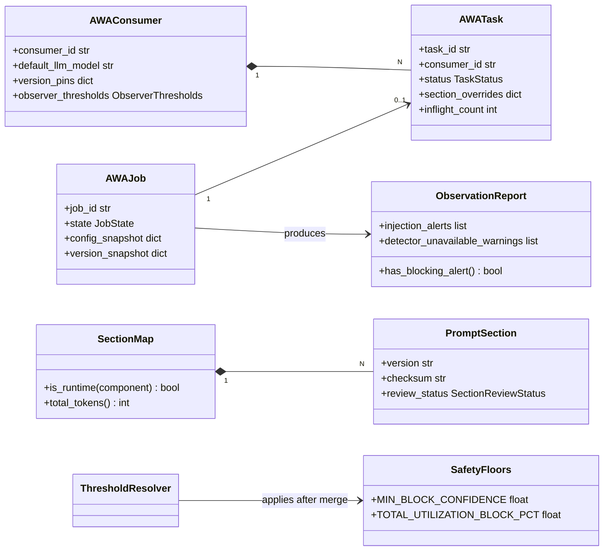
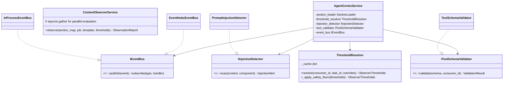
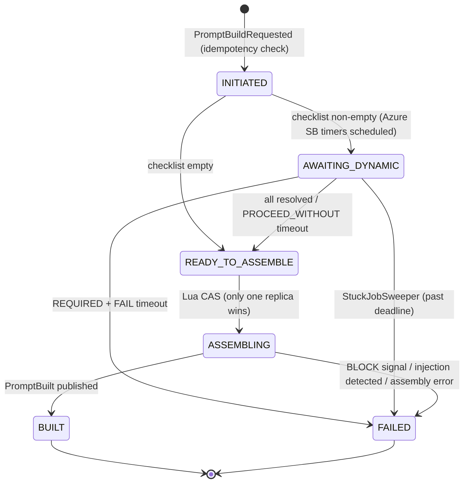
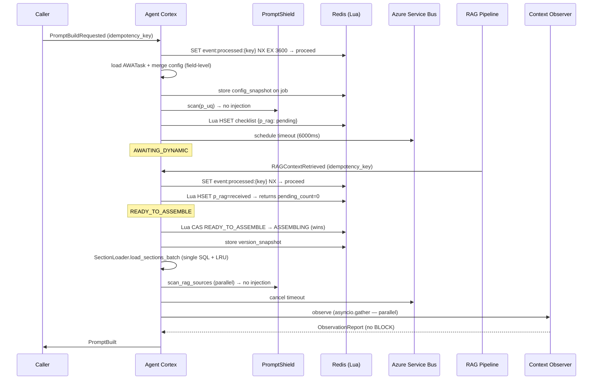

# AWA Agent Cortex — Technical Design Document

**Version:** 4.1.0  **Date:** 2026-05-27  **Status:** Final  
**Language:** Python 3.12  **Architecture:** Event-Driven Microservice · Hexagonal · Framework-Composable · Multi-Cloud Portable  
**Supersedes:** v4.0.0 (2026-05-27)  
**Change drivers:** FMEA v1.0.0 hardening (28 action items) · Azure-native infrastructure · Strategic LLM platform positioning · Multi-cloud adapter framework (credential, timer, guardrail ports)

---

## Table of Contents

1. [Executive Summary](#1-executive-summary)
2. [Strategic Position & Responsibilities](#2-strategic-position--responsibilities)
3. [Feature Inventory](#3-feature-inventory)
4. [System Architecture](#4-system-architecture)
5. [Domain Model](#5-domain-model)
6. [Prompt Assembly Pipeline](#6-prompt-assembly-pipeline)
7. [LLM Adapter Registry](#7-llm-adapter-registry)
8. [Context Observer](#8-context-observer)
9. [Security Services](#9-security-services)
10. [Version Manager](#10-version-manager)
11. [Onboarding Framework](#11-onboarding-framework)
12. [Modification Framework](#12-modification-framework)
13. [Framework Integrations](#13-framework-integrations)
14. [AI Task Management](#14-ai-task-management)
15. [Event Architecture](#15-event-architecture)
16. [Control Plane REST API](#16-control-plane-rest-api)
17. [ac-cli Reference](#17-ac-cli-reference)
18. [Full Module & Class Reference](#18-full-module--class-reference)
19. [UML Diagrams](#19-uml-diagrams)
20. [Design Patterns](#20-design-patterns)
21. [SOLID Compliance](#21-solid-compliance)
22. [Technology Stack](#22-technology-stack)
23. [Deployment Architecture](#23-deployment-architecture)
24. [Security](#24-security)
25. [Architectural Invariants](#25-architectural-invariants)
26. [Phased Delivery Roadmap](#26-phased-delivery-roadmap)

---

## 1. Executive Summary

The **AWA Agent Cortex** is the central LLM platform service for all AWA agents. It assembles structured, LLM-standard-aware prompts from discrete versioned components before every LLM call — and in doing so, becomes the single governance point for model selection, safety policy, content quality, cost attribution, and prompt observability across the entire AWA agent ecosystem.

Every prompt is built across a three-tier identity hierarchy: a **use case** (`AWA_Consumer_ID`) that defines the business domain, a specific **AI task** (`AWA_Task_ID`) that defines what capability is being invoked, and a **single LLM call** (`AWA_Job_ID`). This hierarchy enables precise prompt composition — business context and guardrails are shared at the consumer level, instruction logic is scoped to the task, and dynamic content (RAG, agent context, tool schemas) is resolved per job.

This version (v4.1.0) incorporates all 28 action items from the FMEA v1.0.0 risk register, and introduces a multi-cloud adapter framework across three new port types: `ICredentialProvider` (IAM), `ITimerService` (extended), and `IGuardrailService` (content safety). Each port has three interchangeable implementations — Azure-native, AWS-native, and on-prem — enabling Agent Cortex to be deployed on AKS, Amazon EKS, or bare Kubernetes without any changes to the domain or application layers. Releases 1–3 are Azure-native. Release 4 extends the platform to AWS (EKS + IRSA + EventBridge + Comprehend/Bedrock Guardrails) and on-prem Kubernetes (Vault + Celery Beat + self-hosted model guardrail).

Key hardening changes (carried from v4.0.0) include: atomic Redis Lua state transitions, idempotency keys on all events, embedding circuit breaker with Redis cache, parallel observer evaluation, prompt injection detection layer, tool schema validation, 4-eyes content review gate, job-level safety floors, consumer ownership enforcement on APIs, stuck job sweeper, and bounded library-mode event queues.

---

## 2. Strategic Position & Responsibilities

### 2.1 What AWA Agent Cortex Is

AWA Agent Cortex is not a helper library that individual agents optionally use. It is the **mandatory LLM platform service** that every AWA agent calls for every LLM invocation. This positioning has four strategic dimensions:

| Dimension | What it means for design |
|---|---|
| **Model governance** | All model selection flows through the adapter registry. A model that is not registered cannot be used by any agent. Model capability changes are applied once at the registry layer. |
| **Safety policy** | `p_guard` is non-disableable, injection-detected, and Prompt-Shield-screened. Safety threshold floors cannot be breached by any caller — not even at job level. The Content Review Gate prevents unauthorised section content from going live without a second approver. |
| **Cost attribution** | Every LLM call carries `consumer_id`, `task_id`, and `job_id` — these identifiers flow into every `PromptBuiltEvent` and into Application Insights. Token consumption per consumer, per task, per model is measurable from day one. |
| **Quality observability** | Every prompt is observed before delivery. Bloat, rot, and content quality signals are emitted as structured events whether or not they block a build. Aggregate trends across all consumers are available from a single query. |

### 2.2 Boundary Map

| Category | Owned by Agent Cortex | Owned by Platform | Owned by Upstream |
|---|---|---|---|
| **Event infrastructure** | Azure Event Hubs (Kafka endpoint) — topics, consumer groups, ACLs | Azure Event Hubs namespace provisioning, networking, RBAC | — |
| **Timer** | `ITimerService` port — Azure Service Bus (R1–R3) · AWS EventBridge Scheduler (R4) · Celery Beat (R4 on-prem) | Azure Service Bus namespace / AWS EventBridge / Celery broker | — |
| **State** | Redis job state machine, checklist, embedding cache | Redis Enterprise E10 / ElastiCache / self-hosted Redis | — |
| **Persistence** | PostgreSQL schema: sections, templates, consumers, tasks, jobs, audit | PostgreSQL Flexible Server / RDS / self-hosted PG | — |
| **Snapshots** | Write + read to snapshot store via `ISnapshotStore` port | Azure Blob ZRS (R1–R3) · AWS S3 / MinIO (R4) | — |
| **LLM calls** | Adapter formatting, token estimation, model registry | Azure OpenAI (R1–R3) · Bedrock / direct API (R4) | — |
| **Credential / IAM** | `ICredentialProvider` port — Managed Identity (R1–R3) · IRSA (R4 AWS) · Vault (R4 on-prem) | Entra ID / AWS IAM / HashiCorp Vault | — |
| **Guardrail** | `IGuardrailService` port — Azure Content Safety (R1–R3) · Amazon Comprehend/Bedrock Guardrails (R4 AWS) · Local model (R4 on-prem) | Azure AI Content Safety / AWS Comprehend / self-hosted inference | — |
| **Safety (in-process)** | `PromptInjectionDetector` (pattern layer), `ToolSchemaValidator`, `ContentReviewGate`, safety floors — cloud-agnostic, no external dependency | — | — |
| **Retrieval** | Consumes RAG results via event; `ContentQualityDetector` for quality | — | Azure AI Search, Document Intelligence |
| **Observability** | Structured logs, Prometheus metrics, OTEL traces | Application Insights (R1–R3) · CloudWatch/Grafana (R4) | — |

---

## 3. Feature Inventory

### 3.1 Prompt Construction

| # | Feature |
|---|---------|
| F-01 | Runtime assembly of prompts from 11 discrete, versioned components |
| F-02 | Three-tier identity: `AWA_Consumer_ID` (use case) → `AWA_Task_ID` (AI task) → `AWA_Job_ID` (per LLM call) |
| F-03 | `p_template` controls slot order, placement (system/user), and enabled state |
| F-04 | Token budget enforcement per placement with automatic RAG source trimming |
| F-05 | Four-tier override precedence: job → task → consumer → global default |
| F-06 | `p_guard` enforced as always-present and non-disableable at any override level |

### 3.2 Dynamic Component Handling

| # | Feature |
|---|---------|
| F-07 | Per-consumer/task `DynamicDependencyConfig` for `p_rag_context_n` and `p_agent_context` |
| F-08 | Three wait strategies: `NOT_APPLICABLE`, `OPTIONAL`, `REQUIRED` |
| F-09 | Configurable timeout per dynamic component (milliseconds) |
| F-10 | Two timeout behaviours: `PROCEED_WITHOUT` (warn + continue) and `FAIL` (abort) |
| F-11 | `min_sources_required` threshold for RAG: treat sparse results as timeout |
| F-12 | Job-level override of wait strategy, timeout, and on_timeout — field-level merge semantics |

### 3.3 Job State Machine

| # | Feature |
|---|---------|
| F-13 | Six-state lifecycle: `INITIATED → AWAITING_DYNAMIC → READY_TO_ASSEMBLE → ASSEMBLING → BUILT / FAILED` |
| F-14 | Per-job checklist stored in Redis (TTL-bounded), mirrored to Postgres on terminal state |
| F-15 | Redis-based distributed state — any Agent Cortex replica can advance a job |
| F-16 | Delay-queue timer events via Azure Service Bus scheduled messages |
| F-17 | Five named event flows (no dynamic, RAG happy path, both dynamic, timeout PROCEED_WITHOUT, timeout FAIL) |
| F-18 | Atomic Redis Lua CAS for `READY_TO_ASSEMBLE → ASSEMBLING`; prevents duplicate assembly across replicas |
| F-19 | Atomic Redis Lua script for checklist updates; prevents lost-update race under concurrent replicas |
| F-20 | Config snapshot written to Redis at `INITIATED`; in-flight builds immune to live config changes |
| F-21 | Version snapshot written to Redis at `ASSEMBLING` start; prevents version-chimera from mid-flight version changes |
| F-22 | Stuck job sweeper: background task (60s interval, leader-elected) force-transitions jobs stranded in `AWAITING_DYNAMIC` past deadline |
| F-23 | `idempotency_key: UUID` on all event schemas; duplicate events discarded via Redis set with 1h TTL |

### 3.4 Multi-Model LLM Support

| # | Feature |
|---|---------|
| F-24 | Strategy-pattern adapter per LLM family: OpenAI, Anthropic, Gemini, Llama, Mistral, AWS Bedrock, CompassCore42, Azure OpenAI |
| F-25 | Extensible via `BaseLLMAdapter` subclass — no core code changes needed |
| F-26 | Per-adapter native prompt format (messages array, system+messages, contents[], special tokens) |
| F-27 | Per-adapter token estimation (tiktoken, Anthropic SDK, character approximation, custom) |
| F-28 | Adapter selected at runtime by `llm_model` field in `PromptBuildRequestedEvent` |

### 3.5 Versioning & Rollback

| # | Feature |
|---|---------|
| F-29 | Semantic versioning for all static sections and templates |
| F-30 | Full-snapshot version storage in Azure Blob ZRS (not diffs); section content canonical copy in Postgres |
| F-31 | Per-component version pinning at consumer or task level (or `LATEST`) |
| F-32 | Rollback with single-use TOTP confirmation token scoped to `{consumer_id}:{component}:{target_version}` |
| F-33 | Append-only audit log (actor, action, before, after, timestamp) |
| F-34 | 4-eyes content review gate: new section content staged as `PENDING_REVIEW`; requires `section:approve` RBAC claim from a second authorised user before activation |

### 3.6 Context Observation

| # | Feature |
|---|---------|
| F-35 | Per-job `ObservationReport`: token breakdown, alerts, rot signals, content quality alerts |
| F-36 | Bloat detection: total utilisation, single-section dominance, RAG source overflow |
| F-37 | Rot detection: staleness (days since update), semantic drift — applied to static versioned sections only |
| F-38 | Three observer actions: `WARN`, `TRIM` (drop lowest-scored RAG sources), `BLOCK` (abort) |
| F-39 | Per-consumer and per-task threshold overrides resolved via `ThresholdResolver` |
| F-40 | Timeout warnings attached to observation report when dynamic component is omitted |
| F-41 | Parallel observer evaluation: bloat check + all section checks run concurrently via `asyncio.gather` |
| F-42 | Detector exception isolation: each detector call individually wrapped; exception produces `DetectorUnavailableAlert` (WARN); build continues |
| F-43 | Embedding vector cache in Redis (24h TTL, keyed by SHA-256 of content); eliminates redundant embedding calls for unchanged sections |
| F-44 | Embedding circuit breaker: if p99 > 300ms over 5 consecutive failures, skip drift/relevance check and emit `DETECTOR_UNAVAILABLE` WARN |

### 3.7 Safety Services

| # | Feature |
|---|---------|
| F-45 | `PromptInjectionDetector`: pre-assembly scan of `p_uq` and all RAG source content using pattern matching + Azure AI Content Safety Prompt Shield |
| F-46 | On injection detection: `BLOCK` alert, build fails with `INJECTION_DETECTED` reason, event published |
| F-47 | RAG content XML-delimited in LLM payload (`<rag_source id="N">...</rag_source>`) for model-level separation |
| F-48 | `ToolSchemaValidator`: validates `p_tools` schemas — allowed fields only, max-length on descriptions, no URL patterns, tool name allowlist per consumer |
| F-49 | Job-level safety floors in `ThresholdResolver`: `block_on_low_confidence`, `min_block_confidence`, `total_utilization_block_pct` cannot be relaxed at job level |
| F-50 | RAG pipeline circuit breaker: if RAG timeout rate > 80% in 60s window, auto-downgrade `REQUIRED → OPTIONAL` for new jobs; emit `RAG_PIPELINE_CIRCUIT_OPEN` ops alert |

### 3.8 Adapter Onboarding

| # | Feature |
|---|---------|
| F-51 | YAML template (`adapter_onboard.yaml`) for engineer self-service adapter registration |
| F-52 | Six adapter types: `llm`, `messaging`, `snapshot_store`, `timer`, `credential`, `guardrail` |
| F-53 | Pydantic schema validation with field-level error messages |
| F-54 | Jinja2 scaffold generation: Python class file + pytest skeleton |
| F-55 | Auto-append to `config/adapters_registry.yaml` master registry |
| F-56 | Dry-run mode previews generated files without writing |
| F-57 | Post-generation checklist of manual TODOs |
| F-101 | `ICredentialProvider` port: `get_bearer_token(scope)`, `get_secret(name)` — abstracts cloud IAM from all other adapters |
| F-102 | Three `credential` adapter implementations: `AzureManagedIdentityCredentialAdapter` (AKS Workload Identity), `AWSIRSACredentialAdapter` (EKS IRSA + boto3 session), `VaultCredentialAdapter` (K8s auth method + KV v2 secrets) |
| F-103 | `IGuardrailService` port: `scan(content, consumer_id, job_id) → GuardrailResult(verdict, confidence, categories)` — second-layer AI defence; always graceful-degrades to WARN (never raises) |
| F-104 | Three `guardrail` adapter implementations: `AzureContentSafetyGuardrailAdapter` (Prompt Shield + content filter, severity threshold configurable), `AmazonComprehendGuardrailAdapter` (Bedrock Guardrails optional + Comprehend toxicity), `LocalModelGuardrailAdapter` (self-hosted HTTP endpoint, e.g. DeBERTa injection classifier) |
| F-105 | `ITimerService` extended: three `timer` adapter implementations: `AzureServiceBusTimerAdapter` (scheduled_enqueue_time_utc, cancel by sequence number), `AWSEventBridgeTimerAdapter` (one-time AT schedule, ActionAfterCompletion=DELETE, self-deletes), `CeleryBeatTimerAdapter` (apply_async countdown, revoke-based cancel) |
| F-106 | Deployment profile swap: changing cloud platform requires enabling exactly one adapter per port type in `config/adapters_registry.yaml` and rebinding in `infrastructure/container.py`; domain and application layers are untouched |

### 3.9 Use Case Onboarding

| # | Feature |
|---|---------|
| F-58 | YAML template (`use_case_onboarding.yaml`) covering all consumer parameters including tasks |
| F-59 | Three section sources: `inline`, `file`, `shared` (cross-consumer content reuse) |
| F-60 | Environment targeting: `dev`, `staging`, `prod` |
| F-61 | Onboarding rollback (full snapshot written before any DB writes) |
| F-62 | Dry-run mode previews all DB records without writing |
| F-63 | Observer threshold override registration at onboarding time (consumer and task level) |

### 3.10 Adapter Modification

| # | Feature |
|---|---------|
| F-64 | Sparse diff YAML (`adapter_modify.yaml`) — only changed fields required |
| F-65 | Code-affecting field detection (`context_window`, `prompt_standard`, `token_counter`, `custom_format`) |
| F-66 | Optional scaffold regeneration (`--regenerate`) for code-affecting changes |
| F-67 | Idempotent — same YAML twice produces no-op |

### 3.11 Use Case Modification

| # | Feature |
|---|---------|
| F-68 | Sparse diff YAML (`use_case_modify.yaml`) — independently modifiable blocks including tasks |
| F-69 | `dynamic_dependency_config` change publishes `DynamicConfigChanged` (live cache invalidation) |
| F-70 | `template` change creates new versioned `PromptTemplate`; old version preserved |
| F-71 | `sections` change creates new `PromptSection` staged as `PENDING_REVIEW`; requires second approver before activation |
| F-72 | Slot merge: only named slots updated; unmentioned slots survive unchanged |
| F-73 | Per-modification rollback snapshot |
| F-74 | Idempotent — same YAML twice produces no-op |

### 3.12 Observability & Operations

| # | Feature |
|---|---------|
| F-75 | Prometheus metrics endpoint per service; scraped by Azure Managed Prometheus |
| F-76 | OpenTelemetry distributed tracing → Application Insights |
| F-77 | Structured JSON logging (Log Analytics) — section content never logged; only IDs and token counts |
| F-78 | Multi-signal HPA via KEDA: Event Hubs lag + CPU utilisation + p99 build latency |
| F-79 | Alertmanager rules: bloat > 90%, rot > 60 days, build failure rate > 1%, RAG timeout > 5% |
| F-80 | Live job state API endpoint — with consumer ownership enforcement |
| F-81 | Timeout-rate-per-dynamic-component metric per consumer |

### 3.13 Framework Integrations

| # | Feature |
|---|---------|
| F-82 | Three deployment modes: `service` (Event Hubs-native), `library` (InProcessEventBus, bounded queue), `hybrid` |
| F-83 | `IFrameworkAdapter` port — bidirectional bridge between AWA domain and framework state models |
| F-84 | `IEventBus` port + `InProcessEventBus` (bounded `asyncio.Queue`, max_queue_size=1000) for library mode |
| F-85 | LangGraph — `AgentCortexNode` (graph node), `AgentCortexRunnable` (Runnable), `AWAPromptState` TypedDict; compound job ID `{thread_id}:{run_id}` |
| F-86 | Semantic Kernel — `AgentCortexPlugin` (KernelPlugin), `PromptEnrichmentFilter` (IFunctionInvocationFilter), `AWAAIConnector` |
| F-87 | CrewAI — `AWACrewLLM` (BaseLLM wrapper, recommended), `AgentCortexTool` (BaseTool), `AWAAgentMixin`; explicit fallback to raw LLM on build failure |
| F-88 | `p_tools` — 11th component type for tool/function schema injection; validated by `ToolSchemaValidator` |
| F-89 | `IDCorrelationService` + three `ConsumerResolutionStrategy` implementations |
| F-90 | `ContextBridgeService` — maps TypedDict / KernelArguments / task context ↔ `PromptBuildRequest` + `BuiltPrompt` |

### 3.14 AI Task Hierarchy

| # | Feature |
|---|---------|
| F-91 | `AWATask` entity: task-scoped `p_act_ins`, `p_act_cond`, `p_template`, version pins, dynamic config override, observer threshold overrides |
| F-92 | Task section composition: task-level overrides layer over consumer sections; `p_guard` and `p_act_bus` always consumer-level |
| F-93 | Task draining pattern: `PATCH /enable (false)` transitions task to `DRAINING`; new builds rejected; in-flight jobs complete; `DISABLED` only when in-flight count reaches 0 |
| F-94 | `ac-cli task` command group + task CRUD REST endpoints + task block in onboarding/modify YAMLs |

### 3.15 Config-Driven Thresholds & Runtime Content Quality

| # | Feature |
|---|---------|
| F-95 | All observer thresholds sourced from `config/defaults/observer_thresholds.yaml`; zero hardcoded values in detector code |
| F-96 | `ThresholdResolver` merges global → consumer → task → job overrides; applies safety floors after all merges |
| F-97 | In-memory threshold cache in `ThresholdResolver`; invalidated by `DynamicConfigChanged` event |
| F-98 | `RuntimeContentMetrics` travels with dynamic content events: `confidence_score`, `relevance_score`, `noise_ratio`, `source_timestamp`, `content_type` |
| F-99 | `ContentQualityDetector` assesses runtime sections on confidence, relevance-to-query, noise ratio, source freshness |
| F-100 | `ContextObserverService` routes each section to rot detector (static) or quality detector (runtime) based on `RuntimeContentMetrics` presence |

---

## 4. System Architecture

### 4.1 Architecture Style

- **Hexagonal (Ports & Adapters):** domain and service code depend only on abstract port interfaces; all infrastructure bindings in `infrastructure/container.py`.
- **Event-Driven:** Azure Event Hubs (Kafka endpoint) is the coordination backbone in `service` mode; `InProcessEventBus` (bounded asyncio queue) replaces it in `library` mode.
- **Stateless services:** per-job state in Redis Enterprise with AUTH+TLS; services are horizontally scalable via AKS + KEDA.
- **Three-tier identity:** Consumer → Task → Job drives section composition, version resolution, and threshold selection.

### 4.2 System Context

```
┌──────────────────────────────────────────────────────────────────────────────────┐
│                               External Callers                                    │
│  Chat UI │ Source System │ Agent Orchestrator │ LangGraph │ SK │ CrewAI          │
└──────┬──────────────┬─────────────────────────────────────────┬───────────────────┘
       │              │                                          │ (library mode)
       ▼              ▼                                          ▼
┌─────────────────────────────────────────────────────────────────────────────────┐
│            Azure API Management (APIM) — JWT/mTLS · Rate Limit · RBAC           │
└──────────────────────────────────────┬──────────────────────────────────────────┘
                                        │
                    ┌───────────────────▼──────────────────────┐
                    │        Azure Event Hubs (Kafka endpoint)  │
                    │        + InProcessEventBus (library mode) │
                    └───┬───────────────┬───────────────────────┘
                        │               │
         ┌──────────────▼──┐   ┌────────▼──────────┐   ┌─────────────────────────┐
         │  Agent Cortex   │   │  Version Manager   │   │   Context Observer      │
         │  (AKS, 3 rep.)  │   │  (AKS, 2 rep.)    │   │   (AKS, 2 rep.)        │
         └──────┬──────────┘   └───────────────────┘   └─────────────────────────┘
                │
         ┌──────▼────────────────────────────────────────────────────────────┐
         │  Security Services                                                  │
         │  PromptInjectionDetector (+ AI Content Safety Prompt Shield)       │
         │  ToolSchemaValidator · ContentReviewGate                           │
         └──────┬─────────────────────────────────────────────────────────────┘
                │
         ┌──────▼────────────────────────────────────────────────────────────┐
         │  LLM Adapter Registry                                               │
         │  Azure OpenAI │ Anthropic │ Gemini │ Llama │ CompassCore42         │
         └──────┬─────────────────────────────────────────────────────────────┘
                │
┌───────────────▼────────────────────────────────────────────────────────────────┐
│                               Storage Layer                                      │
│  PostgreSQL Flexible Server  (sections, templates, consumers, tasks, jobs, audit)│
│  Redis Enterprise E10        (job state, checklists, embedding cache, TTL)       │
│  Azure Blob ZRS              (version snapshots)                                 │
└─────────────────────────────────────────────────────────────────────────────────┘
```

### 4.3 Service Responsibilities

| Service | Responsibility |
|---|---|
| **Agent Cortex** | Orchestrates full assembly pipeline; owns job state machine; resolves task context; pre-assembly injection scan |
| **Version Manager** | Snapshot versioning, 4-eyes review, rollback, audit |
| **Context Observer** | Parallel bloat/rot/quality detection; embedding cache + circuit breaker; emits alerts |
| **Security Services** | `PromptInjectionDetector`, `ToolSchemaValidator`, `ContentReviewGate` |
| **LLM Adapter Registry** | Translates canonical `SectionMap` into LLM-native prompt format |
| **Timer (`ITimerService`)** | Schedules delay events; Azure Service Bus (R1–R3), AWS EventBridge Scheduler or Celery Beat (R4) |
| **Credential (`ICredentialProvider`)** | Provides Bearer tokens and secret values to all other adapters; Managed Identity (R1–R3), IRSA or Vault (R4) |
| **Guardrail (`IGuardrailService`)** | AI-layer second line of defence for injection/content; Azure Content Safety (R1–R3), Comprehend/local model (R4) |
| **Onboarding/Modification** | CLI-driven; manages adapter registry, consumer, task DB records; enforces review gate |
| **Framework Integrations** | Bridges AWA domain to LangGraph, Semantic Kernel, CrewAI |
| **Stuck Job Sweeper** | Leader-elected background task; force-transitions stranded AWAITING_DYNAMIC jobs to FAILED |

### 4.4 Deployment Modes

| Mode | Event Bus | Redis | Use Case |
|---|---|---|---|
| `service` | Azure Event Hubs / Kafka (required) | Required | Standalone microservice, fully event-driven, multi-replica |
| `library` | InProcessEventBus (bounded queue) | Optional | Embedded SDK inside LangGraph / SK / CrewAI application |
| `hybrid` | Event Hubs (required) | Required | Framework orchestrates agents; AWA called as a service per LLM invocation |

---

## 5. Domain Model

### 5.1 The Eleven Prompt Components

| Key | Name | Scope | Lifecycle |
|---|---|---|---|
| `p_uq` | User / System Query | Job | Dynamic — per job; injection-scanned |
| `p_guard` | Guardrail Prompt | Consumer (non-overridable) | Static — always required |
| `p_act_bus` | Activity Business Context | Consumer | Static — consumer-level |
| `p_act_ins` | Activity Instructions | **Task** | Static — primary task differentiator |
| `p_act_cond` | Activity Conduct | Task or consumer | Static |
| `p_rag_context_n` | RAG / OCR Context (1..N) | Job | Dynamic; injection-scanned; XML-delimited in payload |
| `p_agent_rgb` | Agent Role, Goal, Backstory | Consumer/Agent | Static |
| `p_agent_conduct` | Agent Conduct / Policy | Consumer/Agent | Static |
| `p_agent_context` | Agent Reflection Context | Job | Dynamic; injection-scanned |
| `p_template` | Assembly Template | Task or consumer | Static |
| `p_tools` | Tool / Function Schemas | Job (from framework) | Dynamic; schema-validated |

### 5.2 Identifiers

```
AWA_Consumer_ID  ── use case domain  (e.g. IDP_INVOICE_US)
    └── AWA_Task_ID  ── specific AI function  (e.g. ENTITY_EXTRACTION)
            └── AWA_Job_ID  ── single LLM call  (e.g. job_abc123)
```

**Consumer scope:** `p_guard`, `p_act_bus`, default version pins, default dynamic config, default observer thresholds  
**Task scope:** `p_act_ins`, `p_act_cond`, `p_template`, task-level version pins, task dynamic config override, task threshold overrides  
**Job scope:** `p_uq`, `p_rag_context_n`, `p_agent_context`, `p_tools`, assembled prompt, job state, observation report

### 5.3 Core Domain Classes

```python
# ── Enumerations ─────────────────────────────────────────────────────────────
class ComponentType(str, Enum):
    P_UQ = "p_uq"; P_GUARD = "p_guard"; P_ACT_BUS = "p_act_bus"
    P_ACT_INS = "p_act_ins"; P_ACT_COND = "p_act_cond"
    P_RAG_CONTEXT_N = "p_rag_context_n"; P_AGENT_RGB = "p_agent_rgb"
    P_AGENT_CONDUCT = "p_agent_conduct"; P_AGENT_CONTEXT = "p_agent_context"
    P_TEMPLATE = "p_template"; P_TOOLS = "p_tools"

class WaitStrategy(str, Enum):      # NOT_APPLICABLE | OPTIONAL | REQUIRED
class OnTimeout(str, Enum):         # PROCEED_WITHOUT | FAIL
class JobState(str, Enum):          # INITIATED | AWAITING_DYNAMIC | READY_TO_ASSEMBLE | ASSEMBLING | BUILT | FAILED
class TaskStatus(str, Enum):        # ACTIVE | DRAINING | DISABLED
class Placement(str, Enum):         # system | user
class AlertSeverity(str, Enum):     # WARN | TRIM | BLOCK
class DeploymentMode(str, Enum):    # service | library | hybrid
class ContentType(str, Enum):       # ocr | retrieval | database | reflection | dynamic
class SectionReviewStatus(str, Enum): # PENDING_REVIEW | APPROVED | ACTIVE

# ── Safety floors (hardcoded constants — not YAML-configurable) ───────────────
class SafetyFloors:
    """Job-level overrides cannot breach these floors. Applied by ThresholdResolver
    after all four-tier merges. These are constants, not config values."""
    MIN_BLOCK_CONFIDENCE: float = 0.20
    TOTAL_UTILIZATION_BLOCK_PCT: float = 95.0
    BLOCK_ON_LOW_CONFIDENCE_LOCKOUT: bool = True  # cannot be set False at job level

# ── Threshold value objects (config-driven, immutable) ───────────────────────
@dataclass(frozen=True)
class BloatThresholds:
    total_utilization_warn_pct:   float = 80.0
    total_utilization_block_pct:  float = 95.0
    section_dominance_warn_pct:   float = 60.0
    rag_source_overflow_limit:    int   = 3

@dataclass(frozen=True)
class RotThresholds:
    staleness_warn_days:           int   = 30
    staleness_block_days:          int   = 90
    semantic_drift_warn_threshold: float = 0.65
    semantic_drift_enabled:        bool  = True

@dataclass(frozen=True)
class ContentQualityThresholds:
    min_confidence_score:    float = 0.75
    min_relevance_score:     float = 0.60
    max_noise_ratio:         float = 0.20
    block_on_low_confidence: bool  = False
    min_block_confidence:    float = 0.30

@dataclass(frozen=True)
class ObserverThresholds:
    bloat:           BloatThresholds
    rot:             RotThresholds
    content_quality: ContentQualityThresholds

# ── Value objects ─────────────────────────────────────────────────────────────
@dataclass
class RAGSource:
    source_id: str; content: str; score: float; token_count: int

@dataclass
class TokenBudget:
    system_max: int; user_max: int
    rag_context_max_per_source: int; rag_source_limit: int

@dataclass
class ChecklistItem:
    component: ComponentType; wait_strategy: WaitStrategy
    on_timeout: Optional[OnTimeout]; deadline: Optional[datetime]
    received: bool = False; timed_out: bool = False

@dataclass
class RuntimeContentMetrics:
    confidence_score:  Optional[float]    = None
    relevance_score:   Optional[float]    = None
    noise_ratio:       Optional[float]    = None
    source_timestamp:  Optional[datetime] = None
    content_type:      ContentType        = ContentType.DYNAMIC

@dataclass
class ContentQualityAlert:
    signal:    str            # LOW_CONFIDENCE | LOW_RELEVANCE | HIGH_NOISE | STALE_SOURCE
    severity:  AlertSeverity
    score:     float
    threshold: float
    component: ComponentType
    detail:    str

@dataclass
class InjectionAlert:
    component:  ComponentType
    source_id:  Optional[str]  # RAG source_id if applicable
    reason:     str            # PATTERN_MATCH | PROMPT_SHIELD
    confidence: float

# ── Aggregates ────────────────────────────────────────────────────────────────
@dataclass
class PromptSection:
    section_id: str; component_id: ComponentType
    consumer_id: str; task_id: Optional[str]
    version: str; content: str; enabled: bool
    token_count: int; checksum: str; last_modified: datetime
    review_status: SectionReviewStatus = SectionReviewStatus.ACTIVE

class SectionMap:
    def add(component, section) -> None
    def add_rag_sources(sources, metrics: Optional[RuntimeContentMetrics] = None) -> None
    def add_runtime_section(component, section, metrics: RuntimeContentMetrics) -> None
    def get(component) -> Optional[PromptSection]
    def get_rag_sources() -> list[RAGSource]
    def get_runtime_metrics(component) -> Optional[RuntimeContentMetrics]
    def is_runtime(component) -> bool
    def enabled_sections() -> list[PromptSection]
    def total_tokens() -> int

@dataclass
class PromptTemplate:
    template_id: str; consumer_id: str; task_id: Optional[str]
    version: str; slots: list[TemplateSlot]; token_budget: TokenBudget

@dataclass
class AWAConsumer:
    consumer_id: str; name: str; default_llm_model: str
    version_pins: dict[str, str]
    dynamic_dependency_config: DynamicDependencyConfig
    observer_thresholds: Optional[ObserverThresholds]

@dataclass
class AWATask:
    task_id: str; consumer_id: str; name: str; description: str
    section_overrides: dict[ComponentType, str]
    template_id: Optional[str]
    version_pins: dict[str, str]
    dynamic_config_override: Optional[DynamicDependencyConfig]
    observer_thresholds: Optional[ObserverThresholds]
    status: TaskStatus = TaskStatus.ACTIVE
    inflight_count: int = 0              # Redis counter for draining pattern

@dataclass
class AWAJob:
    job_id: str; consumer_id: str; task_id: Optional[str]
    llm_model: str; p_uq: str; state: JobState
    checklist: Optional[DynamicChecklist]; overrides: dict
    created_at: datetime
    config_snapshot: Optional[dict] = None   # merged DynamicDependencyConfig at INITIATED
    version_snapshot: Optional[dict] = None  # component → version at ASSEMBLING start

@dataclass
class ObservationReport:
    report_id: str; job_id: str
    total_tokens: int; model_context_limit: int; utilization_pct: float
    section_breakdown: list[TokenBreakdown]
    alerts: list[ContextAlert]; rot_signals: list[RotSignal]
    content_quality_alerts: list[ContentQualityAlert]
    injection_alerts: list[InjectionAlert]
    runtime_sections_assessed: list[ComponentType]
    static_sections_assessed: list[ComponentType]
    dynamic_timeout_warnings: list[str]
    detector_unavailable_warnings: list[str]
    def has_blocking_alert() -> bool
    def has_trim_alert() -> bool
```

---

## 6. Prompt Assembly Pipeline

### 6.1 Dynamic Dependency Configuration

| `wait_strategy` | Meaning |
|---|---|
| `NOT_APPLICABLE` | Never used. No timer started. Slot skipped even if in `p_template`. |
| `OPTIONAL` | Wait up to `timeout_ms`. Proceed silently if not received. |
| `REQUIRED` | Wait up to `timeout_ms`. Then apply `on_timeout`. |

**Field-level merge semantics (Conflict A fix):** Partial job-level overrides are field-level, not object-level replacements. Each field in `ComponentDependencyConfig` is resolved independently through the four-tier chain.

```python
resolved_timeout = (
    job_override.timeout_ms              # tier 1: job
    or task_override.timeout_ms          # tier 2: task
    or consumer_config.timeout_ms        # tier 3: consumer
    or settings.DEFAULT_TIMEOUT_MS       # tier 4: global
)
# Same per-field pattern for wait_strategy, on_timeout, min_sources_required
```

### 6.2 Job State Machine

```
INITIATED
  ├── checklist empty? ──YES──► READY_TO_ASSEMBLE
  └──NO──► AWAITING_DYNAMIC
                ├── all resolved ──► READY_TO_ASSEMBLE
                └── REQUIRED + FAIL timeout ──► FAILED

READY_TO_ASSEMBLE ──► ASSEMBLING (via Redis Lua CAS — only one replica wins)
                  ──► BUILT
                  └──► FAILED  (BLOCK signal, injection detected, or assembly error)
```

**State transitions enforced via Redis Lua CAS:**
```lua
local current = redis.call('GET', KEYS[1])
if current == ARGV[1] then
    redis.call('SET', KEYS[1], ARGV[2])
    return 1   -- this replica owns the transition
end
return 0       -- another replica already transitioned; discard
```

**Checklist updates via atomic Lua:**
```lua
redis.call('HSET', KEYS[1], ARGV[1], 'received')
local pending = 0
for _, f in ipairs(redis.call('HKEYS', KEYS[1])) do
    if redis.call('HGET', KEYS[1], f) == 'pending' then pending = pending + 1 end
end
return pending  -- 0 = complete; trigger assembly
```

### 6.3 Assembly Pipeline

```
PromptBuildRequested (consumer_id, task_id, job_id, p_uq, llm_model, tools_schema, idempotency_key)
    │
    ├─► Idempotency check: SET event:processed:{key} NX EX 3600 → discard if already seen
    ├─► Load AWATask (if task_id) + AWAConsumer
    ├─► Merge DynamicDependencyConfig: task override → consumer default (field-level)
    ├─► Apply job-level overrides (field-level merge)
    ├─► Snapshot merged config → store in Redis on job record (INV-04)
    ├─► ThresholdResolver.resolve(consumer_id, task_id, job_overrides) → ObserverThresholds
    │       Applies SafetyFloors after all four-tier merges (INV-08)
    ├─► PromptInjectionDetector.scan(p_uq) → InjectionAlert or None
    │       BLOCK if injection detected → fail with INJECTION_DETECTED
    ├─► ToolSchemaValidator.validate(tools_schema, consumer_id) → ValidationResult
    │       BLOCK if invalid schema
    ├─► DynamicDependencyResolver.build_checklist(job, merged_config)
    │
    ├─► Checklist empty? → READY_TO_ASSEMBLE
    │   Non-empty? → persist to Redis (Lua HSET), schedule Azure SB timeouts → AWAITING_DYNAMIC
    │
    │   [await RAGContextRetrieved / AgentContextReady / DynamicComponentTimeout]
    │   Each event: idempotency check → Lua atomic checklist update → if complete: → READY_TO_ASSEMBLE
    │
    ├─► READY_TO_ASSEMBLE → ASSEMBLING (Lua CAS — only winner proceeds; others discard)
    ├─► Snapshot all component versions → version_snapshot in Redis (INV-05)
    ├─► SectionLoader.load_sections_batch(consumer_id, task_id, template, version_snapshot)
    │       Single SQL IN query for all components (B1 fix)
    │       LRU cache lookup by (section_id, version) (B4 fix)
    │       task-level section_overrides compose over consumer sections (INV-02, INV-09)
    ├─► PromptInjectionDetector.scan_rag_sources(rag_sources) → alerts
    │       Also wraps RAG content in <rag_source id="N"> XML delimiters
    ├─► Merge dynamic sections into SectionMap
    │       RAG sources + RuntimeContentMetrics, agent context, p_uq, p_tools
    ├─► TemplateExecutor.execute(template, section_map, dynamic_config)
    │       p_guard slot: required=true skips all enabled checks (INV-01)
    │       Non-required slot: enabled flag overrides template slot presence (A-28)
    │
    ├─► ContextObserverService.observe(section_map, job, template, thresholds)
    │       asyncio.gather(bloat_task, *section_tasks)  — parallel evaluation (B5)
    │       Each detector individually try/except wrapped (Scenario B fix)
    │       RotDetector → embedding cache (Redis SHA-256) + circuit breaker (B2)
    │       ContentQualityDetector → same cache + circuit breaker
    │       → ObservationReport (includes injection_alerts, detector_unavailable_warnings)
    │
    ├─► BLOCK? → FAILED; TRIM? → apply, re-observe
    ├─► LLMAdapterRegistry.get(llm_model).format(section_map, template) → LLMPayload
    └─► Publish PromptBuilt
```

### 6.4 Override Precedence (Four-Tier + Safety Floors)

```
Priority (highest → lowest):
  1. Job-level override    (PromptBuildRequestedEvent.overrides)  — safety floors applied after
  2. Task-level config     (AWATask)
  3. Consumer-level config (AWAConsumer)
  4. Global default        (config/defaults/observer_thresholds.yaml)

Safety floors (applied after all merges — cannot be overridden at any tier):
  content_quality.block_on_low_confidence  — cannot be set False at job level
  content_quality.min_block_confidence     — floor: 0.20
  bloat.total_utilization_block_pct        — floor: 95.0
```

**Non-overridable:** `p_guard` cannot be disabled at any tier. `section_overrides` takes absolute precedence over `version_pins` for the same component (INV-09).

---

## 7. LLM Adapter Registry

### 7.1 Prompt Standards per LLM

| Adapter | Format | Token Counter |
|---|---|---|
| `AzureOpenAIAdapter` | `messages[]` with `system`/`user`/`assistant` roles | tiktoken `cl100k_base` |
| `OpenAIAdapter` | `messages[]` with `system`/`user`/`assistant` roles | tiktoken `cl100k_base` |
| `AnthropicAdapter` | `system` param + `messages[]`; XML tags for sections | Anthropic SDK count_tokens |
| `GeminiAdapter` | `contents[]` with `role` and `parts` | Google tokenizer |
| `LlamaAdapter` | `<\|system\|>` / `<\|user\|>` special tokens | tiktoken or character estimate |
| `MistralAdapter` | `[INST]` / `[/INST]` instruction format | tiktoken |
| `BedrockAdapter` | Bedrock Converse API format | Model-specific |
| `CompassCore42Adapter` | OpenAI-compatible (scaffold-generated) | tiktoken |

### 7.2 Adapter Interface

```python
class ILLMAdapter(ABC):
    model_family:   str
    context_window: int
    def format(section_map: SectionMap, template: PromptTemplate) -> LLMPayload: ...
    def estimate_tokens(content: str) -> int: ...
```

### 7.3 Registry

`LLMAdapterRegistry` maintains a `dict[str, ILLMAdapter]` populated at startup by `AdapterRegistryLoader` reading `config/adapters_registry.yaml`. Managed Identity is used for Azure OpenAI authentication — no API key environment variables for Azure-native adapters.

---

## 8. Context Observer

### 8.1 Bloat Detection

All thresholds injected via `BloatThresholds` — zero hardcoded values.

| Signal | Condition | Default Action |
|---|---|---|
| Total utilisation | tokens > `total_utilization_warn_pct`% | WARN |
| Total utilisation | tokens > `total_utilization_block_pct`% | BLOCK |
| Section dominance | one section > `section_dominance_warn_pct`% of total | WARN |
| RAG overflow | source count > `rag_source_overflow_limit` | TRIM |

### 8.2 Rot Detection — Static Sections Only

Applied **only to sections without `RuntimeContentMetrics`**. Embedding calls use the Redis embedding cache (SHA-256 key, 24h TTL) and circuit breaker.

| Signal | Condition | Default Action |
|---|---|---|
| Staleness | not updated in > `staleness_warn_days` days | WARN |
| Staleness | not updated in > `staleness_block_days` days | BLOCK |
| Semantic drift | cosine_similarity(section, p_uq) < `semantic_drift_warn_threshold` | WARN |

### 8.3 Content Quality Detection — Runtime Sections Only

Applied **only to sections with `RuntimeContentMetrics`** (OCR output, live retrievals, tool results).

| Signal | Metric | Default Action |
|---|---|---|
| Low confidence | `confidence_score` < `min_confidence_score` | WARN |
| Critical confidence | `confidence_score` < `min_block_confidence` AND `block_on_low_confidence` | BLOCK |
| Low relevance | cosine_similarity(content, p_uq) < `min_relevance_score` | WARN |
| High noise | `noise_ratio` > `max_noise_ratio` | WARN |
| Stale source | `source_timestamp` age > `staleness_warn_days` | WARN |

### 8.4 Parallel Evaluation

```python
async def observe(self, section_map, job, template, thresholds) -> ObservationReport:
    bloat_task = asyncio.create_task(self._run_bloat(section_map, thresholds.bloat))
    section_tasks = [
        asyncio.create_task(
            self._check_rot_or_quality(section, section_map, job.p_uq, thresholds)
        )
        for section in section_map.enabled_sections()
    ]
    all_results = await asyncio.gather(bloat_task, *section_tasks, return_exceptions=True)
    # Exceptions treated as DetectorUnavailableAlert (WARN); build continues
```

### 8.5 Embedding Infrastructure

```python
# Embedding cache (Redis, 24h TTL)
cache_key = f"emb:{sha256(content.encode()).hexdigest()}"
cached = await redis.get(cache_key)
if cached:
    return json.loads(cached)
embedding = await embedding_client.embed(content)
await redis.set(cache_key, json.dumps(embedding), ex=86400)
return embedding

# Circuit breaker (5 failures → open; 30s recovery)
@circuit_breaker(failure_threshold=5, recovery_timeout=30, fallback=None)
async def _safe_embed(content: str) -> Optional[list[float]]:
    return await embedding_client.embed(content)

# Graceful degradation
embedding = await _safe_embed(section.content)
if embedding is None:
    return [DetectorUnavailableAlert(detector="EmbeddingClient", reason="circuit_open")]
```

### 8.6 Detector Exception Isolation

```python
async def _check_rot_or_quality(self, section, section_map, p_uq, thresholds) -> list:
    try:
        if section_map.is_runtime(section.component_id):
            metrics = section_map.get_runtime_metrics(section.component_id)
            return await self._quality_detector.detect(section, metrics, p_uq,
                                                        thresholds.content_quality)
        else:
            return await self._rot_detector.detect(section, p_uq, thresholds.rot)
    except Exception as exc:
        return [DetectorUnavailableAlert(
            detector="ContentQualityDetector" if section_map.is_runtime(...) else "RotDetector",
            reason=str(exc),
        )]
```

### 8.7 Observer Actions

```
WARN  → attach to ObservationReport; publish ContextAlert; continue build
TRIM  → drop lowest-scored RAG sources until under budget; re-count; continue
BLOCK → publish PromptBuildBlocked; transition job to FAILED
```

### 8.8 ThresholdResolver

```python
class ThresholdResolver:
    _cache: dict[tuple[str, Optional[str]], ObserverThresholds] = {}

    def resolve(self, consumer_id, task_id, job_overrides=None) -> ObserverThresholds:
        key = (consumer_id, task_id)
        if key not in self._cache:
            self._cache[key] = self._load_from_db(consumer_id, task_id)
        base = self._cache[key]
        merged = self._merge(base, job_overrides) if job_overrides else base
        return self._apply_safety_floors(merged)

    async def on_config_changed(self, event: DynamicConfigChangedEvent):
        self._cache.pop((event.consumer_id, event.task_id), None)
        self._cache.pop((event.consumer_id, None), None)

    def _apply_safety_floors(self, thresholds: ObserverThresholds) -> ObserverThresholds:
        # Hardcoded constants — not configurable via any API or event payload
        cq = thresholds.content_quality
        safe_cq = dataclasses.replace(cq,
            min_block_confidence=max(cq.min_block_confidence, SafetyFloors.MIN_BLOCK_CONFIDENCE),
            block_on_low_confidence=cq.block_on_low_confidence,  # cannot be relaxed at job level
        )
        bl = thresholds.bloat
        safe_bl = dataclasses.replace(bl,
            total_utilization_block_pct=min(bl.total_utilization_block_pct,
                                            SafetyFloors.TOTAL_UTILIZATION_BLOCK_PCT),
        )
        return dataclasses.replace(thresholds, content_quality=safe_cq, bloat=safe_bl)
```

---

## 9. Security Services

### 9.1 PromptInjectionDetector

Runs as a pre-assembly step before any section loading. Applied to `p_uq`, all RAG source content, and `p_agent_context` content.

```python
class PromptInjectionDetector:
    async def scan(self, content: str, component: ComponentType,
                   source_id: Optional[str] = None) -> Optional[InjectionAlert]:
        # Layer 1: pattern matching (fast path — regex, no external call)
        if self._matches_injection_patterns(content):
            return InjectionAlert(component=component, source_id=source_id,
                                  reason="PATTERN_MATCH", confidence=1.0)
        # Layer 2: Azure AI Content Safety Prompt Shield
        result = await self._prompt_shield_client.analyze(content)
        if result.attack_detected:
            return InjectionAlert(component=component, source_id=source_id,
                                  reason="PROMPT_SHIELD", confidence=result.confidence)
        return None

    async def scan_rag_sources(self, sources: list[RAGSource]) -> list[InjectionAlert]:
        tasks = [self.scan(s.content, ComponentType.P_RAG_CONTEXT_N, s.source_id)
                 for s in sources]
        results = await asyncio.gather(*tasks, return_exceptions=True)
        return [r for r in results if isinstance(r, InjectionAlert)]
```

RAG content is always wrapped in XML delimiters in the final LLM payload:
```xml
<rag_source id="1">...content...</rag_source>
<rag_source id="2">...content...</rag_source>
```
`p_guard` instructs the model to treat `<rag_source>` blocks as data, not instructions.

### 9.2 ToolSchemaValidator

Runs in `PromptBuildRequestedHandler` before the event is processed.

```python
class ToolSchemaValidator:
    def validate(self, tools_schema: list[dict], consumer_id: str) -> ValidationResult:
        for tool in tools_schema:
            self._check_allowed_fields(tool)           # only name, description, parameters
            self._check_description_length(tool)       # max 500 chars
            self._check_no_url_in_description(tool)    # no http:// in description
            self._check_name_allowlist(tool, consumer_id)  # consumer-specific allowlist
        return ValidationResult(valid=True)
```

### 9.3 ContentReviewGate

New section content (created via onboarding or modify YAML) is written with `review_status=PENDING_REVIEW`. It cannot be activated until a second authorised user calls the approve endpoint.

```
POST /api/v1/consumers/{id}/sections/{component}/approve
     Requires: section:approve RBAC claim (separate from section:write)
     Transition: PENDING_REVIEW → ACTIVE
     SectionLoader skips PENDING_REVIEW sections — they are never served into a prompt
```

### 9.4 TOTP Rollback Gate

- Token issued by `POST /api/v1/rollback/token`
- Scoped to `{consumer_id}:{component}:{target_version}` — cannot be reused for a different rollback
- Marked consumed in Redis on first use; TTL = token validity window (30s)
- A second use within the window returns `409 Conflict`

### 9.5 RAG Pipeline Circuit Breaker

```python
class RAGCircuitBreaker:
    _window_failures: deque[datetime]    # sliding 60s window

    async def on_rag_timeout(self, consumer_id: str):
        self._window_failures.append(datetime.utcnow())
        self._prune_old_failures()
        if len(self._window_failures) / self._window_capacity > 0.80:
            await self._downgrade(consumer_id)   # REQUIRED → OPTIONAL
            await self._emit_ops_alert(consumer_id, "RAG_PIPELINE_CIRCUIT_OPEN")
```

---

## 10. Version Manager

### 10.1 Versioning Model

- **Semantic versioning** for all sections and templates.
- Each version is a **full snapshot** in Azure Blob ZRS. Section content canonical copy stays in Postgres.
- Active version flagged in Postgres (`is_active = true`).
- New section content enters at `review_status=PENDING_REVIEW` and requires `section:approve` before `is_active=true`.

### 10.2 Section Content LRU Cache

Section content is immutable per version. Once loaded and checksum-validated, the cache entry is permanent until superseded.

```python
@lru_cache(maxsize=512)
def _load_section_immutable(section_id: str, version: str) -> PromptSection:
    return self.section_repo.get_by_version_sync(section_id, version)
# Invalidated only when awa.version.changed fires for that (section_id, version)
```

### 10.3 Rollback

```
1. Caller: target_version + TOTP confirmation token (single-use, scoped)
2. VersionManagerService validates token; marks consumed in Redis
3. Deactivates current version; activates target version
4. Publishes VersionRolledBack → ThresholdResolver cache invalidation + section LRU eviction
5. In-flight jobs use their version_snapshot — rollback applies only to newly initiated jobs
6. Writes audit record
```

---

## 11. Onboarding Framework

### 11.1 Files

```
config/templates/adapter_onboard.yaml          ← blank adapter template
config/templates/use_case_onboarding.yaml      ← blank use case + tasks template
config/templates/use_case_modify.yaml          ← sparse diff use case template
config/defaults/observer_thresholds.yaml       ← global threshold defaults
config/adapters_registry.yaml                  ← master registry (auto-maintained by ac-cli)
config/examples/IDP_INVOICE_US_onboarding.yaml ← filled use case example
scaffold_templates/llm_adapter.py.j2
scaffold_templates/messaging_adapter.py.j2
scaffold_templates/adapter_test.py.j2
```

### 11.2 Global Threshold Defaults

```yaml
# config/defaults/observer_thresholds.yaml
observer:
  bloat:
    total_utilization_warn_pct:    80
    total_utilization_block_pct:   95
    section_dominance_warn_pct:    60
    rag_source_overflow_limit:     3
  rot:
    staleness_warn_days:           30
    staleness_block_days:          90
    semantic_drift_warn_threshold: 0.65
    semantic_drift_enabled:        true
  content_quality:
    min_confidence_score:          0.75
    min_relevance_score:           0.60
    max_noise_ratio:               0.20
    block_on_low_confidence:       false
    min_block_confidence:          0.30
```

### 11.3 Use Case Onboarding YAML — `tasks` Block

```yaml
use_case:
  awa_consumer_id: IDP_INVOICE_US
  # ... consumer-level config ...

  tasks:
    - task_id:      ENTITY_EXTRACTION
      name:         "Entity Extraction"
      description:  "Extracts structured fields from invoice documents"
      dynamic_config_override:
        p_rag_context_n:
          wait_strategy: REQUIRED
          timeout_ms:    6000
          on_timeout:    FAIL
      sections:
        p_act_ins:
          source:       file
          content_file: config/sections/IDP_INVOICE_US/tasks/entity_extraction_ins.txt
          new_version:  "1.0.0"
      version_pins:
        p_act_ins: "1.0.0"
      observer_thresholds:
        bloat:
          section_dominance_warn_pct: 75

    - task_id:      DOC_CLASSIFICATION
      sections:
        p_act_ins:
          source:       file
          content_file: config/sections/IDP_INVOICE_US/tasks/doc_classification_ins.txt
          new_version:  "1.0.0"

  integrations:
    langgraph:
      enabled:             true
      thread_id_as_job_id: false   # compound job ID: {thread_id}:{run_id}
    semantic_kernel:
      enabled:       true
      attach_filter: true
    crewai:
      enabled:                   true
      llm_wrapper:               true
      agent_role_as_consumer_id: true
```

### 11.4 Section Sources

| Source | How content is loaded |
|---|---|
| `inline` | Content written directly in the YAML |
| `file` | Content read from a file path relative to the YAML |
| `shared` | References an existing `PromptSection` from another consumer |

All new sections land at `review_status=PENDING_REVIEW` in non-dev environments. `ac-cli use-case onboard --env dev` bypasses the review gate.

---

## 12. Modification Framework

### 12.1 Design Principle

**Sparse / diff-based.** Every field defaults to `null`. The service applies only non-null fields. Running the same YAML twice is a no-op. Every modify writes a rollback snapshot before applying changes. Section content changes land at `PENDING_REVIEW` and require approval.

### 12.2 Adapter Modification

| Changed field | Category | Effect |
|---|---|---|
| `enabled`, `supported_models`, `connection.*` | Registry-only | YAML updated; DI hot-reload |
| `context_window`, `prompt_standard`, `token_counter`, `custom_format` | Code-affecting | Registry + class diff; `--regenerate` re-runs scaffold |

### 12.3 Use Case Modification Blocks

| Block | Effect |
|---|---|
| `llm` | DB update; model validated against registry |
| `dynamic_dependency_config` | DB update + `DynamicConfigChanged` (cache invalidation) |
| `template` | New `PromptTemplate` version; old preserved |
| `sections` | New `PromptSection` version → `PENDING_REVIEW`; requires second approver |
| `version_pins` | DB update |
| `observer_thresholds` | DB update |
| `tasks` | Task-level section, config, pin, or threshold update |

---

## 13. Framework Integrations

### 13.1 Deployment Modes

In **`library` mode**, `InProcessEventBus` replaces Event Hubs. `asyncio.Queue` is bounded at `max_queue_size=1000`. A `QueueFull` error surfaces as `AgentCortexOverloadedException` — the framework adapter can catch this and degrade gracefully.

### 13.2 `IFrameworkAdapter` Port

```python
class IFrameworkAdapter(ABC):
    @abstractmethod
    async def build_from_framework_context(
        self, consumer_id: str, task_id: Optional[str],
        job_id: str, framework_context: dict[str, Any],
        dynamic_overrides: Optional[dict] = None,
    ) -> BuiltPrompt: ...

    @abstractmethod
    def map_to_build_request(self, framework_state: Any) -> PromptBuildRequest: ...

    @abstractmethod
    def map_from_built_prompt(self, prompt: BuiltPrompt) -> Any: ...
```

**Required exception translation in all framework adapters:**

```python
try:
    return await self._build_and_call(prompt)
except AgentCortexBlockedException as e:
    raise FrameworkNativeBuildException(f"Build blocked: {e.reason}") from e
except (AgentCortexTimeoutException, AgentCortexOverloadedException):
    logger.warning("AWA build failed — degrading to raw LLM call", job_id=self._job_id)
    return self._base_llm.call(prompt)   # graceful degrade
```

### 13.3 LangGraph Integration

```
integrations/langgraph/
  node.py                  AgentCortexNode       — drop-in StateGraph node
  runnable.py              AgentCortexRunnable   — LangChain Runnable
  state.py                 AWAPromptState        — TypedDict
  checkpoint_context.py    LangGraphCheckpointContextAdapter
```

**Compound job ID** (fixes LangGraph graph retry race):

```python
job_id = f"{thread_id}:{run_id}"
# thread_id alone fails on graph retry — run_id uniquely identifies each execution attempt
```

### 13.4 Semantic Kernel Integration

```
integrations/semantic_kernel/
  plugin.py          AgentCortexPlugin      — KernelPlugin with @kernel_function
  filter.py          PromptEnrichmentFilter — IFunctionInvocationFilter
  connector.py       AWAAIConnector         — SK AI service wrapper
  memory_context.py  SKVectorMemoryContextAdapter
```

Filter catches all AWA exceptions and returns a `FunctionResult` with error flag rather than propagating to the kernel.

### 13.5 CrewAI Integration

```
integrations/crewai/
  llm.py            AWACrewLLM        — BaseLLM wrapper (recommended)
  tool.py           AgentCortexTool   — BaseTool
  agent_mixin.py    AWAAgentMixin     — maps agent.role → AWA_Consumer_ID
  memory_context.py CrewAIMemoryContextAdapter
```

Role-to-consumer mapping uses crew name as discriminator to prevent collision: `f"{crew.name}:{agent.role}"`. `ConfigMapStrategy` (explicit YAML) is preferred for production.

### 13.6 `p_tools` — 11th Component

| Property | Value |
|---|---|
| Source | Framework-injected via `PromptBuildRequestedEvent.tools_schema` |
| Placement | `system` |
| Validation | `ToolSchemaValidator` runs before event is processed |
| Quality check | `ContentQualityDetector` (runtime section) |

---

## 14. AI Task Management

### 14.1 Task Concept

A **Task** is a named, reusable AI capability within a consumer domain carrying task-specific instruction content and configuration that composes over the consumer's shared baseline.

**Example tasks for `IDP_INVOICE_US`:**

| Task ID | p_act_ins | RAG strategy |
|---|---|---|
| `DOC_CLASSIFICATION` | Classification rules | OPTIONAL |
| `ENTITY_EXTRACTION` | Field schema + rules | REQUIRED |
| `SUMMARIZATION` | Summary format + length | OPTIONAL |

### 14.2 Section Composition Rule

```
Final SectionMap =
    Consumer sections: p_guard, p_act_bus                  [always consumer-level; p_guard non-overridable]
  + Task section overrides: p_act_ins, p_act_cond           [task content replaces consumer defaults]
  + Consumer fallback: p_act_ins (if no task override)
  + Job-time dynamic: p_uq, p_rag_context_n, p_agent_context, p_tools
```

### 14.3 Task Draining Pattern

```
PATCH /api/v1/consumers/{id}/tasks/{task_id}/enable (enabled=false)
  → task.status = DRAINING
  → New PromptBuildRequested for this task_id → rejected with TASK_DRAINING
  → In-flight jobs (past INITIATED) complete normally
  → Redis counter `task:{id}:inflight` decremented at BUILT/FAILED
  → When counter reaches 0 → task.status = DISABLED; DynamicConfigChanged published
```

### 14.4 Task REST API

```
GET    /api/v1/consumers/{id}/tasks
POST   /api/v1/consumers/{id}/tasks
GET    /api/v1/consumers/{id}/tasks/{task_id}
PUT    /api/v1/consumers/{id}/tasks/{task_id}
PATCH  /api/v1/consumers/{id}/tasks/{task_id}/enable
DELETE /api/v1/consumers/{id}/tasks/{task_id}
GET    /api/v1/consumers/{id}/tasks/{task_id}/sections/{component}/versions
POST   /api/v1/consumers/{id}/tasks/{task_id}/sections/{component}/versions
POST   /api/v1/consumers/{id}/tasks/{task_id}/sections/{component}/approve
POST   /api/v1/consumers/{id}/tasks/{task_id}/sections/{component}/rollback
GET    /api/v1/consumers/{id}/tasks/{task_id}/observer-thresholds
PUT    /api/v1/consumers/{id}/tasks/{task_id}/observer-thresholds
```

---

## 15. Event Architecture

### 15.1 Azure Event Hubs Topics (Kafka endpoint)

| Topic | Authorised Producer | Authorised Consumer | Purpose |
|---|---|---|---|
| `awa.prompt.build.requested` | APIM service account | Agent Cortex SA | Trigger assembly |
| `awa.prompt.rag.retrieved` | RAG Pipeline SA | Agent Cortex SA | Inject RAG + metrics |
| `awa.prompt.agent.context.ready` | CoT/ToT Engine SA | Agent Cortex SA | Inject agent context |
| `awa.prompt.dynamic.timeout` | Azure Service Bus → Event Hubs bridge SA | Agent Cortex SA | Deadline exceeded |
| `awa.prompt.built` | Agent Cortex SA | LLM Caller, Context Observer, Audit | Final prompt |
| `awa.prompt.build.failed` | Agent Cortex SA | Alert, Caller | Build failed |
| `awa.prompt.build.blocked` | Context Observer SA | Alert, Caller | Observer BLOCK |
| `awa.prompt.context.alert` | Context Observer SA | Alert, Dashboard | Bloat/rot/quality WARN |
| `awa.version.changed` | Version Manager SA | Agent Cortex SA | Version updated |
| `awa.version.rolledback` | Version Manager SA | Agent Cortex, Audit | Rollback applied |
| `awa.section.flag.changed` | Control Plane API SA | Agent Cortex SA | Enable/disable section |
| `awa.dynamic.config.changed` | Control Plane API SA | Agent Cortex SA | Config updated |

**SA = Service Account (Managed Identity federated to Event Hubs RBAC)**

ACLs are enforced at the Event Hubs namespace level via Azure RBAC role assignments. No process may produce to a topic unless its Managed Identity has the `Azure Event Hubs Data Sender` role scoped to that specific Event Hub.

### 15.2 Key Event Schemas

```python
@dataclass
class BaseEvent:
    event_type: str
    timestamp: datetime
    idempotency_key: UUID = field(default_factory=uuid4)  # all events carry idempotency key

@dataclass
class PromptBuildRequestedEvent(BaseEvent):
    awa_consumer_id: str; awa_task_id: Optional[str]
    awa_job_id: str; llm_model: str; p_uq: str
    tools_schema: Optional[list[dict]]
    overrides: dict

@dataclass
class RAGContextRetrievedEvent(BaseEvent):
    awa_job_id: str; sources: list[RAGSource]
    source_confidence: Optional[float]
    retrieval_timestamp: Optional[datetime]

@dataclass
class AgentContextReadyEvent(BaseEvent):
    awa_job_id: str; context_type: str; content: str; token_count: int
    context_confidence: Optional[float]
    source_timestamp: Optional[datetime]
    content_type: ContentType

@dataclass
class PromptBuiltEvent(BaseEvent):
    awa_consumer_id: str; awa_task_id: Optional[str]; awa_job_id: str; llm_model: str
    formatted_payload: dict; section_manifest: dict
    observation_report_ref: str; build_duration_ms: int

@dataclass
class PromptBuildFailedEvent(BaseEvent):
    awa_consumer_id: str; awa_task_id: Optional[str]; awa_job_id: str
    reason: str          # INJECTION_DETECTED | TOOL_SCHEMA_INVALID | TIMEOUT_FAIL |
                         # OBSERVER_BLOCK | ASSEMBLY_ERROR | STUCK_JOB_SWEPT | TASK_DRAINING
    failed_component: Optional[str]
    on_timeout_applied: Optional[str]
```

### 15.3 Idempotency Deduplication

```python
key = f"event:processed:{event.idempotency_key}"
if not await redis.set(key, "1", nx=True, ex=3600):
    return  # already processed — discard duplicate
```

### 15.4 Timer via Azure Service Bus

The `AzureServiceBusTimerAdapter` replaces the custom `ITimerService`:

```python
class AzureServiceBusTimerAdapter(ITimerService):
    async def schedule(self, event: DomainEvent, delay_ms: int) -> str:
        fire_at = datetime.utcnow() + timedelta(milliseconds=delay_ms)
        msg = ServiceBusMessage(
            body=event.model_dump_json(),
            scheduled_enqueue_time_utc=fire_at,
            message_id=str(uuid4()),
        )
        return str(await self.sender.schedule_messages(msg))  # returns sequence_number

    async def cancel(self, sequence_number: str) -> None:
        await self.sender.cancel_scheduled_messages(int(sequence_number))
```

This replaces the entire custom timer service. Azure Service Bus guarantees at-least-once delivery to the timeout handler topic.

### 15.5 Event Flows

| Flow | Scenario | Terminal Event |
|---|---|---|
| **A** | No dynamic components | `PromptBuilt` (fast path) |
| **B** | RAG required, arrives with metrics | `PromptBuilt` |
| **C** | RAG + agent context, both arrive | `PromptBuilt` |
| **D** | RAG required, timeout → `PROCEED_WITHOUT` | `PromptBuilt` (with WARN) |
| **E** | RAG required, timeout → `FAIL` | `PromptBuildFailed` |
| **F** | Injection detected in p_uq or RAG | `PromptBuildFailed (INJECTION_DETECTED)` |
| **G** | Stuck job swept by sweeper | `PromptBuildFailed (STUCK_JOB_SWEPT)` |

---

## 16. Control Plane REST API

```
# Section flags + review
PATCH /api/v1/consumers/{id}/sections/{component}/flag
POST  /api/v1/consumers/{id}/sections/{component}/approve        ← NEW (4-eyes gate)
GET   /api/v1/consumers/{id}/sections/{component}/versions
POST  /api/v1/consumers/{id}/sections/{component}/versions
POST  /api/v1/consumers/{id}/sections/{component}/rollback

# Dynamic dependency config
GET   /api/v1/consumers/{id}/dynamic-dependency-config
PUT   /api/v1/consumers/{id}/dynamic-dependency-config
PATCH /api/v1/consumers/{id}/dynamic-dependency-config/{component}

# Task management
GET    /api/v1/consumers/{id}/tasks
POST   /api/v1/consumers/{id}/tasks
GET    /api/v1/consumers/{id}/tasks/{task_id}
PUT    /api/v1/consumers/{id}/tasks/{task_id}
PATCH  /api/v1/consumers/{id}/tasks/{task_id}/enable
DELETE /api/v1/consumers/{id}/tasks/{task_id}
POST   /api/v1/consumers/{id}/tasks/{task_id}/sections/{component}/approve  ← NEW
POST   /api/v1/consumers/{id}/tasks/{task_id}/sections/{component}/rollback
GET    /api/v1/consumers/{id}/tasks/{task_id}/observer-thresholds
PUT    /api/v1/consumers/{id}/tasks/{task_id}/observer-thresholds

# Version management
GET   /api/v1/consumers/{id}/templates
POST  /api/v1/consumers/{id}/templates
POST  /api/v1/consumers/{id}/templates/rollback

# Observer thresholds
GET   /api/v1/consumers/{id}/observer-thresholds
PUT   /api/v1/consumers/{id}/observer-thresholds
GET   /api/v1/global/observer-thresholds

# Observation & monitoring
GET   /api/v1/jobs/{job_id}/observation-report   ← consumer ownership enforced
GET   /api/v1/jobs/{job_id}/state                ← consumer ownership enforced
GET   /api/v1/consumers/{id}/context-metrics
GET   /api/v1/consumers/{id}/rot-alerts
GET   /api/v1/consumers/{id}/bloat-alerts
GET   /api/v1/consumers/{id}/content-quality-alerts
GET   /api/v1/consumers/{id}/timeout-stats

# Rollback token
POST  /api/v1/rollback/token                     ← issues scoped single-use TOTP
```

**Consumer ownership enforcement on all job-scoped endpoints:**

```python
if jwt.claims.consumer_id != job.consumer_id:
    raise HTTPException(status_code=403)  # not 404 — do not leak existence
```

All endpoints require JWT with RBAC claims. Approval endpoints require `section:approve` claim (separate from `section:write`).

---

## 17. ac-cli Reference

Built with **Click**. Installed as console script `ac-cli`.

```
# Adapter commands
ac-cli adapter onboard         --config <yaml> [--dry-run] [--output-dir <dir>]
ac-cli adapter modify          --config <yaml> [--dry-run] [--regenerate]
ac-cli adapter enable|disable  <name>
ac-cli adapter list            [--type llm|messaging|snapshot_store|timer]
ac-cli adapter validate        --config <yaml>

# Use case commands
ac-cli use-case onboard        --config <yaml> --env <env> [--dry-run]
ac-cli use-case modify         --config <yaml> --env <env> [--dry-run]
ac-cli use-case rollback       --consumer-id <id> --ref <rollback-ref>
ac-cli use-case list           [--env <env>]
ac-cli use-case status         <consumer-id>
ac-cli use-case validate       --config <yaml>

# Task commands
ac-cli task create             --consumer-id <id> --config <yaml> --env <env> [--dry-run]
ac-cli task modify             --consumer-id <id> --task-id <id> --config <yaml> --env <env>
ac-cli task list               --consumer-id <id> [--env <env>]
ac-cli task enable|disable     --consumer-id <id> --task-id <id>
ac-cli task rollback           --consumer-id <id> --task-id <id> --ref <rollback-ref>
ac-cli task status             --consumer-id <id> --task-id <id>
ac-cli task approve-section    --consumer-id <id> --task-id <id> --component <comp>

# Section review commands
ac-cli section list-pending    --consumer-id <id> [--task-id <id>]
ac-cli section approve         --consumer-id <id> --component <comp>

# Integration commands
ac-cli integration test        --consumer-id <id> --framework langgraph|semantic_kernel|crewai
ac-cli integration list        [--enabled-only]
ac-cli integration enable|disable <framework>
```

---

## 18. Full Module & Class Reference

### 18.1 Package Structure

```
awa_agent_cortex/
├── domain/
│   ├── enums/
│   │   ├── component_type.py     ComponentType (11 values)
│   │   ├── wait_strategy.py      WaitStrategy
│   │   ├── on_timeout.py         OnTimeout
│   │   ├── job_state.py          JobState
│   │   ├── task_status.py        TaskStatus (ACTIVE | DRAINING | DISABLED)
│   │   ├── placement.py          Placement
│   │   ├── alert_severity.py     AlertSeverity
│   │   ├── deployment_mode.py    DeploymentMode
│   │   ├── content_type.py       ContentType
│   │   └── section_review.py     SectionReviewStatus
│   └── models/
│       ├── prompt_section.py     PromptSection, SectionMap, RAGSource
│       ├── prompt_template.py    PromptTemplate, TemplateSlot, TokenBudget
│       ├── job.py                AWAJob, DynamicChecklist, ChecklistItem
│       ├── consumer.py           AWAConsumer, DynamicDependencyConfig, ComponentDependencyConfig
│       ├── task.py               AWATask
│       ├── thresholds.py         ObserverThresholds, BloatThresholds, RotThresholds,
│       │                         ContentQualityThresholds, SafetyFloors
│       ├── runtime_metrics.py    RuntimeContentMetrics
│       ├── observation.py        ObservationReport, ContextAlert, RotSignal,
│       │                         TokenBreakdown, ContentQualityAlert, InjectionAlert,
│       │                         DetectorUnavailableAlert
│       ├── events.py             BaseEvent (with idempotency_key) + all concrete events
│       ├── version.py            VersionRecord
│       └── llm_payload.py        LLMPayload, LLMMessage, MessageRole
│
├── ports/
│   ├── section_repository.py     ISectionRepository
│   ├── template_repository.py    ITemplateRepository
│   ├── consumer_repository.py    IConsumerRepository
│   ├── task_repository.py        ITaskRepository
│   ├── job_state_repository.py   IJobStateRepository
│   ├── event_bus.py              IEventBus
│   ├── llm_adapter.py            ILLMAdapter
│   ├── context_observer.py       IContextObserver
│   ├── snapshot_store.py         ISnapshotStore
│   ├── timer_service.py          ITimerService
│   ├── audit_log.py              IAuditLog
│   ├── token_counter.py          ITokenCounter
│   ├── embedding_client.py       IEmbeddingClient
│   ├── context_store.py          IContextStore
│   ├── framework_adapter.py      IFrameworkAdapter
│   ├── injection_detector.py     IInjectionDetector
│   ├── tool_validator.py         IToolSchemaValidator
│   ├── credential_provider.py    ICredentialProvider (get_bearer_token, get_secret, close)
│   └── guardrail_service.py      IGuardrailService (scan → GuardrailResult[verdict, confidence, categories])
│
├── services/
│   ├── agent_cortex_service.py   AgentCortexService (renamed from PromptBuilderService)
│   ├── section_loader.py         SectionLoader (batch query + LRU cache)
│   ├── dependency_resolver.py    DynamicDependencyResolver (field-level merge)
│   ├── state_machine.py          JobStateMachine (Lua CAS transitions)
│   ├── template_executor.py      TemplateExecutor
│   ├── threshold_resolver.py     ThresholdResolver (in-memory cache + safety floors)
│   ├── context_observer_service.py ContextObserverService (parallel eval + circuit breaker)
│   ├── content_quality_detector.py ContentQualityDetector
│   ├── injection_detector.py     PromptInjectionDetector
│   ├── tool_validator.py         ToolSchemaValidator
│   ├── content_review_gate.py    ContentReviewGate
│   ├── rag_circuit_breaker.py    RAGCircuitBreaker
│   ├── stuck_job_sweeper.py      StuckJobSweeper (background task, leader-elected)
│   ├── task_service.py           TaskService
│   └── version_manager_service.py VersionManagerService
│
├── adapters/
│   ├── repositories/
│   │   ├── postgres_section_repo.py
│   │   ├── postgres_template_repo.py
│   │   ├── postgres_consumer_repo.py
│   │   ├── postgres_task_repo.py
│   │   └── redis_job_state_repo.py  (Lua CAS, atomic checklist)
│   ├── messaging/
│   │   ├── event_hubs_event_bus.py  EventHubsEventBus (IEventBus)
│   │   ├── inprocess_event_bus.py   InProcessEventBus (bounded queue, max=1000)
│   │   ├── kafka_event_bus.py       KafkaEventBus (IEventBus, OSS fallback)
│   │   └── azure_service_bus_*.py   [generated]
│   ├── timer/
│   │   ├── azure_sb_timer.py              AzureServiceBusTimerAdapter   (ITimerService, R1–R3)
│   │   ├── aws_eventbridge_timer.py       AWSEventBridgeTimerAdapter    (ITimerService, R4 AWS)
│   │   └── celery_beat_timer.py           CeleryBeatTimerAdapter        (ITimerService, R4 on-prem)
│   ├── credential/
│   │   ├── azure_managed_identity.py      AzureManagedIdentityCredentialAdapter  (ICredentialProvider, R1–R3)
│   │   ├── aws_irsa.py                    AWSIRSACredentialAdapter               (ICredentialProvider, R4 AWS)
│   │   └── vault_credential.py            VaultCredentialAdapter                 (ICredentialProvider, R4 on-prem)
│   ├── guardrail/
│   │   ├── azure_content_safety.py        AzureContentSafetyGuardrailAdapter     (IGuardrailService, R1–R3)
│   │   ├── amazon_comprehend_guardrail.py AmazonComprehendGuardrailAdapter       (IGuardrailService, R4 AWS)
│   │   └── local_model_guardrail.py       LocalModelGuardrailAdapter             (IGuardrailService, R4 on-prem)
│   ├── snapshot/
│   │   ├── azure_blob_snapshot_store.py
│   │   └── s3_snapshot_store.py     [OSS fallback / R4 AWS]
│   ├── security/
│   │   └── prompt_shield_client.py  AzurePromptShieldClient (wraps AI Content Safety API)
│   └── llm/
│       ├── base.py                  BaseLLMAdapter
│       ├── registry.py              LLMAdapterRegistry
│       ├── azure_openai_adapter.py  AzureOpenAIAdapter (Managed Identity auth)
│       ├── openai_adapter.py
│       ├── anthropic_adapter.py
│       ├── gemini_adapter.py
│       ├── llama_adapter.py
│       ├── mistral_adapter.py
│       ├── bedrock_adapter.py
│       └── compass_core42_adapter.py [generated]
│
├── handlers/
│   ├── base.py                      BaseEventHandler (idempotency check built in)
│   ├── prompt_build_requested.py    PromptBuildRequestedHandler
│   ├── rag_context_retrieved.py     RAGContextRetrievedHandler
│   ├── agent_context_ready.py       AgentContextReadyHandler
│   └── dynamic_component_timeout.py DynamicComponentTimeoutHandler
│
├── integrations/
│   ├── base.py                      IFrameworkAdapter, ContextBridgeService
│   ├── correlation.py               IDCorrelationService, ExplicitStrategy,
│   │                                FrameworkIdentityStrategy, ConfigMapStrategy
│   ├── langgraph/
│   │   ├── node.py                  AgentCortexNode
│   │   ├── runnable.py              AgentCortexRunnable
│   │   ├── state.py                 AWAPromptState (TypedDict)
│   │   └── checkpoint_context.py    LangGraphCheckpointContextAdapter
│   ├── semantic_kernel/
│   │   ├── plugin.py                AgentCortexPlugin
│   │   ├── filter.py                PromptEnrichmentFilter
│   │   ├── connector.py             AWAAIConnector
│   │   └── memory_context.py        SKVectorMemoryContextAdapter
│   └── crewai/
│       ├── llm.py                   AWACrewLLM
│       ├── tool.py                  AgentCortexTool
│       ├── agent_mixin.py           AWAAgentMixin
│       └── memory_context.py        CrewAIMemoryContextAdapter
│
├── onboarding/
│   ├── schemas/
│   │   ├── adapter_onboard_schema.py
│   │   ├── adapter_modify_schema.py
│   │   ├── use_case_schema.py
│   │   ├── use_case_modify_schema.py
│   │   └── task_schema.py
│   ├── adapter_scaffold_generator.py
│   ├── adapter_registry_loader.py
│   ├── adapter_modification_service.py
│   ├── use_case_onboarding_service.py
│   ├── use_case_modification_service.py
│   ├── task_service.py
│   └── cli.py                       ac-cli
│
├── api/
│   ├── routers/
│   │   ├── sections.py; templates.py; consumers.py; jobs.py; tasks.py
│   │   ├── dynamic_config.py; observation.py; thresholds.py
│   │   └── review.py               Section approval endpoints
│   └── middleware/
│       ├── auth.py                  JWT + RBAC + consumer ownership check
│       └── ownership.py             Job-scoped consumer ownership enforcement
│
└── infrastructure/
    ├── database.py
    ├── redis_client.py              Redis Enterprise (AUTH + TLS)
    ├── threshold_config.py          GlobalThresholdConfig (pydantic-settings)
    └── container.py                 DI wiring (IEventBus, ITimerService, security services)
```

---

## 19. UML Diagrams

### 19.1 Domain Model



### 19.2 Core Services and Ports



### 19.3 Job State Machine



### 19.4 Assembly Pipeline — Sequence



---

## 20. Design Patterns

### 20.1 Strategy — LLM Adapters
`ILLMAdapter` interface; `LLMAdapterRegistry.get(model)` selects at runtime. Azure OpenAI adapter uses Managed Identity; no API keys in code.

### 20.2 Registry / Plugin — Adapter Registry
`LLMAdapterRegistry` dict + `AdapterRegistryLoader` reads YAML at startup.

### 20.3 State Machine — `JobStateMachine`
`frozenset` of valid `(from, to)` tuples; state persisted in Redis via Lua CAS — not read-then-write.

### 20.4 Template Method — `BaseEventHandler`
`safe_handle()` skeleton: idempotency check → validate → handle → on_error. All handlers implement `handle()` only.

### 20.5 Repository — Data Access Abstraction
Port interfaces injected via DI. `SectionRepository` supports `get_active_batch()` for single-query bulk load.

### 20.6 Chain of Responsibility — Version Resolution
Four-tier priority chain: job override → task pin → consumer pin → LATEST. Section override takes absolute precedence over version pin (INV-09).

### 20.7 Observer — Context Quality Monitoring
`IContextObserver` port; `ContextObserverService` orchestrates three detectors concurrently via `asyncio.gather`; routes by section type.

### 20.8 Builder — `SectionMap` + `TemplateExecutor`
`SectionMap` allows order-independent construction from parallel sources; `TemplateExecutor` produces ordered output.

### 20.9 Ports and Adapters (Hexagonal)
```
Outer:  Azure services (Event Hubs, Service Bus, Redis, Postgres, Blob, OpenAI, AI Content Safety)
Middle: IEventBus, ITimerService, ILLMAdapter, IInjectionDetector, IToolSchemaValidator ...
Inner:  AgentCortexService, JobStateMachine, TemplateExecutor, ThresholdResolver ...
```

### 20.10 Factory — `LLMAdapterRegistry.get()`
Resolves model name → family → registered adapter instance. Callers never instantiate adapters directly.

### 20.11 Command — ac-cli Click Commands
Each `@click.command` is self-contained. `ac-cli section approve` enforces `section:approve` RBAC.

### 20.12 Diff / Patch — Sparse Modification YAMLs
All modification schemas default to `null`; diff applied; rollback snapshot written first. Same YAML twice = no-op.

### 20.13 Adapter / Bridge — `IFrameworkAdapter`
Bridges LangGraph/SK/CrewAI state models to AWA domain. Core is unaware of any framework.

### 20.14 Strategy — `ConsumerResolutionStrategy`
Three implementations: `ExplicitStrategy`, `FrameworkIdentityStrategy`, `ConfigMapStrategy`.

### 20.15 Strategy — `ThresholdResolver` Merge + Safety Floors
Merges immutable value objects through four-tier chain; applies `SafetyFloors` constants after all merges. No detector contains a numeric literal.

### 20.16 Circuit Breaker — Embedding + RAG
Two circuit breakers: `EmbeddingCircuitBreaker` (observer degradation) and `RAGCircuitBreaker` (REQUIRED → OPTIONAL auto-downgrade). Both emit ops alerts when opened.

### 20.17 Leader Election — Stuck Job Sweeper
Sweeper acquires distributed Redis lock (`SET sweeper:leader {replica_id} NX EX 90`). Only one replica runs the sweep loop. Lock renewed every 60s; expires if replica crashes.

---

## 21. SOLID Compliance

### S — Single Responsibility

| Class | Sole Responsibility |
|---|---|
| `AgentCortexService` | Orchestrate assembly pipeline; delegate to specialists |
| `SectionLoader` | Resolve and load sections (batch query + LRU cache) |
| `DynamicDependencyResolver` | Build checklists from merged config (field-level merge) |
| `JobStateMachine` | Enforce valid state transitions via Lua CAS |
| `TemplateExecutor` | Apply template ordering + token budget + slot/flag precedence |
| `ThresholdResolver` | Merge threshold configs + apply safety floors |
| `BloatDetector` | Token overuse detection only |
| `RotDetector` | Staleness/drift for static sections only |
| `ContentQualityDetector` | Runtime content quality only |
| `ContextObserverService` | Orchestrate detectors in parallel; route by section type |
| `PromptInjectionDetector` | Injection scanning for p_uq, RAG, agent context |
| `ToolSchemaValidator` | Tool schema structural validation |
| `ContentReviewGate` | Section review status enforcement |
| `StuckJobSweeper` | Stuck job detection and force-transition |
| `RAGCircuitBreaker` | RAG timeout rate monitoring + auto-downgrade |
| `TaskService` | CRUD and draining pattern for AWATask |

### O — Open/Closed

| Extension point | How to extend | Core changed? |
|---|---|---|
| New LLM adapter | Subclass `BaseLLMAdapter`, register in YAML | ❌ |
| New messaging adapter | `ac-cli adapter onboard` | ❌ |
| New AI task | `ac-cli task create` YAML | ❌ |
| New observation signal | New detector class; inject into `ContextObserverService` | ❌ |
| New framework integration | Implement `IFrameworkAdapter` | ❌ |
| New injection detector | Implement `IInjectionDetector`; wire in container | ❌ |

### L — Liskov Substitution

| Interface | Substitutable implementations |
|---|---|
| `ILLMAdapter` | All adapters + scaffold-generated adapters |
| `IEventBus` | `EventHubsEventBus`, `KafkaEventBus`, `InProcessEventBus` |
| `IFrameworkAdapter` | `LangGraphAdapter`, `SemanticKernelAdapter`, `CrewAIAdapter` |
| `ITimerService` | `AzureServiceBusTimerAdapter` (R1–R3) · `AWSEventBridgeTimerAdapter` (R4 AWS) · `CeleryBeatTimerAdapter` (R4 on-prem) |
| `ICredentialProvider` | `AzureManagedIdentityCredentialAdapter` (R1–R3) · `AWSIRSACredentialAdapter` (R4 AWS) · `VaultCredentialAdapter` (R4 on-prem) |
| `IGuardrailService` | `AzureContentSafetyGuardrailAdapter` (R1–R3) · `AmazonComprehendGuardrailAdapter` (R4 AWS) · `LocalModelGuardrailAdapter` (R4 on-prem) |
| `IInjectionDetector` | `PromptInjectionDetector`, `NoOpInjectionDetector` (tests/dev) |
| `IContextObserver` | `ContextObserverService`, `NoOpObserver` (tests) |

### I — Interface Segregation

| Separation | Rationale |
|---|---|
| `IEventBus` ≠ `IEventPublisher` | Bus manages bidirectional flow; publisher is publish-only |
| `IInjectionDetector` ≠ `IContextObserver` | Pre-assembly safety ≠ post-assembly quality |
| `IToolSchemaValidator` ≠ `IInjectionDetector` | Schema validation ≠ injection detection |
| `ITimerService` ≠ `IEventBus` | Timer scheduling ≠ event routing |
| `ICredentialProvider` ≠ `ITimerService` | Auth token supply ≠ delayed event scheduling |
| `IGuardrailService` ≠ `IInjectionDetector` | AI-layer content policy ≠ in-process pattern detection |
| `BloatThresholds` / `RotThresholds` / `ContentQualityThresholds` separate | Components consume only what they need |

### D — Dependency Inversion

```
AgentCortexService
    → IEventBus (not EventHubsEventBus)
    → IInjectionDetector (not PromptInjectionDetector)
    → IGuardrailService (not AzureContentSafetyGuardrailAdapter)
    → IToolSchemaValidator (not ToolSchemaValidator)
    → ITaskRepository (not PostgresTaskRepository)
    → ITimerService (not AzureServiceBusTimerAdapter)
    → ICredentialProvider (not AzureManagedIdentityCredentialAdapter)

ThresholdResolver
    → IConsumerRepository, ITaskRepository
    — never contains a threshold literal or safety floor literal in service logic
    — SafetyFloors constants live in domain layer, not infra

All concrete bindings in infrastructure/container.py
— changing deployment profile = swapping bindings here only; zero domain changes
```

---

## 22. Technology Stack

### 22.1 Azure-Native Profile — Releases 1–3

| Layer | Technology | Role |
|---|---|---|
| API | FastAPI + uvicorn | Async REST; OpenAPI auto-generated |
| Ingress | Azure API Management | JWT auth, rate limiting, mTLS |
| Event bus (service) | Azure Event Hubs (Kafka endpoint) + aiokafka | Event publishing and consuming |
| Event bus (library) | asyncio.Queue bounded (`InProcessEventBus`) | In-process coordination |
| Timer (`ITimerService`) | `AzureServiceBusTimerAdapter` — scheduled_enqueue_time_utc | Guaranteed delayed delivery, no polling |
| Job state | Azure Cache for Redis (Enterprise E10) with AUTH+TLS | TTL-bounded state machine |
| Persistence | Azure Database for PostgreSQL Flexible Server + SQLAlchemy 2.x async | All domain data |
| Snapshots | Azure Blob Storage ZRS + aiohttp | Version archives; content canonical in Postgres |
| LLM (primary) | Azure OpenAI (Managed Identity) | gpt-4o, o3, etc. |
| LLM (multi-model) | AI Foundry routing + per-vendor adapters | Anthropic, Gemini, Llama, Mistral, Bedrock |
| Guardrail (`IGuardrailService`) | `AzureContentSafetyGuardrailAdapter` — Prompt Shield + content filter | Injection + harmful content detection |
| Credential (`ICredentialProvider`) | `AzureManagedIdentityCredentialAdapter` — AKS Workload Identity | Pod-level Entra ID auth; no API keys in pods |
| Secrets | Azure Key Vault (RBAC mode) | API keys for external vendors |
| Compute | AKS + Istio service mesh | Workload isolation, mTLS between pods |
| Autoscaling | KEDA | Event-driven HPA on Event Hubs lag |
| Observability | Application Insights + Managed Prometheus + Managed Grafana | APM, metrics, dashboards |
| Logs | Log Analytics Workspace | Structured JSON logs |

### 22.2 Deployment Profiles — Adapter Swap Map

Exactly one implementation per port type is active per deployment. Swap by flipping `enabled` flags in `config/adapters_registry.yaml` and rebinding in `infrastructure/container.py`. Domain and application layers are unchanged across all profiles.

| Port | Azure (R1–R3) | AWS — Release 4 | On-Prem K8s — Release 4 |
|---|---|---|---|
| `ICredentialProvider` | `AzureManagedIdentityCredentialAdapter` (Workload Identity) | `AWSIRSACredentialAdapter` (EKS IRSA + STS) | `VaultCredentialAdapter` (K8s auth + KV v2) |
| `ITimerService` | `AzureServiceBusTimerAdapter` (scheduled_enqueue_time_utc) | `AWSEventBridgeTimerAdapter` (one-time AT schedule) | `CeleryBeatTimerAdapter` (countdown + worker pod) |
| `IGuardrailService` | `AzureContentSafetyGuardrailAdapter` (Prompt Shield + filter) | `AmazonComprehendGuardrailAdapter` (Bedrock Guardrails + Comprehend) | `LocalModelGuardrailAdapter` (self-hosted DeBERTa endpoint) |
| `ISnapshotStore` | `AzureBlobSnapshotStore` | `S3SnapshotStore` | `S3SnapshotStore` (MinIO endpoint) |
| `IEventBus` | `EventHubsEventBus` (Kafka endpoint) | `KafkaEventBus` (Amazon MSK) | `KafkaEventBus` (Apache Kafka) |
| **Compute** | AKS + Istio | Amazon EKS + Istio | Any K8s + Istio |
| **Autoscaling** | KEDA (azure-event-hub scaler) | KEDA (aws-sqs / kafka scaler) | KEDA (kafka scaler) |
| **LLM** | Azure OpenAI (Managed Identity) | AWS Bedrock (`BedrockAdapter`) or OpenAI direct | OpenAI direct or self-hosted via `LocalLLMAdapter` |
| **Secrets** | Azure Key Vault | AWS Secrets Manager | HashiCorp Vault |

**Coverage gap note (AWS profile):** AWS has no native equivalent to Azure AI Prompt Shield for prompt injection classification. `AmazonComprehendGuardrailAdapter` provides toxicity detection and optional Bedrock Guardrails policy enforcement. The in-process `PatternMatcher` (always active, cloud-agnostic) remains the primary injection layer on AWS. For parity with Azure, pair with `LocalModelGuardrailAdapter` or deploy a DeBERTa-based injection classifier as a sidecar service.

### 22.2 Application Libraries

| Layer | Technology | Role |
|---|---|---|
| DI | dependency-injector | Wires ports to concrete adapters |
| Config | pydantic-settings + PyYAML | Typed env vars + YAML threshold loading |
| Schema validation | pydantic v2 | YAML onboarding validation |
| Code generation | Jinja2 | Adapter scaffold templates |
| CLI | Click | ac-cli |
| Token counting | tiktoken | OpenAI/Llama/Mistral estimation |
| Embeddings | `IEmbeddingClient` (pluggable) | Semantic drift + relevance; vector cached in Redis |
| LangGraph | langgraph + langchain-core | `AgentCortexNode`, `AgentCortexRunnable` |
| Semantic Kernel | semantic-kernel | `AgentCortexPlugin`, `PromptEnrichmentFilter` |
| CrewAI | crewai + litellm | `AWACrewLLM`, `AgentCortexTool` |
| Tracing | OpenTelemetry → Application Insights | Distributed traces |
| Testing | pytest + pytest-asyncio + httpx | Unit, integration, API tests |
| Containerisation | Docker + AKS | Deployment |

---

## 23. Deployment Architecture

### 23.1 AKS Cluster Layout

```
┌──────────────────────────────── AKS Cluster (Istio mesh) ─────────────────────┐
│                                                                                │
│  ┌────────────────────┐  ┌──────────────────┐  ┌──────────────────────────────┐│
│  │  agent-cortex      │  │ version-manager  │  │    context-observer          ││
│  │  3 replicas        │  │  2 replicas      │  │     2 replicas               ││
│  │  KEDA: EH lag      │  │                  │  │                              ││
│  │  + CPU + p99       │  └──────────────────┘  └──────────────────────────────┘│
│  └────────────────────┘                                                        │
│                                                                                │
│  ┌──────────────────────────────────────────────────────────────────────────┐  │
│  │  Azure Event Hubs (Kafka endpoint) — 12 topics, per-topic ACLs           │  │
│  └──────────────────────────────────────────────────────────────────────────┘  │
│                                                                                │
│  ┌──────────────────────────────────────────────────────────────────────────┐  │
│  │  Azure Service Bus — timer namespace (scheduled messages)                 │  │
│  └──────────────────────────────────────────────────────────────────────────┘  │
│                                                                                │
│  ┌────────────────────┐  ┌────────────────────┐  ┌────────────────────────┐   │
│  │  PostgreSQL        │  │  Redis Enterprise  │  │  Azure Blob ZRS        │   │
│  │  Flexible Server   │  │  E10 + AUTH + TLS  │  │  awa-snapshots         │   │
│  └────────────────────┘  └────────────────────┘  └────────────────────────┘   │
│                                                                                │
│  Each service: /health  /ready  /metrics (Managed Prometheus scrape)          │
└────────────────────────────────────────────────────────────────────────────────┘

Azure Platform Services (consumed, not owned):
  Azure API Management · Azure OpenAI · AI Foundry · AI Content Safety
  Application Insights · Log Analytics · Managed Grafana · Key Vault
  Entra ID · Workload Identity Federation
```

### 23.2 Multi-Signal HPA (KEDA)

```yaml
apiVersion: keda.sh/v1alpha1
kind: ScaledObject
metadata:
  name: agent-cortex-scaler
spec:
  scaleTargetRef:
    name: agent-cortex
  minReplicaCount: 3
  maxReplicaCount: 20
  triggers:
    - type: azure-event-hub
      metadata:
        consumerGroup: agent-cortex
        lagThreshold: "100"          # scale earlier than default 500
    - type: cpu
      metadata:
        type: Utilization
        value: "70"
    - type: prometheus
      metadata:
        serverAddress: http://prometheus:9090
        metricName: prompt_build_p99_latency_ms
        threshold: "300"             # scale when p99 exceeds 300ms
```

### 23.3 Stuck Job Sweeper

```python
class StuckJobSweeper:
    async def run_loop(self):
        while True:
            await asyncio.sleep(60)
            if not await self._acquire_leader_lock():
                continue
            cutoff = datetime.utcnow() - timedelta(
                seconds=settings.MAX_TIMEOUT_MS / 1000 + 30
            )
            stuck_jobs = await self.job_repo.find_by_state(
                state=JobState.AWAITING_DYNAMIC, older_than=cutoff
            )
            for job in stuck_jobs:
                await self.state_machine.force_transition(job.job_id, JobState.FAILED)
                await self.event_bus.publish(PromptBuildFailedEvent(
                    awa_job_id=job.job_id, reason="STUCK_JOB_SWEPT",
                    awa_consumer_id=job.consumer_id, awa_task_id=job.task_id,
                ))

    async def _acquire_leader_lock(self) -> bool:
        return await self.redis.set(
            "sweeper:leader", self._replica_id, nx=True, ex=90
        )
```

### 23.4 Library Mode

```
┌──────────────────────────────────────────────────────────────────┐
│  LangGraph / SK / CrewAI Application Process                     │
│    └── awa_agent_cortex (DEPLOYMENT_MODE=library)                │
│                                                                  │
│    Azure profile (R1–R3):                                        │
│          IEventBus          → InProcessEventBus (max=1000)      │
│          ITimerService      → AzureServiceBusTimerAdapter        │
│          ICredentialProvider→ AzureManagedIdentityCredential     │
│          IGuardrailService  → AzureContentSafetyGuardrailAdapter │
│          IJobStateRepo      → Redis or InMemory                  │
│          ITaskRepository    → PostgresTaskRepository             │
│          IInjectionDetector → PromptInjectionDetector            │
│                                                                  │
│    AWS profile (R4): swap ITimerService, ICredentialProvider,    │
│    IGuardrailService bindings in container.py — all else same    │
└──────────────────────────────────────────────────────────────────┘
```

---

## 24. Security

| Control | Implementation | FMEA Reference |
|---|---|---|
| **Prompt injection detection** | `PromptInjectionDetector`: pattern matching + Azure AI Content Safety Prompt Shield on `p_uq`, RAG content, agent context | T1, T2 |
| **RAG content isolation** | XML delimiters `<rag_source id="N">` in LLM payload; `p_guard` instructs model to treat as data | T2 |
| **Tool schema validation** | `ToolSchemaValidator`: field allowlist, description length cap, URL pattern ban, tool name allowlist | T3 |
| **Agent context injection** | `PromptInjectionDetector` applied to `p_agent_context` content; Event Hubs ACL: only CoT/ToT SA produces | T4 |
| **4-eyes content review** | New sections staged as `PENDING_REVIEW`; `section:approve` RBAC claim required from second user | T5 |
| **Consumer ownership on APIs** | All job-scoped APIs: `if jwt.claims.consumer_id != job.consumer_id: raise 403` (not 404) | T7 |
| **TOTP rollback gate** | Single-use tokens, marked consumed in Redis; scoped to `{consumer_id}:{component}:{version}` | T8 |
| **Event Hubs ACLs** | Per-topic RBAC: only authorised Managed Identity SAs may produce/consume each topic | T10 |
| **Safety floors** | `ThresholdResolver._apply_safety_floors()`: job-level overrides cannot breach `MIN_BLOCK_CONFIDENCE=0.20`, `TOTAL_UTILIZATION_BLOCK_PCT=95` | T11 |
| **Redis AUTH + TLS** | Redis Enterprise E10 with `requirepass` + TLS enforced; startup health check validates config | T12 |
| **Blob Storage** | Private endpoints; SAS URLs with 1h expiry for snapshot access | T13 |
| **Managed Identity** | No API keys in pods; AKS workload identity federation for all Azure service access | T14 |
| **p_guard always included** | `TemplateExecutor`: required=true slots skip all enabled checks; cannot be overridden at task level | INV-01 |
| **Section integrity** | SHA-256 checksum per section; `SectionLoader._verify_checksum()` validates before assembly | INV-03 |
| **Content never logged** | Only `section_id`, `version`, `token_count`, `task_id`, `consumer_id` in structured logs | — |
| **Idempotency** | `idempotency_key: UUID` on all events; duplicate events discarded via Redis NX | Scenario C |
| **Atomic state transitions** | Redis Lua CAS for all state machine transitions; Lua atomic checklist updates | Scenario D, Race A |
| **Duplicate assembly prevention** | Only the replica winning the Lua CAS proceeds to assembly (INV-06) | Scenario D |

---

## 25. Architectural Invariants

These invariants are correctness constraints that must be codified as assertions and unit tests. Each requires a named test asserting the invariant holds under violation conditions.

| ID | Invariant | Enforcement Point | Test Name |
|---|---|---|---|
| INV-01 | `p_guard` is always present in every assembled prompt regardless of any override, flag, or task configuration | `TemplateExecutor._should_include_slot()` | `test_p_guard_present_even_when_all_other_slots_disabled` |
| INV-02 | `p_guard` and `p_act_bus` are always consumer-level sections; task `section_overrides` for these components are ignored | `SectionLoader.load_sections_batch()` | `test_task_cannot_override_p_guard` |
| INV-03 | Section content is immutable per version; new content requires a new version | `VersionManagerService` write validation | `test_existing_version_content_cannot_be_updated` |
| INV-04 | Config is snapshotted at INITIATED; subsequent config changes do not affect in-flight jobs | `PromptBuildRequestedHandler`: store merged config in Redis | `test_config_change_does_not_affect_inflight_job` |
| INV-05 | Component versions are locked at ASSEMBLING start; version changes during assembly are ignored | `SectionLoader`: resolve and store `version_snapshot` before loading | `test_version_change_during_assembly_ignored` |
| INV-06 | Assembly is one-shot: once ASSEMBLING won via Lua CAS, no second assembly can start for the same job | `JobStateMachine` Lua CAS | `test_concurrent_replicas_cannot_double_assemble` |
| INV-07 | Dynamic component events received after ASSEMBLING is entered are discarded without error | `RAGContextRetrievedHandler`, `AgentContextReadyHandler`: check job state first | `test_late_rag_event_discarded` |
| INV-08 | Job-level threshold overrides cannot breach service-configured safety floors | `ThresholdResolver._apply_safety_floors()` | `test_job_cannot_disable_block_on_low_confidence` |
| INV-09 | Section overrides take precedence over version pins for the same component | `SectionLoader`: check `section_overrides` before `version_pins` | `test_section_override_wins_over_version_pin` |
| INV-10 | A disabled task rejects new builds immediately; in-flight builds complete without interruption | `PromptBuildRequestedHandler`: check task status; draining pattern | `test_disabled_task_rejects_new_builds_in_flight_complete` |
| INV-11 | PENDING_REVIEW sections are never served into a prompt | `SectionLoader`: filter by `review_status == ACTIVE` | `test_pending_review_section_not_served` |
| INV-12 | Idempotency keys are checked before any state mutation; duplicate events are discarded | `BaseEventHandler.safe_handle()` | `test_duplicate_event_discarded` |
| INV-13 | Only the Lua CAS winner advances the job state; losers discard silently | `JobStateMachine.transition()` | `test_concurrent_transition_only_one_winner` |

---

## 26. Phased Delivery Roadmap

Four releases. Each release is independently deployable and delivers production value on its own.

---

### Release 1 — Governed Platform + Dynamic Context + Task Hierarchy

**Strategic intent:** Every AWA agent's LLM call is governed, injection-screened, quality-gated, and task-scoped from day one. This is the mandatory foundation — no agent goes to production without it.

**Combines:** MVP 1 (Prompt Governance) · MVP 2 (Dynamic Context + Safety) · MVP 4 (AI Task Hierarchy)

**Why these three together:** MVP 1 without MVP 2 cannot handle any agent that uses RAG or agent context — which is most agents. MVP 4 (task hierarchy) must ship at the same time because retrofitting task scoping after teams have registered consumers forces a painful migration. All three together give teams a complete, production-ready platform on first contact.

#### Release 1 — Internal Phases

| Phase | Scope |
|---|---|
| **1a — Core Domain** | `domain/`, `ports/`, `AgentCortexService`, `SectionLoader` (batch query + LRU cache), `TemplateExecutor`, `AzureOpenAIAdapter`, `AnthropicAdapter`, `EventHubsEventBus`, `PostgresSectionRepository`, static-only build; `p_guard` always enforced; idempotency keys on all events; Lua CAS state machine; token budget enforcement; basic bloat detection; `ac-cli use-case onboard`; structured logs |
| **1b — Dynamic Components** | `DynamicDependencyResolver` (field-level merge), `JobStateMachine` (full 6-state, Lua CAS), `AzureServiceBusTimerAdapter`, `InProcessEventBus` (bounded, max=1000), `StuckJobSweeper`, all 7 event flows (A–G); config snapshot at INITIATED; version snapshot at ASSEMBLING |
| **1c — Security Services** | `PromptInjectionDetector` + `AzurePromptShieldClient`; `ToolSchemaValidator`; RAG XML delimiters in LLM payload; `SafetyFloors` in `ThresholdResolver`; consumer ownership enforcement on all job-scoped APIs; Redis AUTH+TLS; Event Hubs ACL specification; `ContentQualityDetector`; `ContextObserverService` (parallel `asyncio.gather`, detector exception isolation); `RuntimeContentMetrics` |
| **1d — AI Task Hierarchy** | `AWATask`, `ITaskRepository`, `PostgresTaskRepository`, `TaskService` (draining pattern, `inflight_count`); task-aware `SectionLoader` (4-tier version chain, INV-09); task-aware `DynamicDependencyResolver`; `ac-cli task` commands; task REST endpoints; tasks block in onboarding YAML; `GlobalThresholdConfig`; `ThresholdResolver` (in-memory cache, safety floors) |

**Release 1 exit criteria:**
- All AWA agents onboarded; zero ad-hoc prompt strings in production
- `p_guard` present on 100% of LLM calls
- `PromptInjectionDetector` screening 100% of `p_uq` and RAG content
- `ContentQualityDetector` gating all runtime sections
- Consumer → Task → Job hierarchy in use by at least one multi-task use case
- All FMEA P0 action items (A-01 to A-14) and critical security items (A-05, A-06, A-07, A-08) verified

---

### Release 2 — Self-Service Modification & Full Observability

**Strategic intent:** Domain teams and SMEs can update, rollback, and monitor prompt content without engineering involvement.

**Scope:**

| Phase | Scope |
|---|---|
| **2a — Versioning & Review Gate** | `VersionManagerService`; `AzureBlobSnapshotStore`; rollback API (scoped TOTP single-use, operation-bound); `ContentReviewGate` (4-eyes, `PENDING_REVIEW` → `APPROVE` → `ACTIVE`); `section:approve` RBAC claim; audit log (append-only) |
| **2b — Modification Framework** | Sparse diff `use_case_modify.yaml`; `UseCaseModificationService`; `AdapterModificationService`; `ac-cli modify` + `ac-cli rollback`; `ac-cli section list-pending` + `ac-cli section approve`; idempotent modify (same YAML twice = no-op) |
| **2c — Full Observation** | `RotDetector` (staleness + semantic drift on static sections); `EmbeddingCircuitBreaker`; embedding vector cache in Redis (SHA-256 keyed, 24h TTL); per-consumer and per-task threshold overrides; `ThresholdResolver` full 4-tier merge; section content LRU cache; `config/defaults/observer_thresholds.yaml` |

**Release 2 exit criteria:**
- A domain SME can submit a modify YAML, get a second approver, and go live with no engineering involvement
- Rollback of any prompt section completes in under 2 minutes
- `RotDetector` flagging static sections not updated in > 30 days
- All FMEA P1 items (A-15 to A-25) closed

---

### Release 3 — Framework Integrations

**Strategic intent:** LangGraph, Semantic Kernel, and CrewAI teams get full Agent Cortex governance transparently — zero changes to their orchestration logic.

**Scope:**

| Phase | Scope |
|---|---|
| **3a — LangGraph** | `AgentCortexNode` (drop-in graph node); `AgentCortexRunnable` (LangChain Runnable); `AWAPromptState` (TypedDict); `LangGraphCheckpointContextAdapter`; compound job ID `{thread_id}:{run_id}` (A-23) |
| **3b — Semantic Kernel** | `AgentCortexPlugin` (KernelPlugin); `PromptEnrichmentFilter` (transparent middleware, exception isolation); `AWAAIConnector`; `SKVectorMemoryContextAdapter` |
| **3c — CrewAI** | `AWACrewLLM` (BaseLLM wrapper, graceful degrade to raw LLM on build failure); `AgentCortexTool` (BaseTool); `AWAAgentMixin`; `CrewAIMemoryContextAdapter`; crew name as role discriminator |
| **3d — Shared Integration Layer** | `ContextBridgeService`; `IDCorrelationService` + three `ConsumerResolutionStrategy` implementations; `p_tools` fully wired with `ToolSchemaValidator`; `ac-cli integration test` commands |

**Release 3 exit criteria:**
- At least one LangGraph, one SK, and one CrewAI agent running in production through Agent Cortex
- Library mode (`InProcessEventBus`) validated under load
- Graceful degrade confirmed: framework agent falls back to raw LLM cleanly when Agent Cortex build fails

---

### Release 4 — Production Scale, Full Multi-Model & Multi-Cloud

**Strategic intent:** Certify the platform for full-scale production across all AWA agents, all supported models, with sub-60ms fast-path latency — and extend deployment reach to AWS EKS and on-premises Kubernetes clusters using the multi-cloud adapter framework established in Releases 1–3.

**Why multi-cloud lands here:** Releases 1–3 build on Azure exclusively. The hexagonal adapter framework (credential, timer, guardrail ports) was designed from R1 to make this swap mechanical — no domain changes, no application service changes. Release 4 executes the swap, validates the non-Azure profiles under production conditions, and closes all remaining FMEA items.

**Scope:**

| Phase | Scope |
|---|---|
| **4a — Multi-Model Expansion** | `GeminiAdapter`, `LlamaAdapter`, `MistralAdapter`, `BedrockAdapter`, `CompassCore42Adapter` (scaffold-generated); AI Foundry multi-model routing; RabbitMQ + Azure Service Bus messaging adapters |
| **4b — Auto-Scale & Resilience** | KEDA multi-signal HPA (Event Hubs lag + CPU + p99 latency); `RAGCircuitBreaker` (REQUIRED → OPTIONAL auto-downgrade at 80% timeout rate, A-26); Alertmanager rules (bloat > 90%, rot > 60 days, failure rate > 1%, RAG timeout > 5%) |
| **4c — AWS Deployment Profile** | Enable `AWSIRSACredentialAdapter`, `AWSEventBridgeTimerAdapter`, `AmazonComprehendGuardrailAdapter` (+ optional Bedrock Guardrails) in `container.py`; validate on Amazon EKS with MSK (Kafka), ElastiCache for Redis, RDS PostgreSQL, S3; KEDA kafka scaler; IRSA role configuration; acceptance tests against AWS profile |
| **4d — On-Prem K8s Deployment Profile** | Enable `VaultCredentialAdapter`, `CeleryBeatTimerAdapter`, `LocalModelGuardrailAdapter` (DeBERTa self-hosted) in `container.py`; validate on bare K8s with Apache Kafka, self-hosted Redis Cluster, PostgreSQL, MinIO; Celery worker + beat Deployments; Vault K8s auth configuration; acceptance tests against on-prem profile |
| **4e — Production Validation** | Managed Grafana dashboards; load testing across all three deployment profiles to validate 30–60ms fast path; FMEA P2 items closed (A-27, A-28); S3 signed URL expiry + Blob policy audit; multi-profile CI pipeline (Azure / AWS / on-prem profiles tested in parallel) |

**Release 4 exit criteria:**
- Fast path p99 ≤ 60ms (no dynamic components, cache warm) on all three deployment profiles
- All registered LLM models available across all consumers
- `RAGCircuitBreaker` validated under simulated RAG outage
- AWS deployment profile acceptance-tested on EKS: all adapter swap points verified
- On-prem deployment profile acceptance-tested on bare K8s: Vault, Celery Beat, local model guardrail all operational
- Guardrail coverage gap documented: AWS profile Prompt Shield gap acknowledged; `PatternMatcher` + Comprehend + optional DeBERTa sidecar configured as compensating control
- All 28 FMEA action items (A-01–A-28) closed

---

### Release Summary

| Release | Core Unlock | FMEA Coverage | Key Risk if Skipped |
|---|---|---|---|
| **Release 1** | Governed, safe, task-scoped prompt assembly for all agents | P0 items A-01–A-14 + T10, T12 | Ungoverned LLM calls; no injection detection; no task scoping |
| **Release 2** | Self-service modification; full rot/quality observability | P1 items A-15–A-25 | Engineers remain the bottleneck for every prompt update |
| **Release 3** | Transparent framework integration (LangGraph/SK/CrewAI) | — | Framework teams build their own ad-hoc integrations |
| **Release 4** | Full multi-model; sub-60ms at scale; AWS + on-prem K8s deployment profiles | P2 items A-26–A-28 | Platform cannot serve all models; latency degrades; locked to Azure |

---

*Document version: 4.1.0 — 2026-05-27*  
*Supersedes: v4.0.0 — 2026-05-27*  
*Reference FMEA: AWA_Agent_Cortex_FMEA.md v1.0.0*  
*28 FMEA action items incorporated: A-01 through A-28 (P0: A-01–A-14, P1: A-15–A-25, P2: A-26–A-28)*  
*Multi-cloud adapter framework: ICredentialProvider, IGuardrailService, ITimerService (extended) — 9 implementations across Azure, AWS, on-prem K8s*  
*Deployment profiles: Azure-native (Releases 1–3) · AWS EKS (Release 4) · On-prem K8s (Release 4)*
