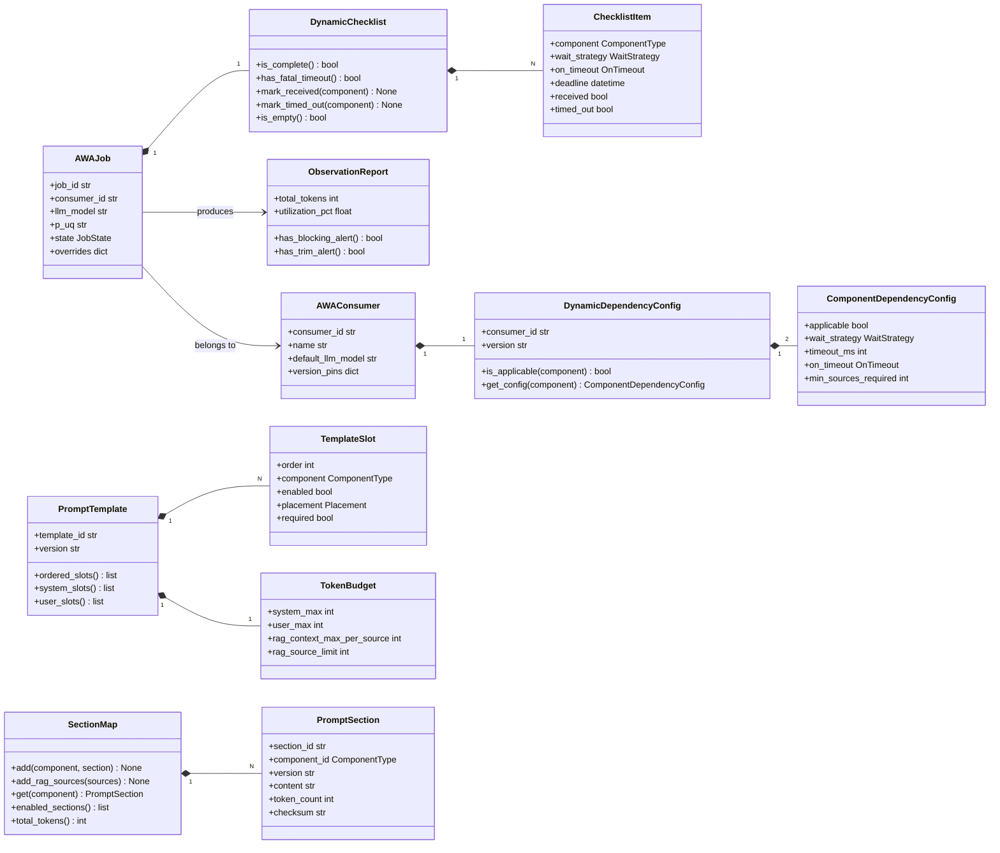
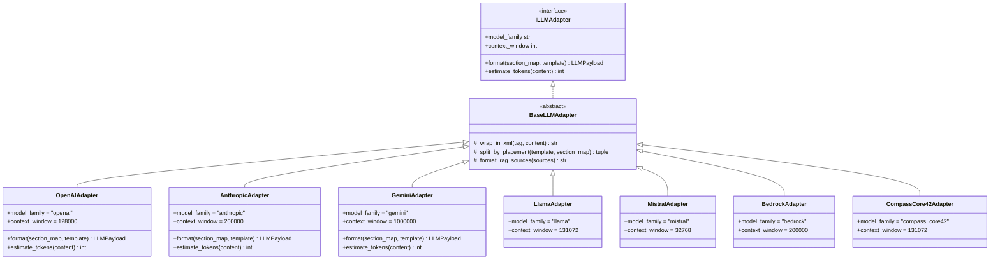
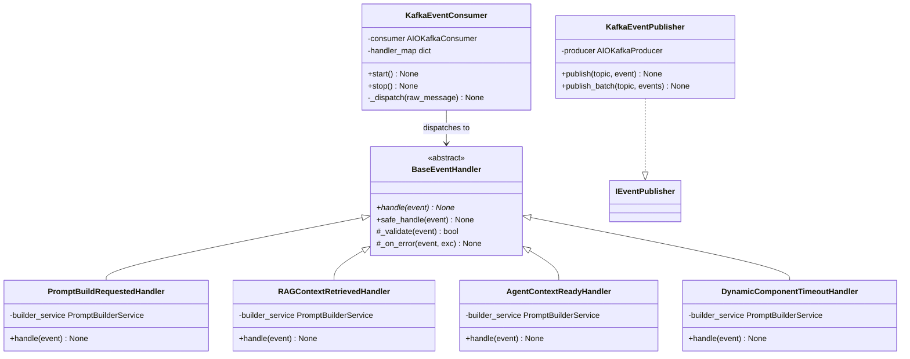
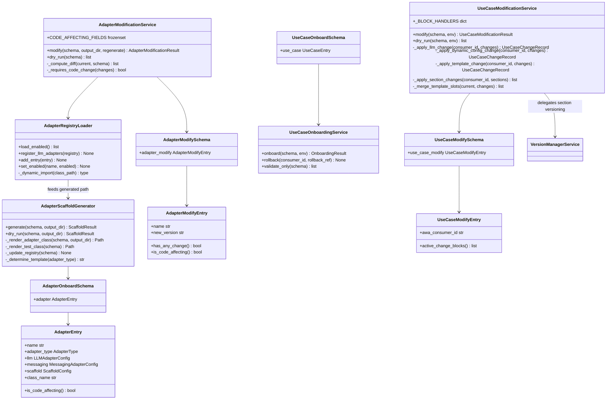
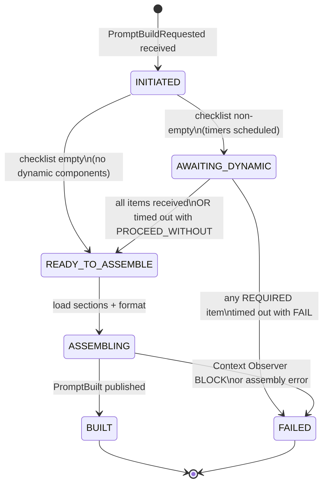
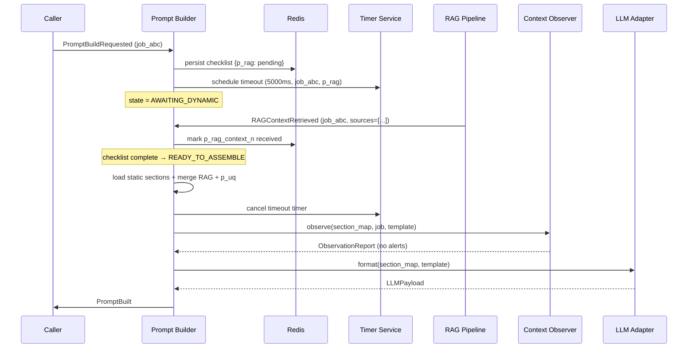

# AWA Prompt Builder — Technical Design Document

**Version:** 2.0.0  **Date:** 2026-05-26  **Status:** Pending Confirmation  
**Language:** Python 3.12  **Architecture:** Event-Driven Microservice · Hexagonal

---

## Table of Contents

1. [Executive Summary](#1-executive-summary)
2. [Feature Inventory](#2-feature-inventory)
3. [System Architecture](#3-system-architecture)
4. [Domain Model](#4-domain-model)
5. [Prompt Assembly Pipeline](#5-prompt-assembly-pipeline)
6. [LLM Adapter Registry](#6-llm-adapter-registry)
7. [Context Observer](#7-context-observer)
8. [Version Manager](#8-version-manager)
9. [Onboarding Framework](#9-onboarding-framework)
10. [Modification Framework](#10-modification-framework)
11. [Event Architecture](#11-event-architecture)
12. [Control Plane REST API](#12-control-plane-rest-api)
13. [pb-cli Reference](#13-pb-cli-reference)
14. [Full Module & Class Reference](#14-full-module--class-reference)
15. [UML Diagrams](#15-uml-diagrams)
16. [Design Patterns](#16-design-patterns)
17. [SOLID Compliance](#17-solid-compliance)
18. [Technology Stack](#18-technology-stack)
19. [Deployment Architecture](#19-deployment-architecture)
20. [Security](#20-security)
21. [Phased Delivery Roadmap](#21-phased-delivery-roadmap)

---

## 1. Executive Summary

The **AWA Prompt Builder** is a runtime prompt construction microservice that assembles structured, LLM-standard-aware prompts from discrete versioned components before every LLM call. It is event-driven (Kafka), horizontally scalable, and model-agnostic.

Every prompt is built in the context of a **use case** (`AWA_Consumer_ID`) and a **single LLM call** (`AWA_Job_ID`). The framework provides complete lifecycle management: onboarding new adapters and use cases via YAML templates, modifying parameters through sparse diff YAMLs, version-controlling every change, and observing assembled prompts for quality signals before they reach the LLM.

---

## 2. Feature Inventory

### 2.1 Prompt Construction

| # | Feature |
|---|---|
| F-01 | Runtime assembly of prompts from 10 discrete, versioned components |
| F-02 | `AWA_Consumer_ID` scoping (use case level) and `AWA_Job_ID` scoping (per LLM call) |
| F-03 | `p_template` controls slot order, placement (system/user), and enabled state |
| F-04 | Token budget enforcement per placement with automatic RAG source trimming |
| F-05 | Three-tier override precedence: job-level → consumer-level → global default |
| F-06 | `p_guard` enforced as always-present and non-disableable |

### 2.2 Dynamic Component Handling

| # | Feature |
|---|---|
| F-07 | Per-consumer `DynamicDependencyConfig` for `p_rag_context_n` and `p_agent_context` |
| F-08 | Three wait strategies: `NOT_APPLICABLE`, `OPTIONAL`, `REQUIRED` |
| F-09 | Configurable timeout per dynamic component (milliseconds) |
| F-10 | Two timeout behaviours: `PROCEED_WITHOUT` (warn + continue) and `FAIL` (abort) |
| F-11 | `min_sources_required` threshold for RAG: treat sparse results as timeout |
| F-12 | Job-level override of wait strategy, timeout, and on_timeout |

### 2.3 Job State Machine

| # | Feature |
|---|---|
| F-13 | Six-state job lifecycle: `INITIATED → AWAITING_DYNAMIC → READY_TO_ASSEMBLE → ASSEMBLING → BUILT / FAILED` |
| F-14 | Per-job checklist stored in Redis (TTL-bounded), mirrored to Postgres on terminal state |
| F-15 | Redis-based distributed state — any Prompt Builder replica can advance a job |
| F-16 | Delay-queue timer events for dynamic component timeouts |
| F-17 | Five named event flows (no dynamic, RAG happy path, both dynamic, timeout PROCEED_WITHOUT, timeout FAIL) |

### 2.4 Multi-Model LLM Support

| # | Feature |
|---|---|
| F-18 | Strategy-pattern adapter per LLM family: OpenAI, Anthropic, Gemini, Llama, Mistral, AWS Bedrock |
| F-19 | Extensible via `BaseLLMAdapter` subclass — no core code changes needed |
| F-20 | Per-adapter native prompt format (messages array, system+messages, contents[], special tokens) |
| F-21 | Per-adapter token estimation (tiktoken, Anthropic SDK, character approximation, custom) |
| F-22 | Adapter selected at runtime by `llm_model` field in `PromptBuildRequestedEvent` |

### 2.5 Versioning & Rollback

| # | Feature |
|---|---|
| F-23 | Semantic versioning for all static sections and templates |
| F-24 | Full-snapshot version storage (not diffs) in S3-compatible object store |
| F-25 | Per-component version pinning per consumer (or `LATEST`) |
| F-26 | Rollback with short-lived TOTP-style confirmation token gate |
| F-27 | Append-only audit log (actor, action, before, after, timestamp) |

### 2.6 Context Observation

| # | Feature |
|---|---|
| F-28 | Per-job `ObservationReport`: token breakdown, alerts, rot signals |
| F-29 | Bloat detection: total utilisation, single-section dominance, RAG source overflow |
| F-30 | Rot detection: staleness (days since update), semantic drift (embedding cosine similarity) |
| F-31 | Three observer actions: `WARN`, `TRIM` (drop lowest-scored RAG sources), `BLOCK` (abort) |
| F-32 | Per-consumer threshold overrides for all bloat and rot signals |
| F-33 | Timeout warnings attached to observation report when dynamic component is omitted |

### 2.7 Adapter Onboarding

| # | Feature |
|---|---|
| F-34 | YAML template (`adapter_onboard.yaml`) for engineer self-service adapter registration |
| F-35 | Four adapter types: `llm`, `messaging`, `snapshot_store`, `timer` |
| F-36 | Pydantic schema validation with field-level error messages |
| F-37 | Jinja2 scaffold generation: Python class file + pytest skeleton |
| F-38 | Auto-append to `adapters_registry.yaml` master registry |
| F-39 | Dry-run mode previews generated files without writing |
| F-40 | Post-generation checklist of manual TODOs |

### 2.8 Use Case Onboarding

| # | Feature |
|---|---|
| F-41 | YAML template (`pb_use_case_onboarding.yaml`) covering all consumer parameters |
| F-42 | Three section sources: `inline`, `file`, `shared` (cross-consumer content reuse) |
| F-43 | Environment targeting: `dev`, `staging`, `prod` |
| F-44 | Onboarding rollback (full snapshot written before any DB writes) |
| F-45 | Dry-run mode previews all DB records without writing |
| F-46 | Observer threshold override registration at onboarding time |

### 2.9 Adapter Modification

| # | Feature |
|---|---|
| F-47 | Sparse diff YAML (`adapter_modify.yaml`) — only changed fields required |
| F-48 | Code-affecting field detection (`context_window`, `prompt_standard`, `token_counter`, `custom_format`) |
| F-49 | Optional scaffold regeneration (`--regenerate`) for code-affecting changes |
| F-50 | Class diff printed when code change detected without `--regenerate` |
| F-51 | Registry-only changes applied immediately without code change |
| F-52 | Idempotent — same YAML twice produces no-op |

### 2.10 Use Case Modification

| # | Feature |
|---|---|
| F-53 | Sparse diff YAML (`pb_use_case_modify.yaml`) — six independently modifiable blocks |
| F-54 | `dynamic_dependency_config` change publishes `DynamicConfigChanged` (live cache invalidation) |
| F-55 | `template` change creates new versioned `PromptTemplate`; old version preserved |
| F-56 | `sections` change creates new versioned `PromptSection` via `VersionManagerService` |
| F-57 | Slot merge: only named slots updated; unmentioned slots survive unchanged |
| F-58 | Per-modification rollback snapshot (independent from onboarding snapshot) |
| F-59 | Idempotent — same YAML twice produces no-op |

### 2.11 Observability & Operations

| # | Feature |
|---|---|
| F-60 | Prometheus metrics endpoint per service |
| F-61 | OpenTelemetry distributed tracing (Jaeger) |
| F-62 | Structured JSON logging (ELK) — section content never logged, only IDs and token counts |
| F-63 | Alertmanager rules: bloat > 90%, rot > 60 days, build failure rate > 1%, RAG timeout > 5% |
| F-64 | Live job state API endpoint (`GET /api/v1/jobs/{id}/state`) |
| F-65 | Timeout-rate-per-dynamic-component metric per consumer |

---

## 3. System Architecture

### 3.1 Architecture Style

- **Hexagonal (Ports & Adapters):** domain and service code depend only on abstract port interfaces; all infrastructure bindings in the DI container.
- **Event-Driven:** Kafka is the coordination backbone; services communicate by publishing and consuming events, never by direct HTTP calls between services.
- **Stateless services:** per-job state held in Redis (TTL-bounded); services are horizontally scalable.

### 3.2 System Context

```
┌────────────────────────────────────────────────────────────────────────────┐
│                            External Callers                                │
│    Chat UI  │  Source System API  │  Agent Orchestrator  │  pb-cli         │
└──────┬───────────────┬───────────────────────┬────────────────┬────────────┘
       │               │                       │                │
       ▼               ▼                       ▼                ▼
┌──────────────────────────────────────────────────────────────────────────┐
│                     API Gateway / Ingress                                 │
│              REST + gRPC  ──  JWT/mTLS Auth  ──  Rate Limit              │
└─────────────────────────────────┬────────────────────────────────────────┘
                                  │
                         ┌────────▼────────┐
                         │   Apache Kafka   │
                         │  (Event Bus)     │
                         └────────┬────────┘
       ┌──────────────────────────┼──────────────────────────┐
       ▼                          ▼                          ▼
┌─────────────┐         ┌─────────────────┐        ┌─────────────────────┐
│   Prompt    │         │    Version       │        │   Context           │
│   Builder   │         │    Manager       │        │   Observer          │
│   Service   │         │    Service       │        │   Service           │
└──────┬──────┘         └─────────────────┘        └─────────────────────┘
       │
┌──────▼───────────────────────────────────────┐
│              LLM Adapter Registry             │
│  OpenAI │ Anthropic │ Gemini │ Llama │ ...   │
└──────────────────────────────────────────────┘
       │
┌──────▼──────────────────────────────────────────────────────────────────┐
│                            Storage Layer                                  │
│  PostgreSQL (sections, templates, consumers, jobs, audit)                 │
│  Redis      (job state machine, checklist, TTL)                          │
│  S3 / Blob  (version snapshots, prompt archives)                         │
└─────────────────────────────────────────────────────────────────────────┘
```

### 3.3 Service Responsibilities

| Service | Responsibility |
|---|---|
| **Prompt Builder** | Orchestrates the full assembly pipeline; owns job state machine |
| **Version Manager** | Snapshot versioning, rollback, audit for sections and templates |
| **Context Observer** | Bloat and rot detection; emits alerts; applies TRIM strategy |
| **LLM Adapter Registry** | Translates canonical `SectionMap` into LLM-native prompt format |
| **Onboarding/Modification** | CLI-driven; manages adapter registry and consumer DB records |

---

## 4. Domain Model

### 4.1 The Ten Prompt Components

| Key | Name | Source | Lifecycle |
|---|---|---|---|
| `p_uq` | User / System Query | Chat turn or request payload | Dynamic — per job |
| `p_guard` | Guardrail Prompt | Config store | Static — always required |
| `p_act_bus` | Activity Business Context | Config store | Static — per consumer |
| `p_act_ins` | Activity Instructions | Config store | Static — per consumer |
| `p_act_cond` | Activity Conduct | Config store | Static — per consumer |
| `p_rag_context_n` | RAG / OCR Context (1..N sources) | Knowledge retrieval pipeline | Dynamic — per job, configurable |
| `p_agent_rgb` | Agent Role, Goal, Backstory | Agent profile store | Static — per agent |
| `p_agent_conduct` | Agent Conduct / Policy | Agent policy store | Static — per agent |
| `p_agent_context` | Agent Reflection Context | CoT / ToT / reflection engine | Dynamic — per job, configurable |
| `p_template` | Assembly Template | Template registry | Static — per consumer, versioned |

### 4.2 Identifiers

```
AWA_Consumer_ID  ── use case identifier  (e.g. IDP_INVOICE_US)
    └── AWA_Job_ID  ── single LLM call  (e.g. job_abc123)
```

**Consumer scope:** template, static sections, version pins, dynamic config, observer thresholds  
**Job scope:** `p_uq`, `p_rag_context_n`, `p_agent_context`, assembled prompt, job state, observation report

### 4.3 Core Domain Classes

```python
# ── Enumerations ────────────────────────────────────────────────────────────
class ComponentType(str, Enum):    # p_uq | p_guard | p_act_bus | ...
class WaitStrategy(str, Enum):     # NOT_APPLICABLE | OPTIONAL | REQUIRED
class OnTimeout(str, Enum):        # PROCEED_WITHOUT | FAIL
class JobState(str, Enum):         # INITIATED | AWAITING_DYNAMIC | READY_TO_ASSEMBLE | ASSEMBLING | BUILT | FAILED
class Placement(str, Enum):        # system | user
class AlertSeverity(str, Enum):    # WARN | TRIM | BLOCK

# ── Value objects ───────────────────────────────────────────────────────────
@dataclass
class RAGSource:
    source_id: str; content: str; score: float; token_count: int

@dataclass
class TokenBudget:
    system_max: int; user_max: int
    rag_context_max_per_source: int; rag_source_limit: int

@dataclass
class ChecklistItem:
    component: ComponentType; wait_strategy: WaitStrategy
    on_timeout: Optional[OnTimeout]; deadline: Optional[datetime]
    received: bool = False; timed_out: bool = False

# ── Aggregates ──────────────────────────────────────────────────────────────
@dataclass
class PromptSection:
    section_id: str; component_id: ComponentType; consumer_id: str
    version: str; content: str; enabled: bool
    token_count: int; checksum: str; last_modified: datetime

class SectionMap:                  # dict[ComponentType, PromptSection | list[RAGSource]]
    def add(component, section) -> None
    def add_rag_sources(sources) -> None
    def get(component) -> Optional[PromptSection]
    def get_rag_sources() -> list[RAGSource]
    def enabled_sections() -> list[PromptSection]
    def total_tokens() -> int

@dataclass
class TemplateSlot:
    order: int; component: ComponentType; enabled: bool
    placement: Placement; required: bool

@dataclass
class PromptTemplate:
    template_id: str; consumer_id: str; version: str
    slots: list[TemplateSlot]; token_budget: TokenBudget
    def ordered_slots() -> list[TemplateSlot]
    def system_slots() -> list[TemplateSlot]
    def user_slots() -> list[TemplateSlot]

class DynamicChecklist:            # dict[ComponentType, ChecklistItem]
    def is_complete() -> bool
    def has_fatal_timeout() -> bool
    def mark_received(component) -> None
    def mark_timed_out(component) -> None
    def is_empty() -> bool

@dataclass
class ComponentDependencyConfig:
    applicable: bool; wait_strategy: WaitStrategy
    timeout_ms: Optional[int]; on_timeout: Optional[OnTimeout]
    min_sources_required: Optional[int]

@dataclass
class DynamicDependencyConfig:
    consumer_id: str; version: str
    p_rag_context_n: ComponentDependencyConfig
    p_agent_context: ComponentDependencyConfig
    def is_applicable(component) -> bool
    def get_config(component) -> ComponentDependencyConfig

@dataclass
class AWAConsumer:
    consumer_id: str; name: str; default_llm_model: str
    version_pins: dict[str, str]
    dynamic_dependency_config: DynamicDependencyConfig

@dataclass
class AWAJob:
    job_id: str; consumer_id: str; llm_model: str; p_uq: str
    state: JobState; checklist: Optional[DynamicChecklist]
    overrides: dict; created_at: datetime

@dataclass
class ObservationReport:
    report_id: str; job_id: str
    total_tokens: int; model_context_limit: int; utilization_pct: float
    section_breakdown: list[TokenBreakdown]
    alerts: list[ContextAlert]; rot_signals: list[RotSignal]
    dynamic_timeout_warnings: list[str]
    def has_blocking_alert() -> bool
    def has_trim_alert() -> bool
```

---

## 5. Prompt Assembly Pipeline

### 5.1 Dynamic Dependency Configuration

Stored per consumer. Controls whether the builder waits for `p_rag_context_n` and `p_agent_context`.

| `wait_strategy` | Meaning |
|---|---|
| `NOT_APPLICABLE` | Never used. No timer started. Slot skipped even if present in `p_template`. |
| `OPTIONAL` | Wait up to `timeout_ms`. Proceed silently if not received. |
| `REQUIRED` | Wait up to `timeout_ms`. Then apply `on_timeout`. |

| `on_timeout` | Behaviour (only for `REQUIRED`) |
|---|---|
| `PROCEED_WITHOUT` | Omit section. Record `received: false, reason: TIMEOUT` in manifest. Emit WARN. |
| `FAIL` | Abort build. Publish `PromptBuildFailed`. |

### 5.2 Job State Machine

```
INITIATED
  │
  ├── checklist empty? ──YES──► READY_TO_ASSEMBLE
  │
  └──NO──► AWAITING_DYNAMIC
                │
                ├── all items received or PROCEED_WITHOUT timed out ──► READY_TO_ASSEMBLE
                │
                └── any REQUIRED item timed out with FAIL ──────────► FAILED

READY_TO_ASSEMBLE ──► ASSEMBLING ──► BUILT
                                └──► FAILED  (Context Observer BLOCK)
```

Valid transitions (frozenset in `JobStateMachine._TRANSITIONS`):
```python
{
  (INITIATED,          AWAITING_DYNAMIC),
  (INITIATED,          READY_TO_ASSEMBLE),
  (AWAITING_DYNAMIC,   READY_TO_ASSEMBLE),
  (AWAITING_DYNAMIC,   FAILED),
  (READY_TO_ASSEMBLE,  ASSEMBLING),
  (ASSEMBLING,         BUILT),
  (ASSEMBLING,         FAILED),
}
```

State is held in **Redis** keyed by `AWA_Job_ID` with TTL = `max(timeout_ms) + 10 s`.

### 5.3 Assembly Pipeline (Internal)

```
PromptBuildRequested received
    │
    ├─► Load p_template + DynamicDependencyConfig (from cache/DB)
    ├─► Apply job-level overrides to DynamicDependencyConfig
    ├─► DynamicDependencyResolver.build_checklist(job) → DynamicChecklist
    │
    ├─► Checklist empty? → READY_TO_ASSEMBLE immediately
    │   Checklist non-empty? → persist to Redis, schedule timeout events → AWAITING_DYNAMIC
    │
    │   [wait for RAGContextRetrieved / AgentContextReady / DynamicComponentTimeout]
    │
    ├─► Checklist resolved → READY_TO_ASSEMBLE
    ├─► SectionLoader.load_static_sections(consumer_id, template) → SectionMap
    ├─► Merge arrived dynamic sections (RAG sources, agent context, p_uq) into SectionMap
    ├─► TemplateExecutor.execute(template, section_map, dynamic_config)
    │       ├─ Skip NOT_APPLICABLE slots
    │       ├─ Apply token budget (trim RAG sources if over limit)
    │       └─ Return ordered SectionMap
    │
    ├─► ContextObserverService.observe(section_map, job, template)
    │       → ObservationReport (with WARN / TRIM / BLOCK signals)
    │
    ├─► BLOCK signal? → FAILED (publish PromptBuildFailed)
    ├─► TRIM signal? → apply trim, re-observe
    │
    ├─► LLMAdapterRegistry.get(llm_model).format(section_map, template)
    │       → LLMPayload (native format for target model)
    │
    └─► Publish PromptBuilt (with payload + section_manifest + observation_report_ref)
```

### 5.4 Override Precedence

```
Priority (highest → lowest):
  1. Job-level override    (PromptBuildRequestedEvent.overrides)
  2. Consumer-level config (DynamicDependencyConfig / AWAConsumer.version_pins)
  3. Global default        (system-wide fallback in settings)
```

**Non-overridable at job level:** `p_guard` cannot be disabled. `min_sources_required` can only be relaxed (lowered).

---

## 6. LLM Adapter Registry

### 6.1 Prompt Standards per LLM

| Adapter | Format | Token Counter |
|---|---|---|
| `OpenAIAdapter` | `messages[]` with `system`/`user`/`assistant` roles | tiktoken `cl100k_base` |
| `AnthropicAdapter` | `system` param + `messages[]`; XML tags for sections | Anthropic SDK count_tokens |
| `GeminiAdapter` | `contents[]` with `role` and `parts` | Google tokenizer |
| `LlamaAdapter` | `<\|system\|>` / `<\|user\|>` / `<\|assistant\|>` special tokens | tiktoken or character estimate |
| `MistralAdapter` | `[INST]` / `[/INST]` instruction format | tiktoken |
| `BedrockAdapter` | Bedrock Converse API format | Model-specific |
| `CompassCore42Adapter` | OpenAI-compatible (generated by scaffold) | tiktoken |

### 6.2 Adapter Interface

```python
class ILLMAdapter(ABC):
    model_family:   str   # abstract property
    context_window: int   # abstract property
    def format(section_map: SectionMap, template: PromptTemplate) -> LLMPayload: ...
    def estimate_tokens(content: str) -> int: ...
```

### 6.3 Registry

```python
class LLMAdapterRegistry:
    def register(adapter: ILLMAdapter) -> None
    def get(model: str) -> ILLMAdapter       # resolves model name → family → adapter
    def get_by_family(family: str) -> ILLMAdapter
    def supported_models() -> list[str]
```

Populated at startup by `AdapterRegistryLoader` reading `config/adapters_registry.yaml`.

---

## 7. Context Observer

### 7.1 Bloat Detection (`BloatDetector`)

| Signal | Condition | Default Action |
|---|---|---|
| Total utilisation | tokens > 80% of context window | WARN |
| Total utilisation | tokens > 95% of context window | BLOCK |
| Section dominance | one section > 60% of total | WARN |
| RAG overflow | n sources > `rag_source_limit` | TRIM (drop lowest-score first) |

### 7.2 Rot Detection (`RotDetector`)

| Signal | Condition | Default Action |
|---|---|---|
| Staleness | section not updated in > 30 days | WARN |
| Staleness | section not updated in > 90 days | BLOCK |
| Semantic drift | cosine_similarity(section, p_uq) < 0.65 | WARN |

Semantic drift requires an `IEmbeddingClient` implementation. When not configured, drift check is skipped.

### 7.3 Observer Actions

```
WARN  → attach alert to ObservationReport; publish ContextAlert event; continue build
TRIM  → drop lowest-scored RAG sources until under budget; re-count; continue build
BLOCK → publish PromptBuildBlocked; transition job to FAILED
```

All thresholds are per-consumer configurable (set at onboarding, modifiable via YAML).

---

## 8. Version Manager

### 8.1 Versioning Model

- **Semantic versioning** (`major.minor.patch`) for all sections and templates.
- Each version is a **full snapshot** (not a diff) stored in object storage (S3/Azure Blob).
- The active version is flagged in Postgres (`is_active = true`).
- Consumer can pin any component to a specific version or `LATEST`.

### 8.2 Rollback

```
1. Caller provides target_version + confirmation_token
2. VersionManagerService validates token (short-lived TOTP-style)
3. Sets is_active = false on current version
4. Sets is_active = true on target version
5. Publishes VersionRolledBack → Prompt Builder invalidates cache
6. Writes audit record (who, when, from, to, reason)
```

Rollback cannot be undone silently — it is itself versioned as a new change record.

---

## 9. Onboarding Framework

### 9.1 Files

```
config/templates/adapter_onboard.yaml        ← blank template
config/templates/pb_use_case_onboarding.yaml ← blank template
config/examples/compass_core42_adapter.yaml  ← filled LLM example
config/examples/rabbitmq_adapter.yaml        ← filled messaging example
config/examples/azure_event_bus_adapter.yaml ← filled messaging example
config/examples/IDP_INVOICE_US_onboarding.yaml ← filled use case example
config/adapters_registry.yaml                ← master registry (auto-maintained)
scaffold_templates/llm_adapter.py.j2         ← Jinja2 class template
scaffold_templates/messaging_adapter.py.j2   ← Jinja2 class template
scaffold_templates/adapter_test.py.j2        ← Jinja2 test template
```

### 9.2 Adapter Onboarding Flow

```
pb-cli adapter validate --config <file>    → Pydantic schema validation
pb-cli adapter onboard  --config <file> --dry-run
pb-cli adapter onboard  --config <file> --output-dir ./adapters/llm/
```

Steps: validate YAML → render class from Jinja2 → render test skeleton → append to registry → print TODO checklist.

### 9.3 Use Case Onboarding Flow

```
pb-cli use-case validate --config <file>
pb-cli use-case onboard  --config <file> --env staging --dry-run
pb-cli use-case onboard  --config <file> --env staging
```

Steps: validate YAML → check no duplicate → validate model registered → write rollback snapshot → create consumer + dynamic config + sections + template in DB → write audit.

### 9.4 Section Sources

| Source | How content is loaded |
|---|---|
| `inline` | Content written directly in the YAML |
| `file` | Content read from a text file path relative to the YAML |
| `shared` | References an existing `PromptSection` from another consumer — no duplication |

---

## 10. Modification Framework

### 10.1 Design Principle

**Sparse / diff-based.** Every field defaults to `null`. The service applies only non-null fields. Running the same YAML twice is a no-op.

### 10.2 Adapter Modification

```
config/templates/adapter_modify.yaml           ← blank template
config/examples/compass_core42_modify.yaml     ← filled example
```

| Changed field | Category | Effect |
|---|---|---|
| `enabled`, `supported_models`, `connection.*` | Registry-only | YAML updated; DI hot-reload |
| `context_window`, `prompt_standard`, `token_counter`, `custom_format` | Code-affecting | Registry updated + class diff printed; `--regenerate` re-runs scaffold |

### 10.3 Use Case Modification

```
config/templates/pb_use_case_modify.yaml       ← blank template
config/examples/IDP_INVOICE_US_modify.yaml     ← filled example
```

| Block | Change type | Effect |
|---|---|---|
| `llm` | `llm_update` | DB update; model validated against registry |
| `dynamic_dependency_config` | `dynamic_config_update` | DB update + `DynamicConfigChanged` Kafka event |
| `template` | `template_version` | New `PromptTemplate` version; old preserved |
| `sections` | `section_version` | New `PromptSection` version via `VersionManagerService` |
| `version_pins` | `version_pin_update` | DB update |
| `observer_thresholds` | `threshold_update` | DB update |

**Slot merge rule:** only named slots updated; unmentioned slots survive unchanged.  
Every `modify` writes a rollback snapshot before applying any changes.

---

## 11. Event Architecture

### 11.1 Kafka Topics

| Topic | Publisher | Consumers | Purpose |
|---|---|---|---|
| `awa.prompt.build.requested` | API Gateway | Prompt Builder | Trigger assembly |
| `awa.prompt.rag.retrieved` | RAG Pipeline | Prompt Builder | Inject RAG context |
| `awa.prompt.agent.context.ready` | CoT/ToT Engine | Prompt Builder | Inject agent context |
| `awa.prompt.dynamic.timeout` | Timer Service | Prompt Builder | Dynamic component deadline exceeded |
| `awa.prompt.built` | Prompt Builder | LLM Caller, Context Observer, Audit | Final prompt ready |
| `awa.prompt.build.failed` | Prompt Builder | Alert, Caller | Build failed |
| `awa.prompt.build.blocked` | Context Observer | Alert, Caller | Observer blocked build |
| `awa.prompt.context.alert` | Context Observer | Alert, Dashboard | Bloat/rot warning |
| `awa.version.changed` | Version Manager | Prompt Builder (cache invalidate) | Section/template updated |
| `awa.version.rolledback` | Version Manager | Prompt Builder, Audit | Rollback applied |
| `awa.section.flag.changed` | Control Plane API | Prompt Builder | Enable/disable section |
| `awa.dynamic.config.changed` | Control Plane API | Prompt Builder | Dynamic config updated |

### 11.2 Key Event Schemas

```python
# Trigger
PromptBuildRequestedEvent: event_type, awa_consumer_id, awa_job_id,
                            llm_model, p_uq, overrides

# Dynamic components
RAGContextRetrievedEvent:       awa_job_id, sources: list[RAGSource]
AgentContextReadyEvent:         awa_job_id, context_type, content, token_count
DynamicComponentTimeoutEvent:   awa_job_id, component_id

# Results
PromptBuiltEvent:       awa_consumer_id, awa_job_id, llm_model,
                        formatted_payload, section_manifest, observation_report_ref,
                        build_duration_ms
PromptBuildFailedEvent: awa_consumer_id, awa_job_id, reason,
                        failed_component, on_timeout_applied
```

### 11.3 Event Flows (Summary)

| Flow | Scenario | Terminal event |
|---|---|---|
| **A** | No dynamic components applicable | `PromptBuilt` (fast path) |
| **B** | RAG required, arrives in time | `PromptBuilt` |
| **C** | RAG + agent context both required, both arrive | `PromptBuilt` |
| **D** | RAG required, timeout → `PROCEED_WITHOUT` | `PromptBuilt` (with WARN) |
| **E** | RAG required, timeout → `FAIL` | `PromptBuildFailed` |

---

## 12. Control Plane REST API

```
# Section flags
PATCH /api/v1/consumers/{id}/sections/{component}/flag
      Body: { enabled, reason, changed_by }

# Dynamic dependency config
GET   /api/v1/consumers/{id}/dynamic-dependency-config
PUT   /api/v1/consumers/{id}/dynamic-dependency-config
PATCH /api/v1/consumers/{id}/dynamic-dependency-config/{component}
GET   /api/v1/consumers/{id}/dynamic-dependency-config/history

# Version management
GET   /api/v1/consumers/{id}/sections/{component}/versions
POST  /api/v1/consumers/{id}/sections/{component}/versions
GET   /api/v1/consumers/{id}/sections/{component}/versions/{version}
POST  /api/v1/consumers/{id}/sections/{component}/rollback

# Template management
GET   /api/v1/consumers/{id}/templates
POST  /api/v1/consumers/{id}/templates
PUT   /api/v1/consumers/{id}/templates/{template_id}
POST  /api/v1/consumers/{id}/templates/rollback

# Observation & monitoring
GET   /api/v1/jobs/{job_id}/observation-report
GET   /api/v1/jobs/{job_id}/state
GET   /api/v1/consumers/{id}/context-metrics
GET   /api/v1/consumers/{id}/rot-alerts
GET   /api/v1/consumers/{id}/bloat-alerts
GET   /api/v1/consumers/{id}/timeout-stats
```

All endpoints require JWT with RBAC claims. Rollback requires a separate TOTP confirmation token.

---

## 13. pb-cli Reference

Built with **Click**. Installed as console script `pb-cli`.

```
# Adapter commands
pb-cli adapter onboard        --config <yaml> [--dry-run] [--output-dir <dir>]
pb-cli adapter modify         --config <yaml> [--dry-run] [--regenerate]
pb-cli adapter enable         <name>
pb-cli adapter disable        <name>
pb-cli adapter list           [--type llm|messaging|snapshot_store|timer] [--enabled-only]
pb-cli adapter validate       --config <yaml>
pb-cli adapter validate-modify --config <yaml>

# Use case commands
pb-cli use-case onboard       --config <yaml> --env <dev|staging|prod> [--dry-run]
pb-cli use-case modify        --config <yaml> --env <dev|staging|prod> [--dry-run]
pb-cli use-case rollback      --consumer-id <id> --ref <rollback-ref>
pb-cli use-case list          [--env <env>]
pb-cli use-case status        <consumer-id>
pb-cli use-case validate      --config <yaml>
pb-cli use-case validate-modify --config <yaml>
```

All destructive commands follow: **validate → dry-run → apply**.

---

## 14. Full Module & Class Reference

### 14.1 Package Structure

```
awa_prompt_builder/
├── domain/
│   ├── enums/
│   │   ├── component_type.py       ComponentType
│   │   ├── wait_strategy.py        WaitStrategy
│   │   ├── on_timeout.py           OnTimeout
│   │   ├── job_state.py            JobState
│   │   ├── placement.py            Placement
│   │   └── alert_severity.py       AlertSeverity
│   └── models/
│       ├── prompt_section.py       PromptSection, SectionMap, RAGSource
│       ├── prompt_template.py      PromptTemplate, TemplateSlot, TokenBudget
│       ├── job.py                  AWAJob, DynamicChecklist, ChecklistItem
│       ├── consumer.py             AWAConsumer, DynamicDependencyConfig, ComponentDependencyConfig
│       ├── observation.py          ObservationReport, ContextAlert, RotSignal, TokenBreakdown
│       ├── events.py               BaseEvent + 7 concrete events
│       ├── version.py              VersionRecord
│       └── llm_payload.py          LLMPayload, LLMMessage, MessageRole
│
├── ports/
│   ├── section_repository.py       ISectionRepository
│   ├── template_repository.py      ITemplateRepository
│   ├── consumer_repository.py      IConsumerRepository
│   ├── job_state_repository.py     IJobStateRepository
│   ├── event_publisher.py          IEventPublisher
│   ├── llm_adapter.py              ILLMAdapter
│   ├── context_observer.py         IContextObserver
│   ├── snapshot_store.py           ISnapshotStore
│   ├── timer_service.py            ITimerService
│   ├── audit_log.py                IAuditLog
│   ├── token_counter.py            ITokenCounter
│   └── embedding_client.py         IEmbeddingClient
│
├── services/
│   ├── prompt_builder_service.py   PromptBuilderService
│   ├── section_loader.py           SectionLoader
│   ├── dependency_resolver.py      DynamicDependencyResolver
│   ├── state_machine.py            JobStateMachine
│   ├── template_executor.py        TemplateExecutor
│   ├── context_observer_service.py ContextObserverService, BloatDetector, RotDetector
│   └── version_manager_service.py  VersionManagerService
│
├── adapters/
│   ├── repositories/
│   │   ├── postgres_section_repo.py    PostgresSectionRepository
│   │   ├── postgres_template_repo.py   PostgresTemplateRepository
│   │   ├── postgres_consumer_repo.py   PostgresConsumerRepository
│   │   └── redis_job_state_repo.py     RedisJobStateRepository
│   ├── messaging/
│   │   ├── kafka_publisher.py          KafkaEventPublisher
│   │   ├── kafka_consumer.py           KafkaEventConsumer
│   │   ├── rabbitmq_publisher.py       RabbitMQEventPublisher  [generated]
│   │   ├── rabbitmq_consumer.py        RabbitMQEventConsumer   [generated]
│   │   ├── azure_service_bus_publisher.py  [generated]
│   │   └── azure_service_bus_consumer.py   [generated]
│   ├── snapshot/
│   │   ├── s3_snapshot_store.py        S3SnapshotStore
│   │   └── azure_blob_snapshot_store.py AzureBlobSnapshotStore [generated]
│   └── llm/
│       ├── base.py                     BaseLLMAdapter
│       ├── registry.py                 LLMAdapterRegistry
│       ├── openai_adapter.py           OpenAIAdapter
│       ├── anthropic_adapter.py        AnthropicAdapter
│       ├── gemini_adapter.py           GeminiAdapter
│       ├── llama_adapter.py            LlamaAdapter
│       ├── mistral_adapter.py          MistralAdapter
│       ├── bedrock_adapter.py          BedrockAdapter
│       └── compass_core42_adapter.py   CompassCore42Adapter    [generated]
│
├── handlers/
│   ├── base.py                         BaseEventHandler
│   ├── prompt_build_requested.py       PromptBuildRequestedHandler
│   ├── rag_context_retrieved.py        RAGContextRetrievedHandler
│   ├── agent_context_ready.py          AgentContextReadyHandler
│   └── dynamic_component_timeout.py    DynamicComponentTimeoutHandler
│
├── onboarding/
│   ├── schemas/
│   │   ├── adapter_onboard_schema.py   AdapterOnboardSchema + sub-schemas
│   │   ├── adapter_modify_schema.py    AdapterModifySchema + sub-schemas
│   │   ├── use_case_schema.py          UseCaseOnboardSchema + sub-schemas
│   │   └── use_case_modify_schema.py   UseCaseModifySchema + sub-schemas
│   ├── adapter_scaffold_generator.py   AdapterScaffoldGenerator
│   ├── adapter_registry_loader.py      AdapterRegistryLoader
│   ├── adapter_modification_service.py AdapterModificationService
│   ├── use_case_onboarding_service.py  UseCaseOnboardingService
│   ├── use_case_modification_service.py UseCaseModificationService
│   └── cli.py                          pb-cli Click application
│
├── api/
│   ├── routers/
│   │   ├── sections.py
│   │   ├── templates.py
│   │   ├── consumers.py
│   │   ├── dynamic_config.py
│   │   ├── jobs.py
│   │   └── observation.py
│   └── middleware/auth.py
│
└── infrastructure/
    ├── database.py                     SQLAlchemy async engine + session factory
    ├── redis_client.py                 Redis connection pool
    ├── timer_service.py                RedisTimerService (implements ITimerService)
    ├── s3_snapshot_store.py            S3SnapshotStore (implements ISnapshotStore)
    └── container.py                    dependency-injector DI container
```

### 14.2 All Classes and Key Methods

#### Services

```python
class PromptBuilderService:
    # entry points (called by event handlers)
    async def handle_build_requested(event: PromptBuildRequestedEvent) -> None
    async def handle_rag_context_retrieved(event: RAGContextRetrievedEvent) -> None
    async def handle_agent_context_ready(event: AgentContextReadyEvent) -> None
    async def handle_dynamic_timeout(event: DynamicComponentTimeoutEvent) -> None
    # internal
    async def _initialise_job(event) -> AWAJob
    async def _attempt_assembly(job: AWAJob) -> None
    async def _assemble_and_publish(job: AWAJob) -> None
    async def _publish_built(job, payload, report, elapsed_ms) -> None
    async def _publish_failed(job, reason, component) -> None

class SectionLoader:
    async def load_static_sections(consumer_id, template) -> SectionMap
    async def load_section(consumer_id, component) -> Optional[PromptSection]
    async def resolve_version(consumer_id, component) -> str   # Chain of Responsibility
    def _verify_checksum(section) -> bool

class DynamicDependencyResolver:
    async def build_checklist(job: AWAJob) -> DynamicChecklist
    def apply_job_overrides(base_config, overrides) -> DynamicDependencyConfig
    def _make_checklist_item(component, config) -> Optional[ChecklistItem]

class JobStateMachine:
    _TRANSITIONS: frozenset[tuple[JobState, JobState]]
    async def initiate(job, checklist) -> JobState
    async def mark_component_received(job_id, component) -> JobState
    async def mark_component_timed_out(job_id, component) -> JobState
    async def advance_to_assembling(job_id) -> JobState
    async def mark_built(job_id) -> None
    async def mark_failed(job_id, reason) -> None
    def _can_transition(current, target) -> bool
    def _resolve_after_checklist_update(checklist) -> JobState
    async def _schedule_timeouts(job_id, checklist) -> None

class TemplateExecutor:
    def execute(template, section_map, dynamic_config) -> SectionMap
    def _should_include_slot(slot, section_map, dynamic_config) -> bool
    def _apply_token_budget(section_map, budget) -> SectionMap
    def _trim_rag_sources(sources, budget) -> list[RAGSource]

class BloatDetector:
    def detect(section_map, context_limit) -> list[ContextAlert]
    def _total_utilization_alert(used, limit) -> Optional[ContextAlert]
    def _section_dominance_alert(section_map, total) -> Optional[ContextAlert]
    def _rag_overflow_alert(sources, limit) -> Optional[ContextAlert]

class RotDetector:
    async def detect(section_map, p_uq) -> list[RotSignal]
    def _staleness_signal(section) -> Optional[RotSignal]
    async def _semantic_drift_signal(section, p_uq) -> Optional[RotSignal]

class ContextObserverService:   # implements IContextObserver
    async def observe(section_map, job, template) -> ObservationReport
    async def _check_bloat(section_map, context_limit) -> list[ContextAlert]
    async def _check_rot(section_map, p_uq) -> list[RotSignal]
    def _build_breakdown(section_map) -> list[TokenBreakdown]
    async def _publish_alerts(job_id, alerts) -> None

class VersionManagerService:
    async def create_version(consumer_id, component, content, reason, changed_by) -> VersionRecord
    async def get_version(consumer_id, component, version) -> Optional[VersionRecord]
    async def list_versions(consumer_id, component) -> list[VersionRecord]
    async def rollback(consumer_id, component, target_version, reason, confirmation_token) -> VersionRecord
    async def _take_snapshot(section) -> str
    async def _validate_confirmation_token(token, consumer_id, component) -> bool
    def _bump_version(current, change_type) -> str
```

#### Onboarding & Modification

```python
class AdapterScaffoldGenerator:
    def generate(schema, output_dir) -> ScaffoldResult
    def dry_run(schema, output_dir) -> ScaffoldResult
    def _render_adapter_class(schema, output_dir) -> Path
    def _render_test_class(schema) -> Path
    def _update_registry(schema) -> None
    def _determine_template(adapter_type) -> str
    def _build_template_context(schema) -> dict

class AdapterRegistryLoader:
    def load_all() -> list[AdapterRegistryEntry]
    def load_enabled() -> list[AdapterRegistryEntry]
    def register_llm_adapters(registry: LLMAdapterRegistry) -> None
    def register_messaging_adapters(container) -> None
    def add_entry(entry) -> None
    def set_enabled(name, enabled) -> None
    def _dynamic_import(class_path) -> type

class AdapterModificationService:
    CODE_AFFECTING_FIELDS: frozenset
    def modify(schema, output_dir, regenerate) -> AdapterModificationResult
    def dry_run(schema) -> list[ChangePreview]
    def _compute_diff(current, schema) -> list[ChangeRecord]
    def _apply_registry_changes(name, changes, new_version) -> None
    def _requires_code_change(changes) -> bool
    def _regenerate_class(name, output_dir) -> Path

class UseCaseOnboardingService:
    async def onboard(schema, env) -> OnboardingResult
    async def rollback(consumer_id, rollback_ref) -> None
    async def validate_only(schema) -> list[str]
    async def _resolve_section_content(component, config) -> str
    async def _write_rollback_snapshot(consumer_id) -> str

class UseCaseModificationService:
    _BLOCK_HANDLERS: dict[str, str]   # block name → handler method name
    async def modify(schema, env) -> UseCaseModificationResult
    async def dry_run(schema, env) -> list[ChangePreview]
    async def _apply_llm_change(consumer_id, changes) -> UseCaseChangeRecord
    async def _apply_dynamic_config_change(consumer_id, changes) -> UseCaseChangeRecord
    async def _apply_template_change(consumer_id, changes) -> UseCaseChangeRecord
    async def _apply_section_changes(consumer_id, sections) -> list[UseCaseChangeRecord]
    async def _apply_version_pin_change(consumer_id, pins) -> UseCaseChangeRecord
    async def _apply_threshold_change(consumer_id, changes) -> UseCaseChangeRecord
    async def _merge_template_slots(current, changes) -> list[TemplateSlot]
    async def _write_rollback_snapshot(consumer_id) -> str
```

#### Adapters & Handlers

```python
class BaseLLMAdapter:             # implements ILLMAdapter (abstract)
    def _wrap_in_xml(tag, content) -> str
    def _split_by_placement(template, section_map) -> tuple[str, str]
    def _format_rag_sources(sources) -> str

class LLMAdapterRegistry:
    def register(adapter) -> None
    def get(model) -> ILLMAdapter
    def get_by_family(family) -> ILLMAdapter
    def supported_models() -> list[str]

# All concrete adapters implement:
class XxxAdapter(BaseLLMAdapter):
    model_family: str;  context_window: int
    SUPPORTED_MODELS: list[str]
    def format(section_map, template) -> LLMPayload
    def estimate_tokens(content) -> int

class BaseEventHandler:           # abstract
    async def handle(event) -> None   # abstract
    async def safe_handle(event) -> None   # Template Method
    async def _validate(event) -> bool
    async def _on_error(event, exc) -> None

# All concrete handlers:
class XxxHandler(BaseEventHandler):
    async def handle(event) -> None
```

---

## 15. UML Diagrams

### 15.1 Domain Model



### 15.2 Core Services and Ports

```mermaid
classDiagram
    direction TB

    class ILLMAdapter {
        <<interface>>
        +model_family str
        +context_window int
        +format(section_map, template) LLMPayload
        +estimate_tokens(content) int
    }
    class ISectionRepository {
        <<interface>>
        +get_active(consumer_id, component) PromptSection
        +get_by_version(consumer_id, component, version) PromptSection
        +save(section) None
        +list_versions(consumer_id, component) list
    }
    class IJobStateRepository {
        <<interface>>
        +save(job) None
        +get(job_id) AWAJob
        +update_state(job_id, state) None
        +update_checklist(job_id, checklist) None
    }
    class IConsumerRepository {
        <<interface>>
        +get(consumer_id) AWAConsumer
        +get_dynamic_config(consumer_id) DynamicDependencyConfig
        +save_dynamic_config(config) None
    }
    class IEventPublisher {
        <<interface>>
        +publish(topic, event) None
        +publish_batch(topic, events) None
    }
    class IContextObserver {
        <<interface>>
        +observe(section_map, job, template) ObservationReport
    }
    class ITimerService {
        <<interface>>
        +schedule(delay_ms, event, topic) str
        +cancel(timer_id) None
    }

    class PromptBuilderService {
        -section_loader SectionLoader
        -dependency_resolver DynamicDependencyResolver
        -state_machine JobStateMachine
        -template_executor TemplateExecutor
        -adapter_registry LLMAdapterRegistry
        -context_observer IContextObserver
        -event_publisher IEventPublisher
        +handle_build_requested(event) None
        +handle_rag_context_retrieved(event) None
        +handle_agent_context_ready(event) None
        +handle_dynamic_timeout(event) None
    }
    class SectionLoader {
        +load_static_sections(consumer_id, template) SectionMap
        +resolve_version(consumer_id, component) str
        -_verify_checksum(section) bool
    }
    class DynamicDependencyResolver {
        +build_checklist(job) DynamicChecklist
        +apply_job_overrides(base_config, overrides) DynamicDependencyConfig
    }
    class JobStateMachine {
        -_TRANSITIONS frozenset
        +initiate(job, checklist) JobState
        +mark_component_received(job_id, component) JobState
        +mark_component_timed_out(job_id, component) JobState
        +mark_built(job_id) None
        +mark_failed(job_id, reason) None
        -_can_transition(current, target) bool
    }
    class TemplateExecutor {
        +execute(template, section_map, dynamic_config) SectionMap
        -_should_include_slot(slot, section_map, dynamic_config) bool
        -_apply_token_budget(section_map, budget) SectionMap
    }
    class LLMAdapterRegistry {
        +register(adapter) None
        +get(model) ILLMAdapter
        +get_by_family(family) ILLMAdapter
    }
    class ContextObserverService {
        +observe(section_map, job, template) ObservationReport
    }

    PromptBuilderService --> SectionLoader
    PromptBuilderService --> DynamicDependencyResolver
    PromptBuilderService --> JobStateMachine
    PromptBuilderService --> TemplateExecutor
    PromptBuilderService --> LLMAdapterRegistry
    PromptBuilderService --> IContextObserver
    PromptBuilderService --> IEventPublisher

    SectionLoader --> ISectionRepository
    SectionLoader --> IConsumerRepository
    DynamicDependencyResolver --> IConsumerRepository
    JobStateMachine --> IJobStateRepository
    JobStateMachine --> IEventPublisher
    JobStateMachine --> ITimerService
    LLMAdapterRegistry --> ILLMAdapter
    ContextObserverService ..|> IContextObserver
```



### 15.3 LLM Adapter Hierarchy



### 15.4 Event Handlers and Kafka Infrastructure



### 15.5 Onboarding and Modification Framework



### 15.6 Job State Machine



### 15.7 RAG Happy Path Sequence



---

## 16. Design Patterns

### 16.1 Strategy — LLM Adapters

**Problem:** Different LLMs require fundamentally different prompt formats. The builder must not contain LLM-specific conditionals.

**Solution:** `ILLMAdapter` is the strategy interface. `LLMAdapterRegistry.get(model)` selects the correct strategy at runtime.

```python
# Adding a new LLM needs zero changes in PromptBuilderService:
class MyNewLLMAdapter(BaseLLMAdapter):
    model_family = "my_new_llm"
    context_window = 256_000
    def format(self, section_map, template) -> LLMPayload: ...
    def estimate_tokens(self, content) -> int: ...
```

**Classes:** `ILLMAdapter`, `BaseLLMAdapter`, `OpenAIAdapter`, `AnthropicAdapter`, `GeminiAdapter`, `LlamaAdapter`, `MistralAdapter`, `BedrockAdapter`, `CompassCore42Adapter`

---

### 16.2 Registry / Plugin — `LLMAdapterRegistry` + `AdapterRegistryLoader`

**Problem:** New adapters must be discoverable at runtime without hardcoded `if/elif` chains.

**Solution:** `LLMAdapterRegistry` maintains a `dict[str, ILLMAdapter]`. `AdapterRegistryLoader` reads `adapters_registry.yaml` at startup, dynamically imports enabled adapters, and registers them. The registry is the single lookup point.

**Extension point:** `adapters_registry.yaml` is the only file an engineer edits to add a new adapter to the active runtime.

**Classes:** `LLMAdapterRegistry`, `AdapterRegistryLoader`

---

### 16.3 State Machine — `JobStateMachine`

**Problem:** A job's lifecycle has strict sequencing. Invalid transitions must be rejected. State must survive across replicas.

**Solution:** Transitions are encoded as a `frozenset` of `(from, to)` tuples. `_can_transition()` validates any move against this table. State is persisted in Redis (keyed by `job_id`), so any replica can advance a job.

```python
_TRANSITIONS = frozenset({
    (JobState.INITIATED,         JobState.AWAITING_DYNAMIC),
    (JobState.INITIATED,         JobState.READY_TO_ASSEMBLE),
    (JobState.AWAITING_DYNAMIC,  JobState.READY_TO_ASSEMBLE),
    (JobState.AWAITING_DYNAMIC,  JobState.FAILED),
    (JobState.READY_TO_ASSEMBLE, JobState.ASSEMBLING),
    (JobState.ASSEMBLING,        JobState.BUILT),
    (JobState.ASSEMBLING,        JobState.FAILED),
})
```

**Classes:** `JobStateMachine`, `JobState`, `DynamicChecklist`

---

### 16.4 Template Method — `BaseEventHandler`

**Problem:** Every event handler needs the same error isolation, validation, and dead-letter logic. Duplicating this across handlers is fragile.

**Solution:** `safe_handle()` defines the skeleton: validate → handle → on_error. Subclasses override only `handle()`.

```python
class BaseEventHandler(ABC):
    async def safe_handle(self, event: BaseEvent) -> None:
        if not await self._validate(event):
            return
        try:
            await self.handle(event)
        except Exception as exc:
            await self._on_error(event, exc)

    @abstractmethod
    async def handle(self, event: BaseEvent) -> None: ...
```

**Classes:** `BaseEventHandler`, `PromptBuildRequestedHandler`, `RAGContextRetrievedHandler`, `AgentContextReadyHandler`, `DynamicComponentTimeoutHandler`

---

### 16.5 Repository — Data Access Abstraction

**Problem:** Service code must not know whether data lives in Postgres, Redis, or an in-memory fixture for tests.

**Solution:** Four port interfaces define the data access contract. Concrete implementations are injected via DI.

**Interfaces:** `ISectionRepository`, `ITemplateRepository`, `IConsumerRepository`, `IJobStateRepository`  
**Implementations:** `PostgresSectionRepository`, `PostgresTemplateRepository`, `PostgresConsumerRepository`, `RedisJobStateRepository`

---

### 16.6 Chain of Responsibility — Version Resolution

**Problem:** Section version must be resolved through a priority chain: job override → consumer pin → active version.

**Solution:** `SectionLoader.resolve_version()` walks a responsibility chain. Each step either handles the request or passes it down.

```python
async def resolve_version(self, consumer_id, component, job_overrides):
    if version := job_overrides.get(str(component)):
        return version                                     # step 1: job override
    if version := consumer.version_pins.get(str(component)):
        if version != "LATEST":
            return version                                 # step 2: consumer pin
    return await self.section_repo.get_active_version(consumer_id, component)  # step 3: latest
```

**Class:** `SectionLoader`

---

### 16.7 Observer — Context Quality Monitoring

**Problem:** The builder must not contain bloat and rot detection logic. New observation strategies should be addable without changing the builder.

**Solution:** `IContextObserver` is the observer interface. `ContextObserverService` is registered as the observer. It delegates to `BloatDetector` and `RotDetector` and publishes `ContextAlert` events independently.

**Classes:** `IContextObserver`, `ContextObserverService`, `BloatDetector`, `RotDetector`

---

### 16.8 Builder (Incremental Construction) — `SectionMap` + `TemplateExecutor`

**Problem:** The prompt is assembled section by section from different sources (static loader, RAG pipeline, CoT engine). Construction order must be decoupled from assembly order.

**Solution:** `SectionMap.add()` / `add_rag_sources()` allow order-independent construction. `TemplateExecutor.execute()` then reads the map and produces a final, ordered, budget-trimmed output.

**Classes:** `SectionMap`, `TemplateExecutor`

---

### 16.9 Ports and Adapters (Hexagonal Architecture)

**Problem:** Service code must be testable without Kafka, Postgres, Redis, or any LLM.

**Solution:** The application is partitioned into three rings. The domain and service code (inner ring) depends only on port interfaces. Infrastructure (outer ring) contains all concrete implementations, wired together only in `container.py`.

```
Outer: Postgres, Redis, Kafka, S3, LLM APIs
         ↕ (through)
Middle: ISectionRepository, IEventPublisher, ILLMAdapter ...
         ↕ (through)
Inner:  PromptBuilderService, JobStateMachine, TemplateExecutor ...
```

**Classes:** All `ports/*.py` interfaces + `infrastructure/container.py`

---

### 16.10 Factory — `LLMAdapterRegistry.get()`

**Problem:** The caller should not instantiate adapters directly or know their class names.

**Solution:** `get(model)` resolves a model name string (e.g. `"gpt-4o"`) → model family (e.g. `"openai"`) → registered adapter instance. This is the factory method.

**Class:** `LLMAdapterRegistry`

---

### 16.11 Command — pb-cli Click Commands

**Problem:** CLI operations (onboard, modify, rollback) are complex multi-step procedures. Each should be encapsulated with its own validation, dry-run, and apply logic.

**Solution:** Each Click command function is a self-contained command object: it parses input, creates the appropriate service, and delegates. Adding a new CLI command does not affect existing ones.

**Class:** `cli.py` — each `@click.command`

---

### 16.12 Diff / Patch — Sparse Modification YAMLs

**Problem:** Modification of existing configuration must be safe, minimal in scope, and non-destructive to unmentioned fields.

**Solution:** All modification schemas default every field to `null`. The service computes a diff between the current state and the desired state, applies only non-null fields, and writes a rollback snapshot before any changes. The same YAML applied twice is a no-op.

**Classes:** `AdapterModifySchema`, `UseCaseModifySchema`, `AdapterModificationService`, `UseCaseModificationService`

---

## 17. SOLID Compliance

### S — Single Responsibility

Every class has one and only one axis of change:

| Class | Sole responsibility | Why it doesn't do more |
|---|---|---|
| `PromptBuilderService` | Orchestrates the assembly pipeline | Delegates loading to `SectionLoader`, state to `JobStateMachine`, formatting to `LLMAdapter` |
| `SectionLoader` | Resolve and load section content | Does not know about templates, formatting, or LLMs |
| `DynamicDependencyResolver` | Build wait checklists from config | Does not know about state machine or Kafka |
| `JobStateMachine` | Enforce valid state transitions | Does not know about section content or LLM format |
| `TemplateExecutor` | Apply template ordering + token budget | Does not know about DB or Kafka |
| `BloatDetector` | Detect token overuse | Does not detect rot, does not publish events |
| `RotDetector` | Detect staleness and semantic drift | Does not detect bloat, does not publish events |
| `ContextObserverService` | Orchestrate detectors, build report | Delegates detection entirely to `BloatDetector` and `RotDetector` |
| `VersionManagerService` | Snapshot, version, rollback sections | Does not know about job assembly or event flows |
| `AdapterScaffoldGenerator` | Generate Python class files from Jinja2 | Does not manage the registry or validate schemas |
| `AdapterRegistryLoader` | Read/write `adapters_registry.yaml` | Does not generate code or validate YAML |
| `UseCaseOnboardingService` | Create consumer DB records from onboard YAML | Does not apply modifications or handle modification rollback |
| `UseCaseModificationService` | Apply sparse diffs per block | Delegates section versioning to `VersionManagerService` |
| `BaseEventHandler` | Define safe execution skeleton | Does not contain business logic |

### O — Open/Closed

The framework is **open for extension, closed for modification** in four dimensions:

| Extension | How to extend | Core code changed? |
|---|---|---|
| **New LLM adapter** | Subclass `BaseLLMAdapter`, implement `format()` + `estimate_tokens()`, register in registry | ❌ |
| **New messaging adapter** | Run `pb-cli adapter onboard`, fill `adapter_onboard.yaml` with `type: messaging`; scaffold generates class | ❌ |
| **New dynamic component** (beyond RAG and agent context) | Add `ComponentType` enum value, add field to `DynamicDependencyConfig`, add arm in `DynamicDependencyResolver._make_checklist_item()` | Minimal — one enum + one resolver arm |
| **New observation signal** | Subclass `BloatDetector` or add a new detector; inject into `ContextObserverService` | ❌ |
| **New event type** | Subclass `BaseEventHandler`; add entry to `KafkaEventConsumer.handler_map` | ❌ |
| **New CLI command** | Add `@click.command` to `cli.py`; no existing commands affected | ❌ |
| **New use case modification block** | Add field to `UseCaseModifyEntry`; add handler method; add entry to `_BLOCK_HANDLERS` | ❌ to existing handlers |

### L — Liskov Substitution

All port implementations are fully interchangeable from their consumers' perspective:

| Interface | Substitutable implementations |
|---|---|
| `ISectionRepository` | `PostgresSectionRepository`, `InMemorySectionRepository` (test double) |
| `IJobStateRepository` | `RedisJobStateRepository`, `InMemoryJobStateRepository` (test double) |
| `ILLMAdapter` | `OpenAIAdapter`, `AnthropicAdapter`, `CompassCore42Adapter` — all return a valid `LLMPayload` |
| `IContextObserver` | `ContextObserverService`, `NoOpObserver` (for unit tests that don't test observation) |
| `IEventPublisher` | `KafkaEventPublisher`, `RabbitMQEventPublisher`, `InMemoryEventPublisher` (test double) |
| `ISnapshotStore` | `S3SnapshotStore`, `AzureBlobSnapshotStore`, `LocalFileSnapshotStore` (test/dev) |

None of these substitutions require any change in the consuming service.

### I — Interface Segregation

Ports are granular. No class is forced to implement methods it doesn't use:

| Separation | Rationale |
|---|---|
| `IEventPublisher` ≠ `KafkaEventConsumer` | A service that only publishes never implements consume logic |
| `ISectionRepository` ≠ `ITemplateRepository` | Test mocks can implement only the one being tested |
| `ISnapshotStore` ≠ `ISectionRepository` | Object store and relational store have completely different APIs |
| `ITimerService` ≠ `IEventPublisher` | Scheduling and publishing are unrelated concerns |
| `ITokenCounter` ≠ `IEmbeddingClient` | Rot detection can be configured without embedding support |
| `IAuditLog` ≠ any repository | Audit is append-only; its interface has only `record()` |
| `AdapterOnboardSchema` ≠ `AdapterModifySchema` | Onboarding (full config) and modification (sparse diff) have different validation rules |
| `UseCaseOnboardSchema` ≠ `UseCaseModifySchema` | Same reason |

### D — Dependency Inversion

High-level services depend on abstractions, never on infrastructure:

```
PromptBuilderService
    depends on → ILLMAdapter         (not OpenAIAdapter)
    depends on → IContextObserver    (not ContextObserverService)
    depends on → IEventPublisher     (not KafkaEventPublisher)
    depends on → IConsumerRepository (not PostgresConsumerRepository)

SectionLoader
    depends on → ISectionRepository  (not PostgresSectionRepository)
    depends on → IConsumerRepository

JobStateMachine
    depends on → IJobStateRepository (not RedisJobStateRepository)
    depends on → ITimerService       (not RedisTimerService)

UseCaseModificationService
    depends on → IConsumerRepository, ISectionRepository, ITemplateRepository,
                 IEventPublisher, IAuditLog, ISnapshotStore
                 (none are concrete classes)
```

All concrete bindings are declared once in `infrastructure/container.py`. No service module contains an `import` of any infrastructure class.

---

## 18. Technology Stack

| Layer | Technology | Role |
|---|---|---|
| API | FastAPI + uvicorn | Async REST API; OpenAPI docs auto-generated |
| Event bus | Apache Kafka + aiokafka | Async event publishing and consuming |
| Job state | Redis (redis-py async) | TTL-bounded per-job state machine storage |
| Persistence | PostgreSQL + SQLAlchemy 2.x async | Sections, templates, consumers, audit, jobs |
| Object store | AWS S3 / Azure Blob Storage | Version snapshots, prompt archives |
| DI framework | dependency-injector | Wires ports to concrete adapters |
| Config | pydantic-settings | Typed environment variable config |
| Schema validation | pydantic v2 | YAML schema validation with field-level errors |
| Code generation | Jinja2 | Scaffold templates for adapters and tests |
| CLI | Click | pb-cli command-line tool |
| YAML parsing | PyYAML | Adapter and use case config files |
| Token counting | tiktoken | OpenAI/Llama/Mistral token estimation |
| Embeddings | configurable via `IEmbeddingClient` | Semantic drift detection |
| Tracing | OpenTelemetry + Jaeger | Distributed traces |
| Metrics | Prometheus + Grafana | Service and business metrics |
| Logging | structlog → ELK | Structured JSON logs |
| Testing | pytest + pytest-asyncio + httpx | Unit, integration, API tests |
| Containerisation | Docker + Kubernetes | Deployment |

---

## 19. Deployment Architecture

```
┌─────────────────────────────── Kubernetes Cluster ────────────────────────────┐
│                                                                                │
│  ┌──────────────────┐  ┌──────────────────┐  ┌──────────────────────────────┐ │
│  │  prompt-builder   │  │ version-manager  │  │      context-observer        │ │
│  │  (3 replicas)     │  │  (2 replicas)    │  │       (2 replicas)           │ │
│  │  HPA: CPU > 70%   │  └──────────────────┘  └──────────────────────────────┘ │
│  └──────────────────┘                                                          │
│                                                                                │
│  ┌──────────────────────────────────────────────────────────────────────────┐  │
│  │                   Apache Kafka (3-broker cluster)                         │  │
│  └──────────────────────────────────────────────────────────────────────────┘  │
│                                                                                │
│  ┌─────────────────────┐  ┌─────────────────────┐  ┌────────────────────────┐ │
│  │  PostgreSQL          │  │  Redis Cluster       │  │  S3 / Azure Blob       │ │
│  │  (Primary + Replica) │  │  (3 nodes)           │  │  (version snapshots)   │ │
│  └─────────────────────┘  └─────────────────────┘  └────────────────────────┘ │
│                                                                                │
│  Each service exposes: /health  /ready  /metrics                              │
└────────────────────────────────────────────────────────────────────────────────┘
```

**Key metrics for HPA (Prompt Builder):** Kafka consumer lag on `awa.prompt.build.requested`. Scale up when lag > 500 messages.

---

## 20. Security

| Control | Implementation |
|---|---|
| `p_guard` always included | Enforced in `TemplateExecutor._should_include_slot()`: required=true slots skip the enabled check |
| Section content integrity | SHA-256 checksum stored per section; `SectionLoader._verify_checksum()` validates before assembly |
| Secrets exclusion from logs | Section content never logged; only `section_id`, `version`, `token_count` appear in structured logs |
| API authentication | JWT with RBAC claims: `section:write`, `version:rollback`, `flag:write`, `config:write` |
| Rollback gate | Short-lived TOTP-style confirmation token required; issued by separate `/rollback/token` endpoint |
| Audit trail | All flag changes, version changes, rollbacks, onboardings, and modifications written to append-only audit table |
| Credential management | All credentials via environment variables (never in YAML files); `connection.*` fields in adapter YAML store only the env var name, not the value |
| Prompt injection | `p_guard` contains explicit injection resistance instructions; loaded first in all templates |

---

## 21. Phased Delivery Roadmap

| Phase | Scope | Deliverable |
|---|---|---|
| **P1 — Core Assembly** | `domain/`, `ports/`, `PromptBuilderService`, `SectionLoader`, `TemplateExecutor`, `OpenAIAdapter`, `AnthropicAdapter`, `KafkaEventPublisher/Consumer`, `PostgresSectionRepository`, static-only build (no dynamic wait) | End-to-end prompt assembly for static-only use cases |
| **P2 — Dynamic Components** | `DynamicDependencyResolver`, `JobStateMachine`, Redis state, `DynamicComponentTimeout` event, `RedisJobStateRepository`, `RedisTimerService`, all 5 event flows | Full dynamic prompt construction with configurable wait |
| **P3 — Versioning** | `VersionManagerService`, `ISnapshotStore`, `S3SnapshotStore`, rollback API, `VersionHistory` table, audit log | Safe config change management with rollback |
| **P4 — Observation** | `ContextObserverService`, `BloatDetector`, `RotDetector`, `IEmbeddingClient`, per-consumer thresholds, TRIM strategy | Prompt quality monitoring and alerting |
| **P5 — Onboarding** | `onboarding/` package, Jinja2 scaffold, `adapters_registry.yaml`, `pb-cli` adapter and use case commands, all YAML templates | Engineer self-service onboarding |
| **P6 — Modification** | `AdapterModificationService`, `UseCaseModificationService`, `adapter_modify.yaml`, `pb_use_case_modify.yaml`, modify CLI commands | Live parameter modification with rollback |
| **P7 — Multi-Model Expansion** | Remaining LLM adapters (Gemini, Llama, Mistral, Bedrock, Compass Core42), RabbitMQ and Azure Service Bus messaging adapters | Full multi-model, multi-broker production readiness |

---

*Document version: 2.0.0 — 2026-05-26 — Pending confirmation*
