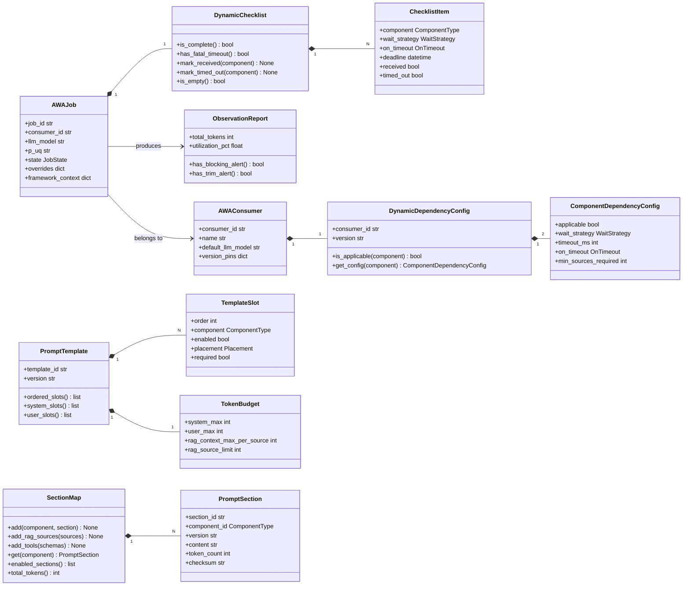
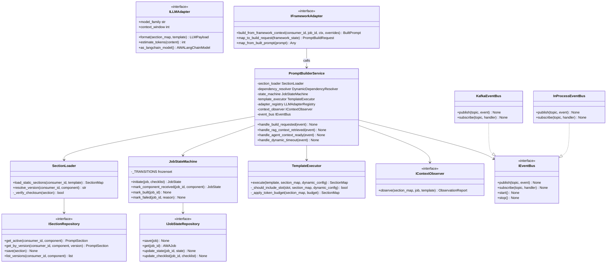
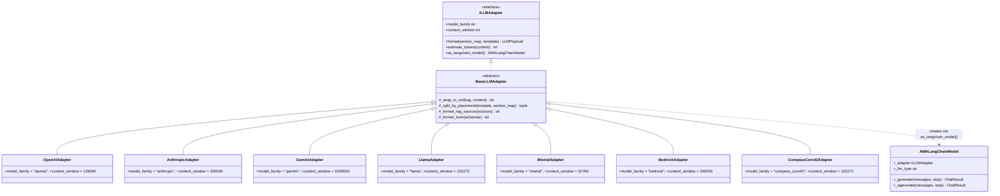
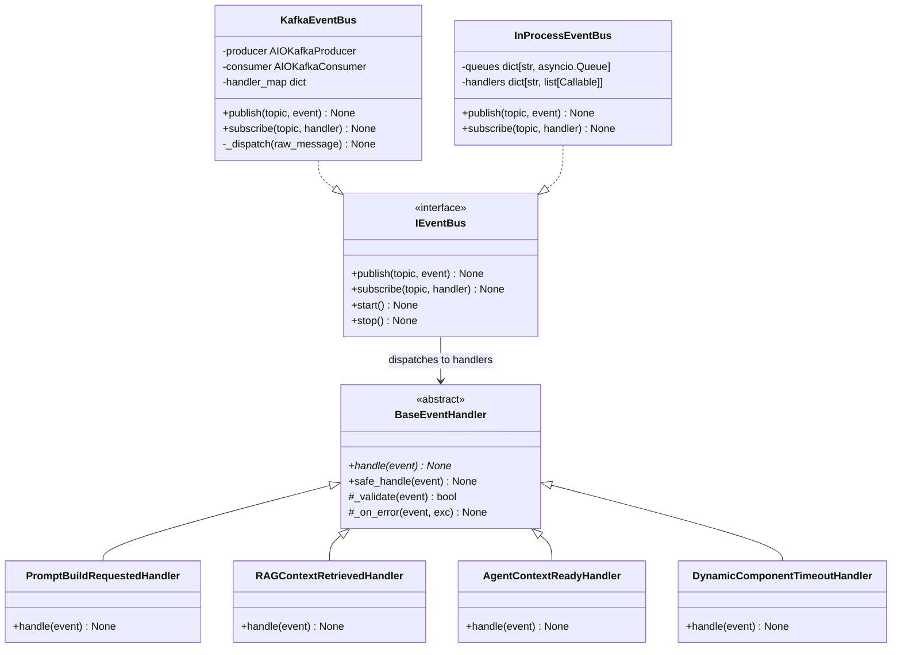
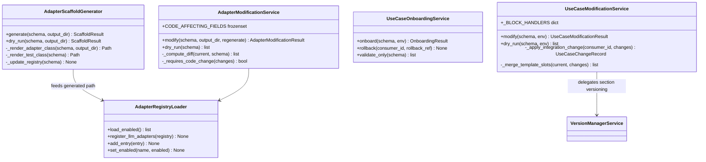
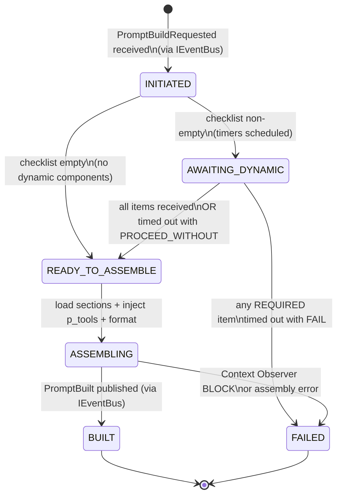
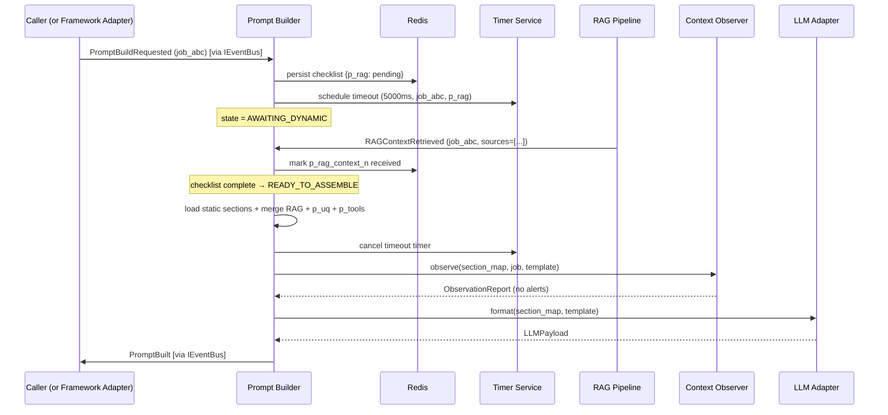

# AWA Prompt Builder — Technical Design Document

**Version:** 3.0.0  **Date:** 2026-05-26  **Status:** Final  
**Language:** Python 3.12  **Architecture:** Event-Driven Microservice · Hexagonal · Framework-Composable

---

## Table of Contents

1. [Executive Summary](#1-executive-summary)
2. [Feature Inventory](#2-feature-inventory)
3. [System Architecture](#3-system-architecture)
4. [Domain Model](#4-domain-model)
5. [Prompt Assembly Pipeline](#5-prompt-assembly-pipeline)
6. [LLM Adapter Registry](#6-llm-adapter-registry)
7. [Context Observer](#7-context-observer)
8. [Version Manager](#8-version-manager)
9. [Onboarding Framework](#9-onboarding-framework)
10. [Modification Framework](#10-modification-framework)
11. [Event Architecture](#11-event-architecture)
12. [Framework Integrations](#12-framework-integrations)
13. [Control Plane REST API](#13-control-plane-rest-api)
14. [pb-cli Reference](#14-pb-cli-reference)
15. [Full Module & Class Reference](#15-full-module--class-reference)
16. [UML Diagrams](#16-uml-diagrams)
17. [Design Patterns](#17-design-patterns)
18. [SOLID Compliance](#18-solid-compliance)
19. [Technology Stack](#19-technology-stack)
20. [Deployment Architecture](#20-deployment-architecture)
21. [Security](#21-security)
22. [Phased Delivery Roadmap](#22-phased-delivery-roadmap)

---

## 1. Executive Summary

The **AWA Prompt Builder** is a runtime prompt construction microservice that assembles structured, LLM-standard-aware prompts from discrete versioned components before every LLM call. It is event-driven (Kafka), horizontally scalable, and model-agnostic.

Every prompt is built in the context of a **use case** (`AWA_Consumer_ID`) and a **single LLM call** (`AWA_Job_ID`). The framework provides complete lifecycle management: onboarding new adapters and use cases via YAML templates, modifying parameters through sparse diff YAMLs, version-controlling every change, and observing assembled prompts for quality signals before they reach the LLM.

In v3.0.0, AWA Prompt Builder extends beyond standalone microservice operation. A new **Framework Integration** layer allows it to be embedded directly inside **LangGraph**, **Semantic Kernel**, and **CrewAI** applications — either as a graph node, a kernel filter, a custom LLM wrapper, or a callable tool — with no changes to the core assembly engine. Three deployment modes (`service`, `library`, `hybrid`) and a pluggable in-process event bus make this possible without breaking existing Kafka-based deployments.

---

## 2. Feature Inventory

### 2.1 Prompt Construction

| # | Feature |
|---|---|
| F-01 | Runtime assembly of prompts from 11 discrete, versioned components |
| F-02 | `AWA_Consumer_ID` scoping (use case level) and `AWA_Job_ID` scoping (per LLM call) |
| F-03 | `p_template` controls slot order, placement (system/user), and enabled state |
| F-04 | Token budget enforcement per placement with automatic RAG source trimming |
| F-05 | Three-tier override precedence: job-level → consumer-level → global default |
| F-06 | `p_guard` enforced as always-present and non-disableable |

### 2.2 Dynamic Component Handling

| # | Feature |
|---|---|
| F-07 | Per-consumer `DynamicDependencyConfig` for `p_rag_context_n` and `p_agent_context` |
| F-08 | Three wait strategies: `NOT_APPLICABLE`, `OPTIONAL`, `REQUIRED` |
| F-09 | Configurable timeout per dynamic component (milliseconds) |
| F-10 | Two timeout behaviours: `PROCEED_WITHOUT` (warn + continue) and `FAIL` (abort) |
| F-11 | `min_sources_required` threshold for RAG: treat sparse results as timeout |
| F-12 | Job-level override of wait strategy, timeout, and on_timeout |

### 2.3 Job State Machine

| # | Feature |
|---|---|
| F-13 | Six-state job lifecycle: `INITIATED → AWAITING_DYNAMIC → READY_TO_ASSEMBLE → ASSEMBLING → BUILT / FAILED` |
| F-14 | Per-job checklist stored in Redis (TTL-bounded), mirrored to Postgres on terminal state |
| F-15 | Redis-based distributed state — any Prompt Builder replica can advance a job |
| F-16 | Delay-queue timer events for dynamic component timeouts |
| F-17 | Five named event flows (no dynamic, RAG happy path, both dynamic, timeout PROCEED_WITHOUT, timeout FAIL) |

### 2.4 Multi-Model LLM Support

| # | Feature |
|---|---|
| F-18 | Strategy-pattern adapter per LLM family: OpenAI, Anthropic, Gemini, Llama, Mistral, AWS Bedrock |
| F-19 | Extensible via `BaseLLMAdapter` subclass — no core code changes needed |
| F-20 | Per-adapter native prompt format (messages array, system+messages, contents[], special tokens) |
| F-21 | Per-adapter token estimation (tiktoken, Anthropic SDK, character approximation, custom) |
| F-22 | Adapter selected at runtime by `llm_model` field in `PromptBuildRequestedEvent` |

### 2.5 Versioning & Rollback

| # | Feature |
|---|---|
| F-23 | Semantic versioning for all static sections and templates |
| F-24 | Full-snapshot version storage (not diffs) in S3-compatible object store |
| F-25 | Per-component version pinning per consumer (or `LATEST`) |
| F-26 | Rollback with short-lived TOTP-style confirmation token gate |
| F-27 | Append-only audit log (actor, action, before, after, timestamp) |

### 2.6 Context Observation

| # | Feature |
|---|---|
| F-28 | Per-job `ObservationReport`: token breakdown, alerts, rot signals |
| F-29 | Bloat detection: total utilisation, single-section dominance, RAG source overflow |
| F-30 | Rot detection: staleness (days since update), semantic drift (embedding cosine similarity) |
| F-31 | Three observer actions: `WARN`, `TRIM` (drop lowest-scored RAG sources), `BLOCK` (abort) |
| F-32 | Per-consumer threshold overrides for all bloat and rot signals |
| F-33 | Timeout warnings attached to observation report when dynamic component is omitted |

### 2.7 Adapter Onboarding

| # | Feature |
|---|---|
| F-34 | YAML template (`adapter_onboard.yaml`) for engineer self-service adapter registration |
| F-35 | Four adapter types: `llm`, `messaging`, `snapshot_store`, `timer` |
| F-36 | Pydantic schema validation with field-level error messages |
| F-37 | Jinja2 scaffold generation: Python class file + pytest skeleton |
| F-38 | Auto-append to `adapters_registry.yaml` master registry |
| F-39 | Dry-run mode previews generated files without writing |
| F-40 | Post-generation checklist of manual TODOs |

### 2.8 Use Case Onboarding

| # | Feature |
|---|---|
| F-41 | YAML template (`pb_use_case_onboarding.yaml`) covering all consumer parameters |
| F-42 | Three section sources: `inline`, `file`, `shared` (cross-consumer content reuse) |
| F-43 | Environment targeting: `dev`, `staging`, `prod` |
| F-44 | Onboarding rollback (full snapshot written before any DB writes) |
| F-45 | Dry-run mode previews all DB records without writing |
| F-46 | Observer threshold override registration at onboarding time |

### 2.9 Adapter Modification

| # | Feature |
|---|---|
| F-47 | Sparse diff YAML (`adapter_modify.yaml`) — only changed fields required |
| F-48 | Code-affecting field detection (`context_window`, `prompt_standard`, `token_counter`, `custom_format`) |
| F-49 | Optional scaffold regeneration (`--regenerate`) for code-affecting changes |
| F-50 | Class diff printed when code change detected without `--regenerate` |
| F-51 | Registry-only changes applied immediately without code change |
| F-52 | Idempotent — same YAML twice produces no-op |

### 2.10 Use Case Modification

| # | Feature |
|---|---|
| F-53 | Sparse diff YAML (`pb_use_case_modify.yaml`) — six independently modifiable blocks |
| F-54 | `dynamic_dependency_config` change publishes `DynamicConfigChanged` (live cache invalidation) |
| F-55 | `template` change creates new versioned `PromptTemplate`; old version preserved |
| F-56 | `sections` change creates new versioned `PromptSection` via `VersionManagerService` |
| F-57 | Slot merge: only named slots updated; unmentioned slots survive unchanged |
| F-58 | Per-modification rollback snapshot (independent from onboarding snapshot) |
| F-59 | Idempotent — same YAML twice produces no-op |

### 2.11 Observability & Operations

| # | Feature |
|---|---|
| F-60 | Prometheus metrics endpoint per service |
| F-61 | OpenTelemetry distributed tracing (Jaeger) |
| F-62 | Structured JSON logging (ELK) — section content never logged, only IDs and token counts |
| F-63 | Alertmanager rules: bloat > 90%, rot > 60 days, build failure rate > 1%, RAG timeout > 5% |
| F-64 | Live job state API endpoint (`GET /api/v1/jobs/{id}/state`) |
| F-65 | Timeout-rate-per-dynamic-component metric per consumer |

### 2.12 Framework Integrations

| # | Feature |
|---|---|
| F-66 | Three deployment modes: `service` (Kafka-native microservice), `library` (in-process SDK), `hybrid` (service + direct SDK call) |
| F-67 | `IFrameworkAdapter` port — bidirectional bridge between AWA domain types and framework state models |
| F-68 | `IEventBus` port with two implementations: `KafkaEventBus` (service mode) and `InProcessEventBus` (library mode, asyncio.Queue-based) |
| F-69 | **LangGraph**: `PromptBuilderNode` (drop-in graph node), `PromptBuilderRunnable` (LangChain Runnable), `AWAPromptState` TypedDict, `thread_id`→`AWA_Job_ID` correlation, LangGraph checkpointer → `p_agent_context` adapter |
| F-70 | **Semantic Kernel**: `PromptBuilderPlugin` (KernelPlugin with `@kernel_function`), `PromptEnrichmentFilter` (`IFunctionInvocationFilter` — transparent enrichment), `AWAAIConnector` (AI service wrapper) |
| F-71 | **CrewAI**: `AWACrewLLM` (`BaseLLM` wrapper — recommended; intercepts every model call), `PromptBuilderTool` (`BaseTool` — tool-mode), `AWAAgentMixin` (maps `Agent.role` → `AWA_Consumer_ID`) |
| F-72 | `p_tools` — 11th component type; injects framework tool/function schemas into the system prompt; per-consumer slot, enabled/disabled in template |
| F-73 | `IDCorrelationService` + three `ConsumerResolutionStrategy` implementations: `ExplicitStrategy`, `FrameworkIdentityStrategy`, `ConfigMapStrategy` |
| F-74 | `ContextBridgeService` — bidirectional mapping: LangGraph `TypedDict` / SK `KernelArguments` / CrewAI task context ↔ `PromptBuildRequest` + `BuiltPrompt` |
| F-75 | Three memory context adapters implementing `IContextStore` for `p_agent_context`: `LangGraphCheckpointContextAdapter`, `SKVectorMemoryContextAdapter`, `CrewAIMemoryContextAdapter` |

---

## 3. System Architecture

### 3.1 Architecture Style

- **Hexagonal (Ports & Adapters):** domain and service code depend only on abstract port interfaces; all infrastructure bindings in the DI container.
- **Event-Driven:** Kafka is the coordination backbone in service mode; services communicate by publishing and consuming events, never by direct HTTP calls.
- **Stateless services:** per-job state held in Redis (TTL-bounded); services are horizontally scalable.
- **Framework-Composable:** the `integrations/` layer exposes the same core assembly engine to LangGraph, Semantic Kernel, and CrewAI via a pluggable `IFrameworkAdapter` port — zero changes to domain or service code.

### 3.2 System Context

```
┌────────────────────────────────────────────────────────────────────────────────┐
│                              External Callers                                   │
│  Chat UI  │  Source System API  │  Agent Orchestrator  │  pb-cli               │
│           │                    │  (LangGraph / SK / CrewAI)                    │
└──────┬────────────────┬─────────────────────────┬──────────────────────────────┘
       │                │                         │
       ▼                ▼                         ▼
       [Kafka Path]     [Kafka Path]       [Library / Direct Path]
       │                │                         │
┌──────▼────────────────▼─────────────────────────▼──────────────────────────────┐
│                          IEventBus (KafkaEventBus | InProcessEventBus)           │
└──────────────────────────────────────┬──────────────────────────────────────────┘
                                       │
              ┌────────────────────────┼──────────────────────────┐
              ▼                        ▼                          ▼
┌─────────────────────┐    ┌─────────────────────┐    ┌─────────────────────────┐
│   Prompt Builder     │    │   Version Manager    │    │   Context Observer      │
│   Service            │    │   Service            │    │   Service               │
└──────┬──────────────┘    └─────────────────────┘    └─────────────────────────┘
       │
┌──────▼──────────────────────────────────────────────────────────┐
│                    LLM Adapter Registry                          │
│  OpenAI │ Anthropic │ Gemini │ Llama │ Mistral │ Bedrock │ ...  │
└──────────────────────────────────────────────────────────────────┘
       │
┌──────▼───────────────────────────────────────────────────────────────────────┐
│                               Storage Layer                                    │
│  PostgreSQL (sections, templates, consumers, jobs, audit)                      │
│  Redis      (job state machine, checklist, TTL)                               │
│  S3 / Blob  (version snapshots, prompt archives)                               │
└───────────────────────────────────────────────────────────────────────────────┘
       │
┌──────▼───────────────────────────────────────────────────────────────────────┐
│                        Integration Layer (integrations/)                       │
│  LangGraphAdapter  │  SemanticKernelAdapter  │  CrewAIAdapter                 │
│  ContextBridgeService  │  IDCorrelationService  │  InProcessEventBus          │
└───────────────────────────────────────────────────────────────────────────────┘
```

### 3.3 Service Responsibilities

| Service | Responsibility |
|---|---|
| **Prompt Builder** | Orchestrates the full assembly pipeline; owns job state machine |
| **Version Manager** | Snapshot versioning, rollback, audit for sections and templates |
| **Context Observer** | Bloat and rot detection; emits alerts; applies TRIM strategy |
| **LLM Adapter Registry** | Translates canonical `SectionMap` into LLM-native prompt format |
| **Onboarding/Modification** | CLI-driven; manages adapter registry and consumer DB records |
| **Integration Layer** | Bridges AWA domain to LangGraph / Semantic Kernel / CrewAI |

### 3.4 Deployment Modes

| Mode | Event Bus | Redis | Kafka | Use Case |
|---|---|---|---|---|
| `service` | `KafkaEventBus` | Required | Required | Standalone microservice; fully event-driven |
| `library` | `InProcessEventBus` | Optional (in-proc fallback) | Not required | Embedded SDK inside a LangGraph / SK / CrewAI app |
| `hybrid` | `KafkaEventBus` | Required | Required | Frameworks orchestrate agents; AWA runs as a service they call via the integration adapters |

Selected via `DEPLOYMENT_MODE` environment variable. The DI container wires the correct `IEventBus` implementation at startup; no other code is affected.

---

## 4. Domain Model

### 4.1 The Eleven Prompt Components

| Key | Name | Source | Lifecycle |
|---|---|---|---|
| `p_uq` | User / System Query | Chat turn or request payload | Dynamic — per job |
| `p_guard` | Guardrail Prompt | Config store | Static — always required |
| `p_act_bus` | Activity Business Context | Config store | Static — per consumer |
| `p_act_ins` | Activity Instructions | Config store | Static — per consumer |
| `p_act_cond` | Activity Conduct | Config store | Static — per consumer |
| `p_rag_context_n` | RAG / OCR Context (1..N sources) | Knowledge retrieval pipeline | Dynamic — per job, configurable |
| `p_agent_rgb` | Agent Role, Goal, Backstory | Agent profile store | Static — per agent |
| `p_agent_conduct` | Agent Conduct / Policy | Agent policy store | Static — per agent |
| `p_agent_context` | Agent Reflection Context | CoT / ToT / reflection engine | Dynamic — per job, configurable |
| `p_template` | Assembly Template | Template registry | Static — per consumer, versioned |
| `p_tools` | Tool / Function Schemas | Framework tool registry | Dynamic — injected by integration layer |

> **p_tools:** Present only when a framework integration is active and the consumer's template has the `p_tools` slot enabled. Injects the JSON schemas of all tools registered with the orchestrating framework into the system message. Placement is always `system`. Subject to bloat detection like any other section.

### 4.2 Identifiers

```
AWA_Consumer_ID  ── use case identifier  (e.g. IDP_INVOICE_US)
    └── AWA_Job_ID  ── single LLM call  (e.g. job_abc123)
```

**Consumer scope:** template, static sections, version pins, dynamic config, observer thresholds  
**Job scope:** `p_uq`, `p_rag_context_n`, `p_agent_context`, `p_tools`, assembled prompt, job state, observation report

### 4.3 Core Domain Classes

```python
# ── Enumerations ────────────────────────────────────────────────────────────
class ComponentType(str, Enum):
    # p_uq | p_guard | p_act_bus | p_act_ins | p_act_cond
    # p_rag_context_n | p_agent_rgb | p_agent_conduct | p_agent_context
    # p_template | p_tools
class WaitStrategy(str, Enum):     # NOT_APPLICABLE | OPTIONAL | REQUIRED
class OnTimeout(str, Enum):        # PROCEED_WITHOUT | FAIL
class JobState(str, Enum):         # INITIATED | AWAITING_DYNAMIC | READY_TO_ASSEMBLE | ASSEMBLING | BUILT | FAILED
class Placement(str, Enum):        # system | user
class AlertSeverity(str, Enum):    # WARN | TRIM | BLOCK
class DeploymentMode(str, Enum):   # service | library | hybrid

# ── Value objects ───────────────────────────────────────────────────────────
@dataclass
class RAGSource:
    source_id: str; content: str; score: float; token_count: int

@dataclass
class TokenBudget:
    system_max: int; user_max: int
    rag_context_max_per_source: int; rag_source_limit: int

@dataclass
class ChecklistItem:
    component: ComponentType; wait_strategy: WaitStrategy
    on_timeout: Optional[OnTimeout]; deadline: Optional[datetime]
    received: bool = False; timed_out: bool = False

# ── Aggregates ──────────────────────────────────────────────────────────────
@dataclass
class PromptSection:
    section_id: str; component_id: ComponentType; consumer_id: str
    version: str; content: str; enabled: bool
    token_count: int; checksum: str; last_modified: datetime

class SectionMap:                  # dict[ComponentType, PromptSection | list[RAGSource]]
    def add(component, section) -> None
    def add_rag_sources(sources) -> None
    def add_tools(schemas: list[dict]) -> None          # new: p_tools injection
    def get(component) -> Optional[PromptSection]
    def get_rag_sources() -> list[RAGSource]
    def get_tools() -> list[dict]
    def enabled_sections() -> list[PromptSection]
    def total_tokens() -> int

@dataclass
class TemplateSlot:
    order: int; component: ComponentType; enabled: bool
    placement: Placement; required: bool

@dataclass
class PromptTemplate:
    template_id: str; consumer_id: str; version: str
    slots: list[TemplateSlot]; token_budget: TokenBudget
    def ordered_slots() -> list[TemplateSlot]
    def system_slots() -> list[TemplateSlot]
    def user_slots() -> list[TemplateSlot]

class DynamicChecklist:            # dict[ComponentType, ChecklistItem]
    def is_complete() -> bool
    def has_fatal_timeout() -> bool
    def mark_received(component) -> None
    def mark_timed_out(component) -> None
    def is_empty() -> bool

@dataclass
class ComponentDependencyConfig:
    applicable: bool; wait_strategy: WaitStrategy
    timeout_ms: Optional[int]; on_timeout: Optional[OnTimeout]
    min_sources_required: Optional[int]

@dataclass
class DynamicDependencyConfig:
    consumer_id: str; version: str
    p_rag_context_n: ComponentDependencyConfig
    p_agent_context: ComponentDependencyConfig
    def is_applicable(component) -> bool
    def get_config(component) -> ComponentDependencyConfig

@dataclass
class AWAConsumer:
    consumer_id: str; name: str; default_llm_model: str
    version_pins: dict[str, str]
    dynamic_dependency_config: DynamicDependencyConfig

@dataclass
class AWAJob:
    job_id: str; consumer_id: str; llm_model: str; p_uq: str
    state: JobState; checklist: Optional[DynamicChecklist]
    overrides: dict; created_at: datetime
    framework_context: Optional[dict] = None            # new: carries framework state metadata

@dataclass
class ObservationReport:
    report_id: str; job_id: str
    total_tokens: int; model_context_limit: int; utilization_pct: float
    section_breakdown: list[TokenBreakdown]
    alerts: list[ContextAlert]; rot_signals: list[RotSignal]
    dynamic_timeout_warnings: list[str]
    def has_blocking_alert() -> bool
    def has_trim_alert() -> bool
```

---

## 5. Prompt Assembly Pipeline

### 5.1 Dynamic Dependency Configuration

Stored per consumer. Controls whether the builder waits for `p_rag_context_n` and `p_agent_context`.

| `wait_strategy` | Meaning |
|---|---|
| `NOT_APPLICABLE` | Never used. No timer started. Slot skipped even if present in `p_template`. |
| `OPTIONAL` | Wait up to `timeout_ms`. Proceed silently if not received. |
| `REQUIRED` | Wait up to `timeout_ms`. Then apply `on_timeout`. |

| `on_timeout` | Behaviour (only for `REQUIRED`) |
|---|---|
| `PROCEED_WITHOUT` | Omit section. Record `received: false, reason: TIMEOUT` in manifest. Emit WARN. |
| `FAIL` | Abort build. Publish `PromptBuildFailed`. |

### 5.2 Job State Machine

```
INITIATED
  │
  ├── checklist empty? ──YES──► READY_TO_ASSEMBLE
  │
  └──NO──► AWAITING_DYNAMIC
                │
                ├── all items received or PROCEED_WITHOUT timed out ──► READY_TO_ASSEMBLE
                │
                └── any REQUIRED item timed out with FAIL ──────────► FAILED

READY_TO_ASSEMBLE ──► ASSEMBLING ──► BUILT
                                └──► FAILED  (Context Observer BLOCK)
```

Valid transitions (frozenset in `JobStateMachine._TRANSITIONS`):
```python
{
  (INITIATED,          AWAITING_DYNAMIC),
  (INITIATED,          READY_TO_ASSEMBLE),
  (AWAITING_DYNAMIC,   READY_TO_ASSEMBLE),
  (AWAITING_DYNAMIC,   FAILED),
  (READY_TO_ASSEMBLE,  ASSEMBLING),
  (ASSEMBLING,         BUILT),
  (ASSEMBLING,         FAILED),
}
```

State is held in **Redis** keyed by `AWA_Job_ID` with TTL = `max(timeout_ms) + 10 s`. In library mode with no Redis configured, an in-process dict with asyncio TTL simulation is used.

### 5.3 Assembly Pipeline (Internal)

```
PromptBuildRequested received (via IEventBus — Kafka or InProcess)
    │
    ├─► Load p_template + DynamicDependencyConfig (from cache/DB)
    ├─► Apply job-level overrides to DynamicDependencyConfig
    ├─► DynamicDependencyResolver.build_checklist(job) → DynamicChecklist
    │
    ├─► Checklist empty? → READY_TO_ASSEMBLE immediately
    │   Checklist non-empty? → persist to Redis, schedule timeout events → AWAITING_DYNAMIC
    │
    │   [wait for RAGContextRetrieved / AgentContextReady / DynamicComponentTimeout]
    │
    ├─► Checklist resolved → READY_TO_ASSEMBLE
    ├─► SectionLoader.load_static_sections(consumer_id, template) → SectionMap
    ├─► Merge arrived dynamic sections (RAG sources, agent context, p_uq) into SectionMap
    ├─► If p_tools slot enabled → ContextBridgeService.inject_tools(section_map, job) [integration mode]
    ├─► TemplateExecutor.execute(template, section_map, dynamic_config)
    │       ├─ Skip NOT_APPLICABLE slots
    │       ├─ Skip p_tools slot if not enabled or framework_context absent
    │       ├─ Apply token budget (trim RAG sources if over limit)
    │       └─ Return ordered SectionMap
    │
    ├─► ContextObserverService.observe(section_map, job, template)
    │       → ObservationReport (with WARN / TRIM / BLOCK signals)
    │
    ├─► BLOCK signal? → FAILED (publish PromptBuildFailed via IEventBus)
    ├─► TRIM signal? → apply trim, re-observe
    │
    ├─► LLMAdapterRegistry.get(llm_model).format(section_map, template)
    │       → LLMPayload (native format for target model)
    │
    └─► Publish PromptBuilt (via IEventBus)
```

### 5.4 Override Precedence

```
Priority (highest → lowest):
  1. Job-level override    (PromptBuildRequestedEvent.overrides)
  2. Consumer-level config (DynamicDependencyConfig / AWAConsumer.version_pins)
  3. Global default        (system-wide fallback in settings)
```

**Non-overridable at job level:** `p_guard` cannot be disabled. `min_sources_required` can only be relaxed (lowered).

---

## 6. LLM Adapter Registry

### 6.1 Prompt Standards per LLM

| Adapter | Format | Token Counter |
|---|---|---|
| `OpenAIAdapter` | `messages[]` with `system`/`user`/`assistant` roles | tiktoken `cl100k_base` |
| `AnthropicAdapter` | `system` param + `messages[]`; XML tags for sections | Anthropic SDK count_tokens |
| `GeminiAdapter` | `contents[]` with `role` and `parts` | Google tokenizer |
| `LlamaAdapter` | `<\|system\|>` / `<\|user\|>` / `<\|assistant\|>` special tokens | tiktoken or character estimate |
| `MistralAdapter` | `[INST]` / `[/INST]` instruction format | tiktoken |
| `BedrockAdapter` | Bedrock Converse API format | Model-specific |
| `CompassCore42Adapter` | OpenAI-compatible (generated by scaffold) | tiktoken |

### 6.2 Adapter Interface

```python
class ILLMAdapter(ABC):
    model_family:   str   # abstract property
    context_window: int   # abstract property
    def format(section_map: SectionMap, template: PromptTemplate) -> LLMPayload: ...
    def estimate_tokens(content: str) -> int: ...
    def as_langchain_model(self) -> "AWALangChainModel": ...  # integration helper
```

### 6.3 Registry

```python
class LLMAdapterRegistry:
    def register(adapter: ILLMAdapter) -> None
    def get(model: str) -> ILLMAdapter       # resolves model name → family → adapter
    def get_by_family(family: str) -> ILLMAdapter
    def supported_models() -> list[str]
```

Populated at startup by `AdapterRegistryLoader` reading `config/adapters_registry.yaml`.

---

## 7. Context Observer

### 7.1 Bloat Detection (`BloatDetector`)

| Signal | Condition | Default Action |
|---|---|---|
| Total utilisation | tokens > 80% of context window | WARN |
| Total utilisation | tokens > 95% of context window | BLOCK |
| Section dominance | one section > 60% of total | WARN |
| RAG overflow | n sources > `rag_source_limit` | TRIM (drop lowest-score first) |
| Tools bloat | `p_tools` > 20% of system budget | WARN |

### 7.2 Rot Detection (`RotDetector`)

| Signal | Condition | Default Action |
|---|---|---|
| Staleness | section not updated in > 30 days | WARN |
| Staleness | section not updated in > 90 days | BLOCK |
| Semantic drift | cosine_similarity(section, p_uq) < 0.65 | WARN |

Semantic drift requires an `IEmbeddingClient` implementation. When not configured, drift check is skipped.

### 7.3 Observer Actions

```
WARN  → attach alert to ObservationReport; publish ContextAlert event; continue build
TRIM  → drop lowest-scored RAG sources until under budget; re-count; continue build
BLOCK → publish PromptBuildBlocked; transition job to FAILED
```

All thresholds are per-consumer configurable (set at onboarding, modifiable via YAML).

---

## 8. Version Manager

### 8.1 Versioning Model

- **Semantic versioning** (`major.minor.patch`) for all sections and templates.
- Each version is a **full snapshot** (not a diff) stored in object storage (S3/Azure Blob).
- The active version is flagged in Postgres (`is_active = true`).
- Consumer can pin any component to a specific version or `LATEST`.

### 8.2 Rollback

```
1. Caller provides target_version + confirmation_token
2. VersionManagerService validates token (short-lived TOTP-style)
3. Sets is_active = false on current version
4. Sets is_active = true on target version
5. Publishes VersionRolledBack → Prompt Builder invalidates cache
6. Writes audit record (who, when, from, to, reason)
```

Rollback cannot be undone silently — it is itself versioned as a new change record.

---

## 9. Onboarding Framework

### 9.1 Files

```
config/templates/adapter_onboard.yaml        ← blank template
config/templates/pb_use_case_onboarding.yaml ← blank template
config/examples/compass_core42_adapter.yaml  ← filled LLM example
config/examples/rabbitmq_adapter.yaml        ← filled messaging example
config/examples/azure_event_bus_adapter.yaml ← filled messaging example
config/examples/IDP_INVOICE_US_onboarding.yaml ← filled use case example
config/adapters_registry.yaml                ← master registry (auto-maintained)
scaffold_templates/llm_adapter.py.j2         ← Jinja2 class template
scaffold_templates/messaging_adapter.py.j2   ← Jinja2 class template
scaffold_templates/adapter_test.py.j2        ← Jinja2 test template
```

### 9.2 Adapter Onboarding Flow

```
pb-cli adapter validate --config <file>    → Pydantic schema validation
pb-cli adapter onboard  --config <file> --dry-run
pb-cli adapter onboard  --config <file> --output-dir ./adapters/llm/
```

Steps: validate YAML → render class from Jinja2 → render test skeleton → append to registry → print TODO checklist.

### 9.3 Use Case Onboarding Flow

```
pb-cli use-case validate --config <file>
pb-cli use-case onboard  --config <file> --env staging --dry-run
pb-cli use-case onboard  --config <file> --env staging
```

Steps: validate YAML → check no duplicate → validate model registered → write rollback snapshot → create consumer + dynamic config + sections + template in DB → write audit.

### 9.4 Section Sources

| Source | How content is loaded |
|---|---|
| `inline` | Content written directly in the YAML |
| `file` | Content read from a text file path relative to the YAML |
| `shared` | References an existing `PromptSection` from another consumer — no duplication |

---

## 10. Modification Framework

### 10.1 Design Principle

**Sparse / diff-based.** Every field defaults to `null`. The service applies only non-null fields. Running the same YAML twice is a no-op.

### 10.2 Adapter Modification

```
config/templates/adapter_modify.yaml           ← blank template
config/examples/compass_core42_modify.yaml     ← filled example
```

| Changed field | Category | Effect |
|---|---|---|
| `enabled`, `supported_models`, `connection.*` | Registry-only | YAML updated; DI hot-reload |
| `context_window`, `prompt_standard`, `token_counter`, `custom_format` | Code-affecting | Registry updated + class diff printed; `--regenerate` re-runs scaffold |

### 10.3 Use Case Modification

```
config/templates/pb_use_case_modify.yaml       ← blank template
config/examples/IDP_INVOICE_US_modify.yaml     ← filled example
```

| Block | Change type | Effect |
|---|---|---|
| `llm` | `llm_update` | DB update; model validated against registry |
| `dynamic_dependency_config` | `dynamic_config_update` | DB update + `DynamicConfigChanged` Kafka event |
| `template` | `template_version` | New `PromptTemplate` version; old preserved |
| `sections` | `section_version` | New `PromptSection` version via `VersionManagerService` |
| `version_pins` | `version_pin_update` | DB update |
| `observer_thresholds` | `threshold_update` | DB update |

**Slot merge rule:** only named slots updated; unmentioned slots survive unchanged.  
Every `modify` writes a rollback snapshot before applying any changes.

---

## 11. Event Architecture

### 11.1 IEventBus — Deployment-Mode Abstraction

```python
class IEventBus(ABC):
    async def publish(self, topic: str, event: DomainEvent) -> None: ...
    async def subscribe(self, topic: str, handler: Callable) -> None: ...
    async def start(self) -> None: ...
    async def stop(self) -> None: ...

class KafkaEventBus(IEventBus):       # service / hybrid mode — wraps aiokafka
class InProcessEventBus(IEventBus):   # library mode — asyncio.Queue per topic
```

All services depend only on `IEventBus`. The DI container selects the implementation based on `DEPLOYMENT_MODE`.

### 11.2 Kafka Topics

| Topic | Publisher | Consumers | Purpose |
|---|---|---|---|
| `awa.prompt.build.requested` | API Gateway / Integration Layer | Prompt Builder | Trigger assembly |
| `awa.prompt.rag.retrieved` | RAG Pipeline | Prompt Builder | Inject RAG context |
| `awa.prompt.agent.context.ready` | CoT/ToT Engine | Prompt Builder | Inject agent context |
| `awa.prompt.dynamic.timeout` | Timer Service | Prompt Builder | Dynamic component deadline exceeded |
| `awa.prompt.built` | Prompt Builder | LLM Caller, Context Observer, Audit | Final prompt ready |
| `awa.prompt.build.failed` | Prompt Builder | Alert, Caller | Build failed |
| `awa.prompt.build.blocked` | Context Observer | Alert, Caller | Observer blocked build |
| `awa.prompt.context.alert` | Context Observer | Alert, Dashboard | Bloat/rot warning |
| `awa.version.changed` | Version Manager | Prompt Builder (cache invalidate) | Section/template updated |
| `awa.version.rolledback` | Version Manager | Prompt Builder, Audit | Rollback applied |
| `awa.section.flag.changed` | Control Plane API | Prompt Builder | Enable/disable section |
| `awa.dynamic.config.changed` | Control Plane API | Prompt Builder | Dynamic config updated |

In **library mode**, topic names are used as keys in `InProcessEventBus`'s internal queue map. Semantics are identical; Kafka is not required.

### 11.3 Key Event Schemas

```python
# Trigger
PromptBuildRequestedEvent: event_type, awa_consumer_id, awa_job_id,
                            llm_model, p_uq, overrides,
                            framework_context: Optional[dict]   # new — carries integration metadata

# Dynamic components
RAGContextRetrievedEvent:       awa_job_id, sources: list[RAGSource]
AgentContextReadyEvent:         awa_job_id, context_type, content, token_count
DynamicComponentTimeoutEvent:   awa_job_id, component_id

# Results
PromptBuiltEvent:       awa_consumer_id, awa_job_id, llm_model,
                        formatted_payload, section_manifest, observation_report_ref,
                        build_duration_ms
PromptBuildFailedEvent: awa_consumer_id, awa_job_id, reason,
                        failed_component, on_timeout_applied
```

### 11.4 Event Flows (Summary)

| Flow | Scenario | Terminal event |
|---|---|---|
| **A** | No dynamic components applicable | `PromptBuilt` (fast path) |
| **B** | RAG required, arrives in time | `PromptBuilt` |
| **C** | RAG + agent context both required, both arrive | `PromptBuilt` |
| **D** | RAG required, timeout → `PROCEED_WITHOUT` | `PromptBuilt` (with WARN) |
| **E** | RAG required, timeout → `FAIL` | `PromptBuildFailed` |

---

## 12. Framework Integrations

### 12.1 Design Principle

The integration layer sits **outside** the core domain and service ring. It depends on `PromptBuilderService` via `IFrameworkAdapter`, not the reverse. All ten (now eleven) components, the job state machine, versioning, and context observation are completely unchanged. The integration layer is purely additive.

```
Core (unchanged):  domain/ → ports/ → services/
Integration layer: integrations/ → depends on services/ via IFrameworkAdapter
```

### 12.2 IFrameworkAdapter Port

```python
class IFrameworkAdapter(ABC):
    """Bidirectional bridge between a framework's state model and AWA's domain."""

    @abstractmethod
    async def build_from_framework_context(
        self,
        consumer_id: str,
        job_id: str,
        framework_context: dict[str, Any],
        dynamic_overrides: dict[str, Any] | None = None,
    ) -> BuiltPrompt: ...

    @abstractmethod
    def map_to_build_request(self, framework_state: Any) -> PromptBuildRequest: ...

    @abstractmethod
    def map_from_built_prompt(self, prompt: BuiltPrompt) -> Any: ...
```

Three concrete adapters implement this port: `LangGraphAdapter`, `SemanticKernelAdapter`, `CrewAIAdapter`.

### 12.3 ContextBridgeService

Maps each framework's state representation into AWA's internal types and back.

| Framework | State In | AWA Request | State Out |
|---|---|---|---|
| LangGraph | `TypedDict` / Pydantic | `PromptBuildRequest` | State dict update (partial) |
| Semantic Kernel | `KernelArguments` | `PromptBuildRequest` | `FunctionResult` |
| CrewAI | Task context dict | `PromptBuildRequest` | Formatted string or `ChatResult` |

```python
class ContextBridgeService:
    async def map_langgraph_state(self, state: dict, consumer_id: str) -> PromptBuildRequest: ...
    async def map_sk_arguments(self, args: KernelArguments, consumer_id: str) -> PromptBuildRequest: ...
    async def map_crewai_context(self, task_context: dict, consumer_id: str) -> PromptBuildRequest: ...
    def map_built_prompt_to_state_update(self, prompt: BuiltPrompt, framework: str) -> Any: ...
    async def inject_tools(self, section_map: SectionMap, tool_schemas: list[dict]) -> None: ...
```

### 12.4 LangGraph Integration

AWA integrates with LangGraph at the **node** level. A `PromptBuilderNode` is a drop-in function node that receives the graph state, runs an AWA build, and returns a partial state update containing the formatted LLM payload.

**AWAPromptState** (TypedDict):
```python
class AWAPromptState(TypedDict):
    messages:         list[BaseMessage]
    awa_consumer_id:  str
    awa_job_id:       str
    awa_built_prompt: Optional[LLMPayload]
    awa_observation:  Optional[dict]
    awa_build_error:  Optional[str]
```

**PromptBuilderNode** (graph node function):
```python
async def PromptBuilderNode(state: AWAPromptState) -> dict:
    """Drop-in LangGraph node. Builds the AWA prompt and returns state update."""
    adapter: LangGraphAdapter = container.langgraph_adapter()
    prompt   = await adapter.build_from_framework_context(
        consumer_id      = state["awa_consumer_id"],
        job_id           = state["awa_job_id"],
        framework_context= state,
    )
    return {"awa_built_prompt": prompt.payload, "awa_observation": prompt.observation_ref}
```

**PromptBuilderRunnable** — wraps `PromptBuilderNode` as a LangChain `Runnable` (`.invoke`, `.ainvoke`, `.stream`, `.astream`).

**AWALangChainModel** — wraps any `ILLMAdapter` as a LangChain `BaseChatModel`:
```python
class AWALangChainModel(BaseChatModel):
    """Makes any AWA ILLMAdapter usable as a LangChain model."""
    _adapter: ILLMAdapter
    def _generate(self, messages, stop=None, **kwargs) -> ChatResult: ...
    async def _agenerate(self, messages, stop=None, **kwargs) -> ChatResult: ...
```

**Usage:**
```python
from awa_prompt_builder.integrations.langgraph import PromptBuilderNode, AWAPromptState

graph = StateGraph(AWAPromptState)
graph.add_node("build_prompt", PromptBuilderNode)
graph.add_node("call_llm", your_llm_node)
graph.add_edge("build_prompt", "call_llm")
```

**ID correlation:** `thread_id` from LangGraph's checkpointer maps to `AWA_Job_ID` via `IDCorrelationService`.

**Memory context adapter:** `LangGraphCheckpointContextAdapter(IContextStore)` reads from the LangGraph checkpointer (SQLite / Redis / Postgres) to populate `p_agent_context`.

### 12.5 Semantic Kernel Integration

AWA integrates with Semantic Kernel at two levels: as a **Plugin** (explicit call) and as a **Filter** (transparent enrichment on every kernel function call).

**PromptBuilderPlugin** (KernelPlugin — explicit call):
```python
class PromptBuilderPlugin:
    @kernel_function(name="BuildPrompt", description="Assemble an AWA prompt for a use case")
    async def build_prompt(
        self,
        consumer_id: Annotated[str, "AWA Consumer ID"],
        user_query:  Annotated[str, "The user's query"],
        kernel:      Kernel,
    ) -> Annotated[str, "Formatted LLM-ready prompt"]: ...
```

**PromptEnrichmentFilter** (transparent — recommended for production):
```python
class PromptEnrichmentFilter(IFunctionInvocationFilter):
    """Intercepts every kernel function call and enriches the prompt via AWA before execution."""
    async def on_function_invocation(self, context: FunctionInvocationContext,
                                     next: Callable) -> None:
        # Build AWA prompt using KernelArguments as context
        built = await self._adapter.build_from_framework_context(
            consumer_id      = self._consumer_id,
            job_id           = str(uuid4()),
            framework_context= dict(context.arguments),
        )
        # Inject formatted prompt back into context arguments
        context.arguments["system_prompt"] = built.payload.system_content
        await next(context)
```

**AWAAIConnector** — wraps AWA's assembly + any `ILLMAdapter` as a Semantic Kernel AI service.

**Usage:**
```python
from awa_prompt_builder.integrations.semantic_kernel import PromptEnrichmentFilter

kernel.add_filter("function_invocation",
                  PromptEnrichmentFilter(consumer_id="IDP_INVOICE_US"))
# Every subsequent kernel.invoke() call is transparently AWA-enriched
```

**Memory context adapter:** `SKVectorMemoryContextAdapter(IContextStore)` reads from SK's vector memory stores to populate `p_agent_context`.

### 12.6 CrewAI Integration

AWA integrates with CrewAI at the **LLM wrapper** level (recommended) or as a **Tool**.

**AWACrewLLM** (`BaseLLM` — recommended pattern):
```python
class AWACrewLLM(BaseLLM):
    """
    Wraps any underlying LLM provider. Before every model call,
    runs AWA prompt assembly and replaces the raw messages with
    the AWA-enriched, versioned, observed payload.
    """
    def __init__(self, base_model: str, consumer_id: str | None = None): ...

    def call(self, messages: list[dict], stop: list[str] | None = None,
             callbacks=None, **kwargs) -> str:
        consumer_id = self._resolve_consumer(messages)
        built       = self._adapter.build_sync(consumer_id, messages)
        return self._underlying_llm.call(built.payload.as_messages(), stop, **kwargs)

    async def acall(self, messages, stop=None, callbacks=None, **kwargs) -> str: ...
    def _resolve_consumer(self, messages) -> str: ...    # uses IDCorrelationService
```

**PromptBuilderTool** (`BaseTool` — tool-mode for agent-driven builds):
```python
class PromptBuilderTool(BaseTool):
    name:        str = "awa_prompt_builder"
    description: str = "Assemble a versioned, guardrail-protected prompt for a use case"
    def _run(self, consumer_id: str, user_query: str, **kwargs) -> str: ...
    async def _arun(self, consumer_id: str, user_query: str, **kwargs) -> str: ...
```

**AWAAgentMixin** — maps `Agent.role` to `AWA_Consumer_ID` via `ConsumerResolutionStrategy`:
```python
class AWAAgentMixin:
    """Mixin for CrewAI Agent subclasses. Maps agent.role → AWA_Consumer_ID."""
    def get_awa_consumer_id(self) -> str:
        return IDCorrelationService.resolve(
            strategy=FrameworkIdentityStrategy,
            identity=self.role,
        )
```

**Usage (recommended — LLM wrapper):**
```python
from awa_prompt_builder.integrations.crewai import AWACrewLLM

invoice_agent = Agent(
    role     = "Invoice Processor",       # maps to AWA_Consumer_ID via ConfigMapStrategy
    goal     = "Extract invoice fields",
    backstory= "...",
    llm      = AWACrewLLM(base_model="gpt-4o")
)
```

**Memory context adapter:** `CrewAIMemoryContextAdapter(IContextStore)` reads from CrewAI's short-term, long-term, and entity memory stores to populate `p_agent_context`.

### 12.7 p_tools — The 11th Component

`p_tools` carries the JSON schemas of all tools registered with the orchestrating framework into the system message.

| Property | Value |
|---|---|
| `ComponentType` | `ComponentType.P_TOOLS` |
| Source | Injected by `ContextBridgeService.inject_tools()` at assembly time |
| Placement | Always `system` |
| Required | `false` — silently skipped if no framework context is present |
| Token impact | Counted by `BloatDetector`; additional threshold: `p_tools > 20%` of system budget → WARN |
| Versioning | Not versioned (framework-provided at job time, not stored in DB) |

To enable per consumer, add the slot to `p_template`:
```yaml
slots:
  - component: p_tools
    enabled:   true
    order:     2          # after p_guard, before p_act_bus
    placement: system
    required:  false
```

### 12.8 Consumer Resolution Strategy

`IDCorrelationService` maps framework-native identities to `AWA_Consumer_ID` using a pluggable strategy:

| Strategy | Resolution | When to use |
|---|---|---|
| `ExplicitStrategy` | `consumer_id` passed directly in the call | Full control; no mapping needed |
| `FrameworkIdentityStrategy` | Derived from `Agent.role` / graph node name / plugin name | Framework identity cleanly maps to a use case |
| `ConfigMapStrategy` | Config file (`consumer_id_map.yaml`) maps framework IDs → consumer IDs | M:1 mapping; many agents → one use case |

```python
class IDCorrelationService:
    def resolve(strategy: ConsumerResolutionStrategy, identity: str) -> str: ...
    def correlate_job_id(framework_execution_id: str) -> str: ...  # caches mapping in Redis
```

### 12.9 Memory Context Adapters

All three implement `IContextStore` — the existing port used by `p_agent_context`. Zero changes to `SectionLoader` or `DynamicDependencyResolver`.

```python
class LangGraphCheckpointContextAdapter(IContextStore):
    """Reads agent memory from LangGraph's checkpointer (SQLite/Redis/Postgres backend)."""
    async def get_context(self, job_id: str) -> Optional[str]: ...

class SKVectorMemoryContextAdapter(IContextStore):
    """Reads from Semantic Kernel's vector memory (any SK-compatible vector store)."""
    async def get_context(self, job_id: str) -> Optional[str]: ...

class CrewAIMemoryContextAdapter(IContextStore):
    """Reads from CrewAI's short-term, long-term, and entity memory."""
    async def get_context(self, job_id: str) -> Optional[str]: ...
```

### 12.10 Framework Integration in Use Case Onboarding YAML

Optional block added to `pb_use_case_onboarding.yaml` (and `pb_use_case_modify.yaml`):

```yaml
integrations:
  deployment_mode: library          # service | library | hybrid

  langgraph:
    enabled: true
    thread_id_as_job_id: true       # maps LangGraph thread_id → AWA_Job_ID
    node_name: build_prompt         # name to register in the StateGraph
    checkpoint_memory_for_agent_context: true

  semantic_kernel:
    enabled: true
    plugin_name: PromptBuilder      # KernelPlugin registration name
    attach_filter: true             # auto-register PromptEnrichmentFilter on kernel
    sk_memory_for_agent_context: false

  crewai:
    enabled: true
    mode: llm_wrapper               # llm_wrapper | tool (recommended: llm_wrapper)
    agent_role_as_consumer_id: true # maps Agent.role → AWA_Consumer_ID
    crewai_memory_for_agent_context: true

  consumer_resolution:
    strategy: config_map            # explicit | framework_identity | config_map
    config_map_file: config/consumer_id_map.yaml
```

### 12.11 Composition Summary

| Component | Status | Detail |
|---|---|---|
| `domain/` | ✅ Unchanged | `ComponentType.P_TOOLS` added as additive enum value |
| `ports/` | ✅ Additive | `IFrameworkAdapter`, `IEventBus`, `IContextStore` added |
| `PromptBuilderService` | ✅ Unchanged | Called by integration adapters via `IFrameworkAdapter` |
| `SectionLoader` / `TemplateExecutor` | ✅ Unchanged | `p_tools` handled as a standard slot |
| `VersionManagerService` | ✅ Unchanged | |
| `ContextObserverService` | ✅ Unchanged | Observes `p_tools` token count like any section |
| `ILLMAdapter` implementations | ✅ Additive | `as_langchain_model()` helper added; originals unchanged |
| `KafkaEventPublisher/Consumer` | ✅ Unchanged | Wrapped as `KafkaEventBus(IEventBus)` |
| DI Container | 🔧 Modified | Wires `IEventBus` based on `DEPLOYMENT_MODE`; integrations registered |
| `adapters_registry.yaml` | 🔧 Extended | New `integrations:` section |
| `pb_use_case_onboarding.yaml` | 🔧 Extended | Optional `integrations:` block |
| `integrations/` package | 🆕 New | 14 new files — fully additive |

---

## 13. Control Plane REST API

```
# Section flags
PATCH /api/v1/consumers/{id}/sections/{component}/flag
      Body: { enabled, reason, changed_by }

# Dynamic dependency config
GET   /api/v1/consumers/{id}/dynamic-dependency-config
PUT   /api/v1/consumers/{id}/dynamic-dependency-config
PATCH /api/v1/consumers/{id}/dynamic-dependency-config/{component}
GET   /api/v1/consumers/{id}/dynamic-dependency-config/history

# Version management
GET   /api/v1/consumers/{id}/sections/{component}/versions
POST  /api/v1/consumers/{id}/sections/{component}/versions
GET   /api/v1/consumers/{id}/sections/{component}/versions/{version}
POST  /api/v1/consumers/{id}/sections/{component}/rollback

# Template management
GET   /api/v1/consumers/{id}/templates
POST  /api/v1/consumers/{id}/templates
PUT   /api/v1/consumers/{id}/templates/{template_id}
POST  /api/v1/consumers/{id}/templates/rollback

# Observation & monitoring
GET   /api/v1/jobs/{job_id}/observation-report
GET   /api/v1/jobs/{job_id}/state
GET   /api/v1/consumers/{id}/context-metrics
GET   /api/v1/consumers/{id}/rot-alerts
GET   /api/v1/consumers/{id}/bloat-alerts
GET   /api/v1/consumers/{id}/timeout-stats

# Integration management (new)
GET   /api/v1/consumers/{id}/integrations
PUT   /api/v1/consumers/{id}/integrations
GET   /api/v1/consumers/{id}/integrations/consumer-map
PUT   /api/v1/consumers/{id}/integrations/consumer-map
```

All endpoints require JWT with RBAC claims. Rollback requires a separate TOTP confirmation token.

---

## 14. pb-cli Reference

Built with **Click**. Installed as console script `pb-cli`.

```
# Adapter commands
pb-cli adapter onboard        --config <yaml> [--dry-run] [--output-dir <dir>]
pb-cli adapter modify         --config <yaml> [--dry-run] [--regenerate]
pb-cli adapter enable         <name>
pb-cli adapter disable        <name>
pb-cli adapter list           [--type llm|messaging|snapshot_store|timer] [--enabled-only]
pb-cli adapter validate       --config <yaml>
pb-cli adapter validate-modify --config <yaml>

# Use case commands
pb-cli use-case onboard       --config <yaml> --env <dev|staging|prod> [--dry-run]
pb-cli use-case modify        --config <yaml> --env <dev|staging|prod> [--dry-run]
pb-cli use-case rollback      --consumer-id <id> --ref <rollback-ref>
pb-cli use-case list          [--env <env>]
pb-cli use-case status        <consumer-id>
pb-cli use-case validate      --config <yaml>
pb-cli use-case validate-modify --config <yaml>

# Integration commands (new)
pb-cli integration enable     --consumer-id <id> --framework <langgraph|semantic_kernel|crewai>
pb-cli integration disable    --consumer-id <id> --framework <framework>
pb-cli integration test       --consumer-id <id> --framework <framework>
pb-cli integration list       [--consumer-id <id>]
pb-cli integration consumer-map set   --framework-id <id> --consumer-id <id>
pb-cli integration consumer-map list
```

All destructive commands follow: **validate → dry-run → apply**.

---

## 15. Full Module & Class Reference

### 15.1 Package Structure

```
awa_prompt_builder/
├── domain/
│   ├── enums/
│   │   ├── component_type.py       ComponentType (11 values incl. p_tools)
│   │   ├── wait_strategy.py        WaitStrategy
│   │   ├── on_timeout.py           OnTimeout
│   │   ├── job_state.py            JobState
│   │   ├── placement.py            Placement
│   │   ├── alert_severity.py       AlertSeverity
│   │   └── deployment_mode.py      DeploymentMode
│   └── models/
│       ├── prompt_section.py       PromptSection, SectionMap, RAGSource
│       ├── prompt_template.py      PromptTemplate, TemplateSlot, TokenBudget
│       ├── job.py                  AWAJob, DynamicChecklist, ChecklistItem
│       ├── consumer.py             AWAConsumer, DynamicDependencyConfig, ComponentDependencyConfig
│       ├── observation.py          ObservationReport, ContextAlert, RotSignal, TokenBreakdown
│       ├── events.py               BaseEvent + 8 concrete events (incl. PromptBuildRequestedEvent.framework_context)
│       ├── version.py              VersionRecord
│       └── llm_payload.py          LLMPayload, LLMMessage, MessageRole
│
├── ports/
│   ├── section_repository.py       ISectionRepository
│   ├── template_repository.py      ITemplateRepository
│   ├── consumer_repository.py      IConsumerRepository
│   ├── job_state_repository.py     IJobStateRepository
│   ├── event_bus.py                IEventBus                      ← new
│   ├── event_publisher.py          IEventPublisher
│   ├── llm_adapter.py              ILLMAdapter
│   ├── context_observer.py         IContextObserver
│   ├── snapshot_store.py           ISnapshotStore
│   ├── timer_service.py            ITimerService
│   ├── audit_log.py                IAuditLog
│   ├── token_counter.py            ITokenCounter
│   ├── embedding_client.py         IEmbeddingClient
│   ├── context_store.py            IContextStore                  ← new (p_agent_context source)
│   └── framework_adapter.py        IFrameworkAdapter              ← new
│
├── services/
│   ├── prompt_builder_service.py   PromptBuilderService
│   ├── section_loader.py           SectionLoader
│   ├── dependency_resolver.py      DynamicDependencyResolver
│   ├── state_machine.py            JobStateMachine
│   ├── template_executor.py        TemplateExecutor
│   ├── context_observer_service.py ContextObserverService, BloatDetector, RotDetector
│   └── version_manager_service.py  VersionManagerService
│
├── adapters/
│   ├── repositories/
│   │   ├── postgres_section_repo.py    PostgresSectionRepository
│   │   ├── postgres_template_repo.py   PostgresTemplateRepository
│   │   ├── postgres_consumer_repo.py   PostgresConsumerRepository
│   │   └── redis_job_state_repo.py     RedisJobStateRepository
│   ├── messaging/
│   │   ├── kafka_event_bus.py          KafkaEventBus              ← new (wraps aiokafka)
│   │   ├── inprocess_event_bus.py      InProcessEventBus          ← new (asyncio.Queue)
│   │   ├── kafka_publisher.py          KafkaEventPublisher
│   │   ├── kafka_consumer.py           KafkaEventConsumer
│   │   ├── rabbitmq_publisher.py       RabbitMQEventPublisher  [generated]
│   │   ├── rabbitmq_consumer.py        RabbitMQEventConsumer   [generated]
│   │   ├── azure_service_bus_publisher.py  [generated]
│   │   └── azure_service_bus_consumer.py   [generated]
│   ├── snapshot/
│   │   ├── s3_snapshot_store.py        S3SnapshotStore
│   │   └── azure_blob_snapshot_store.py AzureBlobSnapshotStore [generated]
│   └── llm/
│       ├── base.py                     BaseLLMAdapter
│       ├── registry.py                 LLMAdapterRegistry
│       ├── langchain_wrapper.py        AWALangChainModel          ← new
│       ├── openai_adapter.py           OpenAIAdapter
│       ├── anthropic_adapter.py        AnthropicAdapter
│       ├── gemini_adapter.py           GeminiAdapter
│       ├── llama_adapter.py            LlamaAdapter
│       ├── mistral_adapter.py          MistralAdapter
│       ├── bedrock_adapter.py          BedrockAdapter
│       └── compass_core42_adapter.py   CompassCore42Adapter    [generated]
│
├── handlers/
│   ├── base.py                         BaseEventHandler
│   ├── prompt_build_requested.py       PromptBuildRequestedHandler
│   ├── rag_context_retrieved.py        RAGContextRetrievedHandler
│   ├── agent_context_ready.py          AgentContextReadyHandler
│   └── dynamic_component_timeout.py    DynamicComponentTimeoutHandler
│
├── onboarding/
│   ├── schemas/
│   │   ├── adapter_onboard_schema.py   AdapterOnboardSchema + sub-schemas
│   │   ├── adapter_modify_schema.py    AdapterModifySchema + sub-schemas
│   │   ├── use_case_schema.py          UseCaseOnboardSchema + sub-schemas (incl. IntegrationsBlock)
│   │   └── use_case_modify_schema.py   UseCaseModifySchema + sub-schemas
│   ├── adapter_scaffold_generator.py   AdapterScaffoldGenerator
│   ├── adapter_registry_loader.py      AdapterRegistryLoader
│   ├── adapter_modification_service.py AdapterModificationService
│   ├── use_case_onboarding_service.py  UseCaseOnboardingService
│   ├── use_case_modification_service.py UseCaseModificationService
│   └── cli.py                          pb-cli Click application (incl. integration commands)
│
├── integrations/                       ← new package (all additive)
│   ├── base.py                         IFrameworkAdapter (re-export), BuiltPrompt
│   ├── context_bridge.py               ContextBridgeService
│   ├── id_correlation.py               IDCorrelationService, ConsumerResolutionStrategy
│   │                                   ExplicitStrategy, FrameworkIdentityStrategy, ConfigMapStrategy
│   ├── langgraph/
│   │   ├── __init__.py
│   │   ├── adapter.py                  LangGraphAdapter(IFrameworkAdapter)
│   │   ├── node.py                     PromptBuilderNode (graph node function)
│   │   ├── runnable.py                 PromptBuilderRunnable (LangChain Runnable)
│   │   ├── state.py                    AWAPromptState TypedDict
│   │   └── checkpoint_context.py       LangGraphCheckpointContextAdapter(IContextStore)
│   ├── semantic_kernel/
│   │   ├── __init__.py
│   │   ├── adapter.py                  SemanticKernelAdapter(IFrameworkAdapter)
│   │   ├── plugin.py                   PromptBuilderPlugin (KernelPlugin)
│   │   ├── filter.py                   PromptEnrichmentFilter (IFunctionInvocationFilter)
│   │   ├── connector.py                AWAAIConnector (SK AI service wrapper)
│   │   └── memory_context.py           SKVectorMemoryContextAdapter(IContextStore)
│   └── crewai/
│       ├── __init__.py
│       ├── adapter.py                  CrewAIAdapter(IFrameworkAdapter)
│       ├── llm.py                      AWACrewLLM (BaseLLM wrapper)
│       ├── tool.py                     PromptBuilderTool (BaseTool)
│       ├── agent_mixin.py              AWAAgentMixin
│       └── memory_context.py           CrewAIMemoryContextAdapter(IContextStore)
│
├── api/
│   ├── routers/
│   │   ├── sections.py
│   │   ├── templates.py
│   │   ├── consumers.py
│   │   ├── dynamic_config.py
│   │   ├── jobs.py
│   │   ├── observation.py
│   │   └── integrations.py            ← new router
│   └── middleware/auth.py
│
└── infrastructure/
    ├── database.py                     SQLAlchemy async engine + session factory
    ├── redis_client.py                 Redis connection pool
    ├── timer_service.py                RedisTimerService (implements ITimerService)
    ├── s3_snapshot_store.py            S3SnapshotStore (implements ISnapshotStore)
    └── container.py                    DI container (wires IEventBus by DEPLOYMENT_MODE;
                                        registers integration adapters when enabled)
```

### 15.2 All Classes and Key Methods

#### Services

```python
class PromptBuilderService:
    async def handle_build_requested(event: PromptBuildRequestedEvent) -> None
    async def handle_rag_context_retrieved(event: RAGContextRetrievedEvent) -> None
    async def handle_agent_context_ready(event: AgentContextReadyEvent) -> None
    async def handle_dynamic_timeout(event: DynamicComponentTimeoutEvent) -> None
    async def _initialise_job(event) -> AWAJob
    async def _attempt_assembly(job: AWAJob) -> None
    async def _assemble_and_publish(job: AWAJob) -> None
    async def _publish_built(job, payload, report, elapsed_ms) -> None
    async def _publish_failed(job, reason, component) -> None

class SectionLoader:
    async def load_static_sections(consumer_id, template) -> SectionMap
    async def load_section(consumer_id, component) -> Optional[PromptSection]
    async def resolve_version(consumer_id, component) -> str
    def _verify_checksum(section) -> bool

class DynamicDependencyResolver:
    async def build_checklist(job: AWAJob) -> DynamicChecklist
    def apply_job_overrides(base_config, overrides) -> DynamicDependencyConfig
    def _make_checklist_item(component, config) -> Optional[ChecklistItem]

class JobStateMachine:
    _TRANSITIONS: frozenset[tuple[JobState, JobState]]
    async def initiate(job, checklist) -> JobState
    async def mark_component_received(job_id, component) -> JobState
    async def mark_component_timed_out(job_id, component) -> JobState
    async def advance_to_assembling(job_id) -> JobState
    async def mark_built(job_id) -> None
    async def mark_failed(job_id, reason) -> None
    def _can_transition(current, target) -> bool
    def _resolve_after_checklist_update(checklist) -> JobState
    async def _schedule_timeouts(job_id, checklist) -> None

class TemplateExecutor:
    def execute(template, section_map, dynamic_config) -> SectionMap
    def _should_include_slot(slot, section_map, dynamic_config) -> bool
    def _apply_token_budget(section_map, budget) -> SectionMap
    def _trim_rag_sources(sources, budget) -> list[RAGSource]

class BloatDetector:
    def detect(section_map, context_limit) -> list[ContextAlert]
    def _total_utilization_alert(used, limit) -> Optional[ContextAlert]
    def _section_dominance_alert(section_map, total) -> Optional[ContextAlert]
    def _rag_overflow_alert(sources, limit) -> Optional[ContextAlert]
    def _tools_bloat_alert(tools_tokens, system_total) -> Optional[ContextAlert]  # new

class RotDetector:
    async def detect(section_map, p_uq) -> list[RotSignal]
    def _staleness_signal(section) -> Optional[RotSignal]
    async def _semantic_drift_signal(section, p_uq) -> Optional[RotSignal]

class ContextObserverService:
    async def observe(section_map, job, template) -> ObservationReport
    async def _check_bloat(section_map, context_limit) -> list[ContextAlert]
    async def _check_rot(section_map, p_uq) -> list[RotSignal]
    def _build_breakdown(section_map) -> list[TokenBreakdown]
    async def _publish_alerts(job_id, alerts) -> None

class VersionManagerService:
    async def create_version(consumer_id, component, content, reason, changed_by) -> VersionRecord
    async def get_version(consumer_id, component, version) -> Optional[VersionRecord]
    async def list_versions(consumer_id, component) -> list[VersionRecord]
    async def rollback(consumer_id, component, target_version, reason, confirmation_token) -> VersionRecord
    async def _take_snapshot(section) -> str
    async def _validate_confirmation_token(token, consumer_id, component) -> bool
    def _bump_version(current, change_type) -> str
```

#### Integration Layer

```python
class ContextBridgeService:
    async def map_langgraph_state(state: dict, consumer_id: str) -> PromptBuildRequest
    async def map_sk_arguments(args, consumer_id: str) -> PromptBuildRequest
    async def map_crewai_context(task_context: dict, consumer_id: str) -> PromptBuildRequest
    def map_built_prompt_to_state_update(prompt: BuiltPrompt, framework: str) -> Any
    async def inject_tools(section_map: SectionMap, tool_schemas: list[dict]) -> None

class IDCorrelationService:
    def resolve(strategy: ConsumerResolutionStrategy, identity: str) -> str
    def correlate_job_id(framework_execution_id: str) -> str
    def load_config_map(path: str) -> dict[str, str]

class LangGraphAdapter(IFrameworkAdapter):
    async def build_from_framework_context(consumer_id, job_id, framework_context, overrides) -> BuiltPrompt
    def map_to_build_request(state: AWAPromptState) -> PromptBuildRequest
    def map_from_built_prompt(prompt: BuiltPrompt) -> dict           # partial state update

class SemanticKernelAdapter(IFrameworkAdapter):
    async def build_from_framework_context(consumer_id, job_id, framework_context, overrides) -> BuiltPrompt
    def map_to_build_request(args: KernelArguments) -> PromptBuildRequest
    def map_from_built_prompt(prompt: BuiltPrompt) -> FunctionResult

class CrewAIAdapter(IFrameworkAdapter):
    async def build_from_framework_context(consumer_id, job_id, framework_context, overrides) -> BuiltPrompt
    def map_to_build_request(task_context: dict) -> PromptBuildRequest
    def map_from_built_prompt(prompt: BuiltPrompt) -> str

class AWALangChainModel(BaseChatModel):
    _adapter: ILLMAdapter
    def _generate(messages, stop, **kwargs) -> ChatResult
    async def _agenerate(messages, stop, **kwargs) -> ChatResult
    @property def _llm_type(self) -> str

class AWACrewLLM(BaseLLM):
    def call(messages, stop, callbacks, **kwargs) -> str
    async def acall(messages, stop, callbacks, **kwargs) -> str
    def _resolve_consumer(messages) -> str
    def build_sync(consumer_id, messages) -> BuiltPrompt

class PromptEnrichmentFilter:
    async def on_function_invocation(context: FunctionInvocationContext, next: Callable) -> None

class PromptBuilderNode:          # function, not class — signature shown
    # async def __call__(state: AWAPromptState) -> dict

class PromptBuilderTool(BaseTool):
    def _run(consumer_id, user_query, **kwargs) -> str
    async def _arun(consumer_id, user_query, **kwargs) -> str
```

#### Onboarding & Modification (unchanged from v2.0.0)

```python
class AdapterScaffoldGenerator:
    def generate(schema, output_dir) -> ScaffoldResult
    def dry_run(schema, output_dir) -> ScaffoldResult
    def _render_adapter_class(schema, output_dir) -> Path
    def _render_test_class(schema) -> Path
    def _update_registry(schema) -> None

class UseCaseOnboardingService:
    async def onboard(schema, env) -> OnboardingResult
    async def rollback(consumer_id, rollback_ref) -> None
    async def validate_only(schema) -> list[str]
    async def _resolve_section_content(component, config) -> str
    async def _write_rollback_snapshot(consumer_id) -> str

class UseCaseModificationService:
    _BLOCK_HANDLERS: dict[str, str]
    async def modify(schema, env) -> UseCaseModificationResult
    async def dry_run(schema, env) -> list[ChangePreview]
    async def _apply_llm_change(consumer_id, changes) -> UseCaseChangeRecord
    async def _apply_dynamic_config_change(consumer_id, changes) -> UseCaseChangeRecord
    async def _apply_template_change(consumer_id, changes) -> UseCaseChangeRecord
    async def _apply_section_changes(consumer_id, sections) -> list[UseCaseChangeRecord]
    async def _apply_version_pin_change(consumer_id, pins) -> UseCaseChangeRecord
    async def _apply_threshold_change(consumer_id, changes) -> UseCaseChangeRecord
    async def _apply_integration_change(consumer_id, changes) -> UseCaseChangeRecord   # new
    async def _merge_template_slots(current, changes) -> list[TemplateSlot]
    async def _write_rollback_snapshot(consumer_id) -> str
```

---

## 16. UML Diagrams

### 16.1 Domain Model



### 16.2 Core Services and Ports



### 16.3 LLM Adapter Hierarchy



### 16.4 Event Handlers and Event Bus Infrastructure



### 16.5 Onboarding and Modification Framework



### 16.6 Job State Machine



### 16.7 RAG Happy Path Sequence



### 16.8 Framework Integration Layer

```mermaid
classDiagram
    direction TB

    class IFrameworkAdapter {
        <<interface>>
        +build_from_framework_context(consumer_id, job_id, ctx, overrides) BuiltPrompt
        +map_to_build_request(framework_state) PromptBuildRequest
        +map_from_built_prompt(prompt) Any
    }
    class LangGraphAdapter {
        +build_from_framework_context(...) BuiltPrompt
        +map_to_build_request(AWAPromptState) PromptBuildRequest
        +map_from_built_prompt(prompt) dict
    }
    class SemanticKernelAdapter {
        +build_from_framework_context(...) BuiltPrompt
        +map_to_build_request(KernelArguments) PromptBuildRequest
        +map_from_built_prompt(prompt) FunctionResult
    }
    class CrewAIAdapter {
        +build_from_framework_context(...) BuiltPrompt
        +map_to_build_request(task_context) PromptBuildRequest
        +map_from_built_prompt(prompt) str
    }

    class ContextBridgeService {
        +map_langgraph_state(state, consumer_id) PromptBuildRequest
        +map_sk_arguments(args, consumer_id) PromptBuildRequest
        +map_crewai_context(ctx, consumer_id) PromptBuildRequest
        +inject_tools(section_map, tool_schemas) None
    }
    class IDCorrelationService {
        +resolve(strategy, identity) str
        +correlate_job_id(framework_execution_id) str
    }
    class ConsumerResolutionStrategy { <<interface>> }
    class ExplicitStrategy { +resolve(identity) str }
    class FrameworkIdentityStrategy { +resolve(identity) str }
    class ConfigMapStrategy { +resolve(identity) str; -_map dict }

    class IContextStore {
        <<interface>>
        +get_context(job_id) Optional[str]
    }
    class LangGraphCheckpointContextAdapter { +get_context(job_id) Optional[str] }
    class SKVectorMemoryContextAdapter { +get_context(job_id) Optional[str] }
    class CrewAIMemoryContextAdapter { +get_context(job_id) Optional[str] }

    class AWACrewLLM { +call(messages, stop) str; +acall(...) str }
    class PromptEnrichmentFilter { +on_function_invocation(ctx, next) None }
    class PromptBuilderPlugin { +build_prompt(consumer_id, user_query, kernel) str }
    class PromptBuilderTool { +_run(consumer_id, user_query) str }

    IFrameworkAdapter <|.. LangGraphAdapter
    IFrameworkAdapter <|.. SemanticKernelAdapter
    IFrameworkAdapter <|.. CrewAIAdapter
    LangGraphAdapter --> ContextBridgeService
    SemanticKernelAdapter --> ContextBridgeService
    CrewAIAdapter --> ContextBridgeService
    IDCorrelationService --> ConsumerResolutionStrategy
    ConsumerResolutionStrategy <|.. ExplicitStrategy
    ConsumerResolutionStrategy <|.. FrameworkIdentityStrategy
    ConsumerResolutionStrategy <|.. ConfigMapStrategy
    IContextStore <|.. LangGraphCheckpointContextAdapter
    IContextStore <|.. SKVectorMemoryContextAdapter
    IContextStore <|.. CrewAIMemoryContextAdapter
    SemanticKernelAdapter --> PromptEnrichmentFilter
    SemanticKernelAdapter --> PromptBuilderPlugin
    CrewAIAdapter --> AWACrewLLM
    CrewAIAdapter --> PromptBuilderTool
```



---

## 17. Design Patterns

### 17.1 Strategy — LLM Adapters

**Problem:** Different LLMs require fundamentally different prompt formats.

**Solution:** `ILLMAdapter` is the strategy interface. `LLMAdapterRegistry.get(model)` selects the correct strategy at runtime. `AWALangChainModel` wraps any strategy as a LangChain `BaseChatModel` so the same strategies are reusable inside LangGraph and CrewAI without duplication.

```python
class MyNewLLMAdapter(BaseLLMAdapter):
    model_family = "my_new_llm"
    context_window = 256_000
    def format(self, section_map, template) -> LLMPayload: ...
    def estimate_tokens(self, content) -> int: ...
    # Automatically available as AWALangChainModel via as_langchain_model()
```

**Classes:** `ILLMAdapter`, `BaseLLMAdapter`, all concrete adapters, `AWALangChainModel`

---

### 17.2 Registry / Plugin — `LLMAdapterRegistry` + `AdapterRegistryLoader`

**Problem:** New adapters must be discoverable at runtime without hardcoded `if/elif` chains.

**Solution:** `LLMAdapterRegistry` maintains a `dict[str, ILLMAdapter]`. `AdapterRegistryLoader` reads `adapters_registry.yaml` at startup, dynamically imports enabled adapters, and registers them. The `integrations:` section of the registry uses the same mechanism for framework adapter discovery.

**Classes:** `LLMAdapterRegistry`, `AdapterRegistryLoader`

---

### 17.3 State Machine — `JobStateMachine`

**Problem:** A job's lifecycle has strict sequencing. Invalid transitions must be rejected. State must survive across replicas.

**Solution:** Transitions encoded as a `frozenset` of `(from, to)` tuples. State persisted in Redis (or in-process dict in library mode).

```python
_TRANSITIONS = frozenset({
    (INITIATED,          AWAITING_DYNAMIC),
    (INITIATED,          READY_TO_ASSEMBLE),
    (AWAITING_DYNAMIC,   READY_TO_ASSEMBLE),
    (AWAITING_DYNAMIC,   FAILED),
    (READY_TO_ASSEMBLE,  ASSEMBLING),
    (ASSEMBLING,         BUILT),
    (ASSEMBLING,         FAILED),
})
```

**Classes:** `JobStateMachine`, `JobState`, `DynamicChecklist`

---

### 17.4 Template Method — `BaseEventHandler`

**Problem:** Every event handler needs the same error isolation, validation, and dead-letter logic.

**Solution:** `safe_handle()` defines the skeleton: validate → handle → on_error. Subclasses override only `handle()`.

```python
class BaseEventHandler(ABC):
    async def safe_handle(self, event: BaseEvent) -> None:
        if not await self._validate(event):
            return
        try:
            await self.handle(event)
        except Exception as exc:
            await self._on_error(event, exc)

    @abstractmethod
    async def handle(self, event: BaseEvent) -> None: ...
```

**Classes:** `BaseEventHandler` and all concrete handlers

---

### 17.5 Repository — Data Access Abstraction

**Problem:** Service code must not know whether data lives in Postgres, Redis, or an in-memory fixture for tests.

**Solution:** Four port interfaces define the data access contract. Concrete implementations injected via DI.

**Interfaces:** `ISectionRepository`, `ITemplateRepository`, `IConsumerRepository`, `IJobStateRepository`

---

### 17.6 Chain of Responsibility — Version Resolution

**Problem:** Section version must be resolved through a priority chain: job override → consumer pin → active version.

**Solution:** `SectionLoader.resolve_version()` walks a responsibility chain. Each step either handles or passes down.

```python
async def resolve_version(self, consumer_id, component, job_overrides):
    if version := job_overrides.get(str(component)):
        return version                                       # step 1: job override
    if version := consumer.version_pins.get(str(component)):
        if version != "LATEST":
            return version                                   # step 2: consumer pin
    return await self.section_repo.get_active_version(...)   # step 3: latest
```

---

### 17.7 Observer — Context Quality Monitoring

**Problem:** The builder must not contain bloat and rot detection logic.

**Solution:** `IContextObserver` port. `ContextObserverService` delegates to `BloatDetector` (now including `p_tools` bloat check) and `RotDetector`.

**Classes:** `IContextObserver`, `ContextObserverService`, `BloatDetector`, `RotDetector`

---

### 17.8 Builder (Incremental Construction) — `SectionMap` + `TemplateExecutor`

**Problem:** Prompt assembled section-by-section from different sources; construction order ≠ assembly order.

**Solution:** `SectionMap.add()` / `add_rag_sources()` / `add_tools()` allow order-independent construction. `TemplateExecutor.execute()` produces the final ordered, budget-trimmed output.

---

### 17.9 Ports and Adapters (Hexagonal Architecture)

**Problem:** Service code must be testable without Kafka, Postgres, Redis, or any LLM.

**Solution:** Three-ring partitioning. In v3.0.0, `IFrameworkAdapter` and `IEventBus` are new middle-ring ports that maintain this invariant for the integration layer.

```
Outer: Postgres, Redis, Kafka, S3, LLM APIs, LangGraph, SK, CrewAI
         ↕ (through ports)
Middle: ISectionRepository, IEventBus, ILLMAdapter, IFrameworkAdapter, IContextStore ...
         ↕ (through ports)
Inner:  PromptBuilderService, JobStateMachine, TemplateExecutor ...
```

---

### 17.10 Factory — `LLMAdapterRegistry.get()`

**Problem:** Callers should not instantiate adapters directly.

**Solution:** `get(model)` resolves model name → model family → registered adapter instance.

---

### 17.11 Command — pb-cli Click Commands

**Problem:** CLI operations are complex multi-step procedures requiring encapsulation.

**Solution:** Each Click command is a self-contained command object. In v3.0.0, the new `pb-cli integration` command group follows the same pattern with no impact on existing commands.

---

### 17.12 Diff / Patch — Sparse Modification YAMLs

**Problem:** Modification of existing configuration must be safe, minimal, and non-destructive.

**Solution:** All modification schemas default every field to `null`. Service computes a diff, applies only non-null fields, writes rollback snapshot first. The `integrations` block in `pb_use_case_modify.yaml` follows the same sparse pattern.

---

### 17.13 Adapter / Bridge — `IFrameworkAdapter`

**Problem:** LangGraph, Semantic Kernel, and CrewAI each have completely different state models, invocation APIs, and result types. The core prompt builder cannot contain framework-specific code.

**Solution:** `IFrameworkAdapter` is the **Adapter** pattern interface. Each concrete adapter (`LangGraphAdapter`, `SemanticKernelAdapter`, `CrewAIAdapter`) translates between the framework's native types and AWA's `PromptBuildRequest` / `BuiltPrompt` domain types. The bridge is bidirectional: `map_to_build_request()` converts framework state → AWA; `map_from_built_prompt()` converts AWA result → framework native. The core `PromptBuilderService` is never aware of which framework (if any) triggered the build.

```python
# LangGraph side: receives a TypedDict
def map_to_build_request(self, state: AWAPromptState) -> PromptBuildRequest:
    return PromptBuildRequest(
        consumer_id = state["awa_consumer_id"],
        job_id      = state["awa_job_id"],
        p_uq        = state["messages"][-1].content,
    )

# LangGraph side: returns a partial state update dict
def map_from_built_prompt(self, prompt: BuiltPrompt) -> dict:
    return {"awa_built_prompt": prompt.payload, "awa_observation": prompt.observation_ref}
```

**Classes:** `IFrameworkAdapter`, `LangGraphAdapter`, `SemanticKernelAdapter`, `CrewAIAdapter`, `ContextBridgeService`

---

### 17.14 Strategy — `ConsumerResolutionStrategy`

**Problem:** Different deployment contexts require different ways of determining which `AWA_Consumer_ID` applies to a given framework execution.

**Solution:** `ConsumerResolutionStrategy` is a strategy interface. `IDCorrelationService` accepts any implementation and delegates resolution. Engineers choose the right strategy at onboarding time via the `integrations.consumer_resolution.strategy` YAML field.

```python
class ConsumerResolutionStrategy(ABC):
    @abstractmethod
    def resolve(self, identity: str) -> str: ...

class ExplicitStrategy(ConsumerResolutionStrategy):
    def resolve(self, identity: str) -> str:
        return identity   # identity IS the consumer_id

class FrameworkIdentityStrategy(ConsumerResolutionStrategy):
    def resolve(self, identity: str) -> str:
        return identity.upper().replace(" ", "_")   # e.g. "Invoice Processor" → "INVOICE_PROCESSOR"

class ConfigMapStrategy(ConsumerResolutionStrategy):
    def __init__(self, map_path: str): self._map = yaml.safe_load(open(map_path))
    def resolve(self, identity: str) -> str:
        return self._map[identity]   # lookup in config file
```

**Classes:** `ConsumerResolutionStrategy`, `ExplicitStrategy`, `FrameworkIdentityStrategy`, `ConfigMapStrategy`, `IDCorrelationService`

---

## 18. SOLID Compliance

### S — Single Responsibility

| Class | Sole responsibility | Why it doesn't do more |
|---|---|---|
| `PromptBuilderService` | Orchestrates the assembly pipeline | Delegates loading, state, formatting, observation |
| `SectionLoader` | Resolve and load section content | Does not know about templates, formatting, or LLMs |
| `DynamicDependencyResolver` | Build wait checklists from config | Does not know about state machine or Kafka |
| `JobStateMachine` | Enforce valid state transitions | Does not know about section content or LLM format |
| `TemplateExecutor` | Apply template ordering + token budget | Does not know about DB or event bus |
| `BloatDetector` | Detect token overuse (incl. p_tools) | Does not detect rot, does not publish events |
| `RotDetector` | Detect staleness and semantic drift | Does not detect bloat, does not publish events |
| `ContextObserverService` | Orchestrate detectors, build report | Delegates detection entirely |
| `VersionManagerService` | Snapshot, version, rollback sections | Does not know about job assembly or event flows |
| `LangGraphAdapter` | Translate LangGraph state ↔ AWA types | Does not contain assembly logic |
| `SemanticKernelAdapter` | Translate SK arguments ↔ AWA types | Does not contain assembly logic |
| `CrewAIAdapter` | Translate CrewAI context ↔ AWA types | Does not contain assembly logic |
| `ContextBridgeService` | Bidirectional state mapping | Does not know which adapter called it |
| `IDCorrelationService` | Resolve framework identity → consumer ID | Does not assemble prompts or manage state |
| `AWACrewLLM` | Intercept CrewAI LLM calls + enrich | Does not manage versions or observation |
| `PromptEnrichmentFilter` | Intercept SK function calls + enrich | Does not manage versions or observation |

### O — Open/Closed

The framework is **open for extension, closed for modification** in six dimensions:

| Extension | How to extend | Core code changed? |
|---|---|---|
| **New LLM adapter** | Subclass `BaseLLMAdapter`, register in registry | ❌ |
| **New messaging adapter** | Run `pb-cli adapter onboard` | ❌ |
| **New framework integration** | Implement `IFrameworkAdapter` + `IContextStore` adapter; register in DI | ❌ |
| **New dynamic component** | Add `ComponentType` enum value + resolver arm | Minimal — 2 lines |
| **New observation signal** | Add detector method to `BloatDetector` or `RotDetector` | ❌ to other signals |
| **New consumer resolution strategy** | Implement `ConsumerResolutionStrategy` | ❌ |
| **New CLI command** | Add `@click.command` | ❌ to existing commands |

### L — Liskov Substitution

All port implementations are fully interchangeable:

| Interface | Substitutable implementations |
|---|---|
| `ISectionRepository` | `PostgresSectionRepository`, `InMemorySectionRepository` (test) |
| `IJobStateRepository` | `RedisJobStateRepository`, `InMemoryJobStateRepository` (test) |
| `ILLMAdapter` | All 7 concrete adapters; all return valid `LLMPayload` |
| `IContextObserver` | `ContextObserverService`, `NoOpObserver` (tests) |
| `IEventBus` | `KafkaEventBus`, `InProcessEventBus` — identical publish/subscribe semantics |
| `IFrameworkAdapter` | `LangGraphAdapter`, `SemanticKernelAdapter`, `CrewAIAdapter` |
| `IContextStore` | `LangGraphCheckpointContextAdapter`, `SKVectorMemoryContextAdapter`, `CrewAIMemoryContextAdapter` |
| `ISnapshotStore` | `S3SnapshotStore`, `AzureBlobSnapshotStore`, `LocalFileSnapshotStore` |
| `ConsumerResolutionStrategy` | All three strategies; all return a valid `str` consumer ID |

### I — Interface Segregation

| Separation | Rationale |
|---|---|
| `IEventBus` ≠ `IEventPublisher` | Bus owns subscribe; publisher is write-only |
| `IFrameworkAdapter` ≠ `IContextStore` | Adapter bridges full request; store only provides agent memory content |
| `ISectionRepository` ≠ `ITemplateRepository` | Test mocks implement only the one needed |
| `ITimerService` ≠ `IEventBus` | Scheduling and event coordination are unrelated |
| `ITokenCounter` ≠ `IEmbeddingClient` | Rot detection configurable without embedding |
| `IAuditLog` ≠ any repository | Audit is append-only with only `record()` |
| `UseCaseOnboardSchema` ≠ `UseCaseModifySchema` | Full config vs. sparse diff have different validation |
| `ConsumerResolutionStrategy` ≠ `IDCorrelationService` | Strategy is the algorithm; service is the coordinator |

### D — Dependency Inversion

High-level services depend on abstractions, never on infrastructure:

```
PromptBuilderService
    depends on → ILLMAdapter         (not OpenAIAdapter)
    depends on → IContextObserver    (not ContextObserverService)
    depends on → IEventBus           (not KafkaEventBus)
    depends on → IConsumerRepository (not PostgresConsumerRepository)

LangGraphAdapter / SemanticKernelAdapter / CrewAIAdapter
    depends on → IFrameworkAdapter   (self)
    depends on → ContextBridgeService
    calls      → PromptBuilderService (the service, not infrastructure)

IDCorrelationService
    depends on → ConsumerResolutionStrategy (not ConfigMapStrategy directly)
```

All concrete bindings are declared once in `infrastructure/container.py`. No service or integration module contains an `import` of any infrastructure class.

---

## 19. Technology Stack

| Layer | Technology | Role |
|---|---|---|
| API | FastAPI + uvicorn | Async REST API; OpenAPI docs auto-generated |
| Event bus (service mode) | Apache Kafka + aiokafka | Async event publishing and consuming |
| Event bus (library mode) | asyncio.Queue (`InProcessEventBus`) | In-process event coordination |
| Job state | Redis (redis-py async) | TTL-bounded per-job state machine storage |
| Persistence | PostgreSQL + SQLAlchemy 2.x async | Sections, templates, consumers, audit, jobs |
| Object store | AWS S3 / Azure Blob Storage | Version snapshots, prompt archives |
| DI framework | dependency-injector | Wires ports to concrete adapters; mode-aware |
| Config | pydantic-settings | Typed environment variable config |
| Schema validation | pydantic v2 | YAML schema validation with field-level errors |
| Code generation | Jinja2 | Scaffold templates for adapters and tests |
| CLI | Click | pb-cli command-line tool |
| YAML parsing | PyYAML | Adapter and use case config files |
| Token counting | tiktoken | OpenAI/Llama/Mistral token estimation |
| Embeddings | configurable via `IEmbeddingClient` | Semantic drift detection |
| **LangGraph integration** | langgraph + langchain-core | `PromptBuilderNode`, `PromptBuilderRunnable`, `AWALangChainModel` |
| **Semantic Kernel integration** | semantic-kernel | `PromptBuilderPlugin`, `PromptEnrichmentFilter`, `AWAAIConnector` |
| **CrewAI integration** | crewai + litellm | `AWACrewLLM`, `PromptBuilderTool`, `AWAAgentMixin` |
| Tracing | OpenTelemetry + Jaeger | Distributed traces (spans across framework boundaries) |
| Metrics | Prometheus + Grafana | Service and business metrics |
| Logging | structlog → ELK | Structured JSON logs |
| Testing | pytest + pytest-asyncio + httpx | Unit, integration, API tests |
| Containerisation | Docker + Kubernetes | Deployment |

---

## 20. Deployment Architecture

```
┌─────────────────────────────── Kubernetes Cluster ─────────────────────────────┐
│                                                                                  │
│  ┌──────────────────┐  ┌──────────────────┐  ┌──────────────────────────────┐   │
│  │  prompt-builder   │  │ version-manager  │  │      context-observer        │   │
│  │  (3 replicas)     │  │  (2 replicas)    │  │       (2 replicas)           │   │
│  │  HPA: Kafka lag   │  └──────────────────┘  └──────────────────────────────┘   │
│  └──────────────────┘                                                            │
│                                                                                  │
│  ┌──────────────────────────────────────────────────────────────────────────┐    │
│  │                   Apache Kafka (3-broker cluster)                         │    │
│  └──────────────────────────────────────────────────────────────────────────┘    │
│                                                                                  │
│  ┌─────────────────────┐  ┌─────────────────────┐  ┌────────────────────────┐   │
│  │  PostgreSQL          │  │  Redis Cluster       │  │  S3 / Azure Blob       │   │
│  │  (Primary + Replica) │  │  (3 nodes)           │  │  (version snapshots)   │   │
│  └─────────────────────┘  └─────────────────────┘  └────────────────────────┘   │
│                                                                                  │
│  Each service exposes: /health  /ready  /metrics                                │
└──────────────────────────────────────────────────────────────────────────────────┘

Library mode (embedded SDK — no Kafka pod required):
┌───────────────────────────────────────────────────────────────────────────────┐
│   LangGraph / Semantic Kernel / CrewAI Application Pod                         │
│   ┌─────────────────────────────────────────────────────────────────────────┐  │
│   │  awa_prompt_builder (library mode: InProcessEventBus, optional Redis)    │  │
│   └─────────────────────────────────────────────────────────────────────────┘  │
└───────────────────────────────────────────────────────────────────────────────┘
```

**Key metrics for HPA (Prompt Builder service mode):** Kafka consumer lag on `awa.prompt.build.requested`. Scale up when lag > 500 messages.

---

## 21. Security

| Control | Implementation |
|---|---|
| `p_guard` always included | Enforced in `TemplateExecutor._should_include_slot()`: `required=true` slots skip the enabled check — **including in library mode via all integration adapters** |
| Section content integrity | SHA-256 checksum per section; `SectionLoader._verify_checksum()` validates before assembly |
| Secrets exclusion from logs | Section content and tool schemas never logged; only `section_id`, `version`, `token_count` appear in structured logs |
| API authentication | JWT with RBAC claims: `section:write`, `version:rollback`, `flag:write`, `config:write`, `integration:write` |
| Rollback gate | Short-lived TOTP-style confirmation token required |
| Audit trail | All flag changes, version changes, rollbacks, onboardings, modifications, and integration config changes written to append-only audit table |
| Credential management | All credentials via environment variables; adapter YAML stores only env var name |
| Prompt injection | `p_guard` loaded first in all templates including those assembled via integration adapters |
| `p_tools` isolation | Tool schemas injected by the integration layer are token-counted and bloat-checked before assembly; never stored in DB |
| Consumer ID validation | `IDCorrelationService.resolve()` validates resolved consumer ID exists in DB before proceeding |
| Framework context sanitisation | `ContextBridgeService.map_*()` validates and sanitises all framework-provided fields before creating `PromptBuildRequest` |

---

## 22. Phased Delivery Roadmap

| Phase | Scope | Deliverable |
|---|---|---|
| **P1 — Core Assembly** | `domain/`, `ports/`, `PromptBuilderService`, `SectionLoader`, `TemplateExecutor`, `OpenAIAdapter`, `AnthropicAdapter`, `KafkaEventBus`, `InProcessEventBus`, `PostgresSectionRepository`, static-only build | End-to-end prompt assembly for static-only use cases; both event bus implementations from day one |
| **P2 — Dynamic Components** | `DynamicDependencyResolver`, `JobStateMachine`, Redis state, `DynamicComponentTimeout` event, `RedisJobStateRepository`, `RedisTimerService`, all 5 event flows | Full dynamic prompt construction with configurable wait |
| **P3 — Versioning** | `VersionManagerService`, `ISnapshotStore`, `S3SnapshotStore`, rollback API, `VersionHistory` table, audit log | Safe config change management with rollback |
| **P4 — Observation** | `ContextObserverService`, `BloatDetector` (incl. `p_tools` bloat), `RotDetector`, `IEmbeddingClient`, per-consumer thresholds, TRIM strategy | Prompt quality monitoring and alerting |
| **P5 — Onboarding** | `onboarding/` package, Jinja2 scaffold, `adapters_registry.yaml`, `pb-cli` adapter and use case commands, all YAML templates | Engineer self-service onboarding |
| **P6 — Modification** | `AdapterModificationService`, `UseCaseModificationService`, `adapter_modify.yaml`, `pb_use_case_modify.yaml`, modify CLI commands | Live parameter modification with rollback |
| **P7 — Multi-Model Expansion** | Remaining LLM adapters (Gemini, Llama, Mistral, Bedrock, Compass Core42), RabbitMQ and Azure Service Bus messaging adapters | Full multi-model, multi-broker production readiness |
| **P8 — Framework Integrations** | `integrations/` package: `LangGraphAdapter` + `PromptBuilderNode` + `PromptBuilderRunnable`; `SemanticKernelAdapter` + `PromptEnrichmentFilter` + `PromptBuilderPlugin`; `CrewAIAdapter` + `AWACrewLLM` + `PromptBuilderTool`; `ContextBridgeService`; `IDCorrelationService` + 3 strategies; 3 `IContextStore` memory adapters; `AWALangChainModel`; `p_tools` component; integration CLI commands; integration YAML block | AWA Prompt Builder composable inside LangGraph, Semantic Kernel, and CrewAI with no changes to core |

---

*Document version: 3.0.0 — 2026-05-26 — Final*
