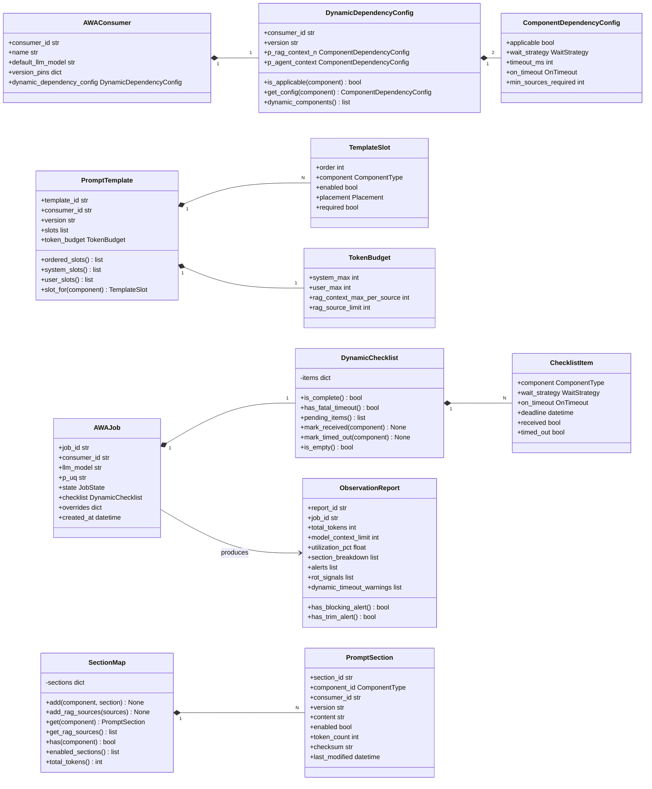

# AWA Prompt Builder — Python Technical Specification

> Implementation language: **Python 3.12**
> Key libraries: FastAPI, aiokafka, SQLAlchemy 2.x (async), redis-py, pydantic-settings, tiktoken, dependency-injector, Jinja2, Click, PyYAML, pydantic

---

## 1. Package Layout

```
awa_prompt_builder/
├── onboarding/                     # Adapter and use case onboarding framework
│   ├── schemas/
│   │   ├── adapter_onboard_schema.py
│   │   └── use_case_schema.py
│   ├── adapter_scaffold_generator.py
│   ├── adapter_registry_loader.py
│   ├── use_case_onboarding_service.py
│   └── cli.py                      # pb-cli Click commands
│
├── domain/                         # Pure domain — zero framework imports
│   ├── enums/
│   │   ├── component_type.py
│   │   ├── wait_strategy.py
│   │   ├── on_timeout.py
│   │   ├── job_state.py
│   │   ├── placement.py
│   │   └── alert_severity.py
│   └── models/
│       ├── prompt_section.py
│       ├── prompt_template.py
│       ├── job.py
│       ├── consumer.py
│       ├── observation.py
│       ├── events.py
│       ├── version.py
│       └── llm_payload.py
│
├── ports/                          # Abstract interfaces (Dependency Inversion boundary)
│   ├── section_repository.py
│   ├── template_repository.py
│   ├── consumer_repository.py
│   ├── job_state_repository.py
│   ├── event_publisher.py
│   ├── llm_adapter.py
│   ├── context_observer.py
│   ├── snapshot_store.py
│   ├── timer_service.py
│   ├── audit_log.py
│   ├── token_counter.py
│   └── embedding_client.py
│
├── services/                       # Application / domain services
│   ├── prompt_builder_service.py
│   ├── section_loader.py
│   ├── dependency_resolver.py
│   ├── state_machine.py
│   ├── template_executor.py
│   ├── context_observer_service.py
│   └── version_manager_service.py
│
├── adapters/                       # Concrete implementations of ports
│   ├── repositories/
│   │   ├── postgres_section_repo.py
│   │   ├── postgres_template_repo.py
│   │   ├── postgres_consumer_repo.py
│   │   └── redis_job_state_repo.py
│   ├── messaging/
│   │   ├── kafka_publisher.py
│   │   └── kafka_consumer.py
│   └── llm/
│       ├── base.py
│       ├── registry.py
│       ├── openai_adapter.py
│       ├── anthropic_adapter.py
│       ├── gemini_adapter.py
│       ├── llama_adapter.py
│       ├── mistral_adapter.py
│       └── bedrock_adapter.py
│
├── handlers/                       # Kafka event handlers
│   ├── base.py
│   ├── prompt_build_requested.py
│   ├── rag_context_retrieved.py
│   ├── agent_context_ready.py
│   └── dynamic_component_timeout.py
│
├── api/                            # FastAPI REST layer
│   ├── routers/
│   │   ├── sections.py
│   │   ├── templates.py
│   │   ├── consumers.py
│   │   ├── dynamic_config.py
│   │   ├── jobs.py
│   │   └── observation.py
│   └── middleware/
│       └── auth.py
│
└── infrastructure/                 # Framework wiring
    ├── database.py
    ├── redis_client.py
    ├── timer_service.py
    ├── s3_snapshot_store.py
    └── container.py               # dependency-injector DI container
```

---

## 2. Modules, Classes, and Functions

### 2.1 `domain/enums/`

#### `component_type.py`
```python
class ComponentType(str, Enum):
    P_UQ             = "p_uq"
    P_GUARD          = "p_guard"
    P_ACT_BUS        = "p_act_bus"
    P_ACT_INS        = "p_act_ins"
    P_ACT_COND       = "p_act_cond"
    P_RAG_CONTEXT_N  = "p_rag_context_n"
    P_AGENT_RGB      = "p_agent_rgb"
    P_AGENT_CONDUCT  = "p_agent_conduct"
    P_AGENT_CONTEXT  = "p_agent_context"
```

#### `wait_strategy.py`
```python
class WaitStrategy(str, Enum):
    NOT_APPLICABLE = "NOT_APPLICABLE"
    OPTIONAL       = "OPTIONAL"
    REQUIRED       = "REQUIRED"
```

#### `on_timeout.py`
```python
class OnTimeout(str, Enum):
    PROCEED_WITHOUT = "PROCEED_WITHOUT"
    FAIL            = "FAIL"
```

#### `job_state.py`
```python
class JobState(str, Enum):
    INITIATED           = "INITIATED"
    AWAITING_DYNAMIC    = "AWAITING_DYNAMIC"
    READY_TO_ASSEMBLE   = "READY_TO_ASSEMBLE"
    ASSEMBLING          = "ASSEMBLING"
    BUILT               = "BUILT"
    FAILED              = "FAILED"
```

#### `placement.py`
```python
class Placement(str, Enum):
    SYSTEM = "system"
    USER   = "user"
```

#### `alert_severity.py`
```python
class AlertSeverity(str, Enum):
    WARN  = "WARN"
    TRIM  = "TRIM"
    BLOCK = "BLOCK"
```

---

### 2.2 `domain/models/`

#### `prompt_section.py`
```python
@dataclass
class RAGSource:
    source_id:   str
    content:     str
    score:       float
    token_count: int

@dataclass
class PromptSection:
    section_id:   str
    component_id: ComponentType
    consumer_id:  str
    version:      str
    content:      str
    enabled:      bool
    token_count:  int
    checksum:     str
    last_modified: datetime

class SectionMap:
    # Internal: dict[ComponentType, PromptSection | list[RAGSource]]
    def add(self, component: ComponentType, section: PromptSection) -> None
    def add_rag_sources(self, sources: list[RAGSource]) -> None
    def get(self, component: ComponentType) -> Optional[PromptSection]
    def get_rag_sources(self) -> list[RAGSource]
    def has(self, component: ComponentType) -> bool
    def enabled_sections(self) -> list[PromptSection]
    def total_tokens(self) -> int
    def to_dict(self) -> dict
```

#### `prompt_template.py`
```python
@dataclass
class TokenBudget:
    system_max:                int
    user_max:                  int
    rag_context_max_per_source: int
    rag_source_limit:          int

@dataclass
class TemplateSlot:
    order:     int
    component: ComponentType
    enabled:   bool
    placement: Placement
    required:  bool

@dataclass
class PromptTemplate:
    template_id:  str
    consumer_id:  str
    version:      str
    slots:        list[TemplateSlot]
    token_budget: TokenBudget

    def ordered_slots(self) -> list[TemplateSlot]
    def system_slots(self) -> list[TemplateSlot]
    def user_slots(self) -> list[TemplateSlot]
    def slot_for(self, component: ComponentType) -> Optional[TemplateSlot]
```

#### `job.py`
```python
@dataclass
class ChecklistItem:
    component:     ComponentType
    wait_strategy: WaitStrategy
    on_timeout:    Optional[OnTimeout]
    deadline:      Optional[datetime]
    received:      bool = False
    timed_out:     bool = False

class DynamicChecklist:
    # Internal: dict[ComponentType, ChecklistItem]
    def __init__(self, items: list[ChecklistItem])
    def is_complete(self) -> bool           # all items received or timed_out
    def has_fatal_timeout(self) -> bool     # any REQUIRED item timed_out with OnTimeout.FAIL
    def pending_items(self) -> list[ChecklistItem]
    def mark_received(self, component: ComponentType) -> None
    def mark_timed_out(self, component: ComponentType) -> None
    def is_empty(self) -> bool

@dataclass
class AWAJob:
    job_id:      str
    consumer_id: str
    llm_model:   str
    p_uq:        str
    state:       JobState
    checklist:   Optional[DynamicChecklist]
    overrides:   dict
    created_at:  datetime
```

#### `consumer.py`
```python
@dataclass
class ComponentDependencyConfig:
    applicable:           bool
    wait_strategy:        WaitStrategy
    timeout_ms:           Optional[int]
    on_timeout:           Optional[OnTimeout]
    min_sources_required: Optional[int]   # RAG only

@dataclass
class DynamicDependencyConfig:
    consumer_id:       str
    version:           str
    p_rag_context_n:   ComponentDependencyConfig
    p_agent_context:   ComponentDependencyConfig

    def is_applicable(self, component: ComponentType) -> bool
    def get_config(self, component: ComponentType) -> ComponentDependencyConfig
    def dynamic_components(self) -> list[ComponentType]  # returns applicable ones only

@dataclass
class AWAConsumer:
    consumer_id:               str
    name:                      str
    default_llm_model:         str
    version_pins:              dict[str, str]
    dynamic_dependency_config: DynamicDependencyConfig
```

#### `observation.py`
```python
@dataclass
class TokenBreakdown:
    component:  ComponentType
    tokens:     int
    percentage: float

@dataclass
class RotSignal:
    component:        ComponentType
    days_since_update: int
    semantic_score:   Optional[float]
    severity:         AlertSeverity

@dataclass
class ContextAlert:
    alert_type: str          # "BLOAT" | "ROT" | "TIMEOUT"
    severity:   AlertSeverity
    component:  Optional[ComponentType]
    detail:     str

@dataclass
class ObservationReport:
    report_id:               str
    job_id:                  str
    total_tokens:            int
    model_context_limit:     int
    utilization_pct:         float
    section_breakdown:       list[TokenBreakdown]
    alerts:                  list[ContextAlert]
    rot_signals:             list[RotSignal]
    dynamic_timeout_warnings: list[str]

    def has_blocking_alert(self) -> bool
    def has_trim_alert(self) -> bool
    def highest_severity(self) -> Optional[AlertSeverity]
```

#### `events.py`
```python
@dataclass
class BaseEvent:
    event_type: str
    timestamp:  datetime

@dataclass
class PromptBuildRequestedEvent(BaseEvent):
    awa_consumer_id: str
    awa_job_id:      str
    llm_model:       str
    p_uq:            str
    overrides:       dict

@dataclass
class RAGContextRetrievedEvent(BaseEvent):
    awa_job_id: str
    sources:    list[RAGSource]

@dataclass
class AgentContextReadyEvent(BaseEvent):
    awa_job_id:   str
    context_type: str
    content:      str
    token_count:  int

@dataclass
class DynamicComponentTimeoutEvent(BaseEvent):
    awa_job_id:   str
    component_id: ComponentType

@dataclass
class PromptBuiltEvent(BaseEvent):
    awa_consumer_id:      str
    awa_job_id:           str
    llm_model:            str
    formatted_payload:    dict
    section_manifest:     dict
    observation_report_ref: str
    build_duration_ms:    int

@dataclass
class PromptBuildFailedEvent(BaseEvent):
    awa_consumer_id:   str
    awa_job_id:        str
    reason:            str
    failed_component:  Optional[ComponentType]
    on_timeout_applied: Optional[OnTimeout]
```

#### `version.py`
```python
@dataclass
class VersionRecord:
    history_id:       str
    component_id:     ComponentType
    consumer_id:      str
    version:          str
    previous_version: Optional[str]
    change_type:      str
    changed_by:       str
    change_reason:    str
    snapshot_ref:     str
    created_at:       datetime
    is_active:        bool
```

#### `llm_payload.py`
```python
class MessageRole(str, Enum):
    SYSTEM    = "system"
    USER      = "user"
    ASSISTANT = "assistant"

@dataclass
class LLMMessage:
    role:    MessageRole
    content: str

@dataclass
class LLMPayload:
    model_family: str
    raw:          dict    # the native format for the target LLM
    messages:     list[LLMMessage]   # normalised view
```

---

### 2.3 `ports/`

#### `section_repository.py`
```python
class ISectionRepository(ABC):
    @abstractmethod
    async def get_by_version(self, consumer_id: str, component: ComponentType, version: str) -> Optional[PromptSection]: ...
    @abstractmethod
    async def get_active(self, consumer_id: str, component: ComponentType) -> Optional[PromptSection]: ...
    @abstractmethod
    async def save(self, section: PromptSection) -> None: ...
    @abstractmethod
    async def list_versions(self, consumer_id: str, component: ComponentType) -> list[VersionRecord]: ...
    @abstractmethod
    async def deactivate(self, consumer_id: str, component: ComponentType, version: str) -> None: ...
```

#### `template_repository.py`
```python
class ITemplateRepository(ABC):
    @abstractmethod
    async def get_active(self, consumer_id: str) -> Optional[PromptTemplate]: ...
    @abstractmethod
    async def get_by_version(self, consumer_id: str, version: str) -> Optional[PromptTemplate]: ...
    @abstractmethod
    async def save(self, template: PromptTemplate) -> None: ...
    @abstractmethod
    async def list_versions(self, consumer_id: str) -> list[VersionRecord]: ...
```

#### `consumer_repository.py`
```python
class IConsumerRepository(ABC):
    @abstractmethod
    async def get(self, consumer_id: str) -> Optional[AWAConsumer]: ...
    @abstractmethod
    async def get_dynamic_config(self, consumer_id: str) -> Optional[DynamicDependencyConfig]: ...
    @abstractmethod
    async def save_dynamic_config(self, config: DynamicDependencyConfig) -> None: ...
    @abstractmethod
    async def update_version_pin(self, consumer_id: str, component: ComponentType, version: str) -> None: ...
```

#### `job_state_repository.py`
```python
class IJobStateRepository(ABC):
    @abstractmethod
    async def save(self, job: AWAJob) -> None: ...
    @abstractmethod
    async def get(self, job_id: str) -> Optional[AWAJob]: ...
    @abstractmethod
    async def update_state(self, job_id: str, state: JobState) -> None: ...
    @abstractmethod
    async def update_checklist(self, job_id: str, checklist: DynamicChecklist) -> None: ...
    @abstractmethod
    async def delete(self, job_id: str) -> None: ...
```

#### `event_publisher.py`
```python
class IEventPublisher(ABC):
    @abstractmethod
    async def publish(self, topic: str, event: BaseEvent) -> None: ...
    @abstractmethod
    async def publish_batch(self, topic: str, events: list[BaseEvent]) -> None: ...
```

#### `llm_adapter.py`
```python
class ILLMAdapter(ABC):
    @property
    @abstractmethod
    def model_family(self) -> str: ...

    @property
    @abstractmethod
    def context_window(self) -> int: ...

    @abstractmethod
    def format(self, section_map: SectionMap, template: PromptTemplate) -> LLMPayload: ...

    @abstractmethod
    def estimate_tokens(self, content: str) -> int: ...
```

#### `context_observer.py`
```python
class IContextObserver(ABC):
    @abstractmethod
    async def observe(self, section_map: SectionMap, job: AWAJob, template: PromptTemplate) -> ObservationReport: ...
```

#### `snapshot_store.py`
```python
class ISnapshotStore(ABC):
    @abstractmethod
    async def write(self, key: str, data: dict) -> str: ...   # returns object ref
    @abstractmethod
    async def read(self, ref: str) -> dict: ...
```

#### `timer_service.py`
```python
class ITimerService(ABC):
    @abstractmethod
    async def schedule(self, delay_ms: int, event: BaseEvent, topic: str) -> str: ...  # returns timer_id
    @abstractmethod
    async def cancel(self, timer_id: str) -> None: ...
```

#### `audit_log.py`
```python
class IAuditLog(ABC):
    @abstractmethod
    async def record(self, actor: str, action: str, entity_type: str, entity_id: str, detail: dict) -> None: ...
```

#### `token_counter.py`
```python
class ITokenCounter(ABC):
    @abstractmethod
    def count(self, text: str, model: str) -> int: ...
```

#### `embedding_client.py`
```python
class IEmbeddingClient(ABC):
    @abstractmethod
    async def embed(self, text: str) -> list[float]: ...
    @abstractmethod
    def cosine_similarity(self, a: list[float], b: list[float]) -> float: ...
```

---

### 2.4 `services/`

#### `prompt_builder_service.py`
```python
class PromptBuilderService:
    def __init__(
        self,
        section_loader:       SectionLoader,
        dependency_resolver:  DynamicDependencyResolver,
        state_machine:        JobStateMachine,
        template_executor:    TemplateExecutor,
        adapter_registry:     LLMAdapterRegistry,
        context_observer:     IContextObserver,
        event_publisher:      IEventPublisher,
        consumer_repo:        IConsumerRepository,
        template_repo:        ITemplateRepository,
    )

    # ── Event entry points (called by handlers) ──────────────────────────
    async def handle_build_requested(self, event: PromptBuildRequestedEvent) -> None
    async def handle_rag_context_retrieved(self, event: RAGContextRetrievedEvent) -> None
    async def handle_agent_context_ready(self, event: AgentContextReadyEvent) -> None
    async def handle_dynamic_timeout(self, event: DynamicComponentTimeoutEvent) -> None

    # ── Internal orchestration ────────────────────────────────────────────
    async def _initialise_job(self, event: PromptBuildRequestedEvent) -> AWAJob
    async def _attempt_assembly(self, job: AWAJob) -> None
    async def _assemble_and_publish(self, job: AWAJob) -> None
    async def _publish_built(self, job: AWAJob, payload: LLMPayload, report: ObservationReport, elapsed_ms: int) -> None
    async def _publish_failed(self, job: AWAJob, reason: str, component: Optional[ComponentType]) -> None
```

#### `section_loader.py`
```python
class SectionLoader:
    def __init__(
        self,
        section_repo:   ISectionRepository,
        consumer_repo:  IConsumerRepository,
    )

    async def load_static_sections(self, consumer_id: str, template: PromptTemplate) -> SectionMap
    async def load_section(self, consumer_id: str, component: ComponentType) -> Optional[PromptSection]
    async def resolve_version(self, consumer_id: str, component: ComponentType) -> str
    def _verify_checksum(self, section: PromptSection) -> bool
```

*Chain of Responsibility is implemented inside `resolve_version`:*
```
job override → consumer version_pins → LATEST (active)
```

#### `dependency_resolver.py`
```python
class DynamicDependencyResolver:
    def __init__(self, consumer_repo: IConsumerRepository)

    async def build_checklist(self, job: AWAJob) -> DynamicChecklist
    def apply_job_overrides(
        self,
        base_config: DynamicDependencyConfig,
        overrides:   dict,
    ) -> DynamicDependencyConfig
    def _make_checklist_item(
        self,
        component: ComponentType,
        config:    ComponentDependencyConfig,
    ) -> Optional[ChecklistItem]           # returns None if NOT_APPLICABLE
```

#### `state_machine.py`
```python
class JobStateMachine:
    # Valid transitions encoded as a frozenset of (from, to) pairs
    _TRANSITIONS: frozenset[tuple[JobState, JobState]]

    def __init__(
        self,
        job_state_repo: IJobStateRepository,
        event_publisher: IEventPublisher,
        timer_service:   ITimerService,
    )

    async def initiate(self, job: AWAJob, checklist: DynamicChecklist) -> JobState
    async def mark_component_received(self, job_id: str, component: ComponentType) -> JobState
    async def mark_component_timed_out(self, job_id: str, component: ComponentType) -> JobState
    async def advance_to_assembling(self, job_id: str) -> JobState
    async def mark_built(self, job_id: str) -> None
    async def mark_failed(self, job_id: str, reason: str) -> None

    def _can_transition(self, current: JobState, target: JobState) -> bool
    def _resolve_after_checklist_update(self, checklist: DynamicChecklist) -> JobState
    async def _schedule_timeouts(self, job_id: str, checklist: DynamicChecklist) -> None
```

#### `template_executor.py`
```python
class TemplateExecutor:
    def execute(
        self,
        template:       PromptTemplate,
        section_map:    SectionMap,
        dynamic_config: DynamicDependencyConfig,
    ) -> SectionMap

    def _should_include_slot(
        self,
        slot:           TemplateSlot,
        section_map:    SectionMap,
        dynamic_config: DynamicDependencyConfig,
    ) -> bool

    def _apply_token_budget(
        self,
        section_map: SectionMap,
        budget:      TokenBudget,
    ) -> SectionMap

    def _trim_rag_sources(
        self,
        sources: list[RAGSource],
        budget:  TokenBudget,
    ) -> list[RAGSource]      # drops lowest-scored sources first
```

#### `context_observer_service.py`
```python
class BloatDetector:
    def __init__(self, thresholds: BloatThresholds)
    def detect(self, section_map: SectionMap, context_limit: int) -> list[ContextAlert]
    def _total_utilization_alert(self, used: int, limit: int) -> Optional[ContextAlert]
    def _section_dominance_alert(self, section_map: SectionMap, total: int) -> Optional[ContextAlert]
    def _rag_overflow_alert(self, sources: list[RAGSource], limit: int) -> Optional[ContextAlert]

class RotDetector:
    def __init__(
        self,
        thresholds:       RotThresholds,
        embedding_client: Optional[IEmbeddingClient],
    )
    async def detect(self, section_map: SectionMap, p_uq: str) -> list[RotSignal]
    def _staleness_signal(self, section: PromptSection) -> Optional[RotSignal]
    async def _semantic_drift_signal(self, section: PromptSection, p_uq: str) -> Optional[RotSignal]

class ContextObserverService(IContextObserver):
    def __init__(
        self,
        token_counter:   ITokenCounter,
        bloat_detector:  BloatDetector,
        rot_detector:    RotDetector,
        event_publisher: IEventPublisher,
    )

    async def observe(
        self,
        section_map: SectionMap,
        job:         AWAJob,
        template:    PromptTemplate,
    ) -> ObservationReport

    async def _check_bloat(self, section_map: SectionMap, context_limit: int) -> list[ContextAlert]
    async def _check_rot(self, section_map: SectionMap, p_uq: str) -> list[RotSignal]
    def _build_breakdown(self, section_map: SectionMap) -> list[TokenBreakdown]
    async def _publish_alerts(self, job_id: str, alerts: list[ContextAlert]) -> None
```

#### `version_manager_service.py`
```python
class VersionManagerService:
    def __init__(
        self,
        section_repo:   ISectionRepository,
        snapshot_store: ISnapshotStore,
        event_publisher: IEventPublisher,
        audit_log:      IAuditLog,
    )

    async def create_version(
        self,
        consumer_id: str,
        component:   ComponentType,
        content:     str,
        reason:      str,
        changed_by:  str,
    ) -> VersionRecord

    async def get_version(
        self,
        consumer_id: str,
        component:   ComponentType,
        version:     str,
    ) -> Optional[VersionRecord]

    async def list_versions(
        self,
        consumer_id: str,
        component:   ComponentType,
    ) -> list[VersionRecord]

    async def rollback(
        self,
        consumer_id:         str,
        component:           ComponentType,
        target_version:      str,
        reason:              str,
        confirmation_token:  str,
    ) -> VersionRecord

    async def _take_snapshot(self, section: PromptSection) -> str
    async def _validate_confirmation_token(self, token: str, consumer_id: str, component: ComponentType) -> bool
    def _bump_version(self, current: str, change_type: str) -> str
```

---

### 2.5 `adapters/llm/`

#### `base.py`
```python
class BaseLLMAdapter(ILLMAdapter):
    def _wrap_in_xml(self, tag: str, content: str) -> str
    def _split_by_placement(
        self,
        template:    PromptTemplate,
        section_map: SectionMap,
    ) -> tuple[str, str]                   # (system_text, user_text)
    def _format_rag_sources(self, sources: list[RAGSource]) -> str
```

#### `registry.py`
```python
class LLMAdapterRegistry:
    def __init__(self)
    def register(self, adapter: ILLMAdapter) -> None
    def get(self, model: str) -> ILLMAdapter          # resolves by model name → family
    def get_by_family(self, family: str) -> ILLMAdapter
    def supported_models(self) -> list[str]
    def _resolve_family(self, model: str) -> str
```

#### `openai_adapter.py`
```python
class OpenAIAdapter(BaseLLMAdapter):
    model_family   = "openai"
    context_window = 128_000

    def format(self, section_map: SectionMap, template: PromptTemplate) -> LLMPayload
    def estimate_tokens(self, content: str) -> int    # uses tiktoken cl100k_base
    def _build_messages(self, system: str, user: str) -> list[dict]
```

#### `anthropic_adapter.py`
```python
class AnthropicAdapter(BaseLLMAdapter):
    model_family   = "anthropic"
    context_window = 200_000

    def format(self, section_map: SectionMap, template: PromptTemplate) -> LLMPayload
    def estimate_tokens(self, content: str) -> int    # uses anthropic token counting
    def _build_payload(self, system: str, user: str) -> dict
```

#### `gemini_adapter.py`
```python
class GeminiAdapter(BaseLLMAdapter):
    model_family   = "gemini"
    context_window = 1_000_000

    def format(self, section_map: SectionMap, template: PromptTemplate) -> LLMPayload
    def estimate_tokens(self, content: str) -> int
    def _build_contents(self, system: str, user: str) -> list[dict]
```

*(LlamaAdapter, MistralAdapter, BedrockAdapter follow the same pattern)*

---

### 2.6 `handlers/`

#### `base.py`
```python
class BaseEventHandler(ABC):
    @abstractmethod
    async def handle(self, event: BaseEvent) -> None: ...

    async def _validate(self, event: BaseEvent) -> bool
    async def _on_error(self, event: BaseEvent, exc: Exception) -> None
    async def safe_handle(self, event: BaseEvent) -> None  # calls _validate → handle → _on_error
```

#### `prompt_build_requested.py`
```python
class PromptBuildRequestedHandler(BaseEventHandler):
    def __init__(self, builder_service: PromptBuilderService)
    async def handle(self, event: PromptBuildRequestedEvent) -> None
```

#### `rag_context_retrieved.py`
```python
class RAGContextRetrievedHandler(BaseEventHandler):
    def __init__(self, builder_service: PromptBuilderService)
    async def handle(self, event: RAGContextRetrievedEvent) -> None
```

#### `agent_context_ready.py`
```python
class AgentContextReadyHandler(BaseEventHandler):
    def __init__(self, builder_service: PromptBuilderService)
    async def handle(self, event: AgentContextReadyEvent) -> None
```

#### `dynamic_component_timeout.py`
```python
class DynamicComponentTimeoutHandler(BaseEventHandler):
    def __init__(self, builder_service: PromptBuilderService)
    async def handle(self, event: DynamicComponentTimeoutEvent) -> None
```

---

### 2.7 `adapters/repositories/`

```python
class PostgresSectionRepository(ISectionRepository):
    def __init__(self, db_session: AsyncSession)
    # implements all ISectionRepository methods via SQLAlchemy ORM

class PostgresTemplateRepository(ITemplateRepository):
    def __init__(self, db_session: AsyncSession)

class PostgresConsumerRepository(IConsumerRepository):
    def __init__(self, db_session: AsyncSession)

class RedisJobStateRepository(IJobStateRepository):
    def __init__(self, redis: Redis, ttl_seconds: int = 30)
    # serialises AWAJob to JSON; uses job_id as key with TTL
    # mirrors final state (BUILT/FAILED) to Postgres via PostgresJobRepository

class KafkaEventPublisher(IEventPublisher):
    def __init__(self, producer: AIOKafkaProducer, serialiser: EventSerialiser)
    async def publish(self, topic: str, event: BaseEvent) -> None
    async def publish_batch(self, topic: str, events: list[BaseEvent]) -> None

class KafkaEventConsumer:
    def __init__(self, consumer: AIOKafkaConsumer, handler_map: dict[str, BaseEventHandler])
    async def start(self) -> None
    async def stop(self) -> None
    async def _dispatch(self, raw_message: ConsumerRecord) -> None
```

---

### 2.8 `infrastructure/container.py`

```python
class ApplicationContainer(containers.DeclarativeContainer):
    # Wires all ports to their concrete adapters using dependency-injector
    # Provides singletons for: db_session, redis, kafka_producer, kafka_consumer
    # Provides factories for: per-request scoped repos
    # Registers all LLMAdapters into LLMAdapterRegistry on startup
```

---

## 3. UML Class Diagrams

### Diagram 1 — Ports and Core Services

```mermaid
classDiagram
    direction TB

    %% ── Ports (interfaces) ─────────────────────────────────────
    class ILLMAdapter {
        <<interface>>
        +model_family str
        +context_window int
        +format(section_map, template) LLMPayload
        +estimate_tokens(content) int
    }

    class ISectionRepository {
        <<interface>>
        +get_active(consumer_id, component) PromptSection
        +get_by_version(consumer_id, component, version) PromptSection
        +save(section) None
        +list_versions(consumer_id, component) list
        +deactivate(consumer_id, component, version) None
    }

    class IJobStateRepository {
        <<interface>>
        +save(job) None
        +get(job_id) AWAJob
        +update_state(job_id, state) None
        +update_checklist(job_id, checklist) None
        +delete(job_id) None
    }

    class IConsumerRepository {
        <<interface>>
        +get(consumer_id) AWAConsumer
        +get_dynamic_config(consumer_id) DynamicDependencyConfig
        +save_dynamic_config(config) None
    }

    class ITemplateRepository {
        <<interface>>
        +get_active(consumer_id) PromptTemplate
        +get_by_version(consumer_id, version) PromptTemplate
        +save(template) None
    }

    class IEventPublisher {
        <<interface>>
        +publish(topic, event) None
        +publish_batch(topic, events) None
    }

    class IContextObserver {
        <<interface>>
        +observe(section_map, job, template) ObservationReport
    }

    class ITimerService {
        <<interface>>
        +schedule(delay_ms, event, topic) str
        +cancel(timer_id) None
    }

    %% ── Core Services ───────────────────────────────────────────
    class PromptBuilderService {
        -section_loader SectionLoader
        -dependency_resolver DynamicDependencyResolver
        -state_machine JobStateMachine
        -template_executor TemplateExecutor
        -adapter_registry LLMAdapterRegistry
        -context_observer IContextObserver
        -event_publisher IEventPublisher
        +handle_build_requested(event) None
        +handle_rag_context_retrieved(event) None
        +handle_agent_context_ready(event) None
        +handle_dynamic_timeout(event) None
        -_attempt_assembly(job) None
        -_assemble_and_publish(job) None
    }

    class SectionLoader {
        -section_repo ISectionRepository
        -consumer_repo IConsumerRepository
        +load_static_sections(consumer_id, template) SectionMap
        +load_section(consumer_id, component) PromptSection
        +resolve_version(consumer_id, component) str
        -_verify_checksum(section) bool
    }

    class DynamicDependencyResolver {
        -consumer_repo IConsumerRepository
        +build_checklist(job) DynamicChecklist
        +apply_job_overrides(base_config, overrides) DynamicDependencyConfig
        -_make_checklist_item(component, config) ChecklistItem
    }

    class JobStateMachine {
        -job_state_repo IJobStateRepository
        -event_publisher IEventPublisher
        -timer_service ITimerService
        +initiate(job, checklist) JobState
        +mark_component_received(job_id, component) JobState
        +mark_component_timed_out(job_id, component) JobState
        +advance_to_assembling(job_id) JobState
        +mark_built(job_id) None
        +mark_failed(job_id, reason) None
        -_can_transition(current, target) bool
        -_schedule_timeouts(job_id, checklist) None
    }

    class TemplateExecutor {
        +execute(template, section_map, dynamic_config) SectionMap
        -_should_include_slot(slot, section_map, dynamic_config) bool
        -_apply_token_budget(section_map, budget) SectionMap
        -_trim_rag_sources(sources, budget) list
    }

    class LLMAdapterRegistry {
        -_adapters dict
        +register(adapter) None
        +get(model) ILLMAdapter
        +get_by_family(family) ILLMAdapter
        +supported_models() list
        -_resolve_family(model) str
    }

    class ContextObserverService {
        -token_counter ITokenCounter
        -bloat_detector BloatDetector
        -rot_detector RotDetector
        -event_publisher IEventPublisher
        +observe(section_map, job, template) ObservationReport
        -_check_bloat(section_map, context_limit) list
        -_check_rot(section_map, p_uq) list
        -_build_breakdown(section_map) list
    }

    %% ── Relationships ───────────────────────────────────────────
    PromptBuilderService --> SectionLoader
    PromptBuilderService --> DynamicDependencyResolver
    PromptBuilderService --> JobStateMachine
    PromptBuilderService --> TemplateExecutor
    PromptBuilderService --> LLMAdapterRegistry
    PromptBuilderService --> IContextObserver
    PromptBuilderService --> IEventPublisher

    SectionLoader --> ISectionRepository
    SectionLoader --> IConsumerRepository

    DynamicDependencyResolver --> IConsumerRepository

    JobStateMachine --> IJobStateRepository
    JobStateMachine --> IEventPublisher
    JobStateMachine --> ITimerService

    LLMAdapterRegistry --> ILLMAdapter
    ContextObserverService ..|> IContextObserver
```



---

### Diagram 2 — Domain Model



---

### Diagram 3 — LLM Adapters and Event Handlers

```mermaid
classDiagram
    direction TB

    class ILLMAdapter {
        <<interface>>
        +model_family str
        +context_window int
        +format(section_map, template) LLMPayload
        +estimate_tokens(content) int
    }

    class BaseLLMAdapter {
        <<abstract>>
        #_wrap_in_xml(tag, content) str
        #_split_by_placement(template, section_map) tuple
        #_format_rag_sources(sources) str
    }

    class OpenAIAdapter {
        +model_family = "openai"
        +context_window = 128000
        +format(section_map, template) LLMPayload
        +estimate_tokens(content) int
        -_build_messages(system, user) list
    }

    class AnthropicAdapter {
        +model_family = "anthropic"
        +context_window = 200000
        +format(section_map, template) LLMPayload
        +estimate_tokens(content) int
        -_build_payload(system, user) dict
    }

    class GeminiAdapter {
        +model_family = "gemini"
        +context_window = 1000000
        +format(section_map, template) LLMPayload
        +estimate_tokens(content) int
        -_build_contents(system, user) list
    }

    class LlamaAdapter {
        +model_family = "llama"
        +context_window = 131072
        +format(section_map, template) LLMPayload
        +estimate_tokens(content) int
    }

    class MistralAdapter {
        +model_family = "mistral"
        +context_window = 32768
        +format(section_map, template) LLMPayload
        +estimate_tokens(content) int
    }

    class BedrockAdapter {
        +model_family = "bedrock"
        +context_window = 200000
        +format(section_map, template) LLMPayload
        +estimate_tokens(content) int
    }

    ILLMAdapter <|.. BaseLLMAdapter
    BaseLLMAdapter <|-- OpenAIAdapter
    BaseLLMAdapter <|-- AnthropicAdapter
    BaseLLMAdapter <|-- GeminiAdapter
    BaseLLMAdapter <|-- LlamaAdapter
    BaseLLMAdapter <|-- MistralAdapter
    BaseLLMAdapter <|-- BedrockAdapter

    class BaseEventHandler {
        <<abstract>>
        +handle(event) None*
        +safe_handle(event) None
        #_validate(event) bool
        #_on_error(event, exc) None
    }

    class PromptBuildRequestedHandler {
        -builder_service PromptBuilderService
        +handle(event) None
    }

    class RAGContextRetrievedHandler {
        -builder_service PromptBuilderService
        +handle(event) None
    }

    class AgentContextReadyHandler {
        -builder_service PromptBuilderService
        +handle(event) None
    }

    class DynamicComponentTimeoutHandler {
        -builder_service PromptBuilderService
        +handle(event) None
    }

    BaseEventHandler <|-- PromptBuildRequestedHandler
    BaseEventHandler <|-- RAGContextRetrievedHandler
    BaseEventHandler <|-- AgentContextReadyHandler
    BaseEventHandler <|-- DynamicComponentTimeoutHandler
```



---

## 4. SOLID Principles

### S — Single Responsibility

Every class has exactly one axis of change:

| Class | Single responsibility |
|---|---|
| `SectionLoader` | Resolve and load section content from the store |
| `DynamicDependencyResolver` | Determine which dynamic components to wait for and build the checklist |
| `JobStateMachine` | Own and enforce all state transitions for a job |
| `TemplateExecutor` | Apply template ordering, slot guards, and token budget trimming |
| `BloatDetector` | Detect token overuse signals only |
| `RotDetector` | Detect content staleness/drift signals only |
| `ContextObserverService` | Orchestrate detectors and produce an `ObservationReport` |
| `VersionManagerService` | Manage snapshots, version history, and rollback |
| `LLMAdapterRegistry` | Maintain the adapter registry and resolve model → adapter |
| `BaseEventHandler` | Define safe execution skeleton for all event handlers |

### O — Open/Closed

The framework is open for extension and closed for modification in three dimensions:

| Extension point | How to extend |
|---|---|
| **New LLM** | Subclass `BaseLLMAdapter`, implement `format()` and `estimate_tokens()`, register in `LLMAdapterRegistry`. Zero changes to `PromptBuilderService`. |
| **New dynamic component** | Add value to `ComponentType`, add config field to `DynamicDependencyConfig`, add handler entry in `DynamicDependencyResolver`. All existing components unaffected. |
| **New observation signal** | Subclass `BloatDetector` or `RotDetector`, or add a new detector and inject it into `ContextObserverService`. |
| **New event type** | Subclass `BaseEventHandler`, register in `KafkaEventConsumer.handler_map`. |

### L — Liskov Substitution

All interface implementations are fully interchangeable from the perspective of their consumers:

- `PostgresSectionRepository` and an in-memory `InMemorySectionRepository` (for testing) are identical from `SectionLoader`'s view — both satisfy `ISectionRepository`'s contract.
- `OpenAIAdapter` and `AnthropicAdapter` are interchangeable in `PromptBuilderService` — both return a valid `LLMPayload`.
- `ContextObserverService` can be replaced by a `NoOpObserver` in unit tests without any test knowing the difference.

### I — Interface Segregation

Ports are granular — no class is forced to implement methods it doesn't use:

| Principle application | Segregation |
|---|---|
| Publishing ≠ consuming | `IEventPublisher` and `KafkaEventConsumer` are separate. A service that only publishes never implements consume logic. |
| Section storage ≠ template storage | `ISectionRepository` and `ITemplateRepository` are separate. A mock can implement only one. |
| Snapshot storage ≠ section content storage | `ISnapshotStore` (S3) is separate from `ISectionRepository` (Postgres). |
| Timing ≠ publishing | `ITimerService` is separate from `IEventPublisher`. |
| Token counting ≠ embedding | `ITokenCounter` and `IEmbeddingClient` are separate — rot detection can be configured without an embedding backend. |

### D — Dependency Inversion

High-level services depend only on abstractions — never on concrete infrastructure:

```
PromptBuilderService
    depends on → ILLMAdapter        (not OpenAIAdapter)
    depends on → IContextObserver   (not ContextObserverService)
    depends on → IEventPublisher    (not KafkaEventPublisher)

SectionLoader
    depends on → ISectionRepository (not PostgresSectionRepository)
    depends on → IConsumerRepository

JobStateMachine
    depends on → IJobStateRepository (not RedisJobStateRepository)
    depends on → ITimerService
```

All concrete bindings happen in `infrastructure/container.py` using `dependency-injector`. Application code never calls `import` on any infrastructure class.

---

## 5. Design Patterns

### 5.1 Strategy — LLM Adapters

`ILLMAdapter` is the strategy interface. `PromptBuilderService` holds a reference to `LLMAdapterRegistry` and selects the correct strategy at runtime based on the `llm_model` field in the job. Adding a new model family requires only a new concrete strategy — no conditionals in the builder.

```
PromptBuilderService → LLMAdapterRegistry.get("gpt-4o") → OpenAIAdapter
                                          .get("claude-opus-4-7") → AnthropicAdapter
```

### 5.2 Registry (Plugin) — `LLMAdapterRegistry`

A self-contained registry where adapters are registered at startup. New adapters are added by calling `registry.register(MyNewAdapter())` in `container.py` — no if/elif chains, no hardcoded lookups.

### 5.3 State Machine — `JobStateMachine`

State transitions are encoded in a static `_TRANSITIONS` frozenset of `(from_state, to_state)` pairs. `_can_transition()` validates any move against this table. This makes legal transitions explicit, testable, and modifiable without touching business logic.

```python
_TRANSITIONS = frozenset({
    (JobState.INITIATED,        JobState.AWAITING_DYNAMIC),
    (JobState.INITIATED,        JobState.READY_TO_ASSEMBLE),
    (JobState.AWAITING_DYNAMIC, JobState.READY_TO_ASSEMBLE),
    (JobState.AWAITING_DYNAMIC, JobState.FAILED),
    (JobState.READY_TO_ASSEMBLE,JobState.ASSEMBLING),
    (JobState.ASSEMBLING,       JobState.BUILT),
    (JobState.ASSEMBLING,       JobState.FAILED),
})
```

### 5.4 Template Method — `BaseEventHandler`

`safe_handle()` defines the skeleton: validate → handle → on_error. Subclasses override only `handle()`. Error isolation, logging, and dead-letter logic live once in the base class.

### 5.5 Repository — Data access

All data access is behind `ISectionRepository`, `ITemplateRepository`, `IConsumerRepository`, `IJobStateRepository`. The service layer is unaware of whether data comes from Postgres, Redis, or an in-memory fixture.

### 5.6 Chain of Responsibility — Version resolution

`SectionLoader.resolve_version()` walks a responsibility chain:

```
1. Job-level override present? → use it
2. Consumer version_pins[component] set? → use it
3. Default → query active version from ISectionRepository
```

Each step either handles the request or passes it to the next.

### 5.7 Observer — `IContextObserver`

`ContextObserverService` is registered as an observer of the assembled `SectionMap`. It is notified after assembly (before formatting) via `observe()`. It publishes `ContextAlert` events independently — the builder does not know what observers exist beyond the interface.

### 5.8 Builder (Fluent Construction) — `SectionMap`

`SectionMap.add()` / `add_rag_sources()` allow incremental, order-independent construction of the section map. `TemplateExecutor.execute()` then reads the map and produces a final ordered output. Construction and ordering are decoupled.

### 5.9 Ports and Adapters (Hexagonal Architecture) — Overall structure

The application is partitioned into three rings:

```
┌─────────────────────────────────────────────┐
│  Infrastructure (Postgres, Redis, Kafka, S3) │   outer ring — adapters
│  ┌───────────────────────────────────────┐   │
│  │  Ports (ISectionRepository, ILLMAdapter │  │   boundary
│  │  ┌─────────────────────────────────┐  │   │
│  │  │  Domain + Services              │  │   │   inner ring — pure Python
│  │  └─────────────────────────────────┘  │   │
│  └───────────────────────────────────────┘   │
└─────────────────────────────────────────────┘
```

Domain and service code can be unit-tested with no network, no database, and no Kafka by swapping all ports with in-memory fakes.

### 5.10 Factory — inside `LLMAdapterRegistry.get()`

`get(model)` acts as a factory method — it maps a model name string to the correct adapter instance. The caller does not `new` an adapter directly.

---

## 6. Pattern-to-Class Mapping Summary

| Pattern | Class(es) |
|---|---|
| Strategy | `ILLMAdapter`, `OpenAIAdapter`, `AnthropicAdapter`, `GeminiAdapter`, `LlamaAdapter`, `MistralAdapter`, `BedrockAdapter` |
| Registry / Plugin | `LLMAdapterRegistry` |
| State Machine | `JobStateMachine`, `JobState`, `DynamicChecklist` |
| Template Method | `BaseEventHandler` |
| Repository | `ISectionRepository`, `ITemplateRepository`, `IConsumerRepository`, `IJobStateRepository` + all Postgres/Redis implementations |
| Chain of Responsibility | `SectionLoader.resolve_version()` |
| Observer | `IContextObserver`, `ContextObserverService`, `BloatDetector`, `RotDetector` |
| Builder | `SectionMap`, `TemplateExecutor` |
| Ports & Adapters | Entire package structure (`domain/`, `ports/`, `services/`, `adapters/`) |
| Factory | `LLMAdapterRegistry.get()` |

---

---

## 7. Onboarding Framework

### 7.1 Overview

The onboarding framework provides a **template-driven, engineer-self-service** mechanism to:

1. Add new adapters (LLM, messaging, snapshot store, timer) without touching core framework code.
2. Register a new use case (AWA_Consumer) with its prompt sections, template, and dependency config.

Both flows are driven by YAML files validated through Pydantic schemas, with Jinja2-powered code scaffold generation and a Click-based CLI (`pb-cli`).

```
config/
├── templates/
│   ├── adapter_onboard.yaml            ← blank template for engineers
│   └── pb_use_case_onboarding.yaml     ← blank template for engineers
├── examples/
│   ├── compass_core42_adapter.yaml     ← filled LLM adapter example
│   ├── rabbitmq_adapter.yaml           ← filled messaging adapter example
│   ├── azure_event_bus_adapter.yaml    ← filled messaging adapter example
│   └── IDP_INVOICE_US_onboarding.yaml ← filled use case example
└── adapters_registry.yaml              ← master adapter registry (auto-maintained)

scaffold_templates/
├── llm_adapter.py.j2                   ← Jinja2: LLM adapter class
├── messaging_adapter.py.j2             ← Jinja2: publisher + consumer classes
└── adapter_test.py.j2                  ← Jinja2: pytest skeleton
```

---

### 7.2 `onboarding/schemas/adapter_onboard_schema.py`

```python
class AdapterType(str, Enum):
    LLM            = "llm"
    MESSAGING      = "messaging"
    SNAPSHOT_STORE = "snapshot_store"
    TIMER          = "timer"

class PromptStandard(str, Enum):
    OPENAI_COMPATIBLE = "openai_compatible"
    ANTHROPIC         = "anthropic"
    CUSTOM            = "custom"

class TokenCounterType(str, Enum):
    TIKTOKEN           = "tiktoken"
    ANTHROPIC          = "anthropic"
    CHARACTER_ESTIMATE = "character_estimate"
    CUSTOM             = "custom"

class BrokerType(str, Enum):
    KAFKA            = "kafka"
    RABBITMQ         = "rabbitmq"
    AZURE_EVENT_BUS  = "azure_event_bus"
    AWS_SQS          = "aws_sqs"
    AWS_SNS          = "aws_sns"

class AdapterRole(str, Enum):
    PUBLISHER = "publisher"
    CONSUMER  = "consumer"
    BOTH      = "both"

class AuthType(str, Enum):
    API_KEY = "api_key"
    OAUTH2  = "oauth2"
    MTLS    = "mtls"

# ── Sub-schemas ────────────────────────────────────────────────────────────────

class CustomFormat(BaseModel):
    system_prefix:    str = ""
    system_suffix:    str = ""
    user_prefix:      str = ""
    user_suffix:      str = ""
    assistant_prefix: str = ""

class ConnectionConfig(BaseModel):
    base_url:        str
    auth_type:       AuthType
    env_var_api_key: str

class LLMAdapterConfig(BaseModel):
    model_family:    str
    context_window:  int
    supported_models: list[str]
    prompt_standard: PromptStandard
    token_counter:   TokenCounterType
    custom_format:   Optional[CustomFormat] = None
    connection:      Optional[ConnectionConfig] = None

    @model_validator(mode="after")
    def custom_format_required_when_custom(self) -> "LLMAdapterConfig":
        if self.prompt_standard == PromptStandard.CUSTOM and not self.custom_format:
            raise ValueError("custom_format is required when prompt_standard is 'custom'")
        return self

class RabbitMQConfig(BaseModel):
    host_env_var:     str
    port:             int = 5672
    vhost:            str = "/"
    exchange:         str
    exchange_type:    str = "topic"
    username_env_var: Optional[str] = None
    password_env_var: Optional[str] = None

class AzureEventBusConfig(BaseModel):
    namespace_env_var:         str
    connection_string_env_var: str
    default_topic:             str = "awa-prompt"

class AWSSQSConfig(BaseModel):
    region_env_var:    str
    queue_url_env_var: str
    access_key_env_var: Optional[str] = None
    secret_key_env_var: Optional[str] = None

class MessagingAdapterConfig(BaseModel):
    broker:          BrokerType
    role:            AdapterRole
    rabbitmq:        Optional[RabbitMQConfig] = None
    azure_event_bus: Optional[AzureEventBusConfig] = None
    aws_sqs:         Optional[AWSSQSConfig] = None

    @model_validator(mode="after")
    def broker_config_present(self) -> "MessagingAdapterConfig":
        required = {
            BrokerType.RABBITMQ:       "rabbitmq",
            BrokerType.AZURE_EVENT_BUS:"azure_event_bus",
            BrokerType.AWS_SQS:        "aws_sqs",
        }
        field = required.get(self.broker)
        if field and not getattr(self, field):
            raise ValueError(f"'{field}' config is required for broker '{self.broker}'")
        return self

class ScaffoldConfig(BaseModel):
    generate_class: bool = True
    generate_tests: bool = True
    output_module:  str

# ── Top-level schema ───────────────────────────────────────────────────────────

class AdapterOnboardSchema(BaseModel):
    adapter: AdapterEntry

class AdapterEntry(BaseModel):
    name:         str = Field(pattern=r'^[a-z][a-z0-9_]*$')
    display_name: str
    version:      str = "1.0.0"
    adapter_type: AdapterType
    author:       str
    enabled:      bool = True
    llm:          Optional[LLMAdapterConfig] = None
    messaging:    Optional[MessagingAdapterConfig] = None
    scaffold:     ScaffoldConfig

    @model_validator(mode="after")
    def type_config_present(self) -> "AdapterEntry":
        if self.adapter_type == AdapterType.LLM and not self.llm:
            raise ValueError("'llm' config required when adapter_type is 'llm'")
        if self.adapter_type == AdapterType.MESSAGING and not self.messaging:
            raise ValueError("'messaging' config required when adapter_type is 'messaging'")
        return self

    @property
    def class_name(self) -> str:
        return "".join(part.capitalize() for part in self.name.split("_")) + "Adapter"
```

---

### 7.3 `onboarding/schemas/use_case_schema.py`

```python
class SectionSource(str, Enum):
    INLINE = "inline"
    FILE   = "file"
    SHARED = "shared"

class WaitStrategyConfig(BaseModel):
    applicable:           bool
    wait_strategy:        WaitStrategy
    timeout_ms:           Optional[int] = None
    on_timeout:           Optional[OnTimeout] = None
    min_sources_required: Optional[int] = None

    @model_validator(mode="after")
    def timeout_required_when_waiting(self) -> "WaitStrategyConfig":
        if self.wait_strategy != WaitStrategy.NOT_APPLICABLE and not self.timeout_ms:
            raise ValueError("timeout_ms required when wait_strategy is OPTIONAL or REQUIRED")
        return self

class DynamicDependencyConfigSchema(BaseModel):
    p_rag_context_n: WaitStrategyConfig
    p_agent_context: WaitStrategyConfig

class TemplateSlotConfig(BaseModel):
    order:     int
    component: ComponentType
    enabled:   bool = True
    placement: Placement
    required:  bool = False

class TokenBudgetConfig(BaseModel):
    system_max:                  int = 4096
    user_max:                    int = 4096
    rag_context_max_per_source:  int = 1024
    rag_source_limit:            int = 5

class TemplateConfig(BaseModel):
    version:      str = "1.0.0"
    slots:        list[TemplateSlotConfig]
    token_budget: TokenBudgetConfig

    @model_validator(mode="after")
    def p_guard_and_p_uq_required(self) -> "TemplateConfig":
        components = {s.component for s in self.slots}
        if ComponentType.P_GUARD not in components:
            raise ValueError("p_guard slot is mandatory in every template")
        if ComponentType.P_UQ not in components:
            raise ValueError("p_uq slot is mandatory in every template")
        return self

class SectionConfig(BaseModel):
    version:              str = "1.0.0"
    source:               SectionSource
    content:              Optional[str] = None           # for inline
    content_file:         Optional[str] = None           # for file
    shared_from_consumer: Optional[str] = None           # for shared
    component:            Optional[ComponentType] = None # for shared (if different key)

    @model_validator(mode="after")
    def source_fields_valid(self) -> "SectionConfig":
        if self.source == SectionSource.INLINE and not self.content:
            raise ValueError("'content' required when source is 'inline'")
        if self.source == SectionSource.FILE and not self.content_file:
            raise ValueError("'content_file' required when source is 'file'")
        if self.source == SectionSource.SHARED and not self.shared_from_consumer:
            raise ValueError("'shared_from_consumer' required when source is 'shared'")
        return self

class BloatThresholdsConfig(BaseModel):
    total_utilization_warn_pct:  float = 80.0
    total_utilization_block_pct: float = 95.0
    section_dominance_warn_pct:  float = 60.0
    rag_source_overflow_limit:   Optional[int] = None

class RotThresholdsConfig(BaseModel):
    staleness_warn_days:           int   = 30
    staleness_block_days:          int   = 90
    semantic_drift_warn_threshold: float = 0.65
    semantic_drift_enabled:        bool  = True

class ObserverThresholdsConfig(BaseModel):
    bloat: BloatThresholdsConfig = BloatThresholdsConfig()
    rot:   RotThresholdsConfig   = RotThresholdsConfig()

class OnboardingMetaConfig(BaseModel):
    requested_by:  str
    approved_by:   Optional[str] = None
    change_reason: str
    jira_ticket:   Optional[str] = None

# ── Top-level schema ───────────────────────────────────────────────────────────

class LLMConfig(BaseModel):
    default_model:  str
    fallback_model: Optional[str] = None

class UseCaseOnboardSchema(BaseModel):
    use_case: UseCaseEntry

class UseCaseEntry(BaseModel):
    awa_consumer_id:           str = Field(pattern=r'^[A-Z][A-Z0-9_]*$')
    name:                      str
    description:               str
    owner:                     str
    tags:                      list[str] = []
    environments:              list[str] = ["dev", "staging", "prod"]
    llm:                       LLMConfig
    dynamic_dependency_config: DynamicDependencyConfigSchema
    template:                  TemplateConfig
    sections:                  dict[str, SectionConfig]
    version_pins:              dict[str, str] = {}
    observer_thresholds:       ObserverThresholdsConfig = ObserverThresholdsConfig()
    onboarding_meta:           OnboardingMetaConfig
```

---

### 7.4 `onboarding/adapter_scaffold_generator.py`

```python
@dataclass
class ScaffoldResult:
    adapter_class_path: Path
    test_class_path:    Path
    registry_updated:   bool
    warnings:           list[str]

class AdapterScaffoldGenerator:
    def __init__(self, jinja_env: Environment, registry_path: Path, project_root: Path)

    def generate(self, schema: AdapterOnboardSchema, output_dir: Path) -> ScaffoldResult
    def dry_run(self, schema: AdapterOnboardSchema, output_dir: Path) -> ScaffoldResult

    def _render_adapter_class(self, schema: AdapterOnboardSchema, output_dir: Path) -> Path
    def _render_test_class(self, schema: AdapterOnboardSchema) -> Path
    def _update_registry(self, schema: AdapterOnboardSchema) -> None
    def _determine_template(self, adapter_type: AdapterType) -> str
    def _determine_base_class(self, adapter_type: AdapterType) -> str
    def _determine_port_interface(self, adapter_type: AdapterType) -> str
    def _build_template_context(self, schema: AdapterOnboardSchema) -> dict
    def _check_existing_class(self, output_path: Path) -> list[str]  # returns warnings
```

**Template selection logic (`_determine_template`):**

| `adapter_type` | Jinja2 template | Base class |
|---|---|---|
| `llm` | `llm_adapter.py.j2` | `BaseLLMAdapter` |
| `messaging` | `messaging_adapter.py.j2` | `IEventPublisher` / `IEventConsumer` |
| `snapshot_store` | `snapshot_store_adapter.py.j2` | `ISnapshotStore` |
| `timer` | `timer_adapter.py.j2` | `ITimerService` |

---

### 7.5 `onboarding/adapter_registry_loader.py`

```python
@dataclass
class AdapterRegistryEntry:
    name:             str
    display_name:     str
    adapter_type:     AdapterType
    class_path:       str           # dotted Python import path
    enabled:          bool
    version:          str
    supported_models: list[str]     # LLM only
    role:             Optional[str] # messaging only

class AdapterRegistryLoader:
    def __init__(self, registry_path: Path)

    def load_all(self) -> list[AdapterRegistryEntry]
    def load_enabled(self) -> list[AdapterRegistryEntry]
    def register_llm_adapters(self, registry: LLMAdapterRegistry) -> None
    def register_messaging_adapters(self, container: ApplicationContainer) -> None
    def add_entry(self, entry: AdapterRegistryEntry) -> None    # appends to YAML
    def remove_entry(self, adapter_name: str) -> None
    def set_enabled(self, adapter_name: str, enabled: bool) -> None

    def _dynamic_import(self, class_path: str) -> type
    def _load_yaml(self) -> dict
    def _write_yaml(self, data: dict) -> None
```

---

### 7.6 `onboarding/use_case_onboarding_service.py`

```python
@dataclass
class OnboardingResult:
    awa_consumer_id: str
    sections_created: int
    template_version: str
    warnings:         list[str]
    rollback_ref:     str           # ID for rollback if needed

class UseCaseOnboardingService:
    def __init__(
        self,
        consumer_repo:  IConsumerRepository,
        section_repo:   ISectionRepository,
        template_repo:  ITemplateRepository,
        snapshot_store: ISnapshotStore,
        audit_log:      IAuditLog,
    )

    async def onboard(self, schema: UseCaseOnboardSchema, env: str) -> OnboardingResult
    async def rollback(self, consumer_id: str, rollback_ref: str) -> None
    async def validate_only(self, schema: UseCaseOnboardSchema) -> list[str]  # returns warnings

    async def _validate_no_duplicate(self, consumer_id: str) -> None
    async def _validate_model_registered(self, model: str) -> None
    async def _create_consumer(self, entry: UseCaseEntry) -> AWAConsumer
    async def _resolve_section_content(self, component: str, config: SectionConfig) -> str
    async def _load_sections(self, entry: UseCaseEntry) -> list[PromptSection]
    async def _create_template(self, entry: UseCaseEntry) -> PromptTemplate
    async def _apply_version_pins(self, consumer_id: str, pins: dict) -> None
    async def _save_observer_thresholds(self, consumer_id: str, thresholds: ObserverThresholdsConfig) -> None
    async def _write_rollback_snapshot(self, consumer_id: str) -> str
```

---

### 7.7 `onboarding/cli.py` — `pb-cli`

Built with **Click**. Installed as a console script: `pb-cli`.

```
pb-cli adapter onboard  --config <yaml>  [--dry-run] [--output-dir <dir>]
pb-cli adapter enable   <adapter-name>
pb-cli adapter disable  <adapter-name>
pb-cli adapter list     [--type llm|messaging|snapshot_store|timer] [--enabled-only]
pb-cli adapter validate --config <yaml>

pb-cli use-case onboard  --config <yaml>  [--env dev|staging|prod] [--dry-run]
pb-cli use-case rollback --consumer-id <id>  --ref <rollback-ref>
pb-cli use-case list     [--env <env>]
pb-cli use-case status   <consumer-id>
pb-cli use-case validate --config <yaml>
```

**CLI command implementations:**

```python
@click.group()
def cli() -> None: ...

# ── Adapter commands ──────────────────────────────────────────────────────────

@cli.group("adapter")
def adapter_group() -> None: ...

@adapter_group.command("onboard")
@click.option("--config",     required=True, type=click.Path(exists=True, path_type=Path))
@click.option("--dry-run",    is_flag=True)
@click.option("--output-dir", type=click.Path(path_type=Path), default=None)
def onboard_adapter(config: Path, dry_run: bool, output_dir: Optional[Path]) -> None:
    # 1. Parse YAML → AdapterOnboardSchema (raises ValidationError with clear messages)
    # 2. Instantiate AdapterScaffoldGenerator
    # 3. Call dry_run() or generate()
    # 4. Print ScaffoldResult summary

@adapter_group.command("enable")
@click.argument("adapter_name")
def enable_adapter(adapter_name: str) -> None: ...

@adapter_group.command("disable")
@click.argument("adapter_name")
def disable_adapter(adapter_name: str) -> None: ...

@adapter_group.command("list")
@click.option("--type",         "adapter_type", default=None)
@click.option("--enabled-only", is_flag=True)
def list_adapters(adapter_type: Optional[str], enabled_only: bool) -> None: ...

@adapter_group.command("validate")
@click.option("--config", required=True, type=click.Path(exists=True, path_type=Path))
def validate_adapter(config: Path) -> None: ...

# ── Use case commands ─────────────────────────────────────────────────────────

@cli.group("use-case")
def use_case_group() -> None: ...

@use_case_group.command("onboard")
@click.option("--config",  required=True, type=click.Path(exists=True, path_type=Path))
@click.option("--env",     required=True, type=click.Choice(["dev", "staging", "prod"]))
@click.option("--dry-run", is_flag=True)
def onboard_use_case(config: Path, env: str, dry_run: bool) -> None:
    # 1. Parse YAML → UseCaseOnboardSchema
    # 2. Validate env is in schema.use_case.environments
    # 3. Instantiate UseCaseOnboardingService
    # 4. Call validate_only() then onboard() (or just validate_only() for dry-run)
    # 5. Print OnboardingResult summary

@use_case_group.command("rollback")
@click.option("--consumer-id", required=True)
@click.option("--ref",         required=True)
def rollback_use_case(consumer_id: str, ref: str) -> None: ...

@use_case_group.command("list")
@click.option("--env", default=None)
def list_use_cases(env: Optional[str]) -> None: ...

@use_case_group.command("status")
@click.argument("consumer_id")
def use_case_status(consumer_id: str) -> None: ...

@use_case_group.command("validate")
@click.option("--config", required=True, type=click.Path(exists=True, path_type=Path))
def validate_use_case(config: Path) -> None: ...
```

---

### 7.8 End-to-End Adapter Onboarding Flow

```
Engineer fills in config/examples/compass_core42_adapter.yaml
              │
              ▼
pb-cli adapter validate --config compass_core42_adapter.yaml
              │ (YAML parsed → Pydantic validation → errors shown with field paths)
              ▼
pb-cli adapter onboard --config compass_core42_adapter.yaml --dry-run
              │ (prints what would be generated, no files written)
              ▼
pb-cli adapter onboard --config compass_core42_adapter.yaml \
       --output-dir ./awa_prompt_builder/adapters/llm/
              │
              ├── Generates: awa_prompt_builder/adapters/llm/compass_core42_adapter.py
              ├── Generates: tests/adapters/llm/test_compass_core42_adapter.py
              ├── Appends entry to: config/adapters_registry.yaml (enabled: true)
              └── Prints checklist:
                    ✓ Class file generated
                    ✓ Test file generated
                    ✓ Registry entry added
                    ✗ TODO: implement format() body (not implemented)
                    ✗ TODO: add COMPASS_CORE42_API_KEY to .env.example
                    ✗ TODO: run: pytest tests/adapters/llm/test_compass_core42_adapter.py
```

---

### 7.9 End-to-End Use Case Onboarding Flow

```
Engineer fills in config/examples/IDP_INVOICE_US_onboarding.yaml
              │
              ▼
pb-cli use-case validate --config IDP_INVOICE_US_onboarding.yaml
              │ (schema + cross-field validation; warns on token budget near threshold)
              ▼
pb-cli use-case onboard --config IDP_INVOICE_US_onboarding.yaml --env staging --dry-run
              │ (prints DB records that would be created, no writes)
              ▼
pb-cli use-case onboard --config IDP_INVOICE_US_onboarding.yaml --env staging
              │
              ├── Validates awa_consumer_id not already registered
              ├── Validates default_model exists in adapters_registry.yaml
              ├── Resolves each section: inline → stored | file → read+stored | shared → linked
              ├── Writes PromptSection records → DB + snapshot to S3
              ├── Writes PromptTemplate record → DB
              ├── Writes AWAConsumer + DynamicDependencyConfig → DB
              ├── Writes ObserverThresholds → DB
              ├── Writes rollback snapshot → S3 (ref returned)
              ├── Writes audit log entry
              └── Prints OnboardingResult:
                    awa_consumer_id : IDP_INVOICE_US
                    sections_created: 5
                    template_version: 1.0.0
                    rollback_ref    : snap_abc123
                    warnings        : [] (none)
```

---

### 7.10 SOLID in the Onboarding Framework

| Principle | Application |
|---|---|
| **S** | `AdapterScaffoldGenerator` only generates code. `AdapterRegistryLoader` only manages the YAML registry. `UseCaseOnboardingService` only executes DB writes. `cli.py` only handles CLI I/O. |
| **O** | New adapter types (e.g. `vector_store`) need a new Jinja2 template and a new enum value — no changes to generator or registry loader logic. |
| **L** | `UseCaseOnboardingService` depends on `IConsumerRepository`, `ISectionRepository` etc — any mock implementation substitutes identically for integration tests. |
| **I** | CLI commands are separate Click functions — adding a new command does not affect existing ones. Schema validators are per-model. |
| **D** | `AdapterScaffoldGenerator` depends on `jinja2.Environment` and `Path` (pure stdlib) — not on any infrastructure class. `UseCaseOnboardingService` depends on ports, not Postgres. |

---

---

## 8. Modification Framework

### 8.1 Why a Separate Modification Path

Onboarding creates resources idempotently from a complete YAML.  
Modification needs a different contract:

| Concern | Onboarding | Modification |
|---|---|---|
| Input | Full config (all fields required) | Sparse diff (only changed fields) |
| Validation | Is the consumer/adapter new? | Does the target exist? Are new values valid? |
| Side effects | Create DB records, generate code | Vary per block (some need Kafka, some need new versions, some need code regen) |
| Audit | One onboarding event | Per-block change records, each with before/after |
| Rollback unit | Entire consumer / adapter | Per-block rollback (independent undo) |

---

### 8.2 Modification YAML Templates

```
config/templates/
├── adapter_modify.yaml          ← sparse diff for any adapter
└── pb_use_case_modify.yaml      ← sparse diff for any use case parameter

config/examples/
├── compass_core42_modify.yaml   ← LLM adapter: add model + expand context window
└── IDP_INVOICE_US_modify.yaml   ← use case: tighten RAG timeout + update section
```

**Key design rule — sparse fields:**  
Every changeable field defaults to `null`. The modification service skips any
field that is `null`, applying the merge rule:

```
effective_value = provided_value  if provided_value is not null
                  current_value   otherwise
```

This means an engineer only declares intent, not the full desired state.

---

### 8.3 Change Type Dispatch

#### Adapter changes

| Field(s) | Category | Effect |
|---|---|---|
| `enabled` | registry-only | YAML updated, `AdapterRegistryLoader` reloads at next startup or hot-reload trigger |
| `supported_models` | registry-only | Same as above |
| `connection.*` | registry-only | Same as above |
| `messaging.*.exchange` / routing | registry-only | Same as above |
| `context_window` | code-affecting | Registry updated **+** pb-cli prints class diff and offers `--regenerate` |
| `prompt_standard` | code-affecting | Same — affects `format()` method body |
| `token_counter` | code-affecting | Same — affects `estimate_tokens()` method body |
| `custom_format.*` | code-affecting | Same |

**Code-affecting detection rule:** `AdapterModificationService._requires_code_change()` compares the incoming `changes` dict key-set against a static `CODE_AFFECTING_FIELDS` frozenset. If any overlap, the engineer is warned and offered scaffold regeneration.

#### Use case changes

| Block | Change type key | Effect |
|---|---|---|
| `llm` | `llm_update` | DB update on `AWAConsumer`; validates model in registry |
| `dynamic_dependency_config` | `dynamic_config_update` | DB update + publishes `DynamicConfigChanged` → Prompt Builder cache invalidated |
| `template.slots` / `token_budget` | `template_version` | New `PromptTemplate` version created; old version preserved |
| `sections.<component>` | `section_version` | New `PromptSection` version via `VersionManagerService`; old version preserved |
| `version_pins` | `version_pin_update` | DB update on `AWAConsumer.version_pins` |
| `observer_thresholds` | `threshold_update` | DB update on `ObserverThresholds` |

---

### 8.4 New Module: `onboarding/schemas/adapter_modify_schema.py`

```python
class AdapterLLMChanges(BaseModel):
    supported_models: Optional[list[str]] = None
    context_window:   Optional[int]       = None
    prompt_standard:  Optional[PromptStandard] = None
    token_counter:    Optional[TokenCounterType] = None
    custom_format:    Optional[CustomFormat] = None
    connection:       Optional[ConnectionConfig] = None

    def code_affecting_fields_changed(self) -> list[str]:
        CODE_AFFECTING = frozenset({"context_window", "prompt_standard", "token_counter", "custom_format"})
        return [f for f in CODE_AFFECTING if getattr(self, f) is not None]

class AdapterRabbitMQChanges(BaseModel):
    exchange:      Optional[str] = None
    exchange_type: Optional[str] = None
    vhost:         Optional[str] = None

class AdapterAzureEventBusChanges(BaseModel):
    default_topic:             Optional[str] = None
    namespace_env_var:         Optional[str] = None
    connection_string_env_var: Optional[str] = None

class AdapterMessagingChanges(BaseModel):
    rabbitmq:        Optional[AdapterRabbitMQChanges] = None
    azure_event_bus: Optional[AdapterAzureEventBusChanges] = None

class AdapterModifyEntry(BaseModel):
    name:          str             # identifies target adapter
    new_version:   str
    change_reason: str
    changed_by:    str
    enabled:       Optional[bool]  = None
    llm:           Optional[AdapterLLMChanges] = None
    messaging:     Optional[AdapterMessagingChanges] = None

    def has_any_change(self) -> bool
    def is_code_affecting(self) -> bool
    def code_affecting_fields(self) -> list[str]

class AdapterModifySchema(BaseModel):
    adapter_modify: AdapterModifyEntry
```

---

### 8.5 New Module: `onboarding/schemas/use_case_modify_schema.py`

```python
class DynamicComponentChanges(BaseModel):
    applicable:           Optional[bool]         = None
    wait_strategy:        Optional[WaitStrategy]  = None
    timeout_ms:           Optional[int]           = None
    on_timeout:           Optional[OnTimeout]     = None
    min_sources_required: Optional[int]           = None

    def has_any_change(self) -> bool

class DynamicDependencyChanges(BaseModel):
    p_rag_context_n: Optional[DynamicComponentChanges] = None
    p_agent_context: Optional[DynamicComponentChanges] = None

class TemplateSlotChange(BaseModel):
    component: ComponentType
    enabled:   Optional[bool]      = None
    order:     Optional[int]       = None
    placement: Optional[Placement] = None
    required:  Optional[bool]      = None

class TokenBudgetChanges(BaseModel):
    system_max:                 Optional[int] = None
    user_max:                   Optional[int] = None
    rag_context_max_per_source: Optional[int] = None
    rag_source_limit:           Optional[int] = None

class TemplateChanges(BaseModel):
    new_version:  str
    slots:        Optional[list[TemplateSlotChange]] = None
    token_budget: Optional[TokenBudgetChanges]       = None

    def has_any_change(self) -> bool

class SectionChange(BaseModel):
    new_version:   str
    change_reason: str
    source:        SectionSource
    content:       Optional[str] = None        # inline
    content_file:  Optional[str] = None        # file

    @model_validator(mode="after")
    def source_fields_valid(self) -> "SectionChange": ...

class LLMChanges(BaseModel):
    default_model:  Optional[str] = None
    fallback_model: Optional[str] = None    # empty string = clear fallback

    def has_any_change(self) -> bool

class BloatThresholdChanges(BaseModel):
    total_utilization_warn_pct:  Optional[float] = None
    total_utilization_block_pct: Optional[float] = None
    section_dominance_warn_pct:  Optional[float] = None
    rag_source_overflow_limit:   Optional[int]   = None

class RotThresholdChanges(BaseModel):
    staleness_warn_days:           Optional[int]   = None
    staleness_block_days:          Optional[int]   = None
    semantic_drift_warn_threshold: Optional[float] = None
    semantic_drift_enabled:        Optional[bool]  = None

class ObserverThresholdChanges(BaseModel):
    bloat: Optional[BloatThresholdChanges] = None
    rot:   Optional[RotThresholdChanges]   = None

class UseCaseModifyEntry(BaseModel):
    awa_consumer_id:           str
    change_reason:             str
    changed_by:                str
    jira_ticket:               Optional[str] = None
    llm:                       Optional[LLMChanges]                = None
    dynamic_dependency_config: Optional[DynamicDependencyChanges]  = None
    template:                  Optional[TemplateChanges]           = None
    sections:                  Optional[dict[str, SectionChange]]  = None
    version_pins:              Optional[dict[str, str]]            = None
    observer_thresholds:       Optional[ObserverThresholdChanges]  = None

    def active_change_blocks(self) -> list[str]
    # Returns list of block names that are non-null, e.g. ["llm", "sections"]

class UseCaseModifySchema(BaseModel):
    use_case_modify: UseCaseModifyEntry
```

---

### 8.6 New Module: `onboarding/adapter_modification_service.py`

```python
@dataclass
class ChangeRecord:
    change_type:    str
    field:          str
    previous_value: Any
    new_value:      Any
    code_affected:  bool = False

@dataclass
class ChangePreview:
    change_type:  str
    description:  str
    code_affected: bool
    warnings:     list[str]

@dataclass
class AdapterModificationResult:
    adapter_name:    str
    new_version:     str
    changes_applied: list[ChangeRecord]
    code_regen_needed: bool
    affected_fields: list[str]

class AdapterModificationService:
    CODE_AFFECTING_FIELDS: frozenset = frozenset({
        "context_window", "prompt_standard", "token_counter", "custom_format"
    })

    def __init__(
        self,
        registry_loader:    AdapterRegistryLoader,
        scaffold_generator: AdapterScaffoldGenerator,
    )

    def modify(
        self,
        schema:     AdapterModifySchema,
        output_dir: Optional[Path] = None,
        regenerate: bool = False,
    ) -> AdapterModificationResult

    def dry_run(self, schema: AdapterModifySchema) -> list[ChangePreview]

    def _load_current(self, name: str) -> AdapterRegistryEntry
    def _compute_diff(self, current: AdapterRegistryEntry, schema: AdapterModifySchema) -> list[ChangeRecord]
    def _apply_registry_changes(self, name: str, changes: list[ChangeRecord], new_version: str) -> None
    def _requires_code_change(self, changes: list[ChangeRecord]) -> bool
    def _regenerate_class(self, name: str, output_dir: Path) -> Path
    def _print_code_diff(self, name: str, changes: list[ChangeRecord]) -> None
```

**`modify()` execution order:**
```
1. Load current entry from adapters_registry.yaml
2. Compute diff — identify all non-null fields in schema
3. Detect code-affecting fields
4. If dry_run → print ChangePreview list and return
5. Apply registry changes (YAML rewrite)
6. If code-affecting and regenerate=True → call scaffold generator
7. If code-affecting and regenerate=False → print class diff, list TODOs
8. Return AdapterModificationResult
```

---

### 8.7 New Module: `onboarding/use_case_modification_service.py`

```python
@dataclass
class UseCaseChangeRecord:
    change_type:    str        # "llm_update" | "dynamic_config_update" | etc.
    block:          str        # which YAML block triggered this
    previous_state: dict
    new_state:      dict
    version_before: Optional[str]
    version_after:  Optional[str]
    kafka_events:   list[str]  # events published as a side-effect

@dataclass
class UseCaseModificationResult:
    awa_consumer_id:  str
    changes_applied:  list[UseCaseChangeRecord]
    rollback_ref:     str
    warnings:         list[str]

class UseCaseModificationService:
    # Maps each block name to its handler method
    _BLOCK_HANDLERS: dict[str, str] = {
        "llm":                       "_apply_llm_change",
        "dynamic_dependency_config": "_apply_dynamic_config_change",
        "template":                  "_apply_template_change",
        "sections":                  "_apply_section_changes",
        "version_pins":              "_apply_version_pin_change",
        "observer_thresholds":       "_apply_threshold_change",
    }

    def __init__(
        self,
        consumer_repo:    IConsumerRepository,
        section_repo:     ISectionRepository,
        template_repo:    ITemplateRepository,
        version_manager:  VersionManagerService,
        event_publisher:  IEventPublisher,
        audit_log:        IAuditLog,
        snapshot_store:   ISnapshotStore,
        registry_loader:  AdapterRegistryLoader,   # for model validation
    )

    async def modify(
        self,
        schema: UseCaseModifySchema,
        env:    str,
    ) -> UseCaseModificationResult

    async def dry_run(
        self,
        schema: UseCaseModifySchema,
        env:    str,
    ) -> list[ChangePreview]

    # ── Block handlers ────────────────────────────────────────────────────────
    async def _apply_llm_change(
        self,
        consumer_id: str,
        changes:     LLMChanges,
    ) -> UseCaseChangeRecord

    async def _apply_dynamic_config_change(
        self,
        consumer_id: str,
        changes:     DynamicDependencyChanges,
    ) -> UseCaseChangeRecord
    # Publishes DynamicConfigChanged on awa.dynamic.config.changed

    async def _apply_template_change(
        self,
        consumer_id: str,
        changes:     TemplateChanges,
    ) -> UseCaseChangeRecord
    # Creates new PromptTemplate version; merges slots with current

    async def _apply_section_changes(
        self,
        consumer_id: str,
        sections:    dict[str, SectionChange],
    ) -> list[UseCaseChangeRecord]
    # One ChangeRecord per section; delegates to VersionManagerService

    async def _apply_version_pin_change(
        self,
        consumer_id: str,
        pins:        dict[str, str],
    ) -> UseCaseChangeRecord

    async def _apply_threshold_change(
        self,
        consumer_id: str,
        changes:     ObserverThresholdChanges,
    ) -> UseCaseChangeRecord

    # ── Internal helpers ──────────────────────────────────────────────────────
    async def _validate_consumer_exists(self, consumer_id: str) -> AWAConsumer
    async def _validate_model_registered(self, model: str) -> None
    async def _merge_template_slots(
        self,
        current:  PromptTemplate,
        changes:  list[TemplateSlotChange],
    ) -> list[TemplateSlot]
    async def _write_rollback_snapshot(self, consumer_id: str) -> str
    async def _record_audit(
        self,
        consumer_id: str,
        records:     list[UseCaseChangeRecord],
        schema:      UseCaseModifySchema,
    ) -> None
```

**Slot merge rule in `_merge_template_slots`:**
```
current_slot_map = {slot.component: slot for slot in current.slots}

for each change in changes.slots:
    existing = current_slot_map[change.component]
    updated  = existing, with non-null fields from change applied
    current_slot_map[change.component] = updated

return sorted(current_slot_map.values(), key=lambda s: s.order)
```
This ensures unmentioned slots survive unchanged.

---

### 8.8 Updated CLI Commands

```
# ── Adapter modification ──────────────────────────────────────────────────────
pb-cli adapter modify            --config <yaml> [--dry-run] [--regenerate]
pb-cli adapter validate-modify   --config <yaml>

# ── Use case modification ─────────────────────────────────────────────────────
pb-cli use-case modify           --config <yaml> --env <env> [--dry-run]
pb-cli use-case validate-modify  --config <yaml>
```

New Click command signatures:

```python
@adapter_group.command("modify")
@click.option("--config",     required=True, type=click.Path(exists=True, path_type=Path))
@click.option("--dry-run",    is_flag=True)
@click.option("--regenerate", is_flag=True,
              help="Re-run scaffold generator for code-affecting field changes")
def modify_adapter(config: Path, dry_run: bool, regenerate: bool) -> None:
    schema = AdapterModifySchema(**yaml.safe_load(config.read_text()))
    svc    = AdapterModificationService(registry_loader, scaffold_generator)
    if dry_run:
        previews = svc.dry_run(schema)
        _print_previews(previews)
    else:
        result = svc.modify(schema, regenerate=regenerate)
        _print_modification_result(result)

@use_case_group.command("modify")
@click.option("--config",  required=True, type=click.Path(exists=True, path_type=Path))
@click.option("--env",     required=True, type=click.Choice(["dev", "staging", "prod"]))
@click.option("--dry-run", is_flag=True)
def modify_use_case(config: Path, env: str, dry_run: bool) -> None:
    schema = UseCaseModifySchema(**yaml.safe_load(config.read_text()))
    svc    = UseCaseModificationService(...)
    if dry_run:
        previews = asyncio.run(svc.dry_run(schema, env))
        _print_previews(previews)
    else:
        result = asyncio.run(svc.modify(schema, env))
        _print_modification_result(result)
```

---

### 8.9 End-to-End Modification Flows

#### Adapter: Add model + expand context window

```
Engineer fills compass_core42_modify.yaml
  (context_window: 131072, supported_models: [v1, v2, v2-instruct, v3])
              │
pb-cli adapter validate-modify --config compass_core42_modify.yaml
              │ ✓ Adapter 'compass_core42' found in registry
              │ ✓ new_version 1.1.0 > current 1.0.0
              │ ⚠ WARNING: context_window is code-affecting — class file will need update
              ▼
pb-cli adapter modify --config compass_core42_modify.yaml --dry-run
              │ WOULD CHANGE:
              │   context_window:   65536 → 131072  [CODE CHANGE]
              │   supported_models: [v1,v2,v2-instruct] → [v1,v2,v2-instruct,v3]
              │   version:          1.0.0 → 1.1.0
              ▼
pb-cli adapter modify --config compass_core42_modify.yaml --regenerate
              │
              ├── Updates config/adapters_registry.yaml
              ├── Re-renders compass_core42_adapter.py from llm_adapter.py.j2
              │     (context_window = 131072, SUPPORTED_MODELS updated)
              ├── Prints diff of changed lines in class file
              └── Prints checklist:
                    ✓ Registry updated (v1.0.0 → v1.1.0)
                    ✓ Class file regenerated
                    ✗ TODO: review regenerated format() and estimate_tokens() stubs
                    ✗ TODO: run: pytest tests/adapters/llm/test_compass_core42_adapter.py
```

#### Use case: Multiple parameter updates in one YAML

```
Engineer fills IDP_INVOICE_US_modify.yaml
  (timeout_ms: 8000, on_timeout: FAIL, p_act_ins new version, threshold tweak)
              │
pb-cli use-case validate-modify --config IDP_INVOICE_US_modify.yaml
              │ ✓ Consumer 'IDP_INVOICE_US' found
              │ ✓ sections.p_act_ins.content_file exists
              │ ✓ No circular version pin references
              ▼
pb-cli use-case modify --config IDP_INVOICE_US_modify.yaml --env staging --dry-run
              │ WOULD APPLY (3 blocks):
              │
              │ [dynamic_config_update]
              │   p_rag_context_n.timeout_ms: 5000 → 8000
              │   p_rag_context_n.on_timeout: PROCEED_WITHOUT → FAIL
              │   → publishes: DynamicConfigChanged
              │
              │ [section_version]  p_act_ins
              │   version: 1.0.0 → 1.1.0
              │   → creates new PromptSection record
              │
              │ [threshold_update]
              │   bloat.section_dominance_warn_pct: 65 → 70
              ▼
pb-cli use-case modify --config IDP_INVOICE_US_modify.yaml --env staging
              │
              ├── Write rollback snapshot (ref: snap_def456)
              ├── [dynamic_config_update] → DB update + Kafka: DynamicConfigChanged
              ├── [section_version]       → VersionManagerService.create_version()
              │                              → snapshot to S3, new DB record
              ├── [threshold_update]      → DB update
              ├── Write audit log (3 change records)
              └── Print UseCaseModificationResult:
                    changes_applied : 3
                    rollback_ref    : snap_def456
                    warnings        : []
                    hint            : pin p_act_ins → run pb-cli use-case modify
                                      --config pin_update.yaml --env staging
```

---

### 8.10 SOLID in the Modification Framework

| Principle | Application |
|---|---|
| **S** | `AdapterModificationService` computes diffs and applies registry changes only. `UseCaseModificationService` orchestrates block handlers only — each block handler (`_apply_llm_change` etc.) has a single responsibility. Section versioning is fully delegated to `VersionManagerService`. |
| **O** | Adding a new modifiable block (e.g. `notification_config`) requires: a new field in `UseCaseModifyEntry`, a new handler method, and a new entry in `_BLOCK_HANDLERS`. Zero changes to existing handlers or the `modify()` orchestration loop. |
| **L** | `UseCaseModificationService` depends on `IConsumerRepository`, `ISectionRepository`, `IEventPublisher` — test doubles substitute identically. |
| **I** | `AdapterModifySchema` and `UseCaseModifySchema` are separate. Modification schemas are separate from onboarding schemas — classes consuming one don't know about the other. |
| **D** | Neither modification service imports a concrete repository or publisher class. All concrete bindings are in `infrastructure/container.py`. |

---

*Technical spec version: 1.2.0 — 2026-05-26*
